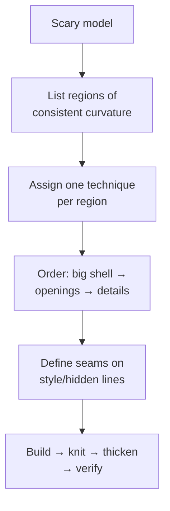

# Complex Showcase Builds

## For future agent
PL1 flagship page: the hardest builds — helmet trilogy (#16–18), propeller (#15), SpaceX Dragon (#91), washbasin (#84), water taps (#39/#49), nozzles (#54/#55/#86), lampshade (#92), hair-dryer body (#93/#94), car door (#8), magician hat (#6), engraved text on sphere (#7), water tank + handle (#2/#26/#79), shower assemblies. Strategies inferred from titles + surfacing methodology (TBC per-video). This page teaches decomposition of scary models into patch plans.

> **The real lesson of this page:** no model is "advanced" — every showcase build is 5–10 beginner techniques sequenced well. Decompose first, model second. If a build intimidates you, you haven't decomposed it yet.

---

## 1. Decomposition method (applies to everything below)

## 2. Flagship deconstructions

**Football helmet (#16–18, three parts) — the capstone of PL1:**
- Part 1: outer shell — boundary patches over crown/side zones, planned seams on ridge lines.
- Part 2: openings — visor + ear holes via trim with oversized patches first, edge roll (swept bead) around openings for stiffness + safety.
- Part 3: liner + details — offset-surface inner liner, chin strap mounts, vents. Multi-part thinking: shell/liner/hardware as separate bodies or parts.

**Marine propeller (#15):** one blade (lofted/boundary with twist from root to tip — pitch built into the profiles) → circular pattern → hub (revolve) → fillet blade roots (stress!). Blade pitch/rake/thickness distribution is naval architecture (TBC: this is CAD practice, not propeller design).

**SpaceX Dragon (#91):** capsule = revolve base + lofted shoulder + heat-shield base; SuperDraco pods as repeated lofted pods (pattern!). Symmetry + repetition turn a spacecraft into an exercise in planning.

**Washbasin (#84):** big sanitary ware — outer styling skin + inner bowl (offset!) + rim + drain hole + overflow (TBC if modeled). Ceramic reality: uniform walls, generous radii, no undercuts (mold/mandrel release).

**Water taps (#39/#49) + nozzles (#54/#55/#86):** spout sweeps + valve bodies + aerator threads; the plumbing lesson is standard interfaces (threads, seats) modeled to mate, not to look right solo.

**Lampshade (#92):** revolved/lofted shade + light-source clearance + heat awareness (incandescent vs LED changes everything — design context, not CAD).

**Car door (#8):** outer panel (large gentle curvature — boundary showcase) + window frame + handle recess + trim lines. Automotive panels demand C2 thinking ([[surfacing-methodology]]) — your zebra-stripe final exam.

**Magician hat (#6) + text on sphere (#7):** ruled/developable-ish surfaces (hat cone + brim) and text-wrapped-on-curved-face technique (split/project + emboss) — presentation-model skills.

**Water tanks (#2/#26/#79):** large vessels + handles + fittings (inlet/outlet bosses, lid threads) — the packaging-to-industrial bridge.

## 3. Multi-part discipline (showcase builds are assemblies in disguise)

- Separate bodies/parts per material and per manufacturing process (shell vs liner vs hardware).
- **Master-model technique (TBC depth):** drive multiple parts from one layout sketch/part so interfaces always agree — helmets and dragons stay consistent this way.
- Fasteners and bought-out parts (screws, vents, straps) as library components, not hand-modeled (model envelopes + mating features only).

## 4. Failure clinic (showcase scale)

| Symptom | Cause → Fix |
|---|---|
| 40-feature tree, afraid to touch anything | No decomposition plan → rebuild with region-per-feature-set order; name everything |
| Openings shatter the shell | Trimming across patch chaos → consolidate patches first, trim once, edge-roll after |
| Assembly interfaces mismatch | Parts modeled in isolation → master sketch or in-context references for every mating dimension |
| Zebra chaos on big panels | Too many sliver patches → rebuild zone with 2–3 large boundary patches |

---

## 5. Worked example: helmet shell patch plan (paper deliverable + build start)

Do the PAPER plan first (30 min) — regions, techniques, order, seams — then model Part 1 only. The plan is the graded deliverable.

**Paper plan (template — fill for YOUR helmet reference):**
| # | Region | Technique | Seams on |
|---|---|---|---|
| 1 | Crown center | Boundary (2 profiles × 2 guides) | Ridge style-lines L/R |
| 2 | Left/right sides | Boundary each, mirrored (model ONE side!) | Ridge lines + lower edge |
| 3 | Rear lower | Lofted transition to edge roll | Edge roll start |
| 4 | Visor opening | Trim (oversized shell first) | Opening curve + edge-roll bead |
| 5 | Ear recesses | Trim + small fill blends | Recess rims |
| 6 | Edge roll | Swept bead around full lower rim | Rim (functional seam, reads as design) |
| Order: 1→2→3 (knit as you go, staged) → 4→5 (trims) → 6 (bead) → zebra → thicken inward 3 (TBC: shell thickness per construction) |

**Propeller blade appendix (#15, numbers-first approach):**
1. Blade data: 3 blades, Ø300 (TBC illustrative), root chord 40 → tip chord 22, pitch angle 25° root → 12° tip (twist BUILT into profile orientations — TBC: real pitch follows hydrodynamic rules; this is CAD practice).
2. 4 sections (root/mid/tip + one intermediate) as rotated airfoil-ish profiles (flat-bottomed at this level — TBC) → Lofted surface with connectors aligned at leading edges (twist + connector discipline combined).
3. Circular pattern ×3 → hub revolve (Ø60 with shaft bore + keyway) → blade-root fillets 6 (stress! — the highest-loaded zone gets the biggest fair fillets).
4. Hand-rotation clearance vs a nozzle ring envelope (if ducted — TBC per design).

**Tap appendix (#39/#49, 10-step core):** base flange (revolve + bolt circle) → valve body (revolve) → spout centerline path → swept/lofted spout per §2 nozzle logic → aerator thread (modeled learning-grade) → handle lever (extrude + grip) → cartridge envelope inside body → assembly + section (water path visible? — the plumber's check) → chrome appearance + render.

---

## 6. Showcase support systems (what separates demos from products)

**Vents + grilles (hair dryer #93/#94-class, helmet #16–18):** intake zones need OPEN area (TBC: confirm airflow-area rules per device — illustrative starting point ~30–50% open) → patterned slots/holes (pattern a ZONE, cosmetic-rest per [[shredders-recycling-machines#5-failure-clinic]]) → recess the grille (impact protection + finger-safety: holes small enough to fail the finger probe — TBC: confirm safety standards for real products) → filter mesh envelope behind (serviceable? — model the access path, not just the mesh).

**Hinges + latches (any opening product):** living-hinge geometry (thin PP flex zone — TBC: confirm living-hinge design rules, NOT this page) vs mechanical hinge (pin + knuckles with clearance — TBC per size) vs snap latch (cantilever deflection math — TBC: confirm with snap-fit references). Pick per material and cycle count; model the pivot explicitly (assemblies that "just touch" separate in reality).

**Water/dust sealing (taps, shower #71/#82, outdoor housings):** O-ring grooves (rectangular groove to seal-cross-section rules — TBC: confirm with seal datasheets, e.g., standard O-ring groove tables) + squeeze verification in section view (groove fill ~75–85% — TBC per seal references) + drain paths for what gets past (seals delay water; drainage removes it — belt-and-suspenders is the professional stance).

**Fastener strategy (showcase assemblies):** ONE screw size per product where possible (service simplicity — TBC taste, confirm per cost analysis) → thread-forming screws into plastic bosses (pilot-hole per screw spec — TBC per datasheet) vs machine screws + inserts for serviceable joints (TBC per cycle count) → captive hardware where the user opens it (lost screws = support calls).

**Verify in-app:** produce the helmet paper plan for a real helmet photo set (front/side/top with ruler), then model regions 1–2 only + knit + zebra. Regions 1–2 done well beat all six done badly.

**Next:** [[artistic-organic]] → then PL2 machines from [[gearbox-fundamentals]].

---

## 8. Helmet trilogy: full 3-part build script (the deep dive)

Reference photos first: front + side + top with a ruler in frame (per [[artistic-organic]] §1) → Sketch Pictures scaled with head breadth + length (TBC: measure YOUR head or a real helmet — illustrative numbers below assume ~600 mm circumference class, confirm per shell size).

**PART 1 — outer shell (boundary zones, staged knits):**
1. Layout: 3 longitudinal guide rails (center ridge + 2 intermediate style lines per side — these double as patch seams AND styling) + 5 cross profiles (brow / temple / crown / rear / lower-rim), all derived from the reference pictures via traced splines (rebuild traces with ≤6 points each + tangent ends — fairness starts here).
2. Crown-center patch: Boundary with the ridge rail + adjacent style rails as Direction 2, cross profiles as Direction 1 → zebra immediately (fix the FIRST patch perfectly — every neighbor inherits its edges).
3. Side patches (ONE side, then mirror!): boundary between style rail and lower-rim rail → mirror about the center plane (asymmetric graphics come later as decals — structure stays symmetric).
4. Rear patch: lofted transition closing crown-to-rim → knit crown + sides + rear IN STAGES (crown+sides first, confirm, then rear) → staged-knit discipline from [[filled-knit-trim-thicken]].
5. Lower rim: edge-roll bead (swept tube Ø8–10 along the rim loop — TBC illustrative: stiffness + safe edge in one feature) → knit bead into shell if same material, or separate part if rubber trim (TBC per construction).

**PART 2 — openings, vents, visor (trim phase):**
6. Visor opening: sketch the aperture on a side-offset plane (TBC per helmet: aperture width ~240–260 illustrative) → project-trim onto shell (trim-with-sketch per [[filled-knit-trim-thicken]] §8) → visor recess ledge (offset-surface step 3 deep for the shield to sit flush — TBC illustrative) → shield as SEPARATE transparent part (revolve/loft to opening curvature + pivot bosses at both temples).
7. Ear recesses: trim circles/ovals (Ø70-ish speaker pockets — TBC per comms gear) + shallow fill-blend rims (no sharp edges near ears — comfort + safety).
8. Vents: brow intake (2 slots) + crown exhausts (3–4) + rear extractors — patterned trims with mesh envelopes behind (insect/debris screening — the forgotten function; model mesh as cosmetic + frame groove) → chin-bar vents if full-face (TBC per helmet type: half/open/full dictate the whole opening map — confirm per YOUR reference).

**PART 3 — liner, retention, hardware (assembly phase):**
9. Comfort liner: offset-surface inward (8–12 gap per §5-liner example in [[surfacing-utilities-troubleshooting]]) → trim to coverage (crown + cheeks, NOT visor/rim) → cheek pads as separate lofted pads (removable/washable in reality — model the snap envelopes, TBC depth).
10. Retention: chin strap (webbing sweep along drape path — TBC) + D-ring/micrometric buckle envelopes (bought-out — model envelopes + mount points, never hand-model buckles) → strap anchors riveted through shell+liner (rivet envelopes + pull-through reinforcement washers — TBC per standard; anchors are life-safety parts, confirm with helmet standards NOT this page).
11. Assembly: shell + liner + shield + pads + strap + vents → interference check (liner vs shell gap uniform? shield sweep vs opening through full pivot travel? — drag-test the shield!) → mass rollup (shell-heavy helmets fatigue necks — TBC: confirm weight targets per standard/size) → exploded view (assembly/service story) → hero render + zebra proof + section through vents (air path visible? — the ventilation check).

**Graduation bar:** paper plan (§5) + regions 1–2 modeled + knit + zebra was the checkpoint; THIS section is the full trilogy. Finish all three parts + assembly + checks = surfacing-capable, provably.

---

## 7. Car-door panel appendix (#8-class: large gentle curvature)

**Why doors are the zebra final exam:** acres of low-curvature skin where every ripple shows — C2-or-bust territory.

1. **Character lines FIRST:** the door's creases/style lines are patch BOUNDARIES (upper shoulder line, lower sculpt) — 3 patches (upper/mid/lower) meeting at designed creases beats one heroic patch spanning everything.
2. **Boundary with C2 on long edges:** profiles from orthographic sections every ~200 mm (TBC illustrative density) + Direction-2 rails along the character lines → continuity C2 to neighbors → zebra after EACH patch (not at the end — isolate defects while cheap).
3. **Openings:** window frame (trim + edge roll — the helmet edge-roll move at automotive scale), handle recess (trim + separate handle part + clearance for fingers — §7-handle clearance generalized), mirror mount reinforcement (doubler patch inside — TBC per construction).
4. **Inner structure (awareness):** real doors have intrusion beams + window regulators inside (TBC depth) — model the beam envelope so the skin never intersects it through slam-travel (the packaging check).

**Panel-gap discipline (the automotive read):** shut lines (door-to-fender gaps) are uniform ~3–4 mm (TBC: confirm with automotive references) — model adjacent panels (fender/rocker envelopes) to READ your gaps, never eyeball a door solo. Uniform gaps photograph as quality; wavy gaps as amateur — same CAD skill as button gaps in [[consumer-electronics]], scaled up.

## CROSS-REFERENCES
- [[INDEX]] · [[household-tools]] · [[artistic-organic]] · [[surfacing-methodology]] · [[gearbox-fundamentals]] · [[solidworks-project-ideas]]
