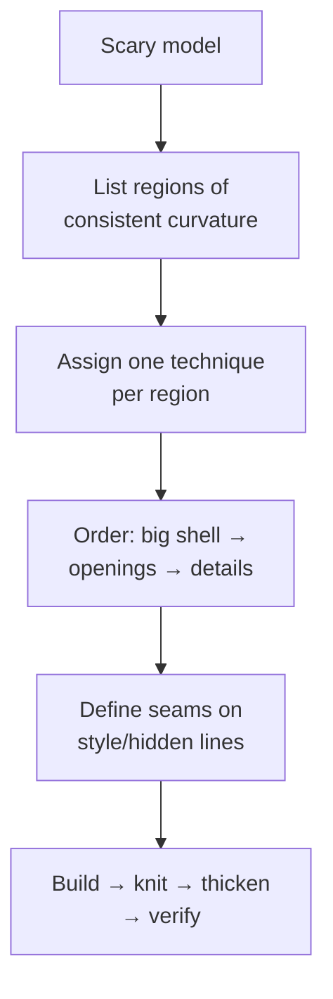

# Complex Showcase Builds

## For future agent
PL1 flagship page: the hardest builds — helmet trilogy (#16–18), propeller (#15), SpaceX Dragon (#91), washbasin (#84), water taps (#39/#49), nozzles (#54/#55/#86), lampshade (#92), hair-dryer body (#93/#94), car door (#8), magician hat (#6), engraved text on sphere (#7), water tank + handle (#2/#26/#79), shower assemblies. Strategies inferred from titles + surfacing methodology (TBC per-video). This page teaches decomposition of scary models into patch plans.

> **The real lesson of this page:** no model is "advanced" — every showcase build is 5–10 beginner techniques sequenced well. Decompose first, model second. If a build intimidates you, you haven't decomposed it yet.

---

## 1. Decomposition method (applies to everything below)

## 2. Flagship deconstructions

**Football helmet (#16–18, three parts) — the capstone of PL1:**
- Part 1: outer shell — boundary patches over crown/side zones, planned seams on ridge lines.
- Part 2: openings — visor + ear holes via trim with oversized patches first, edge roll (swept bead) around openings for stiffness + safety.
- Part 3: liner + details — offset-surface inner liner, chin strap mounts, vents. Multi-part thinking: shell/liner/hardware as separate bodies or parts.

**Marine propeller (#15):** one blade (lofted/boundary with twist from root to tip — pitch built into the profiles) → circular pattern → hub (revolve) → fillet blade roots (stress!). Blade pitch/rake/thickness distribution is naval architecture (TBC: this is CAD practice, not propeller design).

**SpaceX Dragon (#91):** capsule = revolve base + lofted shoulder + heat-shield base; SuperDraco pods as repeated lofted pods (pattern!). Symmetry + repetition turn a spacecraft into an exercise in planning.

**Washbasin (#84):** big sanitary ware — outer styling skin + inner bowl (offset!) + rim + drain hole + overflow (TBC if modeled). Ceramic reality: uniform walls, generous radii, no undercuts (mold/mandrel release).

**Water taps (#39/#49) + nozzles (#54/#55/#86):** spout sweeps + valve bodies + aerator threads; the plumbing lesson is standard interfaces (threads, seats) modeled to mate, not to look right solo.

**Lampshade (#92):** revolved/lofted shade + light-source clearance + heat awareness (incandescent vs LED changes everything — design context, not CAD).

**Car door (#8):** outer panel (large gentle curvature — boundary showcase) + window frame + handle recess + trim lines. Automotive panels demand C2 thinking ([[surfacing-methodology]]) — your zebra-stripe final exam.

**Magician hat (#6) + text on sphere (#7):** ruled/developable-ish surfaces (hat cone + brim) and text-wrapped-on-curved-face technique (split/project + emboss) — presentation-model skills.

**Water tanks (#2/#26/#79):** large vessels + handles + fittings (inlet/outlet bosses, lid threads) — the packaging-to-industrial bridge.

## 3. Multi-part discipline (showcase builds are assemblies in disguise)

- Separate bodies/parts per material and per manufacturing process (shell vs liner vs hardware).
- **Master-model technique (TBC depth):** drive multiple parts from one layout sketch/part so interfaces always agree — helmets and dragons stay consistent this way.
- Fasteners and bought-out parts (screws, vents, straps) as library components, not hand-modeled (model envelopes + mating features only).

## 4. Failure clinic (showcase scale)

| Symptom | Cause → Fix |
|---|---|
| 40-feature tree, afraid to touch anything | No decomposition plan → rebuild with region-per-feature-set order; name everything |
| Openings shatter the shell | Trimming across patch chaos → consolidate patches first, trim once, edge-roll after |
| Assembly interfaces mismatch | Parts modeled in isolation → master sketch or in-context references for every mating dimension |
| Zebra chaos on big panels | Too many sliver patches → rebuild zone with 2–3 large boundary patches |

---

## 5. Worked example: helmet shell patch plan (paper deliverable + build start)

Do the PAPER plan first (30 min) — regions, techniques, order, seams — then model Part 1 only. The plan is the graded deliverable.

**Paper plan (template — fill for YOUR helmet reference):**
| # | Region | Technique | Seams on |
|---|---|---|---|
| 1 | Crown center | Boundary (2 profiles × 2 guides) | Ridge style-lines L/R |
| 2 | Left/right sides | Boundary each, mirrored (model ONE side!) | Ridge lines + lower edge |
| 3 | Rear lower | Lofted transition to edge roll | Edge roll start |
| 4 | Visor opening | Trim (oversized shell first) | Opening curve + edge-roll bead |
| 5 | Ear recesses | Trim + small fill blends | Recess rims |
| 6 | Edge roll | Swept bead around full lower rim | Rim (functional seam, reads as design) |
| Order: 1→2→3 (knit as you go, staged) → 4→5 (trims) → 6 (bead) → zebra → thicken inward 3 (TBC: shell thickness per construction) |

**Propeller blade appendix (#15, numbers-first approach):**
1. Blade data: 3 blades, Ø300 (TBC illustrative), root chord 40 → tip chord 22, pitch angle 25° root → 12° tip (twist BUILT into profile orientations — TBC: real pitch follows hydrodynamic rules; this is CAD practice).
2. 4 sections (root/mid/tip + one intermediate) as rotated airfoil-ish profiles (flat-bottomed at this level — TBC) → Lofted surface with connectors aligned at leading edges (twist + connector discipline combined).
3. Circular pattern ×3 → hub revolve (Ø60 with shaft bore + keyway) → blade-root fillets 6 (stress! — the highest-loaded zone gets the biggest fair fillets).
4. Hand-rotation clearance vs a nozzle ring envelope (if ducted — TBC per design).

**Tap appendix (#39/#49, 10-step core):** base flange (revolve + bolt circle) → valve body (revolve) → spout centerline path → swept/lofted spout per §2 nozzle logic → aerator thread (modeled learning-grade) → handle lever (extrude + grip) → cartridge envelope inside body → assembly + section (water path visible? — the plumber's check) → chrome appearance + render.

---

## 6. Showcase support systems (what separates demos from products)

**Vents + grilles (hair dryer #93/#94-class, helmet #16–18):** intake zones need OPEN area (TBC: confirm airflow-area rules per device — illustrative starting point ~30–50% open) → patterned slots/holes (pattern a ZONE, cosmetic-rest per [[shredders-recycling-machines#5-failure-clinic]]) → recess the grille (impact protection + finger-safety: holes small enough to fail the finger probe — TBC: confirm safety standards for real products) → filter mesh envelope behind (serviceable? — model the access path, not just the mesh).

**Hinges + latches (any opening product):** living-hinge geometry (thin PP flex zone — TBC: confirm living-hinge design rules, NOT this page) vs mechanical hinge (pin + knuckles with clearance — TBC per size) vs snap latch (cantilever deflection math — TBC: confirm with snap-fit references). Pick per material and cycle count; model the pivot explicitly (assemblies that "just touch" separate in reality).

**Water/dust sealing (taps, shower #71/#82, outdoor housings):** O-ring grooves (rectangular groove to seal-cross-section rules — TBC: confirm with seal datasheets, e.g., standard O-ring groove tables) + squeeze verification in section view (groove fill ~75–85% — TBC per seal references) + drain paths for what gets past (seals delay water; drainage removes it — belt-and-suspenders is the professional stance).

**Fastener strategy (showcase assemblies):** ONE screw size per product where possible (service simplicity — TBC taste, confirm per cost analysis) → thread-forming screws into plastic bosses (pilot-hole per screw spec — TBC per datasheet) vs machine screws + inserts for serviceable joints (TBC per cycle count) → captive hardware where the user opens it (lost screws = support calls).

**Verify in-app:** produce the helmet paper plan for a real helmet photo set (front/side/top with ruler), then model regions 1–2 only + knit + zebra. Regions 1–2 done well beat all six done badly.

**Next:** [[artistic-organic]] → then PL2 machines from [[gearbox-fundamentals]].

## CROSS-REFERENCES
- [[INDEX]] · [[household-tools]] · [[artistic-organic]] · [[surfacing-methodology]] · [[gearbox-fundamentals]] · [[solidworks-project-ideas]]
