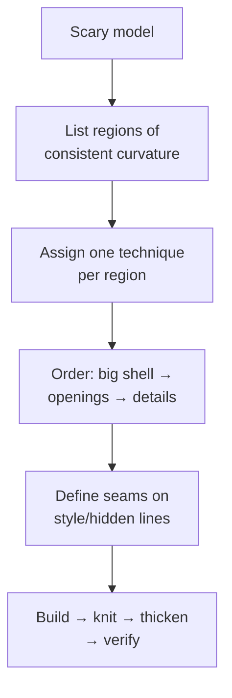

# Complex Showcase Builds

## For future agent
PL1 flagship page: the hardest builds — helmet trilogy (#16–18), propeller (#15), SpaceX Dragon (#91), washbasin (#84), water taps (#39/#49), nozzles (#54/#55/#86), lampshade (#92), hair-dryer body (#93/#94), car door (#8), magician hat (#6), engraved text on sphere (#7), water tank + handle (#2/#26/#79), shower assemblies. Strategies inferred from titles + surfacing methodology (TBC per-video). This page teaches decomposition of scary models into patch plans.

> **The real lesson of this page:** no model is "advanced" — every showcase build is 5–10 beginner techniques sequenced well. Decompose first, model second. If a build intimidates you, you haven't decomposed it yet.

---

## 1. Decomposition method (applies to everything below)

## 2. Flagship deconstructions

**Football helmet (#16–18, three parts) — the capstone of PL1:**
- Part 1: outer shell — boundary patches over crown/side zones, planned seams on ridge lines.
- Part 2: openings — visor + ear holes via trim with oversized patches first, edge roll (swept bead) around openings for stiffness + safety.
- Part 3: liner + details — offset-surface inner liner, chin strap mounts, vents. Multi-part thinking: shell/liner/hardware as separate bodies or parts.

**Marine propeller (#15):** one blade (lofted/boundary with twist from root to tip — pitch built into the profiles) → circular pattern → hub (revolve) → fillet blade roots (stress!). Blade pitch/rake/thickness distribution is naval architecture (TBC: this is CAD practice, not propeller design).

**SpaceX Dragon (#91):** capsule = revolve base + lofted shoulder + heat-shield base; SuperDraco pods as repeated lofted pods (pattern!). Symmetry + repetition turn a spacecraft into an exercise in planning.

**Washbasin (#84):** big sanitary ware — outer styling skin + inner bowl (offset!) + rim + drain hole + overflow (TBC if modeled). Ceramic reality: uniform walls, generous radii, no undercuts (mold/mandrel release).

**Water taps (#39/#49) + nozzles (#54/#55/#86):** spout sweeps + valve bodies + aerator threads; the plumbing lesson is standard interfaces (threads, seats) modeled to mate, not to look right solo.

**Lampshade (#92):** revolved/lofted shade + light-source clearance + heat awareness (incandescent vs LED changes everything — design context, not CAD).

**Car door (#8):** outer panel (large gentle curvature — boundary showcase) + window frame + handle recess + trim lines. Automotive panels demand C2 thinking ([[surfacing-methodology]]) — your zebra-stripe final exam.

**Magician hat (#6) + text on sphere (#7):** ruled/developable-ish surfaces (hat cone + brim) and text-wrapped-on-curved-face technique (split/project + emboss) — presentation-model skills.

**Water tanks (#2/#26/#79):** large vessels + handles + fittings (inlet/outlet bosses, lid threads) — the packaging-to-industrial bridge.

## 3. Multi-part discipline (showcase builds are assemblies in disguise)

- Separate bodies/parts per material and per manufacturing process (shell vs liner vs hardware).
- **Master-model technique (TBC depth):** drive multiple parts from one layout sketch/part so interfaces always agree — helmets and dragons stay consistent this way.
- Fasteners and bought-out parts (screws, vents, straps) as library components, not hand-modeled (model envelopes + mating features only).

## 4. Failure clinic (showcase scale)

| Symptom | Cause → Fix |
|---|---|
| 40-feature tree, afraid to touch anything | No decomposition plan → rebuild with region-per-feature-set order; name everything |
| Openings shatter the shell | Trimming across patch chaos → consolidate patches first, trim once, edge-roll after |
| Assembly interfaces mismatch | Parts modeled in isolation → master sketch or in-context references for every mating dimension |
| Zebra chaos on big panels | Too many sliver patches → rebuild zone with 2–3 large boundary patches |

**Verify in-app:** pick ONE flagship (helmet shell or tap) and produce only its patch plan on paper (regions + techniques + order) before modeling. The plan is the deliverable; the model is proof.

**Next:** [[artistic-organic]] → then PL2 machines from [[gearbox-fundamentals]].

## CROSS-REFERENCES
- [[INDEX]] · [[household-tools]] · [[artistic-organic]] · [[surfacing-methodology]] · [[gearbox-fundamentals]] · [[solidworks-project-ideas]]
