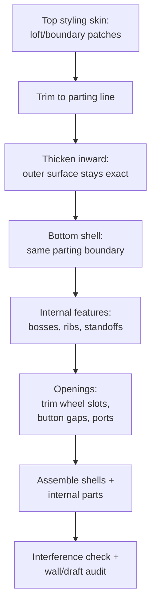

# Consumer Electronics Casings

## For future agent
PL1 product-family page: mice (#1/#24/#25/#50), earphones (#13/#22/#99), AirPods (#45), hair dryer (#93/#94) + nozzle (#44), shower heads (#71/#82), flashlight shell (#88), massager shell (#90), mounting boss (#81). Ergonomic-surfacing focus; recipes follow playlist title patterns + primer combos (TBC per-video vs bulk transcripts). Enclosure/mechanism notes are general product-design knowledge.

> **Why electronics casings are the real exam:** a bottle is one axisymmetric part. A mouse is two ergonomic shells + buttons + wheel + PCB standoffs that must fit together within millimeters. This page is where surfacing meets assemblies meets manufacturing — the complete product loop.

---

## 1. The casing workflow (two shells + guts)

**Parting-line thinking:** decide EARLY where the two halves split (usually the silhouette edge) — everything (trim boundaries, draft directions, shutoff surfaces) hangs off that decision. Late parting changes cascade through the whole tree.

## 2. Playlist build map

| Build | Core lesson (TBC per-video) |
|---|---|
| #1 Sketch mouse, #24/#25 Logitech mouse, #50 Apple Magic Mouse | Ergonomic top shell (loft + guides), side walls, bottom fill, wheel/button cutouts — the genre flagship; compare the three for style range |
| #13 Earphones body, #22 Earphone, #99 Earphone (loft), #45 AirPods | Small-scale surfacing: tiny radii, tight knit tolerances, stem-to-bud transitions |
| #93/#94 Hair dryer body, #44 Boundary nozzle | Main housing + focused airflow nozzle (rectangle→oval boundary); intake grille patterning |
| #71/#82 Shower head (boundary + lofted boss/base) | Dome + face plate + nozzle pattern (circular pattern of holes/jets) |
| #88 Flashlight shell (boundary), #90 Massager shell (filled) | Cylindrical ergonomic grips; switch cutouts; battery-compartment planning |
| #81 Mounting Boss feature | THE enclosure detail: screw posts with gussets — use the dedicated feature, don't hand-model posts |

## 3. Ergonomics surfacing notes (why mice feel right)

- **Palm shapes = loft + guides:** 2–3 profiles (front low, middle crown, rear taper) + a center-ridge guide curve. Crown height and asymmetry (right-hand bias) are the design variables — parameterize them, don't hard-code.
- **Thumb rest / finger grooves:** freeform tweaks AFTER the base quilt ([[surfacing-utilities-troubleshooting]]) — millimeters of push change feel enormously; zebra-check after every tweak.
- **Button gaps:** split lines + trim with consistent gap width (TBC: ~0.3–0.5 mm typical for plastic part gaps); buttons as separate parts for assembly realism.
- **Texture/grip zones:** cosmetic appearances for renders; modeled micro-ribs only if the brief demands (rebuild cost is brutal — TBC per project).

## 4. Enclosure engineering (the invisible half)

- **Bosses + inserts:** PCB/covers screw into mounting bosses; heat-set inserts for repeated assembly (model pilot holes to insert spec — TBC: confirm insert datasheets, not this page).
- **Ribs over thick walls:** stiffen with ribs, keep walls uniform (sink/warp avoidance from [[bottles-containers#4-packaging-dfm]]).
- **Snap fits (TBC depth):** cantilever hooks need deflection math + specific resins — flag for a dedicated study; model the geometry, validate with vendor data, not guesswork.
- **EMI/thermal (awareness only):** metal shielding, vents vs water ingress — know these constraints exist when placing openings; detailed design is its own discipline.

## 5. Failure clinic

| Symptom | Cause → Fix |
|---|---|
| Shells won't knit/thicken | Micro-gaps at parting boundary → extend + re-trim both shells to the SAME parting curves |
| Wheel slot trim shatters the shell | Trimming across patch seams → reposition slot onto one clean patch, or rebuild patch layout around the slot |
| Buttons bind in assembly | Zero clearance modeled → offset button faces inward (TBC: ~0.2 mm typical), verify with section + interference |
| Zebra kinks along parting line | C0-only boundary match → raise edge continuity, re-fill transition zones |
| Tiny features fail (earphone scale) | Absolute tolerances bite at small scale → simplify micro-fillets, loosen knit tolerance slightly (TBC: judge per case) |

**Verify in-app:** pick the mouse: top shell loft → trim → thicken inward → bottom shell → wheel slot → two bosses → assemble shells → interference check. Screenshot zebra stripes before/after into your daily note.

**Next:** [[household-tools]].

## CROSS-REFERENCES
- [[INDEX]] · [[bottles-containers]] · [[household-tools]] · [[lofted-boundary-surfaces]] · [[surfacing-utilities-troubleshooting]] · [[dressup-productivity]]
