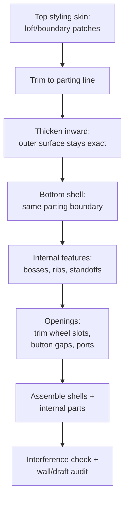

# Consumer Electronics Casings

## For future agent
PL1 product-family page: mice (#1/#24/#25/#50), earphones (#13/#22/#99), AirPods (#45), hair dryer (#93/#94) + nozzle (#44), shower heads (#71/#82), flashlight shell (#88), massager shell (#90), mounting boss (#81). Ergonomic-surfacing focus; recipes follow playlist title patterns + primer combos (TBC per-video vs bulk transcripts). Enclosure/mechanism notes are general product-design knowledge.

> **Why electronics casings are the real exam:** a bottle is one axisymmetric part. A mouse is two ergonomic shells + buttons + wheel + PCB standoffs that must fit together within millimeters. This page is where surfacing meets assemblies meets manufacturing — the complete product loop.

---

## 1. The casing workflow (two shells + guts)

**Parting-line thinking:** decide EARLY where the two halves split (usually the silhouette edge) — everything (trim boundaries, draft directions, shutoff surfaces) hangs off that decision. Late parting changes cascade through the whole tree.

## 2. Playlist build map

| Build | Core lesson (TBC per-video) |
|---|---|
| #1 Sketch mouse, #24/#25 Logitech mouse, #50 Apple Magic Mouse | Ergonomic top shell (loft + guides), side walls, bottom fill, wheel/button cutouts — the genre flagship; compare the three for style range |
| #13 Earphones body, #22 Earphone, #99 Earphone (loft), #45 AirPods | Small-scale surfacing: tiny radii, tight knit tolerances, stem-to-bud transitions |
| #93/#94 Hair dryer body, #44 Boundary nozzle | Main housing + focused airflow nozzle (rectangle→oval boundary); intake grille patterning |
| #71/#82 Shower head (boundary + lofted boss/base) | Dome + face plate + nozzle pattern (circular pattern of holes/jets) |
| #88 Flashlight shell (boundary), #90 Massager shell (filled) | Cylindrical ergonomic grips; switch cutouts; battery-compartment planning |
| #81 Mounting Boss feature | THE enclosure detail: screw posts with gussets — use the dedicated feature, don't hand-model posts |

## 3. Ergonomics surfacing notes (why mice feel right)

- **Palm shapes = loft + guides:** 2–3 profiles (front low, middle crown, rear taper) + a center-ridge guide curve. Crown height and asymmetry (right-hand bias) are the design variables — parameterize them, don't hard-code.
- **Thumb rest / finger grooves:** freeform tweaks AFTER the base quilt ([[surfacing-utilities-troubleshooting]]) — millimeters of push change feel enormously; zebra-check after every tweak.
- **Button gaps:** split lines + trim with consistent gap width (TBC: ~0.3–0.5 mm typical for plastic part gaps); buttons as separate parts for assembly realism.
- **Texture/grip zones:** cosmetic appearances for renders; modeled micro-ribs only if the brief demands (rebuild cost is brutal — TBC per project).

## 4. Enclosure engineering (the invisible half)

- **Bosses + inserts:** PCB/covers screw into mounting bosses; heat-set inserts for repeated assembly (model pilot holes to insert spec — TBC: confirm insert datasheets, not this page).
- **Ribs over thick walls:** stiffen with ribs, keep walls uniform (sink/warp avoidance from [[bottles-containers#4-packaging-dfm]]).
- **Snap fits (TBC depth):** cantilever hooks need deflection math + specific resins — flag for a dedicated study; model the geometry, validate with vendor data, not guesswork.
- **EMI/thermal (awareness only):** metal shielding, vents vs water ingress — know these constraints exist when placing openings; detailed design is its own discipline.

## 5. Failure clinic

| Symptom | Cause → Fix |
|---|---|
| Shells won't knit/thicken | Micro-gaps at parting boundary → extend + re-trim both shells to the SAME parting curves |
| Wheel slot trim shatters the shell | Trimming across patch seams → reposition slot onto one clean patch, or rebuild patch layout around the slot |
| Buttons bind in assembly | Zero clearance modeled → offset button faces inward (TBC: ~0.2 mm typical), verify with section + interference |
| Zebra kinks along parting line | C0-only boundary match → raise edge continuity, re-fill transition zones |
| Tiny features fail (earphone scale) | Absolute tolerances bite at small scale → simplify micro-fillets, loosen knit tolerance slightly (TBC: judge per case) |

---

## 6. Worked example: travel mouse in 20 steps (the genre flagship)

Dimensions illustrative (caliper YOUR mouse for the real lesson — TBC).

1–3. Layout: top-view footprint sketch (100 long × 60 wide, TBC illustrative) on Top Plane → side silhouette spline on Right Plane (front 25 high → 38 crown at 60% → rear 30 taper) → front silhouette on Front Plane. Three orthographic guides = the design's skeleton (shared sketches everything references).
4–6. Top shell: 3 profiles (front/middle/rear sections from the silhouettes — DERIVE via Convert, don't redraw) + center-ridge guide → Lofted Surface → zebra now (fix profiles while cheap).
7–8. Trim shell to parting loop (side silhouette projected as trim curves) → set aside.
9–10. Bottom plate: filled surface on parting loop (Tangent continuity, one camber constrain curve) → PTFE glide pads as split-line zones (TBC: decal/appearance at this level).
11. Thicken top shell inward 2 → thicken bottom inward 2 (outer styling untouched on both).
12–13. Wheel slot: standard trim through top shell (position from layout: centered, 15 behind front — TBC illustrative) → wheel as separate revolved part + axle + encoder envelope → assemble with concentric mate, spin-check.
14–15. Buttons: split lines for L/R zones with 0.4 gap (TBC illustrative) → separate button parts → pivot-post + spring-tab details simplified (TBC depth: real microswitches are bought parts — model envelopes + actuator points).
16–17. Internals: PCB envelope (to measured outline) + 4 mounting bosses from bottom shell + battery bay (AA envelope + contacts — TBC per mouse) + sensor window trim at the optical position.
18. Assembly: shells (concentric alignment pins + coincident parting faces) + PCB + wheel + buttons → interference detection → section through wheel (clearance above PCB?).
19. Zebra final on top shell + draft check (all walls releasable top/bottom?).
20. Render + fairness proof + rebuild test (change length 100→110: guides/profiles derived from layout should follow — failures name your weak references).

**Earphone-scale appendix (#13/#22/#45/#99):** same workflow at 1/5 scale — radii shrink below knit comfort (simplify micro-fillets FIRST), tolerances tighten (TBC per case), stem-to-bud transition = mini-loft with guides. If the mouse took a weekend, the bud takes an evening once the workflow is muscle memory.

**Verify in-app:** steps 1–20 on your own mouse. Screenshot zebra before/after into your daily note.

**Next:** [[household-tools]].

---

## 9. Drop, ingress + regulatory appendix (why casings are engineered, not styled)

**Drop survival (the test every phone/mouse ships through — TBC: confirm with reliability references, NOT this page):** corner/edge impact concentrates force (design sacrificial crush zones AWAY from PCB mounts — TBC per practice) → internal clearance for board FLEX (rigid-mounted boards crack solder joints on impact; compliant mounts + gap absorb — TBC per design) → battery retention under shock (ejected cells in a drop = thermal event + returned product; TBC: confirm with battery-safety references) → test drops in CAD review (which corner? which face? — the test plan EXISTS before tooling; TBC per reliability practice) → Simulation DROP module awareness (explicit dynamics — TBC license depth; the student move is reasoning + physical drop tests on prints, documented).

**Ingress ratings (dust/water — the IP system, awareness):** IP5X/6X dust (sealed seams + filtered vents — TBC per IEC 60529, NOT this page) → IPX4 splash → IPX7 immersion (pressure-equalization vent membranes that pass air, block water — TBC per component practice) → port covers/gaskets (every opening rated or the rating is void — the weakest-opening rule) → model ALL seals + covers + membranes (no "seal TBD" in shipped CAD — TBD seals leak).

**Regulatory marks (the label nobody designs but everybody needs — TBC: confirm with compliance references, NOT this page):** CE/FCC/UL marks + model numbers + serial space + battery warnings molded/printed on the housing (reserve the flat zone EARLY — §8-label-panel thinking extended) → RF keep-outs for antennas (metal near antennas detunes — TBC per RF practice; antenna clearance volumes are LAYOUT law) → accessibility of the battery for replacement regulations (TBC per jurisdiction — glued-shut designs face regulatory headwinds; the serviceability debate from §8 restated as law).

---

## 8. PCB + standoff layout math (the invisible engineering)

**Board mounting geometry:** M2.5/M3 mounting holes on the PCB (TBC per board — measure YOUR board, never assume) → standoff height = tallest bottom-side component + 1 clearance (TBC: confirm per assembly; shorted USB shields against standoffs is the classic smoke event — TBC per horror-story count) → boss OD vs keep-out zones (no copper/traces under boss flanges — TBC: confirm with PCB-layout rules; mechanical vs electrical coordination is a real job function).

**Port alignment (the assembly that must JUST WORK):** USB/HDMI/audio openings positioned FROM the PCB edge connector positions (in-context: board placed first, shell openings derived — never the reverse!) → opening oversize +0.5 per side minimum (TBC illustrative: connector insertion needs forgiveness; tight ports fail assembly) → recess depth vs plug length (plug must seat fully — TBC per connector datasheet) → shield-finger contact (EMI grounding through the shell — TBC depth: awareness that it exists).

**Thermal path (plastic + heat = design work):** hot components (CPU, regulators, LEDs — TBC per board: identify by datasheet power) get copper pours + vias (board-side, TBC) + air gap or thermal pad to shell (TBC per wattage) → vent slots positioned for CONVECTION (low-in, high-out — hot air rises; vents at the wrong height recirculate — TBC: confirm with thermal references) → shell material choice notes on drawing (standard ABS vs heat-stabilized — TBC per operating temp). Plastic enclosures don't cool; they INSULATE — every hot box needs an explicit thermal story.

**Battery bay appendix (the safety-critical cavity):** Li-ion needs containment thinking (puncture = fire — TBC: confirm with battery-safety references, NOT this page) → bay sized to cell + protection circuit + wire routing (no sharp edges on wire paths — grommets modeled where wires cross walls, TBC) → retention (strap/foam/compression — rattling cells fret through insulation) → service access (cells get replaced; glued-shut bays are e-waste design — TBC per product philosophy) → vent path for off-gassing (TBC: confirm with safety standards for real products).

---

## 7. Shower-head + flashlight appendix (water + light discipline)

**Shower head (#71/#82-class):** dome (lofted surface, §6-handle logic at larger scale) + face plate (flat-ish, nozzle field) → nozzles as patterned silicone-jet envelopes (rub-clean nubs — TBC: confirm real jet geometry with plumbing references; model count × layout, not micro-detail) → water inlet thread (modeled learning-grade, seal face for washer — the washer face matters more than the thread!) → flow path check in section (inlet → chamber → jets: uniform plenum depth? dead corners collect limescale — TBC: confirm with plumbing references) → chrome appearance + anti-scald awareness (TBC: thermostatic mixing is device-level, not CAD — know it exists).

**Flashlight shell (#88-class):** tube body (revolve/thin) + head (heatsink fins — patterned thin ribs; LED thermal path: emitter board → metal core → body — TBC: confirm thermal-stack practice; flashlights die of heat, not water) → tail switch boot (flexible envelope + retaining ring) → lens (transparent disc + O-ring groove per [[complex-showcase]] sealing notes) → knurling cosmetic (TBC) + pocket clip (spring-steel envelope + mount screws).

**Shared lesson:** both route something invisible (water, heat, light) through visible geometry — section-view the FLOW/THERMAL/OPTICAL path explicitly (the plumber's check from [[complex-showcase]] generalized). Products fail in the invisible paths; CAD reviews that only orbit the outside miss them.

## CROSS-REFERENCES
- [[INDEX]] · [[bottles-containers]] · [[household-tools]] · [[lofted-boundary-surfaces]] · [[surfacing-utilities-troubleshooting]] · [[dressup-productivity]]
