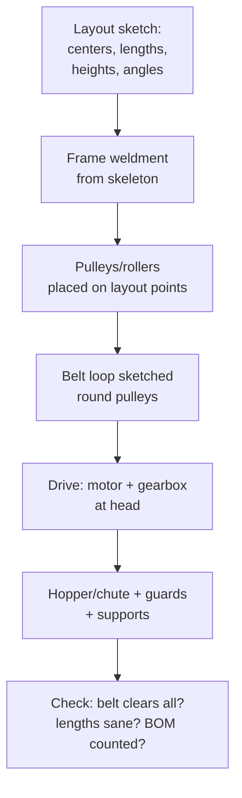

# Conveyors & Material Handling

## For future agent
PL2 build page. Videos: #2 feeding-hopper conveyor #374 · #8 belt conveyor #392 · #13 angular-mount belt #393 · #19 roller system #365 · #21 roller #305. Per-video specifics TBC vs bulk transcripts. Teaches: long-machine layout (lengths in meters, not mm-thinking), roller/belt construction, take-up/tension, and drive placement.

> **Why conveyors stretch your thinking:** everything so far fits on a desk. Conveyors are meters long — you learn layout sketches at scale, structural deflection awareness, repeated-roller patterning, and belt/chain routing. It's the bridge from parts to *plants*.

---

## 1. Conveyor anatomy (belt type)

```
HEAD pulley (drive end: motor + gearbox) ← BELT loops around ← TAIL pulley (take-up end)
   supported by IDLERS/snub pulleys + FRAME (welded legs + stringers)
   fed by HOPPER/chute, discharged over head pulley
   BELT TENSION via take-up screws at tail (non-negotiable — belts stretch)
```

- **Pulleys:** revolved drums with shafts + bearings; drive pulley lagged/crowned (crowning tracks the belt — awareness, TBC depth); snub pulleys increase wrap angle on the drive.
- **Idlers:** small roller sets (troughing 3-roll sets for bulk, flat for packages) at spaced intervals — patterned along the length (the pattern-count exercise).
- **Belt:** modeled as a thin extruded loop following the pulley tangent path (sketch the loop profile around pulleys → thin extrude). It will NOT flex in CAD — acceptable; note it as rigid representation (TBC: belt flex simulation is advanced FEA/fabrication territory).
- **Take-up:** slotted tail bearing mounts + screws — model the adjustment range, not just one position.

## 2. Roller conveyors (#365/#305): different physics

No belt — product rides directly on powered/idle rollers. Gravity-roller (unpowered, sloped) vs line-shaft/chain-driven (powered). CAD: side channels (sheet metal or C-channel weldment) + roller tubes (patterned, 100+ instances — use lightweight pattern settings + configurations) + legs with height adjustment + side guides. #374 feeding-hopper adds the hopper-to-belt interface (flow continuity: hopper outlet width vs belt width).

## 3. Angular mounting (#393): incline/decline duty

Tilted conveyors add: holdback/backstop (belt must not run backward on power loss — awareness), cleated belts for grip (patterned cleats on the belt loop), higher drive torque (grade resistance math — TBC: confirm conveyor design references, not this page), loading skirts to contain material on the slope.

## 4. Layout-first modeling (the method)



**Scale habits:** work in meters in the layout sketch (belt length, lift height); meters-to-mm slips cause 1000× errors — the classic conveyor blooper. Mass properties at this scale catch frame-vs-load absurdities early (awareness: real deflection needs beam calc/FEA, not this page).

## 5. Failure clinic

| Symptom | Cause → Fix |
|---|---|
| Belt loop won't close in sketch | Pulley tangent math off → sketch loop as tangent arcs/lines about pulley circles, fully define before thin-extrude |
| 200-roller pattern kills rebuild | Full detail × count → simplify roller (no internal detail) + set pattern to lightweight/geometry-only (TBC per version) |
| Frame legs mismatch floor | No height adjustment modeled → slotted feet or screw jacks at legs |
| Drive floats unattached | Motor/gearbox modeled late → mount plate + torque arm in the layout phase, not as afterthought |

---

## 6. Worked example: 2 m flat-belt conveyor (layout numbers)

All numbers illustrative (TBC: confirm with conveyor-design references like CEMA for real builds).

**Layout sketch (the design, top + side views):** length 2000 (pulley centers), belt height 800 (ergonomic feed — TBC per duty), pulleys Ø200 (head/tail), snub Ø120 under head (+30° wrap gain — TBC: confirm wrap math per drive needs), 6 idlers Ø89 (standard-ish — TBC) spaced 300.
**Frame:** legs (4× square-tube 50×50 weldment — TBC per load) + 2 stringers (C-channel envelopes) full length + cross members at each idler + adjustable feet (±50 slots — floors lie).
**Pulleys:** revolved drums (crowned 0.5? — TBC: confirm crowning practice; awareness that crowning tracks belts) + shafts + pillow-block bearings (bought-out envelopes) → head shaft extends to drive coupling.
**Idlers:** ONE simplified roller part (tube + end caps, no internals) → linear pattern ×6 (+ mirrored return-side idlers ×3 flat — return belt needs support too, beginners forget the bottom run!).
**Belt loop:** side-view sketch — tangent lines top/bottom + 180° arcs around pulleys (fully define: tangent relations, not eyeballed) → thin extrude 500 wide × 6 thick (TBC illustrative) → belt-tension take-up: tail bearings on slotted plates + M16 screws (model the SLOT + 100 travel — adjustment range is the feature).
**Drive:** motor (envelope, TBC kW per duty — confirm with conveyor references) + gearbox per [[helical-spur-gearboxes]] + chain coupling guard (CLOSED guard, sheet metal — §3's safety rule) + torque-arm from gearbox to frame (gearboxes spin without it — the forgotten part!).
**Feed/discharge:** tail skirt boards (contain the load-on point — TBC) + head discharge hood + scraper blade at head pulley (belt cleaning — without it, carryback builds up and mistracks the belt; TBC: confirm scraper practice).

**Incline variant drill (#393-class, 15°):** tilt layout → cleats every 400 on belt (patterned angle profiles — TBC per material) → loading skirts full slope length → holdback on head shaft (anti-rollback — awareness, TBC device selection) → drive torque recompute (grade resistance $W·sin(15°)$ continuous extra load — TBC: confirm full conveyor-tension calculation method, NOT this page). The delta between flat and incline models is the lesson — diff them feature by feature.

**Verify in-app:** model the 2 m flat version, then tilt a copy 15° and add cleats + skirts — the delta between the two is the angular-mounting lesson.

**Next:** [[presses-forming-drone]].

## CROSS-REFERENCES
- [[INDEX]] · [[shredders-recycling-machines]] · [[presses-forming-drone]] · [[gearbox-fundamentals]] (drives) · [[part-assembly-drawing-workflow]]
