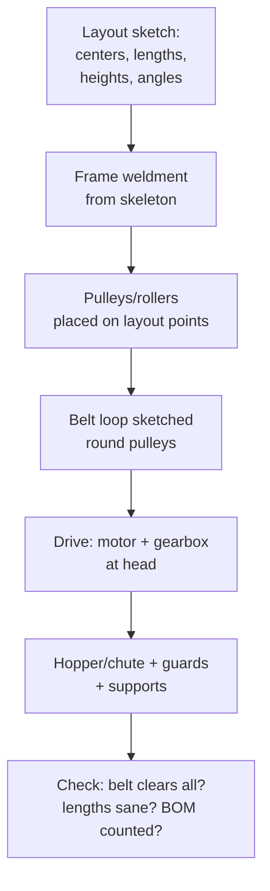

# Conveyors & Material Handling

## For future agent
PL2 build page. Videos: #2 feeding-hopper conveyor #374 · #8 belt conveyor #392 · #13 angular-mount belt #393 · #19 roller system #365 · #21 roller #305. Per-video specifics TBC vs bulk transcripts. Teaches: long-machine layout (lengths in meters, not mm-thinking), roller/belt construction, take-up/tension, and drive placement.

> **Why conveyors stretch your thinking:** everything so far fits on a desk. Conveyors are meters long — you learn layout sketches at scale, structural deflection awareness, repeated-roller patterning, and belt/chain routing. It's the bridge from parts to *plants*.

---

## 1. Conveyor anatomy (belt type)

```
HEAD pulley (drive end: motor + gearbox) ← BELT loops around ← TAIL pulley (take-up end)
   supported by IDLERS/snub pulleys + FRAME (welded legs + stringers)
   fed by HOPPER/chute, discharged over head pulley
   BELT TENSION via take-up screws at tail (non-negotiable — belts stretch)
```

- **Pulleys:** revolved drums with shafts + bearings; drive pulley lagged/crowned (crowning tracks the belt — awareness, TBC depth); snub pulleys increase wrap angle on the drive.
- **Idlers:** small roller sets (troughing 3-roll sets for bulk, flat for packages) at spaced intervals — patterned along the length (the pattern-count exercise).
- **Belt:** modeled as a thin extruded loop following the pulley tangent path (sketch the loop profile around pulleys → thin extrude). It will NOT flex in CAD — acceptable; note it as rigid representation (TBC: belt flex simulation is advanced FEA/fabrication territory).
- **Take-up:** slotted tail bearing mounts + screws — model the adjustment range, not just one position.

## 2. Roller conveyors (#365/#305): different physics

No belt — product rides directly on powered/idle rollers. Gravity-roller (unpowered, sloped) vs line-shaft/chain-driven (powered). CAD: side channels (sheet metal or C-channel weldment) + roller tubes (patterned, 100+ instances — use lightweight pattern settings + configurations) + legs with height adjustment + side guides. #374 feeding-hopper adds the hopper-to-belt interface (flow continuity: hopper outlet width vs belt width).

## 3. Angular mounting (#393): incline/decline duty

Tilted conveyors add: holdback/backstop (belt must not run backward on power loss — awareness), cleated belts for grip (patterned cleats on the belt loop), higher drive torque (grade resistance math — TBC: confirm conveyor design references, not this page), loading skirts to contain material on the slope.

## 4. Layout-first modeling (the method)



**Scale habits:** work in meters in the layout sketch (belt length, lift height); meters-to-mm slips cause 1000× errors — the classic conveyor blooper. Mass properties at this scale catch frame-vs-load absurdities early (awareness: real deflection needs beam calc/FEA, not this page).

## 5. Failure clinic

| Symptom | Cause → Fix |
|---|---|
| Belt loop won't close in sketch | Pulley tangent math off → sketch loop as tangent arcs/lines about pulley circles, fully define before thin-extrude |
| 200-roller pattern kills rebuild | Full detail × count → simplify roller (no internal detail) + set pattern to lightweight/geometry-only (TBC per version) |
| Frame legs mismatch floor | No height adjustment modeled → slotted feet or screw jacks at legs |
| Drive floats unattached | Motor/gearbox modeled late → mount plate + torque arm in the layout phase, not as afterthought |

---

## 6. Worked example: 2 m flat-belt conveyor (layout numbers)

All numbers illustrative (TBC: confirm with conveyor-design references like CEMA for real builds).

**Layout sketch (the design, top + side views):** length 2000 (pulley centers), belt height 800 (ergonomic feed — TBC per duty), pulleys Ø200 (head/tail), snub Ø120 under head (+30° wrap gain — TBC: confirm wrap math per drive needs), 6 idlers Ø89 (standard-ish — TBC) spaced 300.
**Frame:** legs (4× square-tube 50×50 weldment — TBC per load) + 2 stringers (C-channel envelopes) full length + cross members at each idler + adjustable feet (±50 slots — floors lie).
**Pulleys:** revolved drums (crowned 0.5? — TBC: confirm crowning practice; awareness that crowning tracks belts) + shafts + pillow-block bearings (bought-out envelopes) → head shaft extends to drive coupling.
**Idlers:** ONE simplified roller part (tube + end caps, no internals) → linear pattern ×6 (+ mirrored return-side idlers ×3 flat — return belt needs support too, beginners forget the bottom run!).
**Belt loop:** side-view sketch — tangent lines top/bottom + 180° arcs around pulleys (fully define: tangent relations, not eyeballed) → thin extrude 500 wide × 6 thick (TBC illustrative) → belt-tension take-up: tail bearings on slotted plates + M16 screws (model the SLOT + 100 travel — adjustment range is the feature).
**Drive:** motor (envelope, TBC kW per duty — confirm with conveyor references) + gearbox per [[helical-spur-gearboxes]] + chain coupling guard (CLOSED guard, sheet metal — §3's safety rule) + torque-arm from gearbox to frame (gearboxes spin without it — the forgotten part!).
**Feed/discharge:** tail skirt boards (contain the load-on point — TBC) + head discharge hood + scraper blade at head pulley (belt cleaning — without it, carryback builds up and mistracks the belt; TBC: confirm scraper practice).

**Incline variant drill (#393-class, 15°):** tilt layout → cleats every 400 on belt (patterned angle profiles — TBC per material) → loading skirts full slope length → holdback on head shaft (anti-rollback — awareness, TBC device selection) → drive torque recompute (grade resistance $W·sin(15°)$ continuous extra load — TBC: confirm full conveyor-tension calculation method, NOT this page). The delta between flat and incline models is the lesson — diff them feature by feature.

**Verify in-app:** model the 2 m flat version, then tilt a copy 15° and add cleats + skirts — the delta between the two is the angular-mounting lesson.

---

## 7. Cost + safety appendix (the plant-level thinking)

**Cost drivers in order (design for them):** length (steel by the meter!) → belt width/grade → drive size → custom vs standard pulleys/idlers (bought-out catalog parts beat modeled customs 10:1 on price — TBC: confirm with supplier catalogs) → guards + access platforms (safety scope rivals machine scope on real installs). Model standard sizes from the start (catalog-first part selection, not round-number invention).

**Safety scope (awareness — TBC regulatory depth, confirm with local machinery-safety standards, NOT this page):** nip-point guards at every pulley (head/tail/snub/take-up — the in-running nip draws hands in), pull-cord e-stops along the length, belt-break containment on inclines, lockout points on the drive. Model guards CLOSED with fasteners + interlock envelopes (the "guard removed for clarity" config never ships). A conveyor model without guards is a student exercise; with guards, it's a proposal.

**Take-up travel math (illustrative — TBC per belt spec):** fabric belts stretch ~1–2% over life (TBC: confirm with belt references) → 2 m conveyor needs ~20–40 mm take-up travel MINIMUM → model slots + screw length to match. Short take-ups top out within a year and the belt slips forever after — the maintenance lesson hiding in a slot length.

**Next:** [[presses-forming-drone]].

---

## 14. Idler-frame + structure appendix (steel that holds belts — TBC per structural references)

**Idler support frames (the repeated module — TBC: confirm with conveyor-structure practice):** drop-bracket vs stringer-mount idler sets (TBC per duty: change-out speed differs!) → frame spacing matched to idler spacing (structure rhythm follows belt rhythm — the §4-layout habit extended!) → adjustable troughing (wing-angle shims for belt training tweaks — TBC per commissioning!) → CAD consequence: ONE parametric idler-frame module patterned full length (the §8-config habit: change once, update everywhere!) + splice joints at transport lengths (shipped in pieces — TBC per logistics!).

**Stringers + bents (the long steel — TBC: confirm with structural references, NOT this page):** trussed vs beam stringers (span-dependent — TBC per loading!) → bent spacing + foundations (soil + anchor design outsourced to civil — TBC per discipline split; YOUR model provides LOADS + baseplates!) → walkway ONE side minimum (inspection access per §9-safety!) + crossovers where people pass under (headroom + kick plates — TBC per safety!) → CAD consequence: structural ENVELOPES with connection zones (steel detailers do connections — TBC per trade split; model member LINES + loads, not bolts!).

**Head/tail frames (the loaded ends):** drive torque reaction (holdback + torque-arm loads INTO structure — TBC per analysis!) → take-up mass towers (gravity take-up weights + travel — TBC per belt spec!) → pulley removal space (change-out envelopes — bearings + pulleys extract WITHOUT cutting steel — TBC per maintenance!) → CAD consequence: end-frame assemblies as MAINTAINABLE modules (the §7-housing-split lesson at conveyor scale: design the DISASSEMBLY, not just the assembly!).

---

## 13. Commissioning + handover appendix (day one to day done — TBC per commissioning practice)

**Pre-startup review (paper before power — TBC: confirm with pre-startup-safety-review practice, NOT this page):** guard/interlock inventory vs model (every §9 guard present + tagged?) → lubrication filled + labeled (grade + level per §10-lube!) → torque verification sample (foundation + coupling bolts torqued + marked? — TBC per procedure!) → electrical + controls checkout (e-stop categories tested per §9!) → CAD consequence: the AS-BUILT redline round (field changes marked on prints DURING install — the model updates AFTER, or maintenance inherits fiction per §9!).

**No-load → load ramp (the first hours — TBC per practice):** rotation checks uncoupled (direction correct BEFORE coupling? — backwards conveyors destroy chutes!) → belt tracking empty (take-up centered per §6-travel math!) → ramp rate stepped (25/50/75/100% with tracking checks each step — TBC per procedure!) → vibration + temperature baselines logged (future diagnostics compare against DAY ONE — TBC per reliability practice: baselines are the most valuable data nobody collects!) → CAD consequence: baseline readings FILED with the equipment record (the §12-failure-resume habit at plant scale!).

**Handover package (the deliverable owners pay for — TBC per contract practice):** as-built drawings + BOM + spares list (§8-wear + §12-spares!) → O&M manuals with procedures (lockout, tensioning, tracking, lube schedule — TBC per vendor docs!) → training records (operators + maintainers signed off — TBC per site!) → warranty terms + contact tree (TBC per contract!) → CAD consequence: the FINAL model revision matches reality (the loop closed: site → redlines → model → archive — the §-toolchain single-source rule at project scale!).

---

## 12. Stacker/reclaimer + ship-loader appendix (bulk handling at scale — TBC per bulk-handling references)

**Stackers (building stockpiles systematically):** radial luffing + slewing motions stacking in windrows (TBC per yard practice) → tripper-fed boom conveyors (the §11-tripper lesson at 50 m scale!) → boom deflection under load (lattice vs box boom — TBC per structural practice; CAD the boom as weldment per §4-frames!) → wheel/bogey travel on yard rails (the §11-shuttle lesson scaled!) → CAD consequence: stockpile footprints as SITE envelopes (live + dead storage zones — TBC per yard planning; the §11-Dragon scale-model discipline applied to dirt!).

**Reclaimers (taking it back — bucket-wheel + scraper chains):** bucket-wheel digging face (buckets + ring chute + falling-stream transfers per §9 — TBC per machine!) → counterweight + ballast discipline (overturning moments tracked like the §7-H-frame load path — TBC per stability analysis!) → operator sightlines + cameras (blind digging breaks things — TBC per operation!) → CAD consequence: digging envelope vs structure clash through FULL motion ranges (the §11-travel-extremes habit: check BOTH ends + middle, not mid-travel complacency!).

**Ship loaders/unloaders (the quayside giants — TBC depth):** shuttle/trip feed + boom luff/slew + telescopic loading chutes (dust + degradation control per §9-transfers — TBC!) → hatch-coaming clearances (ship geometry constrains loader geometry — TBC per naval architecture; design around the SHIP!) → storm lock-down + travel storm brakes (TBC per wind practice: parked machines must survive storms! — the §11-end-stop lesson at maximum stakes!) → CAD consequence: SHIP ENVELOPES in the assembly (multiple vessel classes — the §11-scale-model discipline: design around the fleet, not one hull!).

---

## 11. Shuttle + tripper + feeder appendix (moving the load point)

**Tripper conveyors (discharge ANYWHERE along the run):** traveling tripper carriage on rails above the belt (TBC: confirm with tripper references) → belt lifted through tripper pulleys into a discharge chute that moves WITH the carriage (the belt path changes with position — model min/max travel extremes!) → winch/cable drive for carriage motion (TBC per design) → chute telescoping/flexible sections (TBC per travel) → CAD consequence: TWO configurations minimum (tripper at each END of travel — interference + belt-length checks at BOTH extremes, not mid-travel complacency!).

**Shuttle conveyors (whole-machine traverse):** machine on rails/wheels traversing perpendicular (stockpile building, ship loading — TBC per application) → travel drives + rail/wheel envelopes (TBC per load) → festoon/cable-reel power feed (moving machines need moving power — TBC per electrical practice; festoon sag + bend radii modeled!) → end-stop buffers + derail containment (TBC per safety) → CAD consequence: travel envelope swept volumes (the machine + load at EVERY position vs structures — swept-volume clash check, TBC per method).

**Feeders (controlled discharge FROM storage):** belt feeders (short belts under hoppers with adjustable gates — TBC per rate control) → apron feeders (overlapping steel pans on chains for heavy/large feed — TBC per mining-duty practice) → vibratory feeders (tuned-spring resonance drive — TBC depth: the tuning IS the design, confirm with vibration references NOT this page) → rotary valves/airlocks (metered + pressure-sealing discharge — TBC per valve practice) → CAD consequence: rate-control features (gates, VFDs, stroke adjustments) modeled WITH their adjustment ranges (the §6-take-up lesson generalized: adjustable things show their RANGE!).

---

## 10. Screw + bucket + pneumatic appendix (the conveying family beyond belts)

**Screw conveyors (augers):** helical flighting on a center tube inside a U-trough (the §6-turbine geometry doing bulk work!) → pitch ≈ diameter standard-ish (TBC: confirm with CEMA screw-conveyor references, NOT this page) → hanger bearings every ~3 m (TBC per length: long screws whip without support — critical-speed awareness, TBC depth) → variable pitch options (metering/feeding duty — TBC per application) → CAD consequence: flights as patterned helical sweeps (rebuild-heavy — suppress in working configs per the §8-config habit) + trough clearance rotate-checked (the turbine lesson restated).

**Bucket elevators (vertical bulk lifting):** head/tail sprockets + chain/belt loop + buckets at spacing (TBC per capacity: spacing sets throughput) → centrifugal vs continuous discharge (head speed decides — TBC per material behavior) → boot + head housings (dust-tight per §9 — buckets throw dust at both ends!) → belt/chain tension + tracking (the §6-take-up lesson vertical) → explosion venting for grain/dust duty (TBC: confirm with safety standards, NOT this page — grain dust explodes; the awareness is non-optional).

**Pneumatic conveying (awareness — TBC depth, confirm with pneumatic-conveying references):** dilute-phase (high velocity, low pressure — fragile product degrades! — TBC) vs dense-phase (slug flow, gentle, high pressure — TBC) → rotary airlocks at infeed (pressure seal that meters — TBC per valve practice) → bends wear (long-radius + replaceable back plates — TBC per abrasive duty) → CAD consequence: route piping with bend-radius discipline + hanger spacing + flexible connections at equipment (vibration isolation — TBC). Model the ROUTE first (layout sketch in 3D — the §4-layout habit in three dimensions), details second.

---

## 9. Transfer chutes + dust control appendix (where conveyors meet reality)

**Transfer design (the highest-wear zone of any plant):** falling-stream trajectory from head-pulley velocity (TBC: confirm with transfer-chute references — hood geometry follows the stream, not aesthetics) → rock-box (dead-material bed absorbs impact — sacrificial wear surface, replaceable liners per §8-wear thinking generalized) vs curved spoon (low-degradation flow for friable product — TBC per material) → skirt/seal at the receiving belt (dust + spillage containment — TBC per practice) → impact idlers/bed under the stream landing (bare-belt impact destroys belts AND idlers — TBC per practice).

**Dust + spillage (the compliance layer):** enclosure around transfers with extraction stubs (TBC per environmental regs — dust is a health AND explosion hazard with organics/metals; TBC: confirm with safety standards, NOT this page) → return-belt cleaners (V-plows + diagonal blades keep carryback off the structure — TBC per practice; carryback mistracks belts AND buries idlers) → walkway + access (every inspection point reachable WITHOUT climbing structure — TBC per safety practice; unmaintainable designs get neglected, neglected conveyors fail) → spill containment below (drip trays/grading — TBC per site).

**Commissioning checklist (the model-to-plant handoff):** belt tension + tracking verified (take-up position logged — §6-travel math closed out) → all guards closed + interlocks tested (TBC per lockout procedure) → pull-cords + e-stops function-tested full length → first-material run at REDUCED rate (witness tracking/discovers before full load — TBC per commissioning practice) → punch-list modeled back into CAD (as-BUILT revision — the drawing must match reality, or maintenance works from fiction; TBC per document-control practice).

---

## 8. Idler/roller deep pass + belt specification (the rotating details)

**Idler anatomy (troughing 3-roll set, bulk duty):** center horizontal roll + 2 wing rolls angled 20–35° (TBC: confirm with CEMA/idler references — trough angle sets belt cross-section and capacity) → rolls spin on dead (non-rotating) shafts pressed into support brackets (live-shaft vs dead-shaft choice is a maintenance fork: dead shafts change rolls without touching alignment — TBC per practice) → labyrinth seals (dust kills bearings; sealed-for-life vs regreasable is a duty decision — TBC per environment) → spacing: carrying-side every ~1–1.2 m (TBC illustrative; sag between idlers must stay ~1–2% of spacing or the belt flaps — TBC: confirm with belt-sag references), return-side every ~3 m flat singles.

**Roller conveyor details (#365/#305-class):** gravity rollers (unpowered: tube + pressed bearings + spring-loaded hex axle that pops into frame holes — tool-free replacement is the feature!) → slope for gravity flow ~2–5% grade (TBC illustrative: too flat stalls, too steep runs away — confirm per load) → powered line-shaft (one rotating shaft drives ALL rollers via bands/chains — TBC per system: accumulation zones need clutches/zero-pressure logic, awareness level) → chain-driven (sprockets per roller — positive drive, no slip, heavier + noisier) → curve sections (tapered rollers or differential speeds steer the load — TBC depth; curves are their own engineering).

**Belt specification reading (order like a buyer):** width (load cross-section + edge clearance — TBC per capacity calc) → cover grade (abrasion/oil/heat/chemical per material — TBC per belt catalogs) → ply/strength rating (tension calc per §6 incline math extended — TBC: confirm full DIN/ISO belt-selection method, NOT this page) → splice type (vulcanized endless vs mechanical fasteners: vulcanized runs quieter/stronger, mechanical splices on-site fast — TBC per operation) → model belt thickness into pulley diameters + take-up travel (thick belts need bigger pulleys — TBC: confirm minimum-pulley tables per belt spec).

**Discharge + transfer appendix:** head-pulley trajectory (material leaves tangentially — hood shaped to the trajectory, not to aesthetics — TBC: confirm with transfer-chute references) → transfer chutes between conveyors (rock boxes vs curved spoon chutes for wear/segregation control — TBC depth; chute wear liners as replaceable plates — model the liner pattern!) → dust suppression at transfers (enclosure + extraction stubs — TBC per environmental compliance; dust is explosive with some materials — TBC: confirm with safety references, NOT this page) → impact beds/cradles at loading (belt support under the drop zone — bare idlers dent under impact; TBC per practice).

## CROSS-REFERENCES
- [[INDEX]] · [[shredders-recycling-machines]] · [[presses-forming-drone]] · [[gearbox-fundamentals]] (drives) · [[part-assembly-drawing-workflow]]
