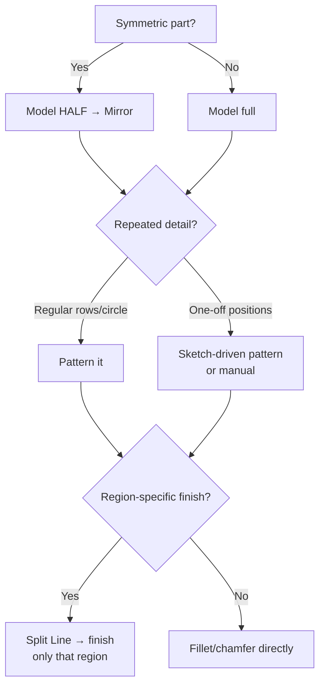

# Dress-Up & Productivity: Fillets, Shells, Patterns, Mirror, Split Lines

## For future agent
Third solid-features page — the "finish and multiply" kit. Grounded in PL1 #43 (Split Line + Offset + Thicken combo) and recurring playlist patterns (linear pattern vary in #101, shells on bottles/enclosures). All version-stable core features.

> **Why last in modeling order but first in speed:** dress-up features are cheap individually, but their *combos* (mirror-half-then-pattern, split-line-then-fillet-control, shell-then-boss) are what make playlist modelers fast. Learn the combos, not just the buttons.

---

## 1. Edge treatment: Fillet vs Chamfer (and when each)

| | Fillet (round) | Chamfer (flat bevel) |
|---|---|---|
| Looks | Soft, molded, ergonomic | Machined, crisp, industrial |
| Stress | Spreads load (stronger) | Concentrates slightly less well |
| Cost | Needs ball-endmill/form tool | Single chamfer mill pass — cheaper |
| Rule | Consumer/pretty/stress-critical edges | Screw heads seating, deburr edges, machined parts |

**Real-world anchor:** a sharp internal corner on a molded part is a crack waiting to happen (stress concentration) AND a mold that can't fill. Fillets aren't decoration — on plastic and cast parts they're structural. On machined parts, chamfers break sharp edges so nobody gets cut and screws seat flat.

**Selection tricks:** select a *face* to fillet all its edges at once; use **variable-size fillet** for ergonomic swells; **face fillet** blends two non-touching faces (surface-model territory).

## 2. Shell, Draft, Rib — the plastic-part trio

- **Shell** (hollow out): pick the open face(s), set wall thickness → uniform walls instantly. Bottles, enclosures, housings. Shell near the END (it eats faces later features may need).
- **Draft** (taper faces): mold release angle on vertical walls. If it will be injection-molded or cast, it needs draft — 1–3° typical (confirm with molder; TBC as universal spec).
- **Rib** (strength without weight): thin triangular gussets sketched with one line. Electronics enclosures and brackets stay light and stiff via ribs, not thick walls.
- **Mounting Boss** (PL1 #81): the little screw-post feature — cylindrical post + gussets in one shot, the standard way PCBs and covers screw into plastic housings.

## 3. Multiply: Mirror, Pattern, and the combos

**Mirror** (about a plane): model HALF the symmetric part, mirror the *features or bodies*. Half the work, guaranteed symmetry — the single biggest speed habit in the playlists. Mirror solids/bodies, not dozens of faces.

**Patterns:**

| Pattern | Use | Playlist sighting |
|---|---|---|
| Linear | Rows/columns of holes, fins, vents | #101 gradient hole cover — **Instances to Vary** changes size along the row! |
| Circular | Bolt circles, fan blades, gear teeth layouts | Gearbox covers, propeller (#15) |
| Curve/Table-driven | Irregular spacing | Conveyor rollers, custom layouts |
| Sketch-driven | Arbitrary positions from a sketch | One-off mounting maps |

**The combos (memorize these four):**
1. **Mirror-half + pattern-detail:** symmetric base → mirror → pattern the repeated detail once. (Nearly every symmetric playlist build.)
2. **Split Line + control:** PL1 #43 pattern — split a face to *isolate* a region, then fillet/offset/thicken only that region. Split lines are how you tell SolidWorks "here, not everywhere."
3. **Shell + boss + rib:** hollow the enclosure, add mounting bosses, stiffen with ribs — the complete plastic housing loop.
4. **Pattern + configurations:** one model, pattern counts driven per-configuration (small/medium/large variants) — product-family modeling.

## 4. Failure clinic

| Symptom | Cause → Fix |
|---|---|
| Fillet fails on one edge | Edge too short/tangent tangle → fillet in sets (big radii first, small last), or reorder before the consuming feature |
| Shell fails / disappears faces | Wall thicker than local geometry, or sharp internal corners → add fillets BEFORE shelling, reduce thickness locally |
| Pattern goes wrong direction | Wrong seed/reference edge → flip direction, check spacing vs extent math |
| Mirror creates duplicate/gap | Asymmetric leftovers or face-level mirror → mirror bodies/features, verify the half was truly symmetric |
| Split line won't select region | Sketch must fully divide the face (extend past boundaries) or project cleanly onto it |

---

## 5. Worked example: plastic sensor housing (the full loop in one part)

A 70×50×25 motion-sensor box: base + lid split, PCB posts, vents, wall mount — every combo firing.

1. **Base box:** Top Plane → 70×50 centered on origin → Extrude Mid-Plane 25. Rename `Main-Body`.
2. **Split for lid:** Front-offset plane at 18 (lid = top 7 mm) → **Split** feature (or Cut-Extrude a 0.5 gap? cleaner: Split with two bodies → `Save Bodies` into `Housing-Base` + `Housing-Lid` as an assembly later — TBC per your assembly strategy; simplest learning path: keep one part, two configs).
3. **Shell the base:** Shell 2 mm, remove the TOP face (open tub). Fillets BEFORE shell would have gone here — note the order: box → fillet outer verticals 3 mm → shell. (If you shelled first, the fillet now fails on thin edges — try it, watch it fail, reorder, learn permanently.)
4. **PCB posts:** 4× mounting bosses (Mounting Boss feature) on 60×40 pattern, height to hold PCB 5 above floor → ribs auto-included by the feature.
5. **Vents:** one slot sketch (10×2) on a side wall → Linear Pattern along the wall (12 instances) → mirror to opposite wall. One seed, patterned twice — the combo.
6. **Lid detail:** split-line a logo zone on top → 0.5 deboss (Cut 0.5) → perimeter tongue-and-groove lip (swept profile around the rim — TBC exact lip geometry per enclosure practice; a simple 1×1 step reads as a seal groove at this level).
7. **Wall-mount:** back face → 2× keyhole slots (circle + slot + wider circle — sketch once, mirror) → split-line keep-out around them.

**Pattern mastery notes:** Linear Pattern options that matter — Spacing AND Instances (Up To Reference beats both when filling a wall: set the wall length, count follows); **Vary Sketch** rebuilds each instance from the seed sketch (slow, powerful — curved-surface patterns); Geometry Pattern skips end-condition solving (fast for simple repeats — TBC per version label). Instances-to-Vary (PL1 #101) sizes/steps instances along the row — gradient vents, directional ribs.

**Verify in-app:** build the housing, then change 70→90: posts track (pattern from edges), vents refill (Up To Reference), shell holds. Every tracking success is design intent paying rent.

---

## 6. Draft + parting-line design (the molding literacy add-on)

**Reading a part for moldability (30-second audit):** pick the pull direction (the axis the mold halves separate along — usually the longest straight axis) → every face must slope AWAY from the parting line along pull (draft!) → faces perpendicular to pull are either parting-line faces or undercuts. Do this audit on every plastic part BEFORE modeling details — late undercut discoveries scrap weeks.

**Parting-line placement strategy:** silhouette edge (the mold split hides on the visual edge — the mouse/housing standard) → shutoff surfaces where openings cross the parting (windows, slots need steel meeting steel — model the shutoff faces explicitly, TBC depth) → side-actions for unavoidable undercuts (holes perpendicular to pull need sliding cores — awareness: adds mold cost/complexity; redesign to eliminate side-actions is the professional reflex, TBC per project economics).

**Rib design rules (numbers-first):** rib thickness ~50–60% of wall (thicker sinks opposite — TBC: confirm with molding references), height ≤ ~3× wall (taller buckles), draft 0.5–1° per side (TBC), generous base fillet (stress + flow), gusseted ends. A ribbed tub floor carries like a solid block at a fraction of the weight and sink risk — the lightweighting move behind every electronics housing in [[consumer-electronics]].

**Next:** the surfacing track — [[surfacing-methodology]].

## CROSS-REFERENCES
- [[INDEX]] · [[lofted-boss-boundary]] · [[surfacing-methodology]] · [[beginner-exercises]] · [[solidworks-cheatsheet]]
