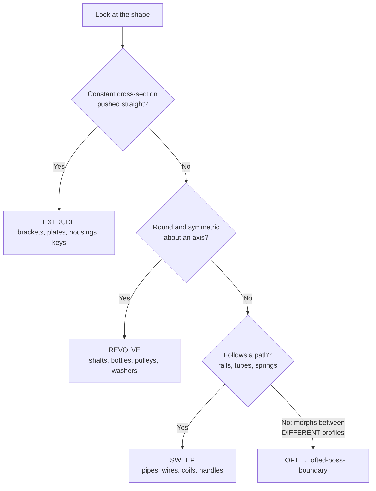

# Extrude · Revolve · Sweep: The Three Workhorses

## For future agent
First solid-features page. Covers the three features behind most PL1 beginner exercises and PL2 prismatic/machined parts. Behavior described is version-stable SolidWorks core (a decade+). Dimensions in examples mirror playlist conventions (mm), not engineering requirements.

> **Why these three:** nearly every manufactured object is either pushed straight (extrude), spun round (revolve), or dragged along a path (sweep). Recognize which one a shape wants and modeling becomes classification, not struggle.

---

## 1. Which feature? (the only flowchart that matters at first)

## 2. Extrude (Boss = add, Cut = remove)

Sketch a closed profile → pull it straight. The **end condition** decides intelligence:

| End condition | Meaning | Use when |
|---|---|---|
| Blind (depth) | Fixed mm | Quick brackets, plates |
| Through All / Up To Surface | Adapts to geometry | Holes through housings — survives thickness changes (design intent!) |
| Mid-Plane | Symmetric both ways | Anything symmetric about its sketch plane — half the dims |
| Up To Vertex/Body | Associative | Features that must track neighbors |

**Real-world anchor:** machined parts (milled/EDM) are extrude-native — a mill cuts straight down, exactly like an extruded cut. If a part will be CNC-milled, bias toward extrudes: the model mirrors the manufacturing, quotes come back cheaper, and nobody has to reinterpret your geometry.

**Draft** (taper while extruding): mandatory for molded/cast parts so they eject from the mold — typically 1–3° (TBC exact shop standard; ask the molder). Add it in the extrude, not as a later feature.

## 3. Revolve (Boss/Cut)

Sketch the **half-profile** on one side of a **centerline** → spin 360° (or less: 180°/270° sectors). Rules: profile must not cross the centerline (else self-intersecting solid); keep the centerline a construction line in the same sketch.

Where it owns the playlist: bottles, jugs, vases, pulleys, shafts, washers, the SpaceX-Dragon-class axisymmetric bodies ([[bottles-containers]], [[complex-showcase]]). **Thin-feature revolve** makes hollow vessels (bottle walls) in one step — wall thickness as a parameter.

## 4. Sweep (Boss/Cut)

**Profile** (cross-section) + **Path** (curve it travels along) = tube/rail/coil. Constraints that bite beginners:

- Path should be smooth (tangent-continuous); kinks in the path become creases or failures.
- Profile plane ⊥ path start, or use **pierce relation** (profile point pierced to path) so it tracks.
- **Guide curves** (second rails) control twisting profiles — the bridge to [[lofted-boss-boundary]].
- Spring/coil = circle profile + helix path (Helix/Spiral curve tool).

Real-world: wiring harnesses, hydraulic tubes, springs, ergonomic rails — anything "long and following."

## 5. Cut versions & Hole Wizard

Every Boss has a Cut twin (same dialog, removes material). Prefer **Hole Wizard** over sketched circles + cut for real holes: it carries threads, counterbores, countersinks, and standard sizes (M3/M4/M6…) with cosmetic or modeled threads. A drilled-and-tapped hole modeled as a plain cut is a manufacturing lie — the shop needs the thread callout, which Hole Wizard puts on the drawing automatically.

## 6. Failure clinic

| Symptom | Cause → Fix |
|---|---|
| "Sketch is not closed" / zero-thickness | Gap/overlap at corners → magnify, Repair Sketch; extrude needs a watertight profile |
| Sweep twists or self-intersects | Path curvature tighter than profile size → shrink profile, smooth path, add guide curves |
| Revolve fails | Profile crosses centerline → keep profile one side only |
| Cut goes the wrong way / blind misses | Wrong direction or end condition → Flip Side, or switch to Up-To-Surface |
| Rebuild errors after edit | Child lost its reference face → re-attach sketch plane to a plane, not a face |

---

## 7. Worked example: motor-mount plate (all three workhorses, one part)

A 120×80×6 plate holding a Ø40 motor boss with a cable hook — exercises extrude (plate), revolve (boss), sweep (hook), Hole Wizard, and end-condition thinking.

1. **Plate:** Top Plane → rectangle 120×80 anchored to origin → fully define → Extrude **Mid-Plane 6** (symmetric — stackable either face up).
2. **Motor boss:** Front Plane sketch? No — boss stands ON the plate: sketch on plate top face (or better: Top-offset plane for stability — TBC taste; face is fine while learning) → two concentric circles Ø40/Ø30 → **Extruded Boss Up-To-Surface? No — Blind 25** (a fixed-height boss is the design) → then **Extruded Cut** the inner Ø30 **Up To Next? Through All** (a through-bore for the motor shaft — Through All survives height changes; Blind would strand material if the boss grows).
3. **Cable hook:** Right Plane → arc path (radius 15, 180°) positioned at the plate corner → profile circle Ø4 at path start with **Pierce** relation → **Swept Boss**. If it twists: path too tight for Ø4? No — R15 vs Ø4 is generous; check pierce + profile ⊥ path.
4. **Mounting:** Hole Wizard M5 ×4 on 110×70 (10 from edges — pattern one hole linearly both directions, don't place four) → 2 mm edge fillets LAST.
5. **Design-intent audit:** change plate 120→140 — holes track (edge-dimensioned), boss stays put (face-anchored — hmm, SHOULD it recenter? If the design says "boss centered," dimension boss position from plate MID-planes/origin, not from one edge — redo that dimension now and feel the difference).

**Hole Wizard deep pass (worth 10 minutes once):** Hole Types tab (Clearance/Threaded/Tapered/Counterbore/Countersink) → Standard: ISO + M5 → End Condition Through All → Positions tab → click faces/points. Counterbore/countersink for socket-head vs flat-head screws (head MUST sit — a socket head modeled into a countersink hole is a shop-floor argument; match head to hole). Cosmetic vs modeled threads: cosmetic for drawings/performance (default!), modeled only for 3D-print threading or close-up renders.

**Verify in-app:** model the plate above, run the intent audit (step 5), then rebuild the boss as a REVOLVE (half-profile + centerline) and compare trees — same geometry, different edit behavior. Prefer the one whose edits match how the design actually changes.

**Next:** [[lofted-boss-boundary]] for morphing shapes.

## CROSS-REFERENCES
- [[INDEX]] · [[sketch-mastery]] · [[lofted-boss-boundary]] · [[dressup-productivity]] · [[beginner-exercises]]
