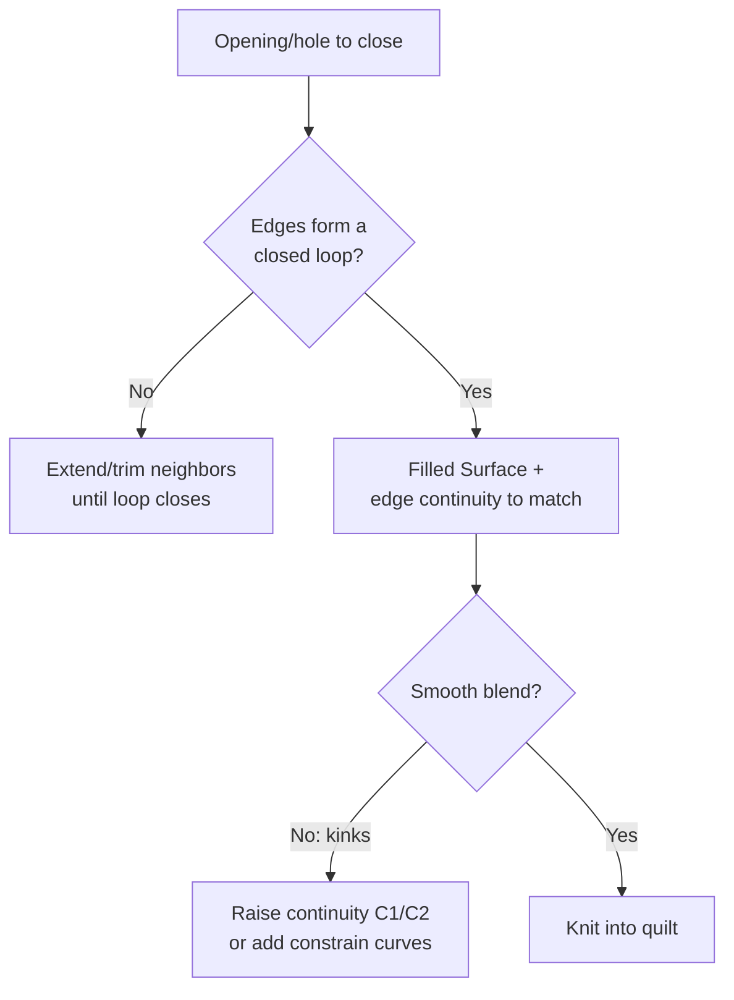
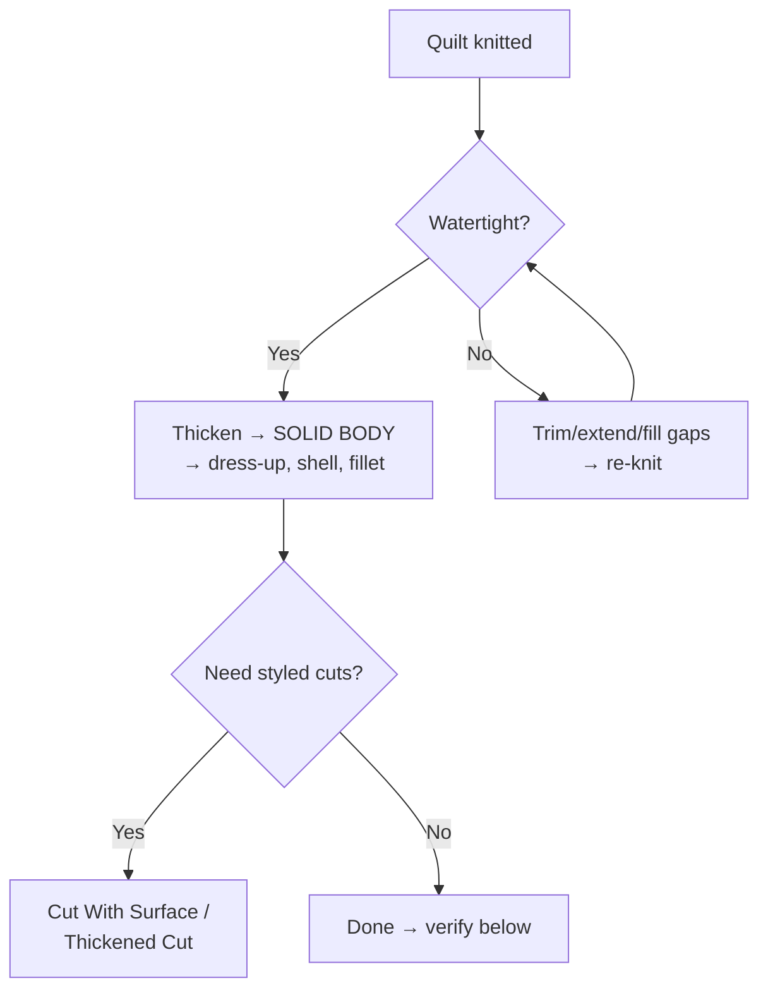

# Filled · Knit · Trim · Thicken: Closing the Quilt

## For future agent
Surfacing completion page. Grounded in PL1 transcripts #11 (Filled + Knit), #35 (Thickened Cut + Cut With Surface), plus recurring trim/thicken combos (#37/#42/#47/#53 exercise titles). Version-stable core.

> **The second half of every surfacing build:** loft/boundary make beautiful open patches. These four features turn patches into products — fill the holes, stitch the quilt, cut it to exact boundaries, give it walls. No build ships without this page.

---

## 1. Filled Surface (cap anything)

Fills a closed boundary of edges with a smooth patch, with **curvature control** to surrounding faces (Contact/Tangent/Curvature) — that control is the whole point: a tangent-constrained fill blends invisibly; an unconstrained fill shows a seam.

Uses across the playlist: bottom caps of mice and housings, helmet interior closures, bottle bases, any "close this opening" moment (#68 dedicated tutorial; clothes-fork #72 and spoon builds lean on it). **Constrain curves** (internal rails the fill must follow) rescue tricky multi-sided holes — sketch one or two, and an "impossible" fill solves.

## 2. Knit Surface (stitch + test)

Selects patches → stitches edges within **gap tolerance** → optionally forms a solid if watertight. Discipline items:

- Keep tolerance **tight** (default-ish; TBC exact value per version — the principle: tolerance hides sins). Gaps get *repaired* (extend, fill, re-trim), not tolerated.
- Knit incrementally: stitch major patches first, confirm, then add small fills — when a knit fails you know exactly which patch is guilty.
- **The thicken test:** a quilt that thickens is watertight. Attempt Thicken as your airtightness check, not just eyeballing.

## 3. Trim Surface (cut to exact boundaries)

Two modes beginners must distinguish:

| Mode | What it does | When |
|---|---|---|
| **Standard trim** (trim tool + trimming surface/sketch) | Cuts the patch, keep/remove pieces | Openings: visor holes, wheel slots, ports, parting boundaries |
| **Mutual trim** | Two surfaces cut each other | Intersecting skins (handle meets body, jug handle meets vessel) — the #58 jug pattern |

**Workflow habit:** build patches *oversized*, then trim to exact edges. Overshoot-and-trim beats trying to loft precisely to a boundary — the trim edge is always cleaner than a loft edge.

## 4. Thicken + Cut With Surface (become / cut solid)

- **Thicken** (from #35 + #47 patterns): wall thickness in/out/mid. Inward preserves outer styling (visible skins); outward preserves inner packaging; mid-plane for symmetric walls. Typical plastic 1.5–3 mm (confirm per material/process — TBC).
- **Cut With Surface** (#35): a surface as a blade through a solid — styled parting cuts, slots, sculpted recesses.
- **Thickened Cut:** surface with thickness removes material — thin slots, grooves,modeled cooling slits.

## 5. End-to-end combo (the playlist's favorite)

`Loft/Boundary patches → Mutual/Standard Trim → Fill closures → Knit (tight tolerance) → Thicken test → solid → fillet/shell`. Exercise titles #37 (Extruded+Boundary+Trim+Loft), #42 (Extruded+Loft+Fill+Trim), #53/#47 read exactly as this pipeline — the numbers in titles are the combo recipe.

## 6. Failure clinic

| Symptom | Cause → Fix |
|---|---|
| Fill shows kinks at edges | Continuity left at Contact → raise to Tangent/Curvature; add constrain curves |
| Knit fails | Real gap/overlap → extend surfaces into each other, re-trim, fill slivers; knit in stages to isolate |
| Thicken fails on a "closed" quilt | Naked edge somewhere (zoom wireframe), or local curvature tighter than wall thickness → thin the wall or fair the curve |
| Trim removes wrong piece | Keep/Remove selection flipped → toggle, preview carefully on mutual trims |
| Thickened Cut destroys styling faces | Cut direction/thickness side wrong → flip side, reduce thickness |

---

## 7. Worked example: mouse bottom plate (fill + knit + thicken, end to end)

Close the loop on the §6 mouse shell plan — bottom cap from opening to solid-ready quilt.

1. **The opening:** assume the trimmed shell edge loop (from [[lofted-boundary-surfaces]] mouse plan) — a closed but non-planar boundary. Select it: if selection stumbles on segment count, the loop has slivers — re-trim the shell edges to clean curves first (fill punishes dirty boundaries).
2. **Filled Surface:** select the loop → set edge continuity to **Tangent** (bottom plate meets walls smoothly — a Contact fill would draw a visible seam line around the whole mouse) → preview: ripples? Add ONE constrain curve (a centerline spline bowed 2 mm — gives the fill gentle camber instead of a drum-flat cap).
3. **Knit:** shell patches + fill → tight tolerance → success should be instant; if it hangs on one edge, that edge is the guilty party (extend/re-trim that patch only — staged-knit discipline from §2).
4. **Thicken test → 2 mm inward.** Fails? Two suspects: (a) naked micro-edge at the fill boundary (deviation-check the seam, numbers don't lie); (b) wall 2 mm vs a local fillet zone curving tighter than 2 mm radius — thin to 1.5 locally or fair the curve (physics, not settings).
5. **Finish:** wheel slot via standard trim AFTER thickening (cut the solid — cleaner than trimming the quilt pre-thicken? TBC taste: solid-cut gives exact slot walls + easy fillets; quilt-trim keeps surfaces editable. Try both on copies, keep a note on which survived edits better).

**Tolerance numbers (working guidance, TBC per version):** default knit gap tolerance is small (sub-mm) — keep it there. A quilt needing >0.5 mm tolerance to knit has modeling debts, not tolerance needs. Deviation Analysis under ~0.1 mm at seams reads as clean for consumer parts (TBC: confirm against your shop's standards for real production).

**Verify in-app:** run the full combo from §5 on a simple two-patch + fill test case (Ex-154-class), then on the mouse bottom above. Break the fill (delete constrain curve), watch knit/thicken complain, repair. The repair rep is the skill.

---

## 8. Trim strategy: standard vs mutual vs sketch-driven (choose like a pro)

**Standard trim (trim tool + trimming entity):** ONE patch cut by a surface/sketch/plane — openings, windows, slots, parting boundaries. Fast, predictable, the 80% case. Keep-pieces vs remove-pieces preview discipline (the §6 failure restated: always preview, mutual trims doubly so).

**Mutual trim (surfaces cut each other):** intersecting skins resolved pairwise — handle-into-body, jug-handle-into-vessel, pipe intersections. Select BOTH surfaces, choose keep/remove per side per surface. The jug (#58) is the canonical demo: handle overshoots INTO the body, mutual trim resolves the intersection loop, fillet finishes the seam. Without mutual trim you'd be lofting exactly-to-boundary (fragile) instead of overshooting (robust).

**Trim-with-sketch (projected boundaries):** sketch the opening shape on a plane → project/trim onto the curved patch (visor curves, decal zones, grille fields). Sketch-driven openings EDIT cleanly (change the sketch, re-trim) where hand-trimmed edges fossilize. Rule: openings defined by sketches, never by eyeballed trim clicks.

**Trim ORDER in a quilt build:** big intersections first (mutual trims that define regions) → openings second (slots, windows) → edge cleanups last (tiny slivers). Trimming small details before big intersections resolve = rework when the big trim moves your edges. Order is strategy.

**Next:** [[surfacing-utilities-troubleshooting]] (offset, freeform, swept/revolved/extruded surfaces, delete-hole + diagnostics).

---

## 10. Thicken-direction strategy + thin-wall design (walls as decisions)

**Direction semantics (choose per face's job):** inward (outer styling exact — consumer shells, helmets, visible housings) → outward (inner packaging exact — bores, cavities, board envelopes that must fit contents) → mid-plane (symmetric walls, no critical face — internal brackets, hidden ribs' parents). WRONG direction is silent corruption (looks fine, fits nothing) — verify direction against the critical-face list, not by eye. (TBC: some versions default outward — check YOUR default once and set the habit.)

**Thin-wall failure modes (physics, not settings):** curvature tighter than wall thickness (inside corner radius < wall = self-intersection at thicken — fair the curve or thin the wall; the §7-forensics restated as prevention) → thickness steps (abrupt 2→4 mm jumps sink/warp in molding AND stress-concentrate — ramp over ≥3× the step length, TBC: confirm with molding references) → tall thin walls (buckling under load/service pressure — ribs per [[dressup-productivity]] §6, not thicker walls) → knit-then-thin vs thin-then-knit ordering (thicken individual patches BEFORE knitting when walls differ per region — TBC taste: test both on a two-thickness quilt and keep notes).

**Wall-audit procedure (every thickened body, 5 minutes):** section view at 3+ stations (uniform? steps ramped?) → thickness analysis tool (Evaluate — TBC per version: find YOUR thickness checker and run it) → min-radius vs wall comparison at every inside corner → draft re-check post-thicken (thickening can EAT draft on steep walls — re-run draft analysis AFTER thickening, not just on the quilt — the sequencing trap).

**Multi-thickness quilts (real products vary):** grip zones thicker (comfort + strength), walls nominal, rims reinforced (edge roll per [[complex-showcase]] §5) — build regions as SEPARATE thicken features (not one compromise thickness!) → knit the thickened solids (boolean, not surface knit — TBC per version behavior) → fillet the thickness steps. One thickness everywhere is beginner uniformity; zoned thickness is product design.

---

## 9. Knit-tolerance philosophy + gap forensics (the honesty chapter)

**Why tight tolerance is a virtue, not a preference:** knit tolerance is the maximum gap the software will PRETEND isn't there. Every pretense becomes a downstream lie — thicken walls of fantasy thickness, molds that flash, shells with paper-thin spots, drawings of geometry that doesn't exist. Professionals keep tolerance at default-or-tighter and fix REAL gaps because they've paid the downstream tuition. Beginners crank tolerance and pay it later with interest. (TBC exact default value per version — find yours in Tools → Options → Document Properties → Image quality... no: knit tolerance lives in the Knit PropertyManager itself; note YOUR default in your daily log once.)

**Gap forensics (reading the failure):** knit fails and highlights edges — READ them: hairline highlight along a full edge = offset/position mismatch (re-derive one patch from the other's edge — shared derivation beats independent modeling); point highlight at corners = trim overshoot/undershoot (extend + re-trim that corner only); flickering highlight = overlapping (not gapped!) surfaces fighting (trim back the overlap, don't knit harder); whole-loop highlight = wrong patch entirely (continuity mismatch or gross misplacement — rebuild, don't coax).

**The three-gap rule (workflow stop-loss):** more than THREE repair cycles on one seam means the STRATEGY is wrong (wrong patch layout, wrong trim order, wrong profile derivation) — step back and re-plan the region per [[surfacing-methodology]] §6 patch-planning instead of grinding the seam. Experts re-plan early; beginners grind late. The rule makes the expert move automatic.

## CROSS-REFERENCES
- [[INDEX]] · [[surfacing-methodology]] · [[lofted-boundary-surfaces]] · [[surfacing-utilities-troubleshooting]] · [[bottles-containers]]
