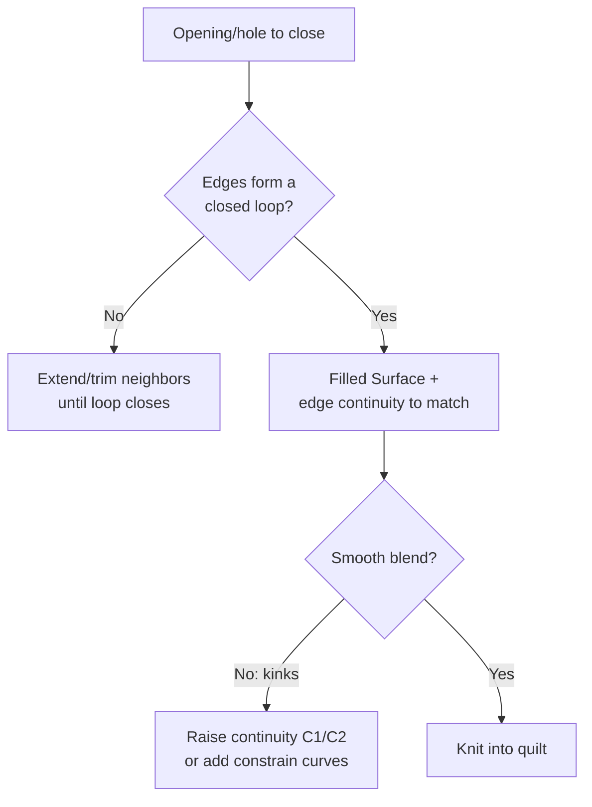
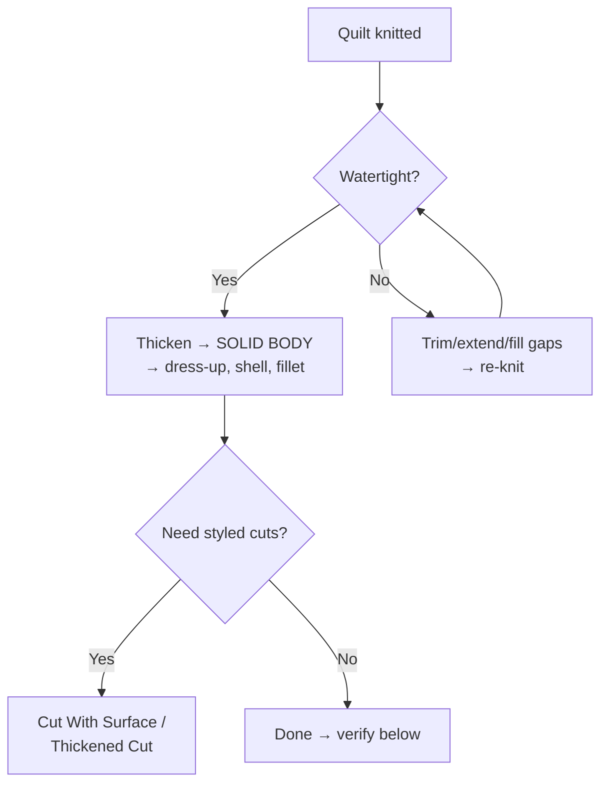

# Filled · Knit · Trim · Thicken: Closing the Quilt

## For future agent
Surfacing completion page. Grounded in PL1 transcripts #11 (Filled + Knit), #35 (Thickened Cut + Cut With Surface), plus recurring trim/thicken combos (#37/#42/#47/#53 exercise titles). Version-stable core.

> **The second half of every surfacing build:** loft/boundary make beautiful open patches. These four features turn patches into products — fill the holes, stitch the quilt, cut it to exact boundaries, give it walls. No build ships without this page.

---

## 1. Filled Surface (cap anything)

Fills a closed boundary of edges with a smooth patch, with **curvature control** to surrounding faces (Contact/Tangent/Curvature) — that control is the whole point: a tangent-constrained fill blends invisibly; an unconstrained fill shows a seam.

Uses across the playlist: bottom caps of mice and housings, helmet interior closures, bottle bases, any "close this opening" moment (#68 dedicated tutorial; clothes-fork #72 and spoon builds lean on it). **Constrain curves** (internal rails the fill must follow) rescue tricky multi-sided holes — sketch one or two, and an "impossible" fill solves.

## 2. Knit Surface (stitch + test)

Selects patches → stitches edges within **gap tolerance** → optionally forms a solid if watertight. Discipline items:

- Keep tolerance **tight** (default-ish; TBC exact value per version — the principle: tolerance hides sins). Gaps get *repaired* (extend, fill, re-trim), not tolerated.
- Knit incrementally: stitch major patches first, confirm, then add small fills — when a knit fails you know exactly which patch is guilty.
- **The thicken test:** a quilt that thickens is watertight. Attempt Thicken as your airtightness check, not just eyeballing.

## 3. Trim Surface (cut to exact boundaries)

Two modes beginners must distinguish:

| Mode | What it does | When |
|---|---|---|
| **Standard trim** (trim tool + trimming surface/sketch) | Cuts the patch, keep/remove pieces | Openings: visor holes, wheel slots, ports, parting boundaries |
| **Mutual trim** | Two surfaces cut each other | Intersecting skins (handle meets body, jug handle meets vessel) — the #58 jug pattern |

**Workflow habit:** build patches *oversized*, then trim to exact edges. Overshoot-and-trim beats trying to loft precisely to a boundary — the trim edge is always cleaner than a loft edge.

## 4. Thicken + Cut With Surface (become / cut solid)

- **Thicken** (from #35 + #47 patterns): wall thickness in/out/mid. Inward preserves outer styling (visible skins); outward preserves inner packaging; mid-plane for symmetric walls. Typical plastic 1.5–3 mm (confirm per material/process — TBC).
- **Cut With Surface** (#35): a surface as a blade through a solid — styled parting cuts, slots, sculpted recesses.
- **Thickened Cut:** surface with thickness removes material — thin slots, grooves,modeled cooling slits.

## 5. End-to-end combo (the playlist's favorite)

`Loft/Boundary patches → Mutual/Standard Trim → Fill closures → Knit (tight tolerance) → Thicken test → solid → fillet/shell`. Exercise titles #37 (Extruded+Boundary+Trim+Loft), #42 (Extruded+Loft+Fill+Trim), #53/#47 read exactly as this pipeline — the numbers in titles are the combo recipe.

## 6. Failure clinic

| Symptom | Cause → Fix |
|---|---|
| Fill shows kinks at edges | Continuity left at Contact → raise to Tangent/Curvature; add constrain curves |
| Knit fails | Real gap/overlap → extend surfaces into each other, re-trim, fill slivers; knit in stages to isolate |
| Thicken fails on a "closed" quilt | Naked edge somewhere (zoom wireframe), or local curvature tighter than wall thickness → thin the wall or fair the curve |
| Trim removes wrong piece | Keep/Remove selection flipped → toggle, preview carefully on mutual trims |
| Thickened Cut destroys styling faces | Cut direction/thickness side wrong → flip side, reduce thickness |

**Verify in-app:** loft two patches + fill the ends → knit → thicken 2 mm → cut a slot with a surface. Then break it (delete a fill), watch knit/thicken fail, repair. The repair rep is the skill.

**Next:** [[surfacing-utilities-troubleshooting]] (offset, freeform, swept/revolved/extruded surfaces, delete-hole + diagnostics).

## CROSS-REFERENCES
- [[INDEX]] · [[surfacing-methodology]] · [[lofted-boundary-surfaces]] · [[surfacing-utilities-troubleshooting]] · [[bottles-containers]]
