# Flowcharts Master (Every Decision Tree, One Page)

## For future agent
Capstone reference page. Collects and extends the decision trees scattered across the module so any modeling question starts here. Trees link back to their home pages for depth. Mermaid diagrams render in Obsidian; ASCII fallbacks omitted for brevity — if Mermaid fails to render, each tree's home page explains the same logic in prose.

---

## 1. What feature makes this shape?

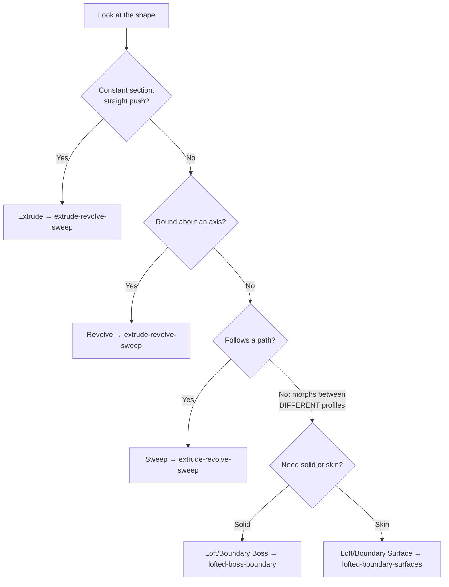

## 2. Solid or surface?

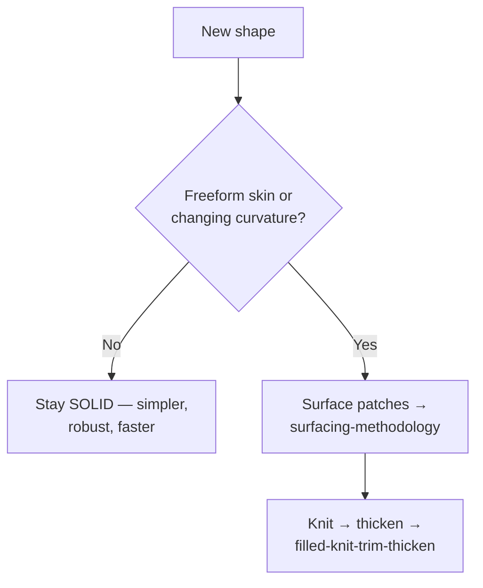

## 3. Loft is twisted — fix order

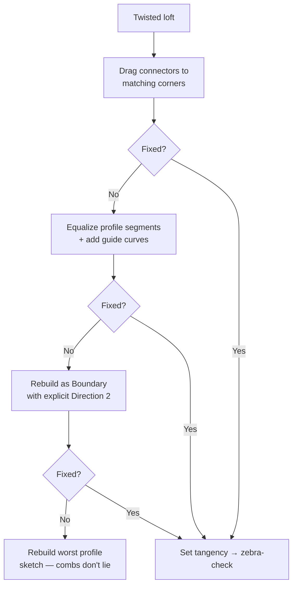

## 4. Knit/thicken failure — repair order

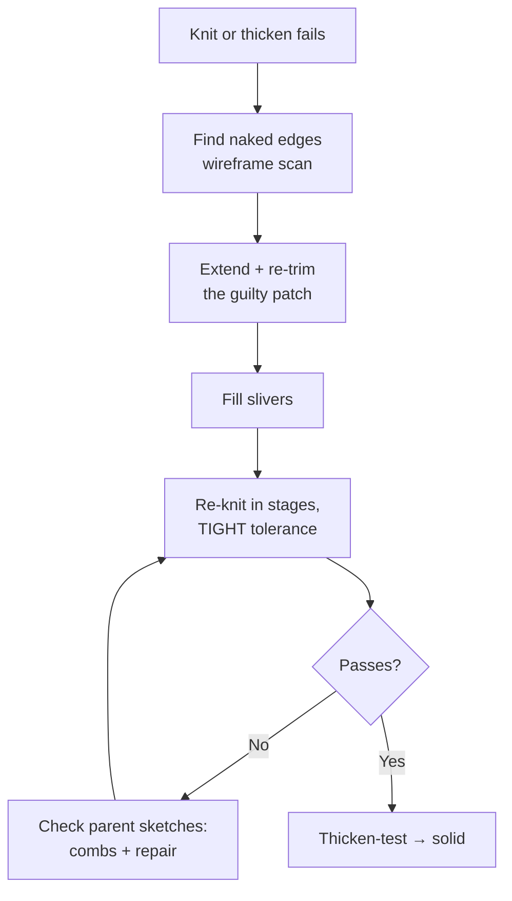

## 5. Which gearbox?

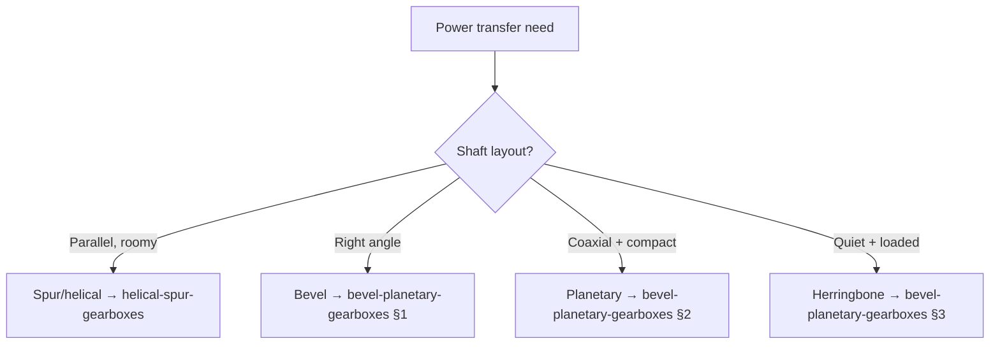

## 6. Decompose a scary model

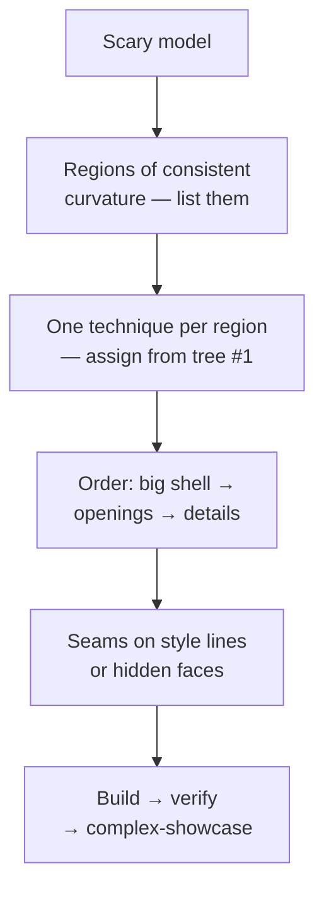

## 7. Finish-order combos

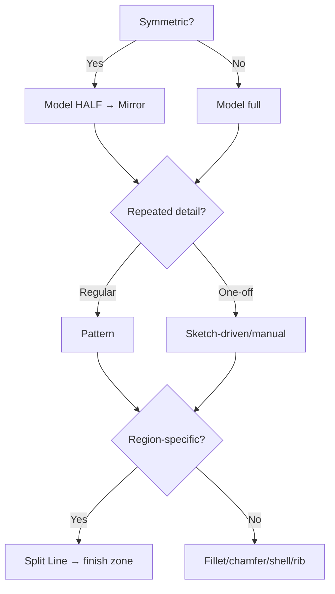

## 8. Debug any failed feature (universal)

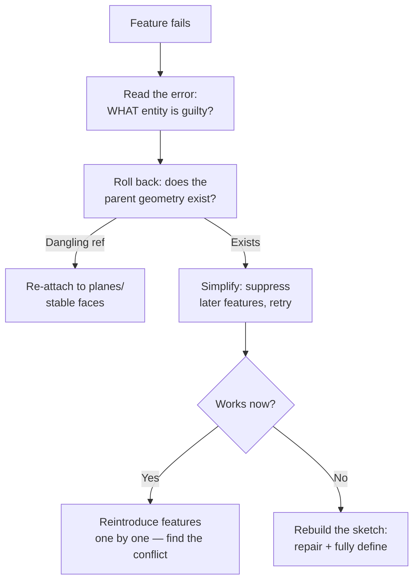

---

## 9. Is this part mold-ready?

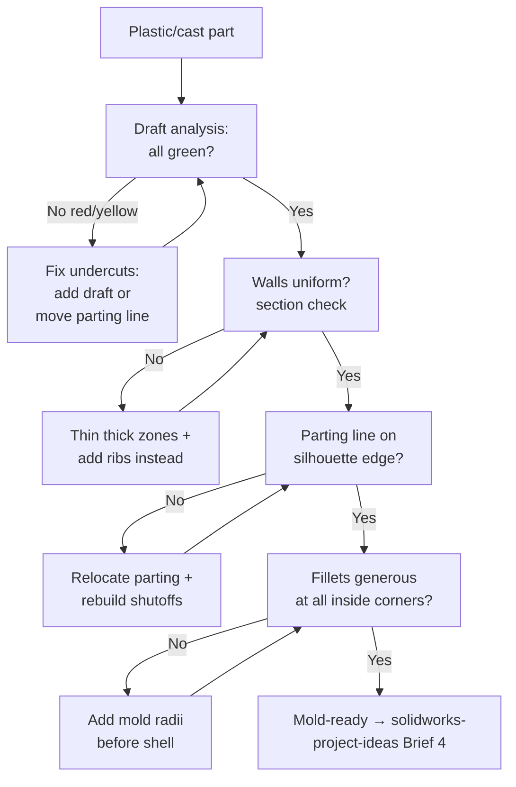

## 10. Sheet-metal sanity (before flat pattern)

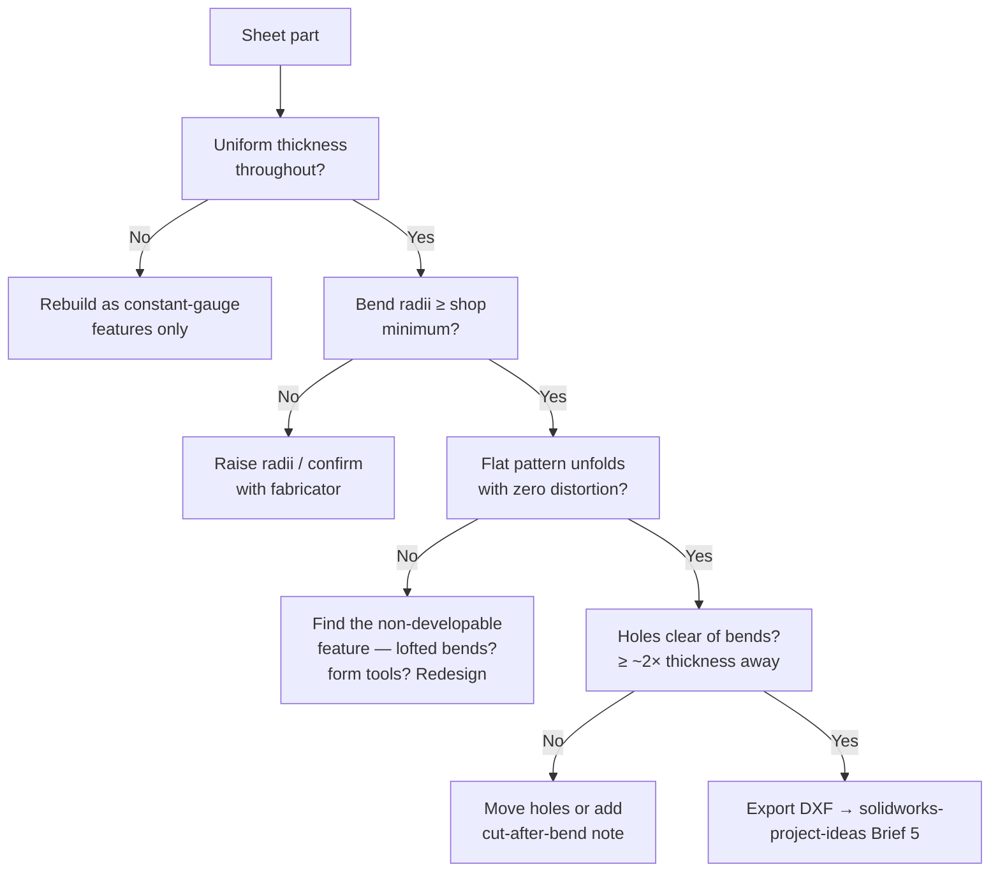

## 11. Which project next? (chooser)

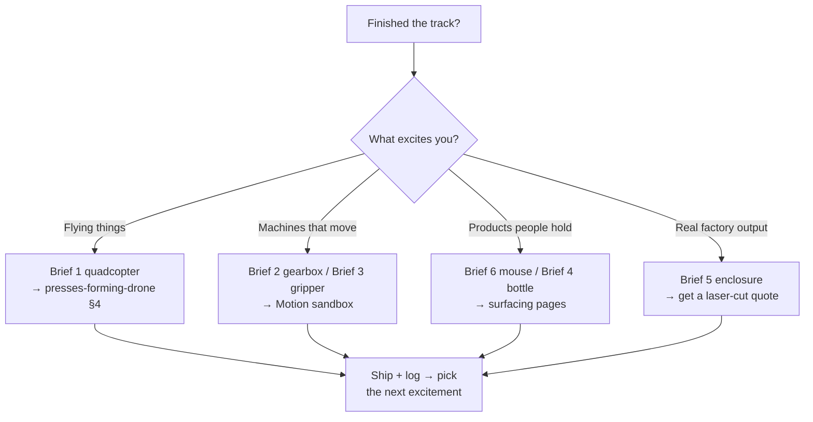

## CROSS-REFERENCES
- [[INDEX]] · [[surfacing-methodology]] · [[lofted-boundary-surfaces]] · [[filled-knit-trim-thicken]] · [[gearbox-fundamentals]] · [[dressup-productivity]] · [[solidworks-cheatsheet]]
