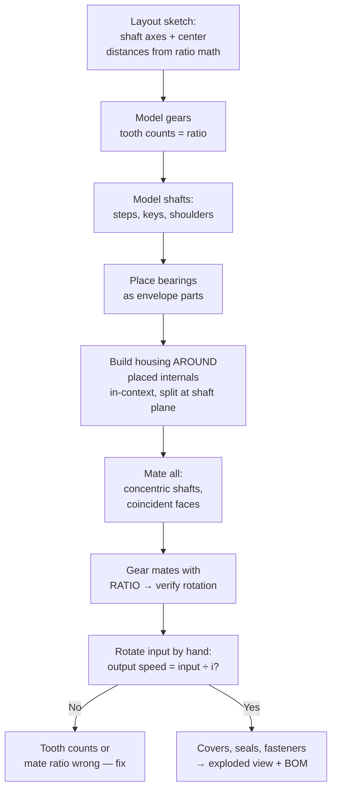

# Gearbox Fundamentals (How They Work + How to Model Them)

## For future agent
PL2 gateway page. PL2 is ~20 gearbox videos out of 33 unique builds — without this page they're button-pushing. Mechanical content is standard machine-design theory (version-independent, textbook-stable); CAD workflow is standard SolidWorks assembly practice. Gear-geometry numbers below are the standard formulas; TBC: verify tooth counts/dimensions per video when bulk transcripts land.

> **Why gearboxes dominate PL2:** a gearbox is the perfect machine-design exercise — gears (precise geometry), shafts (toleranced fits), bearings (bought-out parts), housing (cast/machined enclosure), assembly with real motion. Model one properly and you've touched every mechanical CAD skill that matters.

---

## 1. What a gearbox does (mechanics first, CAD second)

A gearbox trades **speed for torque** (or reverse) between shafts. The only math you need to start:

- **Gear ratio** $i = z_2/z_1 = n_1/n_2$ (teeth driven ÷ teeth driver = speed in ÷ speed out). PL2 titles hand you ratios directly: 1:2 (#361/#360), 1:3 (#355), 1:5 (#364).
- **Torque multiplies** (minus efficiency losses): halve the speed → roughly double the torque. That's why shredders and presses use reduction boxes.
- **Center distance** for external spur gears: $a = m(z_1+z_2)/2$ where $m$ = module. This single formula positions your shafts in CAD — get it right and gears mesh; get it wrong and the assembly is a lie.

## 2. Gear types in PL2 (recognize before modeling)

| Type | Look | Behavior | PL2 sightings |
|---|---|---|---|
| Spur | Straight teeth, parallel shafts | Simple, noisy at speed | #372/#355 reduction boxes, #364 1:5 |
| Helical | Angled teeth, parallel (or crossed) shafts | Smoother, quieter, axial thrust needs handling | #344/#361/#360 single-stage, #348 vertical, #31 three-stage |
| Bevel | Cone-shaped, intersecting (usually 90°) shafts | Turns the corner | #343 two-way, #349 four-way |
| Planetary | Sun + planets + ring, coaxial | Huge reduction in tiny space | #342/#347/#345/#386 |
| Herringbone (double helical) | V-shaped teeth | Cancels axial thrust, premium | #357 |
| Worm (awareness) | Screw + wheel, big reduction | Self-locking often; not prominent in PL2 (TBC) | — |

**Real-world anchor:** gearboxes fail at bearings and lubrication, not at "the CAD looked nice." When modeling, that means: bearing seats with proper fits, oil seals where shafts exit, drain/fill plugs, a breathable but sealed housing. Model the *maintenance*, not just the shape.

## 3. Anatomy of every PL2 gearbox (the parts list)

```
INPUT shaft → [coupling/key] → GEAR 1 meshes GEAR 2 → OUTPUT shaft
   held by BEARINGS seated in HOUSING halves, sealed with OIL SEALS,
   closed with a COVER + gasket, vented, drained.
```

| Component | CAD approach |
|---|---|
| Gears | Revolve blank + patterned teeth (extruded cuts around the blank) OR Toolbox gears (TBC: check if PL2 uses Toolbox — fastest legitimate route); teeth counts set the ratio |
| Shafts | Revolve stepped profile; keyways via cut-extrude; circlip grooves; shoulders position bearings/gears axially |
| Bearings | Bought-out: model envelope (OD/ID/width) + correct seat diameters; full internal geometry is wasted effort (TBC per video) |
| Housing | Cast-style: base + cover split at shaft centerline plane (classic!), ribs, bosses, feet with mounting holes |
| Fasteners | Patterned bolts on the split line + cover; Toolbox or modeled simply |
| Seals/plugs | Lip-seal grooves at shaft exits; drain + filler + breather plugs |

## 4. CAD assembly workflow (gearbox edition)



**The split-at-shaft-plane habit:** housings that split exactly through the shaft axes assemble in reality (drop shafts into the base, close the cover). Housings split anywhere else often can't be assembled at all — your CAD must respect assembly order.

## 5. Verification ladder (per gearbox)

1. Ratio math on paper before CAD (teeth, center distance).
2. Gear mate ratio set → hand-rotate → output speed checks out.
3. Interference detection: gears mesh without overlapping; rotating parts clear housings through full rotation.
4. Backlash/clearance eyeball: teeth must NOT touch both flanks (TBC: exact backlash values are manufacturing data, not this page).
5. Exploded view + BOM: every part listed, no missing fasteners/seals.

---

## 6. Worked example: 1:2 single-stage on paper first (the 10-minute math)

Do this on paper BEFORE touching CAD — every PL2 gearbox repeats it with different numbers.

**Given:** input 1440 RPM motor (standard 4-pole — TBC per sourcing), wanted output ≈ 720 RPM → $i = 2$.
**Teeth:** pinion $z_1 = 20$ (minimum to avoid undercut at 20° pressure angle is ~17 — TBC: confirm with gear references; 20 is safe and round) → wheel $z_2 = 40$.
**Module:** pick $m = 2$ mm (printable + reasonable size — TBC per build; bigger module = chunkier teeth = stronger + coarser).
**Center distance:** $a = m(z_1+z_2)/2 = 2(60)/2 = 60$ mm. Shafts sit EXACTLY 60 apart — this number goes into the layout sketch and everything downstream obeys it.
**Pitch diameters:** $d_1 = mz_1 = 40$, $d_2 = 80$. Blank ODs ≈ pitch + 2m (addendum = 1 module standard — TBC: confirm gear-formula references): 44 / 84.
**Output check:** $n_2 = 1440/2 = 720$ RPM ✓. Torque ≈ 2× minus ~2–5% mesh loss (TBC: confirm efficiency references — illustrative).
**Face width:** ~8–10× module starting point (16–20 mm here — TBC: confirm with gear-design references; wider = more load capacity + more misalignment sensitivity).

**Bearing-fit basics (the number system that makes assemblies work):**
- Shaft seats for bearings: k6/m6-class transition fits (bearing bore grips the shaft — TBC: confirm fit tables like ISO 286, NOT this page).
- Housing bores: H7-class clearance-ish (outer race slides in, located axially by shoulders/circlips).
- In CAD: model NOMINAL sizes (Ø20 shaft, Ø20 bore) and put fits on the DRAWING — modeling actual tolerance offsets into 3D parts is a pro-MBD workflow (TBC depth), not beginner practice. The drawing carries: `Ø20 k6`, `Ø47 H7` (TBC example values — compute per your bearing datasheet).

**Lubrication shopping list (model ALL of these or the box is a toy):** drain plug (lowest point!), filler/breather on top, level sight-glass or dipstick (TBC per box), oil seals at every shaft exit, gasket groove on the split line. Each is 5 minutes of modeling and 100% of the realism.

**Next:** [[helical-spur-gearboxes]] → [[bevel-planetary-gearboxes]].

---

## 11. Noise + vibration appendix (gearboxes heard before seen — TBC: confirm with NVH references, NOT this page)

**Noise sources ranked (find it before fixing it):** mesh impact (tooth-pass frequency = teeth × RPM — TBC per measurement; the §11-spur-whine restated as frequency!) → imbalance (1× RPM signature — TBC per vibration analysis!) → bearing distress (characteristic defect frequencies per bearing geometry — TBC per catalog formulas!) → resonance (housing natural frequencies excited by mesh harmonics — TBC per modal analysis!) → CAD consequence: NONE directly (noise is measured, not modeled, at this level!) — but the DESIGN for quiet lives in CAD (precision grades per §11-high-speed + mesh quality per §9-inspection + isolation mounts per below!).

**Isolation + damping (quiet by construction):** elastomer mounts (stiffness tuned BELOW excitation frequencies — TBC per isolation theory: transmissibility <1 only above √2× natural frequency!) → mass law covers (heavy + damped panels per §13-noise thinking generalized!) → shaft couplings as filters (elastomer spiders absorb torsional spikes — the §10-coupling lesson restated acoustically!) → CAD consequence: mount + cover + coupling STIFFNESSES as design parameters (not afterthoughts — TBC per analysis; soft where isolation matters, stiff where alignment matters, NEVER both by accident!).

**Condition monitoring ports (hearing aids designed in — TBC per reliability practice):** accelerometer pads (flat machined spots at bearing locations — TBC per sensor mounting!) → oil sampling + sight per §8 (debris + level trends!) → temperature taps (winding/bearing RTDs — TBC per criticality!) → CAD consequence: EVERY sensor needs a modeled mount + route (the §9-controls lesson restated: unmounted monitoring never happens!).

---

## 10. Coupling + mounting appendix (gearbox meets the world)

**Coupling selection (shaft-to-shaft joints — TBC: confirm with coupling references, NOT this page):** rigid/flange (perfect alignment assumed — TBC per installation reality: foundations settle, alignment drifts!) → jaw/spider elastomer (misalignment-tolerant + shock-absorbing — the shredder-friendly choice per [[shredders-recycling-machines]] §9-transmission!) → gear-tooth couplings (high torque + misalignment — TBC per duty) → fluid couplings (soft-start for high-inertia loads — TBC per mining/conveyor practice!) → torque limiters (mechanical fuse per §8-jam thinking — shear pins vs friction vs electronic trip — TBC per protection philosophy!) → CAD consequence: coupling ENVELOPES + guard (rotating couplings get CLOSED guards with inspection windows — the §8-safety habit: guards designed, not retrofitted!).

**Mounting configurations (foot vs flange vs shaft — TBC per vendor catalogs):** foot-mounted (sole plates + foundation bolts + grout? epoxy vs cementitious — TBC per installation; soft-foot/eliminated by shimming to 0.05 feeler — TBC per alignment practice!) → flange-mounted (machine-face register + bolt circle — the §5-pump-gearbox interface generalized!) → shaft-mounted with torque arm (gearbox RIDES the driven shaft — arm to ground takes reaction — TBC per design; the arm needs FLEX-direction freedom + rigid torque direction — TBC!) → CAD consequence: mounting faces modeled FLAT + called out (machined pads per §8-housing appendix — cast faces never mount!).

**Alignment discipline (the #1 rotating-equipment killer — TBC: confirm with alignment references, NOT this page):** laser vs dial methods (TBC per practice) → thermal growth offsets (hot-running machines align COLD with calculated offset — TBC per analysis; aligning hot machines hot is the alternative!) → soft-foot elimination BEFORE alignment (TBC per procedure) → CAD consequence: jacking screws + shimmable feet + dowel provisions modeled (alignment FEATURES designed in — TBC per practice; field alignment without provisions is prayer!).

---

## 9. Sizing walkthrough: 5 kW conveyor drive (paper-to-CAD, end to end)

**Duty (illustrative — TBC: confirm with drive-application references, NOT this page):** 5 kW at 1440 in, ~360 out (i ≈ 4) → steady torque out ≈ 5000×9550/360/1000... torque (N·m) = 9550×kW/RPM = 9550×5/360 ≈ 133 N·m steady → service factor 1.5 (moderate shock per §8) → DESIGN torque ≈ 200 N·m → output shaft sized for torsion + bending (combined-shaft formula — TBC: confirm with machine-design references!) → bearings from shaft diameters (bore-first selection: pick available bore, design around it — catalog-first per §8-cost thinking!).

**Stage split decision (§8-math applied):** 4:1 single mesh? Pinion 20 → wheel 80 (bulky wheel, pinion near undercut floor — TBC per §6-minimums) vs 2×2 two-stage (compact, more parts) → CHOOSE two-stage (wheel Ø sane, pinions safe, housing shorter-fat vs long-thin — TBC per space claim) → stage ratios 2×2 EVEN as starting point (§8) → modules: fast stage m2 (low torque), slow stage m2.5–3 (high torque — the growing-module insight from §8 executed!) → center distances per stage → LAYOUT SKETCH with both distances + motor + output positions (the §5-discipline at full assembly scale!).

**Verification cascade (the §5-ladder at system scale):** ratio math (2×2=4 ✓) → per-mesh center distances ✓ → CAD mates + gear ratios (2.0 + 2.0) → hand-rotation (output = input/4 EXACTLY?) → interference full-rotation both meshes → backlash eyeball per mesh → thermal sanity (5 kW losses ~3–5% = 150–250 W to dissipate — fins? fan? ambient? — TBC: confirm with thermal references; small boxes cook!) → BOM (every seal/plug/fastener per §7) → drawing set (housing + shafts + gears + assembly + BOM per §10-drawing discipline).

**What this walkthrough proves:** machine design is ARITHMETIC + CAD transcription, not inspiration — ratio → torque → shafts → bearings → housing → mates → verify. Run these rails and PL2's 20 gearboxes collapse into ONE repeatable procedure with different numbers. That collapse is the entire point of this page.

---

## 8. Ratio-splitting + service-factor thinking (sizing like an engineer)

**Why multi-stage exists (the §5 math extended):** single-mesh ratios above ~1:5–7 get geometrically absurd (giant wheel, pinion below undercut minimum — TBC: confirm with gear-design references) → SPLIT across stages ($i_{total} = i_1 \times i_2 \times ...$). Even splits as starting point (1:9 ≈ 3×3 — TBC: confirm optimal-split practice per efficiency/weight tradeoff, NOT this page) → high-speed stage FIRST (small teeth, fast, light — mesh losses scale with torque, so reduce torque early? No: power is constant-ish; the fast stage sees LOW torque — smaller teeth suffice; the slow stage sees HIGH torque — chunkier module justified. Module can GROW stage by stage — the sizing insight that marks real design.)

**Service factors (the reality multiplier — awareness):** catalog ratings assume smooth duty; real loads shock (shredders!), reverse (conveyors on incline — TBC), start/stop (everything). Service factor multiplies the design torque (TBC: 1.0 gentle → 2.0+ heavy-shock per AGMA-ish practice — confirm with gear-rating references, NOT this page). CAD consequence: NOTHING visible — but the module/face-width choices upstream encode it. Note your assumed factor in the layout sketch comments (design decisions documented where the NEXT engineer looks).

**Backlash budgeting across stages (awareness):** each mesh contributes play; multi-stage stacks it (robot arms and positioning drives care — TBC depth: anti-backlash techniques like split-gear springs exist, confirm with precision-drive references). CAD consequence: model nominal, budget on paper, verify on bench (the §5 ladder extended: rotate input, measure output play TOTAL, divide by stages for per-mesh sanity).

**Thermal + breather appendix (boxes cook):** mesh losses → heat → pressure (sealed boxes weep without breathers — §7's 50-rupee part restated with physics) → oil viscosity drops with temperature (cold-start starvation vs hot-thin film — TBC: confirm with lubrication references) → cooling fins on the housing for continuous duty (patterned thin walls — the pattern feature doing thermal work!) → sight glass + magnetic drain plug (wear-debris monitoring — maintenance reads the plug like a doctor reads bloodwork; TBC per practice).

---

## 7. Fasteners, seals & lubrication hardware (the BOM that makes it real)

**Bolted joints (split line + feet + cover):** one diameter per joint family (M8 split-line, M12 feet — TBC per load; consistency beats optimization at this level) → through-bolts with nuts vs tapped holes (tapped in cast iron holds; tapped in aluminum strips — TBC: confirm with fastener references; model thread depth 1.5× diameter minimum engagement — TBC) → patterned from ONE seed hole (never placed individually) → washers under nuts on soft housings (embedment — TBC awareness).

**Sealing shopping list with placement logic:** input/output lip seals (lip faces INWARD toward oil — backwards seals pump oil OUT; TBC: confirm seal-orientation references) → O-ring cord in split-line groove (groove to seal tables — TBC per datasheet) → gasket vs sealant choice (paper gaskets forgive rough faces; RTV needs clean flat faces — TBC per shop practice) → breather (sealed boxes breathe with temperature — unvented boxes weep oil; the 50-rupee part that saves the gearbox).

**Nameplate + documentation honesty:** ratio, input speed/direction arrow, oil grade + capacity, rotation arrow — model the nameplate (split-line decal zone per [[dressup-productivity]]) and WRITE the drawing notes. A gearbox without oil spec is an unmaintainable box; maintenance data is engineering, not paperwork.

## CROSS-REFERENCES
- [[INDEX]] · [[part-assembly-drawing-workflow]] · [[helical-spur-gearboxes]] · [[bevel-planetary-gearboxes]] · [[solidworks-project-ideas]] (gearbox brief)
