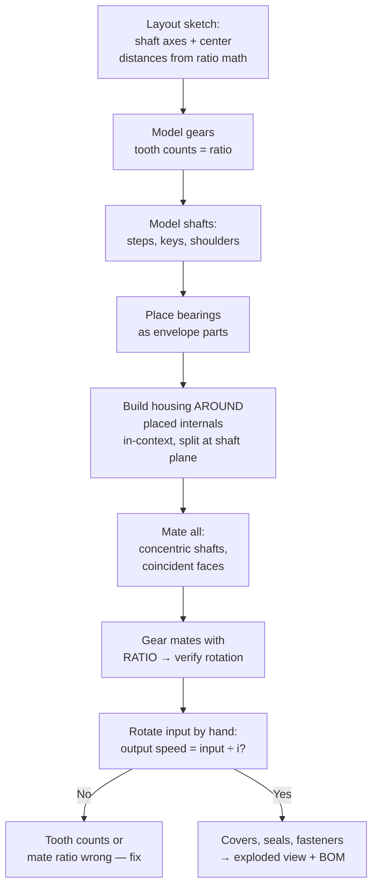

# Gearbox Fundamentals (How They Work + How to Model Them)

## For future agent
PL2 gateway page. PL2 is ~20 gearbox videos out of 33 unique builds — without this page they're button-pushing. Mechanical content is standard machine-design theory (version-independent, textbook-stable); CAD workflow is standard SolidWorks assembly practice. Gear-geometry numbers below are the standard formulas; TBC: verify tooth counts/dimensions per video when bulk transcripts land.

> **Why gearboxes dominate PL2:** a gearbox is the perfect machine-design exercise — gears (precise geometry), shafts (toleranced fits), bearings (bought-out parts), housing (cast/machined enclosure), assembly with real motion. Model one properly and you've touched every mechanical CAD skill that matters.

---

## 1. What a gearbox does (mechanics first, CAD second)

A gearbox trades **speed for torque** (or reverse) between shafts. The only math you need to start:

- **Gear ratio** $i = z_2/z_1 = n_1/n_2$ (teeth driven ÷ teeth driver = speed in ÷ speed out). PL2 titles hand you ratios directly: 1:2 (#361/#360), 1:3 (#355), 1:5 (#364).
- **Torque multiplies** (minus efficiency losses): halve the speed → roughly double the torque. That's why shredders and presses use reduction boxes.
- **Center distance** for external spur gears: $a = m(z_1+z_2)/2$ where $m$ = module. This single formula positions your shafts in CAD — get it right and gears mesh; get it wrong and the assembly is a lie.

## 2. Gear types in PL2 (recognize before modeling)

| Type | Look | Behavior | PL2 sightings |
|---|---|---|---|
| Spur | Straight teeth, parallel shafts | Simple, noisy at speed | #372/#355 reduction boxes, #364 1:5 |
| Helical | Angled teeth, parallel (or crossed) shafts | Smoother, quieter, axial thrust needs handling | #344/#361/#360 single-stage, #348 vertical, #31 three-stage |
| Bevel | Cone-shaped, intersecting (usually 90°) shafts | Turns the corner | #343 two-way, #349 four-way |
| Planetary | Sun + planets + ring, coaxial | Huge reduction in tiny space | #342/#347/#345/#386 |
| Herringbone (double helical) | V-shaped teeth | Cancels axial thrust, premium | #357 |
| Worm (awareness) | Screw + wheel, big reduction | Self-locking often; not prominent in PL2 (TBC) | — |

**Real-world anchor:** gearboxes fail at bearings and lubrication, not at "the CAD looked nice." When modeling, that means: bearing seats with proper fits, oil seals where shafts exit, drain/fill plugs, a breathable but sealed housing. Model the *maintenance*, not just the shape.

## 3. Anatomy of every PL2 gearbox (the parts list)

```
INPUT shaft → [coupling/key] → GEAR 1 meshes GEAR 2 → OUTPUT shaft
   held by BEARINGS seated in HOUSING halves, sealed with OIL SEALS,
   closed with a COVER + gasket, vented, drained.
```

| Component | CAD approach |
|---|---|
| Gears | Revolve blank + patterned teeth (extruded cuts around the blank) OR Toolbox gears (TBC: check if PL2 uses Toolbox — fastest legitimate route); teeth counts set the ratio |
| Shafts | Revolve stepped profile; keyways via cut-extrude; circlip grooves; shoulders position bearings/gears axially |
| Bearings | Bought-out: model envelope (OD/ID/width) + correct seat diameters; full internal geometry is wasted effort (TBC per video) |
| Housing | Cast-style: base + cover split at shaft centerline plane (classic!), ribs, bosses, feet with mounting holes |
| Fasteners | Patterned bolts on the split line + cover; Toolbox or modeled simply |
| Seals/plugs | Lip-seal grooves at shaft exits; drain + filler + breather plugs |

## 4. CAD assembly workflow (gearbox edition)



**The split-at-shaft-plane habit:** housings that split exactly through the shaft axes assemble in reality (drop shafts into the base, close the cover). Housings split anywhere else often can't be assembled at all — your CAD must respect assembly order.

## 5. Verification ladder (per gearbox)

1. Ratio math on paper before CAD (teeth, center distance).
2. Gear mate ratio set → hand-rotate → output speed checks out.
3. Interference detection: gears mesh without overlapping; rotating parts clear housings through full rotation.
4. Backlash/clearance eyeball: teeth must NOT touch both flanks (TBC: exact backlash values are manufacturing data, not this page).
5. Exploded view + BOM: every part listed, no missing fasteners/seals.

**Next:** [[helical-spur-gearboxes]] → [[bevel-planetary-gearboxes]].

## CROSS-REFERENCES
- [[INDEX]] · [[part-assembly-drawing-workflow]] · [[helical-spur-gearboxes]] · [[bevel-planetary-gearboxes]] · [[solidworks-project-ideas]] (gearbox brief)
