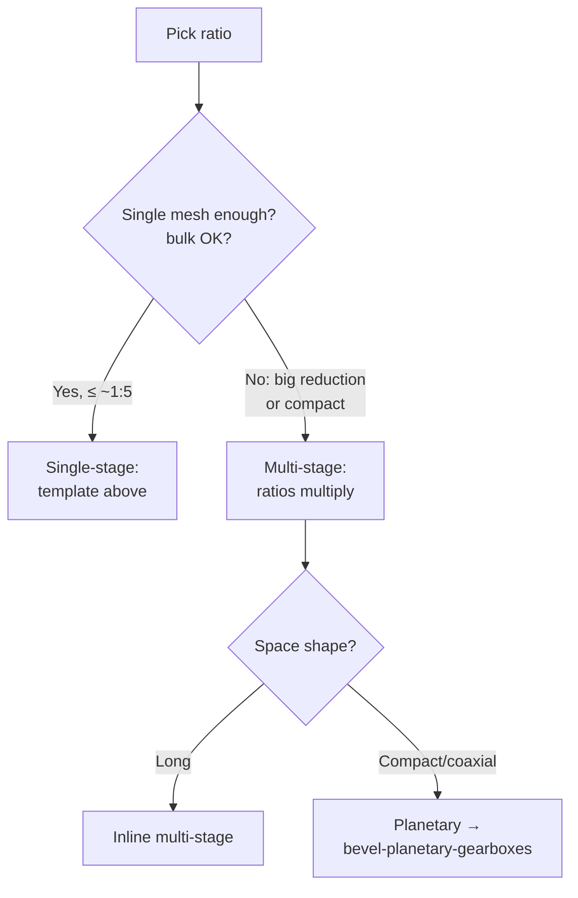

# Helical & Spur Gearboxes (Parallel-Shaft Boxes)

## For future agent
PL2 build page. Videos covered: #3/#42 single-stage helical #344 · #14/#41 1:2 helical #361 · #17/#43 vertical 1:2 #360 · #32/#47 vertical #348 · #9/#47 spur #372 · #50 spur 1:3 #355 · #28/#48 1:5 box #364 · #22 spur walkthrough · #31 three-stage helical · #29 pump gearbox · #38 face-mount #407. Per-video geometry TBC vs bulk transcripts; recipes follow standard parallel-shaft practice + playlist title data.

> **The family logic:** all of these are the same machine with different numbers — two (or more) parallel shafts, ratio set by teeth, housing split at the shaft plane. Learn one deeply and the rest are parameter changes. Start with single-stage 1:2, graduate to three-stage.

---

## 1. Single-stage builds (the template)

**#344 single-stage helical (#3) + #372 spur (#9) + #361 1:2 helical (#14):**

```
1. Ratio math: pick teeth (e.g., 20 → 40 = 1:2), module m → center distance a = m(z1+z2)/2
2. Gears: revolved blanks + patterned teeth (helical = angled cut pattern, TBC exact method per video)
3. Shafts: stepped revolves with keyways + shoulders
4. Bearings: envelope parts at shaft seats
5. Housing: base + cover split through BOTH shaft axes + feet + ribs
6. Assembly: concentric + coincident mates → gear mate with ratio → hand-rotation check
7. Hardware: split-line bolts (patterned), seals at shaft exits, plugs
```

**Spur vs helical modeling difference:** spur teeth cut straight across (simple linear-patterned cuts); helical teeth cut at the helix angle (swept cuts along a helical path, TBC per video) — plus thrust bearings/washers to absorb axial load, which spur boxes skip. The CAD delta is small; the mechanical delta (noise, smoothness, thrust) is the lesson.

**#355 1:3 spur (#50) and #364 1:5 (#28):** same template, bigger wheel. Watch housing proportions change with ratio — high-reduction single stages get bulky, which is *why* multi-stage and planetary exist (design reasoning, not just modeling).

## 2. Multi-stage + special mounts

- **#31 three-stage helical:** three meshes in series — ratios multiply ($i_{total} = i_1·i_2·i_3$). Layout sketch with THREE center distances; intermediate shafts carry two gears each. The assembly-order puzzle gets real: plan insertion sequence before modeling the housing.
- **#360/#348 vertical boxes (#17/#32):** shafts vertical — lubrication changes (splash vs bath, seals face gravity differently — awareness, TBC depth), feet become flange mounts. Same gears, rotated duty.
- **#29 pump gearbox:** input from motor + output to pump — coupling interfaces on both ends; alignment features (spigots/registers) matter more than usual.
- **#38 face-mount #407:** mounting face instead of feet — flange bolt circle (circular pattern), register diameter for alignment.



## 3. Modeling notes that recur

- **Layout sketch first:** all shaft axes + center distances in ONE master sketch — every part references it; ratio changes propagate instead of exploding.
- **Gear teeth:** pattern one tooth-cut around the blank (circular pattern, count = teeth). Helical = angled sweep-cut per tooth (heavy rebuild — keep tooth-cut feature LAST on the gear part).
- **Keys/keyways:** parallel keys per shaft diameter (standard sizes — TBC: confirm key standards table, not this page); keyway cut in both shaft and gear bore, aligned in assembly.
- **Housing ribs:** triangular gussets at feet + around bearing seats — cast housings without ribs crack; your model should show you know that.

## 4. Failure clinic

| Symptom | Cause → Fix |
|---|---|
| Gears overlap or float apart | Center distance ≠ m(z1+z2)/2 → recompute, edit layout sketch (this is why the layout sketch exists) |
| Gear mate spins wrong speed | Ratio inverted or teeth mismatched → ratio = driven/driver, recheck counts |
| Housing halves won't "assemble" | Split not through shaft axes → rebuild split at the shaft plane |
| Shaft slides axially | Missing shoulders/circlips → add axial locators both sides of each bearing/gear |
| Helical box, no thrust handling | Axial load unaddressed → thrust bearings/washers + housing shoulders (awareness at CAD level) |

---

## 5. Worked example: 16 → 48 spur pair, modeled tooth by tooth

The §6 math page gave 20/40 at m2 — now the hands-on cut pattern with 16/48 (same method, different numbers; TBC: 16 teeth at 20° PA risks mild undercut — acceptable for learning/CAD practice, confirm with gear references for real hardware).

**Gear blank (wheel, z=48, m=2):** pitch Ø96, blank OD ≈ 100 → revolve stepped blank (rim + hub + web with lightening holes — patterned AFTER teeth? No: web holes are independent of teeth; order: blank → teeth → hub details → web holes → dress-up).
**Tooth cut:** ONE tooth gap sketched on the face (trapezoid approximating involute — TBC: true involute via equation curve is the advanced rep; trapezoid reads correctly at a glance and meshes visually) → Extruded Cut Through All (or across face width) → **Circular Pattern ×48** about the gear axis. One sketch, one cut, one pattern = 48 teeth.
**Pinion (z=16):** same recipe, blank OD ≈ 36, pattern ×16. Mesh check in assembly at EXACT center distance $a = 2(64)/2 = 64$ — teeth interleave without overlap (eyeball + interference detection; TBC: real backlash needs offset, confirm manufacturing data).
**Helical variant (#344-class):** tooth cut becomes a SWEPT cut along a helical path (helix angle ~15–20° starting point — TBC: confirm with gear references) → pattern the sweep. Watch rebuild time jump (helical patterns are heavy — keep the cut feature LAST, suppress in working configs per [[part-assembly-drawing-workflow#8-configurations-pack-and-go]]).

**Three-stage layout sketch (#31-class):** THREE center distances chained ($a_{12}, a_{23}, a_{34}}$) with ratio split across stages (e.g., 1:5 total ≈ 1.71³ per stage — TBC: split ratios evenly as a starting point, confirm with design references). Intermediate shafts carry two gears each — draw all four shafts + six gears as layout circles BEFORE modeling a single part. The layout sketch IS the design; parts are transcription.

**Vertical-box appendix (#360/#348):** rotate the whole layout 90° (shafts vertical) → lower bearing now carries the gear/shaft WEIGHT (deep-groove + thrust consideration — awareness) → oil sump moves to the bottom cover (drain plug relocates!) → breather stays top. Same gears, three relocated details — the variant lesson.

**Verify in-app:** build the 1:2 single-stage template fully (gears → shafts → bearings → housing → mates → ratio check → exploded + BOM). Change teeth 20/40 → 18/54 and confirm the layout sketch propagates cleanly — that rebuild is the whole page's exam.

**Next:** [[bevel-planetary-gearboxes]].

---

## 16. commissioning + acceptance appendix (new gearboxes proving themselves — TBC per commissioning practice)

**No-load spin (the first truth — TBC: confirm with gearbox-commissioning references):** hand rotation BEFORE power (binds? roughness? the §9-inspection habit with fingers!) → uncoupled motor bump (direction correct? — backwards gearboxes pump oil wrong + starve meshes!) → coupled no-load run (listen: uniform hum vs cyclic thump per §11-NVH! → temperature baseline per §10-lube!) → CAD consequence: NONE (running-in happens in steel, not screens!) — but the BASELINES get recorded against the serial (the §13-reliability habit: day-one data is gold!).

**Load ramp protocol (earning full duty — TBC per practice):** 25/50/75/100% steps with dwell (temperatures stabilize per step — TBC per thermal!) → vibration + temperature + noise logged per step (the §13-commissioning habit at gearbox scale!) → oil sample at first change EARLY (break-in debris per §10-contact/lapping! — first oil tells the bedding story!) → CAD consequence: as-built + nameplate + manual UPDATED with actuals (rated vs achieved recorded — the §10-documentation habit closed!).

**Acceptance criteria (pass/fail written BEFORE testing — TBC per contract!):** vibration limits (velocity/displacement bands per standard — TBC per ISO 10816-class practice!) → temperature rise caps (TBC per class!) → noise caps at distance (TBC per spec!) → efficiency spot-check (input vs output power — TBC per test!) → CAD consequence: the acceptance PLAN referenced on the drawing set (tests exist on paper before steel spins — hope is not a test plan!).

---

## 15. Mill + crusher gearbox appendix (the brutal end of duty — TBC per heavy-industry references)

**Shock-factor reality (crushers don't do steady-state — TBC: confirm with crusher-drive references, NOT this page):** uncrushable events (tramp iron through jaws/cones — TBC per protection: torque limiters + hydraulic tramp release PER §10-coupling-fuse lesson at maximum stakes!) → cyclic overload signatures (the §14-failure-reading habit: spalled teeth with impact morphology = shock, NOT wear!) → flywheel effect as protection (inertia rides through spikes — TBC per sizing!) → CAD consequence: torque-limiter + flywheel modeled as FIRST-CLASS citizens (not accessories — the protection IS the design!).

**Dust + vibration environmentals (the §13-dust lesson at maximum — TBC per mining practice):** pressurized sealing (labyrinth + purge air beating dust at the seal face — TBC per system!) → foundation dynamics (resonance with crusher frequencies avoided — TBC per vibration analysis; grout + soleplate discipline per §10-mounting!) → oil contamination control (offline filtration loops + sampling per §10-lube at industrial grade!) → CAD consequence: ancillaries modeled (breathers, filters, purge lines, sample valves — the §10-ports habit: unmodeled ancillaries never get installed!).

**Segmental + split gears (giant gears come apart — TBC per large-gear practice):** girth-gear splits (flanged segments for transport/install around kilns/mills — TBC per heavy practice!) → pinion pairing + load sharing across dual pinions (TBC per alignment!) → guard + lube enclosures at scale (spray systems + guards per §10 with walkways INSIDE the guard line — TBC per access!) → CAD consequence: SPLIT features modeled (flange joints with bolted connections per §7-fastener discipline — giant parts are assemblies wearing part costumes!).

---

## 14. Failure-analysis + warranty appendix (reading dead gearboxes — TBC per failure-analysis references)

**Reading the wreckage (every failure writes its autobiography — TBC: confirm with gear-failure atlases, NOT this page):** uniform wear (normal life consumed — redesign for LONGER life or accept the interval!) → one-sided wear (misalignment — housing bores? foundation settling? thermal migration? — the §11-NVH-misalignment lesson with evidence!) → pitting concentrated at pitch line (surface fatigue from overload/under-lube — TBC per contact-stress practice!) → tooth breakage at root (bending overload or notch — the §5-root-fillet lesson with consequences!) → scuffing/scoring streaks (film collapse — speed/load/lube triangle per §10!) → CAD consequence: failure PHOTOS mapped to CAD zones (which mesh? which flank? — the §12-failure-resume habit at hardware scale!).

**Warranty-data loop (field truth beats lab theory — TBC per reliability practice):** failure codes per mode (standardized taxonomy — TBC per company practice!) → MTBF by duty class (clean vs dusty vs shock service DIVERGE — TBC per data!) → design-rule updates FROM warranty (patterns become rules: "all X-duty boxes get Y upgrade" — the organizational learning from §12!) → CAD consequence: lessons-encoded templates (upgraded features baked into the STARTING models for next-gen boxes — §9-library habit doing reliability duty!).

**Root-cause discipline (the 5-why habit for hardware — TBC per RCA practice):** symptom → mechanism → cause → systemic fix (replace the BEARING vs fix the SEALING vs redesign the VENTING — the fix LEVEL decides recurrence!) → CAD consequence: systemic fixes modeled as TEMPLATE changes (not one-off edits — the fix must be UNAVOIDABLE in future designs, or it recurs!).

---

## 13. Conveyor + elevator drive appendix (gearboxes with somewhere to be)

**Belt-conveyor drives (the §10-conveyor world powered right):** head-shaft direct (flange + torque arm per §10-mounting!) → backstop MANDATORY on inclines (the §6-conveyor-incline lesson with hardware: sprag/roller-ramp devices, TBC per device catalogs!) → take-up + stretch compensation (belt elongates — drive alignment must TOLERATE take-up travel, TBC per layout!) → dusty duty sealing (the §13-dust lesson at the drive: labyrinth + purge where washdown hits!) → CAD consequence: drive modeled IN the conveyor assembly (alignment across the whole machine, not per-component optimism!).

**Bucket-elevator + vertical drives (lifting bulk — TBC: confirm with elevator references):** head-shaft bending (belt/chain tension BOTH sides + sprocket overhung loads — TBC per shaft analysis!) → service-factor uplift (starting LOADED after power cuts — TBC: worst-case torque, not running torque, sizes the drive!) → platforms + access at the head (maintenance at height — TBC per safety: caged ladders, tie-offs, NOT this page!) → CAD consequence: head section modeled as a MAINTAINABLE module (bearings + drive removable without crane-class disassembly — TBC per design!).

**Free swivel + slew-ring drives (rotating machines fed right):** center-pivot irrigation-style (TBC depth) → crane-slew per §9-slewing (planetary + pinion + ring at the §8-decision-map's big end!) → cable/hose management across rotation (festoon vs slip-ring vs rotary union per medium — TBC per system!) → CAD consequence: rotation ENVELOPES + service-loop volumes modeled (the §11-travel-envelope habit: moving services need DESIGNED space, not leftover gaps!).

---

## 12. High-speed + precision appendix (when RPM and accuracy climb)

**High-speed behavior (pitch-line velocity rules — TBC: confirm with gear references, NOT this page):** dynamic loads grow with speed × error (precision grade matters MORE as speed climbs — TBC per AGMA quality grades; coarse gears at high speed hammer themselves to death!) → balancing (rotating assembly balance grade per speed — TBC per ISO balance practice; model balance-correction features: drill spots? weld beads? — TBC per shop!) → windage + churning (oil drag at speed = heat + power loss — TBC per velocity limits; jet lube + scavenging per §10!) → CAD consequence: speed RATING on the nameplate (§7-documentation habit: max continuous RPM stated, not implied!).

**Precision-grade economics (accuracy costs — TBC: confirm with gear-quality references):** grade 10–12 (as-hobbed/cut — utility duty) → grade 7–9 (shaved/ground light — general industrial) → grade ≤6 (ground/polished — servo/robotics/turbine — TBC per application!) → cost DOUBLES-ish per 1–2 grade steps (TBC per quoting reality; tolerance accordingly — the §9-inspection lesson restated as money!) → CAD consequence: quality grade CALLED OUT on the drawing (inspection plans + quotes key off it — ungraded gears get utility-grade quotes and precision expectations, the classic mismatch!).

**Servo/robotics gearing (zero-backlash world — TBC depth):** preloaded split gears (spring-take-up — TBC per design) → harmonic/strain-wave reducers (flexspline mechanics — TBC: confirm with robotics-drive references, NOT this page; 50–100:1 in one stage with near-zero backlash!) → cycloidal reducers (eccentric + pins — TBC per design; shock-tolerant, compact!) → CAD consequence: these are BOUGHT assemblies at learning level (envelopes + interfaces per §3-bought-out discipline!) — model the MOUNT, buy the magic (the §9-bought-vs-built judgment restated!).

---

## 11. Double-helical + crossed-helical appendix (the thrust story completed)

**Single-helical thrust math (awareness — TBC: confirm with gear references, NOT this page):** axial force ≈ tangential × tan(helix angle) (15–20° helix → ~27–36% of tangential as thrust — TBC per formula; NOT negligible!) → thrust bearings/washers sized for CONTINUOUS thrust (not peak — every revolution pushes, all day) → housing shoulders BOTH flanks (thrust reverses on direction change — bidirectional boxes trap both ways!) → the §4-failure restated with numbers: unaddressed thrust walks shafts until gears unmesh or seals die.

**Double-helical (herringbone's manufactured cousin — TBC: confirm with manufacturing references):** two opposed helices with a CENTER GAP (tool runout needs somewhere to go — the §7-apex-gap restated for parallel shafts!) → gap width vs face utilization tradeoff (gap wastes face width — TBC per design; narrow gap needs specialized cutters — TBC per process) → assembly: two halves + center spacer? or one-piece with gap groove (TBC per size/process) → model halves + gap explicitly (the gap is FUNCTIONAL clearance, not decoration!).

**Crossed-helical (non-parallel, NON-intersecting shafts — the odd cousin):** point contact (not line!) → LOW capacity + sliding wear (TBC: confirm with gear references; crossed helicals are for light auxiliary drives ONLY — instrument feeds, distributor drives, TBC per application) → same-hand vs opposite-hand rules per shaft angle (TBC: confirm — get it backwards and it binds instantly!) → CAD consequence: model EXACTLY per the hand/angle tables (no freelancing — crossed-helical geometry punishes improvisation!) → lubrication criticality (sliding contact needs EP/boundary protection — TBC per lube references).

---

## 10. Lubrication + cooling appendix (oil as a design element)

**Lube method selection (duty decides — TBC: confirm with gear-lubrication references, NOT this page):** splash (dipper/gear fling — simple, speed-limited by churning losses + heat — TBC per pitch-line-velocity limits) → bath (gears dip — level discipline per §8-sump: too deep churns, too shallow starves!) → spray/jet (pumped + filtered + aimed at mesh exit — high-speed/heavy-duty standard, TBC) → grease (sealed-for-life small boxes — TBC per NLGI grade; relube intervals modeled as maintenance notes!) → dry/coated (instrument/plastic gears — TBC per material; wear-tracked, not oil-tracked).

**Filtration + condition monitoring (oil tells the truth):** mesh strainers vs spin-on filters (TBC per flow/contamination) → magnetic plugs (ferrous debris early-warning per §8 — read at EVERY oil change, photograph the fuzz — trend beats snapshot!) → oil analysis sampling ports (TBC per reliability practice: spectrometric wear metals + viscosity + particle counts) → desiccant breathers in humid/dusty service (TBC per environment; standard breathers inhale moisture with every thermal cycle!) → CAD consequence: EVERY one of these needs a modeled port/mount/pad (retrofitted monitoring never fits — design the taps in!).

**Cooling paths (boxes that work hard get hot):** housing fins (patterned thin walls doubling as stiffeners — the §8-rib habit doing thermal duty!) → fan on input shaft (TBC per duty: shaft-driven cooling scales with speed automatically) → external cooler + pump loop (TBC depth: continuous heavy duty) → sump capacity as thermal mass (more oil = slower heat-up — TBC per duty cycle) → temperature switch/gauge ports (TBC: alarm before damage, not after — the instrumentation habit).

---

## 9. Inspection + quality appendix (proving gears are good)

**What gets measured (the gear QA vocabulary — awareness, TBC: confirm with gear-inspection references like AGMA 2000/2015, NOT this page):** tooth-to-tooth composite (single-flank/double-flank testers — the rolling test that hears what eyes can't) → profile + lead traces (involute form + helix alignment charts — TBC per instrument) → pitch variation (cumulative vs adjacent — indexing accuracy lives here) → backlash as INSTALLED (paper math meets assembly reality — measure, don't assume) → contact pattern (marking compound per §8-bevel appendix generalized to ALL meshes — the universal mesh proof).

**CAD-to-inspection traceability (your models feed QA):** datum scheme on gear drawings (bore + face as A/B — the §10-drawing discipline applied) → tolerance callouts that MATCH the inspection plan (don't tolerance what nobody measures — TBC per QA practice; every callout implies an instrument + a cost) → first-article protocol (measure everything once, production-sample after — TBC per quality practice) → the loop closed: inspection rejects → deviation report → CAD revision (REV B with the fix — the §10-revision habit doing its job).

**Failure-reading (gears talk after death — TBC depth, confirm with gear-failure references):** pitting (surface fatigue — overloaded or under-lubed) → scoring/scuffing (film breakdown — speed/load/lube triangle) → bending breakage (root fillet stress — the §5-fillet-at-roots lesson with consequences) → wear patterns (abrasive contamination — seals + breathers from §7-fasteners earning their keep) → EVERY failed gear gets photographed + logged (the failure catalog from [[beginner-exercises]] §8 applied to hardware — organizational learning beats individual brilliance).

---

## 8. Housing design appendix (cast boxes that survive)

**Split-line strategy (restated generally):** shafts define the split PLANE (through all shaft axes — the §4 rule) → split LOCATION along the plane (mid-bearing? offset for deep sump? — TBC per lubrication: sump depth sets oil volume; confirm with gearbox references) → stepped splits (offset planes joined by steps for stiffness + sealing length — TBC per casting practice; straight splits are easiest to machine AND leak easiest — the tradeoff) → split-line fastener spacing (clamping pressure must close the gasket uniformly — TBC: ~4–6× bolt diameter spacing illustrative, confirm with joint references).

**Bearing seats (the precision zone):** bored AFTER casting (as-cast ±1 mm, bored to H7 — TBC: confirm with machining references; model nominal, drawing carries the bore callout + surface finish) → shoulder + circlip groove per side (axial trap BOTH directions — the §4 rule restated with hardware) → cap-side vs blind-side (through-bores for assembly access where shafts insert; blind where sealing matters — TBC per design) → seat-to-seat alignment (split-line machining in ONE setup keeps bores coaxial — TBC: confirm with machining practice; the manufacturing note that justifies stepped-split caution).

**Feet + mounting (the forgotten interface):** foot thickness ≥ wall ×1.5 (TBC illustrative: feet flex otherwise) → mounting holes slotted ONE direction (installation forgiveness — TBC per practice; slots absorb foundation error) → machined mounting pads (spotface/boss around holes — cast faces aren't flat! — TBC per machining practice) → lifting eyes for heavy boxes (TBC per weight: overhead-lift planning starts in CAD, confirm with handling references) → dowel pins for precision reassembly after service (TBC per practice: split-line dowels relocate covers exactly).

**Sump + breather + sight (oil system completeness from §6 restated as checklist):** drain at TRUE lowest point (tilt the assembly in CAD and check! — installed tilt differs from modeled level; TBC per installation) → fill above operating level with funnel access → sight glass at mid-level (visible without disassembly) → breather at top away from splash (baffled — TBC per design) → magnetic plug (wear monitoring per §6) → oil/spec plate (grade + volume on the nameplate per §7-fasteners — the loop closed).

---

## 7. Manufacturing routes appendix (how teeth get cut — awareness that shapes CAD)

**Hobbing (the workhorse):** rotating cutter generates teeth progressively — needs tool runout clearance (grooves beside herringbone apexes, shoulder clearance beside helical pinions — TBC: confirm with gear-manufacturing references). CAD consequence: leave cutter clearance in your blank design (tight shoulders against tooth faces = unmakable; TBC per hob specs).

**Shaping + broaching (internal teeth):** ring-gear internals are shaped/broached, not hobbed (cutter reciprocates — needs undercut relief at tooth ends — TBC depth). CAD consequence: internal gear models need end-relief grooves or the drawing lies about makability (TBC per process).

**Grinding (precision finish):** ground teeth (quiet, accurate) need grind stock + wheel runout (TBC per process) — model the AS-GROUND geometry, note stock removal on the process sheet (TBC per shop). Awareness level: know grinding exists and demands allowances; the allowances live in process planning, not beginner CAD.

**Printed gears (your bench reality per [[solidworks-project-ideas]] Brief 2):** FDM layer lines ARE stress concentrators at tooth roots (orient teeth vertically? flat? — TBC: confirm with 3D-printing references; test both, keep the survivor) → 100% infill at teeth, lightening elsewhere → post-print running-in with abrasive paste (TBC per hobby practice) → noise acceptance (printed gears whine — the spur-noise lesson from §6, amplified). Document orientation + settings WITH the STL (slicer profile travels with the model — reproducibility is engineering).

---

## 6. Noise, backlash & the mesh-quality appendix (beyond geometry)

**Why spur boxes whine and helicals hum:** spur teeth SLAM into full-line contact (impact each mesh — the whine); helical teeth ENGAGE progressively (contact sweeps diagonally — quieter, smoother, at the price of axial thrust). Consequences for modeling: spur housings need stiffness against impact vibration (ribs!); helical housings need thrust paths (shoulders + thrust bearings). The sound difference is a design input, not trivia — quiet-appliance gearboxes pay the helical premium; farm boxes take spur noise for cheap robustness.

**Backlash practice (numbers-first honesty):** zero-backlash CAD jams; real meshes need clearance (TBC: typical backlash ~0.03–0.1 module starting point — confirm with gear references, NOT this page). Implementation at learning level: assemble at exact center distance for the RENDER, then back the driven gear off half the backlash for the MOTION check (TBC taste — document whichever you do). Reversing drives hammer through backlash (the clunk) — bidirectional boxes deserve the generous end; unidirectional can run tighter.

**Mesh-quality eyeball (no instruments needed):** hand-rotate through full turns feeling for tight spots (CAD: rotate mate-driven slowly, watch interference flicker) → marking-blue thinking (engineers paint teeth to read contact patterns — TBC depth; the AWARENESS that contact pattern matters beats any CAD trick) → noise as QA (a box that sounds different each revolution has an eccentric gear — TBC: confirm with maintenance references; the ear is a diagnostic instrument).

## CROSS-REFERENCES
- [[INDEX]] · [[gearbox-fundamentals]] · [[bevel-planetary-gearboxes]] · [[part-assembly-drawing-workflow]] · [[solidworks-project-ideas]]
