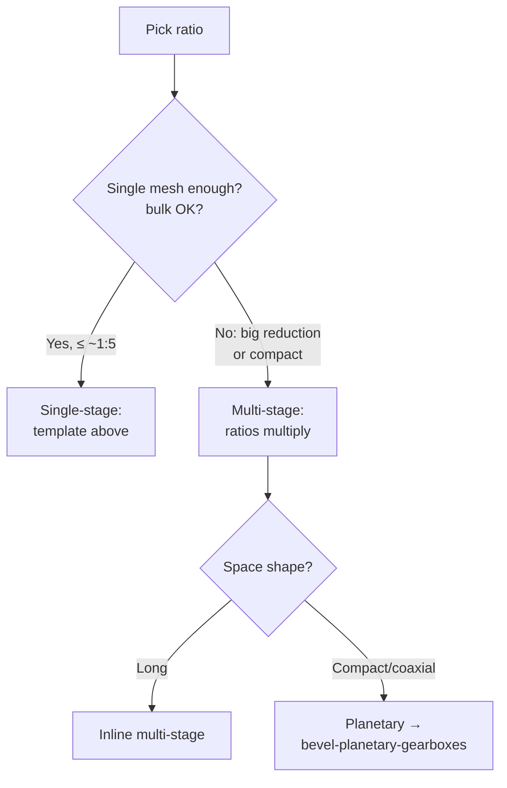

# Helical & Spur Gearboxes (Parallel-Shaft Boxes)

## For future agent
PL2 build page. Videos covered: #3/#42 single-stage helical #344 · #14/#41 1:2 helical #361 · #17/#43 vertical 1:2 #360 · #32/#47 vertical #348 · #9/#47 spur #372 · #50 spur 1:3 #355 · #28/#48 1:5 box #364 · #22 spur walkthrough · #31 three-stage helical · #29 pump gearbox · #38 face-mount #407. Per-video geometry TBC vs bulk transcripts; recipes follow standard parallel-shaft practice + playlist title data.

> **The family logic:** all of these are the same machine with different numbers — two (or more) parallel shafts, ratio set by teeth, housing split at the shaft plane. Learn one deeply and the rest are parameter changes. Start with single-stage 1:2, graduate to three-stage.

---

## 1. Single-stage builds (the template)

**#344 single-stage helical (#3) + #372 spur (#9) + #361 1:2 helical (#14):**

```
1. Ratio math: pick teeth (e.g., 20 → 40 = 1:2), module m → center distance a = m(z1+z2)/2
2. Gears: revolved blanks + patterned teeth (helical = angled cut pattern, TBC exact method per video)
3. Shafts: stepped revolves with keyways + shoulders
4. Bearings: envelope parts at shaft seats
5. Housing: base + cover split through BOTH shaft axes + feet + ribs
6. Assembly: concentric + coincident mates → gear mate with ratio → hand-rotation check
7. Hardware: split-line bolts (patterned), seals at shaft exits, plugs
```

**Spur vs helical modeling difference:** spur teeth cut straight across (simple linear-patterned cuts); helical teeth cut at the helix angle (swept cuts along a helical path, TBC per video) — plus thrust bearings/washers to absorb axial load, which spur boxes skip. The CAD delta is small; the mechanical delta (noise, smoothness, thrust) is the lesson.

**#355 1:3 spur (#50) and #364 1:5 (#28):** same template, bigger wheel. Watch housing proportions change with ratio — high-reduction single stages get bulky, which is *why* multi-stage and planetary exist (design reasoning, not just modeling).

## 2. Multi-stage + special mounts

- **#31 three-stage helical:** three meshes in series — ratios multiply ($i_{total} = i_1·i_2·i_3$). Layout sketch with THREE center distances; intermediate shafts carry two gears each. The assembly-order puzzle gets real: plan insertion sequence before modeling the housing.
- **#360/#348 vertical boxes (#17/#32):** shafts vertical — lubrication changes (splash vs bath, seals face gravity differently — awareness, TBC depth), feet become flange mounts. Same gears, rotated duty.
- **#29 pump gearbox:** input from motor + output to pump — coupling interfaces on both ends; alignment features (spigots/registers) matter more than usual.
- **#38 face-mount #407:** mounting face instead of feet — flange bolt circle (circular pattern), register diameter for alignment.



## 3. Modeling notes that recur

- **Layout sketch first:** all shaft axes + center distances in ONE master sketch — every part references it; ratio changes propagate instead of exploding.
- **Gear teeth:** pattern one tooth-cut around the blank (circular pattern, count = teeth). Helical = angled sweep-cut per tooth (heavy rebuild — keep tooth-cut feature LAST on the gear part).
- **Keys/keyways:** parallel keys per shaft diameter (standard sizes — TBC: confirm key standards table, not this page); keyway cut in both shaft and gear bore, aligned in assembly.
- **Housing ribs:** triangular gussets at feet + around bearing seats — cast housings without ribs crack; your model should show you know that.

## 4. Failure clinic

| Symptom | Cause → Fix |
|---|---|
| Gears overlap or float apart | Center distance ≠ m(z1+z2)/2 → recompute, edit layout sketch (this is why the layout sketch exists) |
| Gear mate spins wrong speed | Ratio inverted or teeth mismatched → ratio = driven/driver, recheck counts |
| Housing halves won't "assemble" | Split not through shaft axes → rebuild split at the shaft plane |
| Shaft slides axially | Missing shoulders/circlips → add axial locators both sides of each bearing/gear |
| Helical box, no thrust handling | Axial load unaddressed → thrust bearings/washers + housing shoulders (awareness at CAD level) |

---

## 5. Worked example: 16 → 48 spur pair, modeled tooth by tooth

The §6 math page gave 20/40 at m2 — now the hands-on cut pattern with 16/48 (same method, different numbers; TBC: 16 teeth at 20° PA risks mild undercut — acceptable for learning/CAD practice, confirm with gear references for real hardware).

**Gear blank (wheel, z=48, m=2):** pitch Ø96, blank OD ≈ 100 → revolve stepped blank (rim + hub + web with lightening holes — patterned AFTER teeth? No: web holes are independent of teeth; order: blank → teeth → hub details → web holes → dress-up).
**Tooth cut:** ONE tooth gap sketched on the face (trapezoid approximating involute — TBC: true involute via equation curve is the advanced rep; trapezoid reads correctly at a glance and meshes visually) → Extruded Cut Through All (or across face width) → **Circular Pattern ×48** about the gear axis. One sketch, one cut, one pattern = 48 teeth.
**Pinion (z=16):** same recipe, blank OD ≈ 36, pattern ×16. Mesh check in assembly at EXACT center distance $a = 2(64)/2 = 64$ — teeth interleave without overlap (eyeball + interference detection; TBC: real backlash needs offset, confirm manufacturing data).
**Helical variant (#344-class):** tooth cut becomes a SWEPT cut along a helical path (helix angle ~15–20° starting point — TBC: confirm with gear references) → pattern the sweep. Watch rebuild time jump (helical patterns are heavy — keep the cut feature LAST, suppress in working configs per [[part-assembly-drawing-workflow#8-configurations-pack-and-go]]).

**Three-stage layout sketch (#31-class):** THREE center distances chained ($a_{12}, a_{23}, a_{34}}$) with ratio split across stages (e.g., 1:5 total ≈ 1.71³ per stage — TBC: split ratios evenly as a starting point, confirm with design references). Intermediate shafts carry two gears each — draw all four shafts + six gears as layout circles BEFORE modeling a single part. The layout sketch IS the design; parts are transcription.

**Vertical-box appendix (#360/#348):** rotate the whole layout 90° (shafts vertical) → lower bearing now carries the gear/shaft WEIGHT (deep-groove + thrust consideration — awareness) → oil sump moves to the bottom cover (drain plug relocates!) → breather stays top. Same gears, three relocated details — the variant lesson.

**Verify in-app:** build the 1:2 single-stage template fully (gears → shafts → bearings → housing → mates → ratio check → exploded + BOM). Change teeth 20/40 → 18/54 and confirm the layout sketch propagates cleanly — that rebuild is the whole page's exam.

**Next:** [[bevel-planetary-gearboxes]].

## CROSS-REFERENCES
- [[INDEX]] · [[gearbox-fundamentals]] · [[bevel-planetary-gearboxes]] · [[part-assembly-drawing-workflow]] · [[solidworks-project-ideas]]
