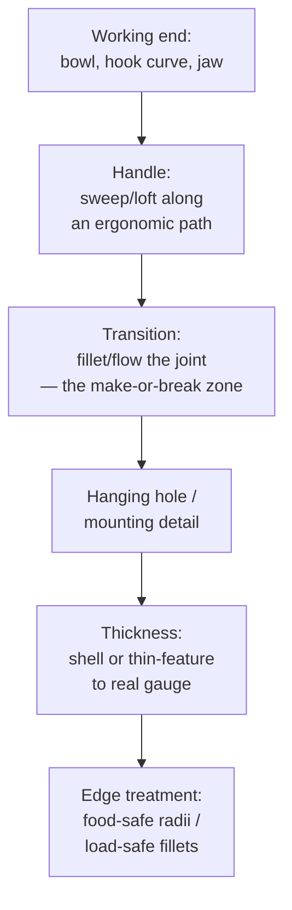

# Household Tools & Utensils

## For future agent
PL1 product-family page: spoon (#12/#29/#31), ladle skimmer (#73), clothes fork (#72: filled + swept), pea shooter (#76), harvester trimmer (#70), agriculture tool (#75), crane hook (#74), lifting ring (#66: boundary), badminton racket (#65), rubber handle (#56), door handle (#60 lofted), double ear clip (#61), dice (#63), triangle ring (#64), mounting boss (#81 cross-ref). Recipes inferred from title feature tags (TBC per-video). Manufacturing notes are general knowledge.

> **Why utensils train you well:** spoons and hooks are deceptively hard — doubly-curved bowls, swept handles with changing sections, hanging holes with strength requirements. Master these and "simple" parts stop surprising you.

---

## 1. The utensil workflow

**Bowl-first (spoons, ladles, skimmers):** the bowl is a filled/lofted depression — build it first, then grow the handle from its rim tangentially so the transition flows. Strainer holes (skimmer #73): pattern of small cuts AFTER thickening; hole count vs weaken tradeoff is real engineering (too many = floppy skimmer).

**Hook-first (crane hook #74, lifting ring #66):** the load curve defines everything — swept profile along a hook centerline path, cross-section sized for the load path (thicker at inner throat where stress peaks — TBC: validate with SimulationXpress, not gut feel). Lifting ring via Boundary (#66) shows planar-alternative construction.

## 2. Playlist build map

| Build | Core lesson (TBC per-video) |
|---|---|
| #12 Spoon, #29 Spoon, #31 Soup Spoon | Bowl depression + handle flow; compare three for technique range |
| #73 Ladle skimmer/strainer | Perforation patterning on a curved bowl; rim stiffening |
| #72 Clothes fork (filled + swept) | Pronged geometry: filled webs + swept arms (the combo in the title) |
| #56 Rubber handle, #60 Door handle (lofted), #43-family handle logic | Grip ergonomics: ovalizing sections, finger grooves, overmold thinking |
| #74 Crane hook, #66 Lifting ring (boundary) | Load-path parts: throat sizing, safety-latch detail (TBC if modeled) |
| #65 Racket, #70 Trimmer, #75 Agri tool, #76 Pea shooter | Shaft + head assemblies; tube/frame construction |
| #61 Ear clip, #63 Dice, #64 Triangle ring, #86 Exhaust nozzle | Small precision: spring tension shapes, marked faces, formed transitions |

## 3. Grip ergonomics (handles that don't hurt)

- **Section morphing:** round where fingers wrap, oval/flattened where palms press — loft with 2–3 sections, guides along the top ridge.
- **Length/diameter rules of thumb (TBC: confirm with ergonomics references):** power grips ~30–40 mm diameter; precision handles smaller; length must clear the widest palm + glove allowance for tools.
- **Overmold thinking:** hard core + soft grip = two bodies/materials in the model (multi-body part or assembly) — the rubber handle (#56) is the intro.

## 4. Material DFM split

| | Stamped/formed metal (forks, clips, rings) | Molded plastic (handles, bowls) | Forged/cast (hooks, agri) |
|---|---|---|---|
| Model bias | Uniform thin walls, bend radii | Draft + ribs + bosses | Generous fillets, parting-aware |
| Watch for | Sharp bends that crack, springback (awareness) | Sink at thick zones, undercuts | Shrink, gating (foundry's problem, your awareness) |
| Finish in model | Break all sharp edges (safety) | Texture-ready faces | Machined faces called out on drawing |

## 5. Failure clinic

| Symptom | Cause → Fix |
|---|---|
| Bowl-handle joint creases | Profiles meet at angle → tangent constraints + transition fillet; rebuild handle start tangent to rim |
| Strainer pattern distorts near rim | Pattern on curved face → use face-curved pattern fill or split-line zones first |
| Hook throat looks thin/weak | Aesthetic sweep, no sizing → thicken inner-throat section, SimulationXpress sanity check |
| Hanging hole too close to edge | Tear-out risk → hole diameter ≥ ~1.5× edge distance rule of thumb (TBC: confirm with strength references) |

---

## 6. Worked example: soup spoon + crane hook (two sweeps, two disciplines)

**Spoon (food-safe surfacing):**
1. Bowl: Top Plane ellipse 50×35 (TBC illustrative) → Lofted/Filled depression 12 deep with Tangent rim continuity → rim fillet 3 (mouth-feel radius — TBC: food-safe radii are generous by design, confirm with product references).
2. Handle path: Right Plane spline from rim tangent, 110 long with a gentle S (wrist clearance curve) → sections: rim-end wide flat (20×3) morphing to mid oval (14×6) → swept/lofted surface → thicken 2.5.
3. Joint: handle start TANGENT to rim (non-negotiable — the crease test) + transition fillet 4.
4. Hanging hole Ø6, 8 from end (edge-distance rule from §5) → all-over food-safe edge breaks 1 mm → polish-ready (appearance: brushed steel).

**Crane hook (load-path sweep):**
1. Centerline path: J-curve (shank straight 60 → throat radius 25 → tip curling back 70% toward shank — TBC illustrative; real hooks follow standards like DIN 15405 — confirm with rigging references, NOT this page).
2. Sections: shank Ø20 → throat 24×18 (fattened INSIDE where stress peaks — the anti-aesthetic move that marks engineering) → tip taper 12.
3. Swept solid along path with 3 sections → safety latch (spring flap envelope + pivot — TBC depth) → shank thread (modeled learning-grade per [[bottles-containers#6-worked-example]]).
4. SimulationXpress: shank fixed, rated load at saddle (TBC: use a nominal load, confirm with standards) → read stress at inner throat (peak location prediction) + safety factor vs yield. If it fails: throat section grows, NOT the whole hook (targeted redesign — the simulation habit).

**Strainer appendix (#73):** bowl per spoon above → hole pattern (Ø3 on 6 grid, TBC illustrative) via Fill Pattern on the bowl face → rim roll (swept bead for stiffness + safe edge) → handle. Pattern AFTER thickening (cut the solid — §4's lesson restated).

---

## 7. Handle-path design + overmold thinking (the professional layer)

**Path-first handle design:** draw the handle CENTERLINE path before any sections (side view spline = the ergonomic gesture: drop angle, palm swell position, hook at end?). Sections get placed ALONG it at 3–5 stations, each sized for its station's job (palm zone fattest, neck thinnest, end flared anti-slip — TBC: confirm with grip-design references for real products). Path-first keeps handles honest; section-first produces lumpy accidents. This ordering generalizes: path → stations → sections → loft/sweep → dress-up.

**Overmold construction (rubber handle #56-class):** hard PP core (extruded/lofted, WITH mechanical interlocks — undercuts, holes, ribs the soft shot grips; chemical bonding alone is a TBC claim, confirm with materials references) → soft TPE grip (offset-surface shell over the core zones, 1.5–2.5 mm — TBC illustrative) → assembly of two materials with interference ZERO (kiss fit) + shutoff faces where the mold halves meet. Model as multi-body part (Core + Grip bodies, different appearances/densities) or assembly — TBC taste; multi-body keeps the interlock references live.

**Metal utensil appendix (fork #72-class):** tines via patterned extruded cuts or formed sheet (TBC per construction) → tine-tip radii (mouth safety — generous) → neck-to-handle transition (the stress zone: cyclic bending every use → fatigue awareness, TBC depth; generous fillets + no sharp section changes) → hanging hole + edge breaks. Stamped construction reads as uniform-thickness sheet with bend radii — model it that way (constant gauge!).

**Verify in-app:** model the spoon end-to-end, section it for wall uniformity, then the hook path + sections. Run the hook through SimulationXpress once — even a rough run teaches where stress lives.

**Next:** [[complex-showcase]].

---

## 14. Fastener + joinery appendix (holding wood and the world together — TBC per woodworking references)

**Screw science in wood (the everyday joint — TBC: confirm with wood-joinery references):** pilot diameters per screw + species (splitting hardwoods vs stripping softwoods bracket the pilot — TBC per tables!) → thread engagement lengths (withdrawal scales with penetration — TBC per formula!) → pocket-hole angle jigs (15°-ish self-contained joints — TBC per jig spec!) → CAD consequence: pilot + clearance + countersink modeled as a THREE-STEP hole habit (the §10-hole-wizard discipline generalized: every screw gets the full stack!).

**Traditional joints (strength without metal — TBC per joinery references):** mortise-and-tenon (cheeks + shoulders + glue faces — TBC per proportion rules!) → dovetails (angle + spacing per TAIL/plate logic — TBC!) → floating tenons/dominos (TBC per system!) → CAD consequence: joint GEOMETRY modeled (tenon/mortise as mating features with glue-gap allowances — TBC per adhesive practice!) + dry-fit sequence check (assembly ORDER modeled — the §6-joint-first habit: joints constrain everything downstream!).

**Knock-down + flat-pack (the §12-furniture lesson restated as CAD deliverable):** cam/dowel/confirmat patterns per panel joint (TBC per hardware catalogs!) → 32-mm system discipline for casework (TBC per cabinetry practice!) → assembly-instruction exploded views FROM the model (the §9-toolchain animations at furniture scale!) → CAD consequence: hardware LIBRARY per §9 (cams/dowels/shelf-pins as drop-in library features — the reuse loop closed!).

---

## 13. Cutlery + cookware appendix (steel that feeds — TBC per cutlery/cookware references)

**Knife architecture (edge science in brief — TBC: confirm with blade references, NOT this page):** blade profile (chef/santoku/paring geometries differ in belly + tip — TBC per use!) → grind (flat/convex/hollow cross-sections trade sharpness vs food-release vs strength — TBC per grind!) → edge angle per side (15° vs 20° per side philosophies — TBC per steel/culture!) → bolster vs no-bolster (balance + sharpening access trade — TBC per design!) → handle scales + rivets/pins (grip per §7 + mechanical retention that survives dishwashers — TBC!) → CAD consequence: blade FLAT pattern thinking (ground bevels modeled as chamfer/loft features with symmetric discipline!) + edge modeled SHARP (0.1-ish visual edge — TBC taste; renders lie about sharpness, drawings note "sharpen to spec"!).

**Cookware bodies (heat management in metal — TBC: confirm with cookware references):** clad layups (stainless-aluminum-stainless sandwiches — TBC per thermal performance; CAD models the ENVELOPE, drawing notes the CLAD spec!) → base flatness (rocking pans infuriate — TBC per tolerance!) → handle attachment (riveted vs welded vs integral — TBC per tier; rivet interiors must clean per §8-food rules!) → lid fit + steam venting (TBC per design) → CAD consequence: handle JOINTS get the §9-joint-first treatment (heat + load + cleaning chemicals combine — the harshest joint environment in this module!).

**Kettles + pourers (controlled liquid delivery — TBC per product):** spout hydraulics (laminar pour vs dribble — spout lip geometry decides — TBC per fluid behavior!) → whistle/steam mechanisms (TBC per design) → handle heat isolation (phenolic standoffs + air gaps — TBC per thermal!) → CAD consequence: pour TESTED physically (CAD predicts, water judges — the §6-bottle lesson: fluids verify on benches, not screens!).

---

## 12. Measuring + marking tools appendix (precision you hold — TBC: confirm with metrology references)

**Squares, levels + straightedges (truth made physical):** blade straightness (the reference edge IS the instrument — TBC per grade: hardened + ground + certified flat to light-bands? TBC per metrology!) → stock + blade joint (the 90° that matters — pinned + adjustable? TBC per tool class!) → vial sensitivity (arc-minutes per 2 mm bubble travel — TBC per level spec!) → CAD consequence: reference faces modeled + CALLED OUT (flatness/square callouts on the drawing per §10-drawing discipline — the tool's spec sheet starts as YOUR geometry notes!).

**Tapes + rules (the flexible datum — TBC per measuring practice):** blade curvature (concave stand-out stiffness — TBC per tape physics!) → hook-end play (the RIVETED LOOSE hook compensates its own thickness inside/outside — TBC per design genius; model the play explicitly!) → case ergonomics per §7-grip rules + belt clip + drop survival per §9-electronics (jobsite drops onto concrete — the §13-drop lesson generalized!) → CAD consequence: hook-play modeled as a CONFIGURATION pair (pushed-in/out states per §11-mechanism-states habit!).

**Marking gauges + knives (layout tools — TBC per woodworking references):** pin/cutter geometry (marking KNIFE severs fibers where pencils crush — TBC per cut quality!) → fence registration faces (the reference that matters — TBC per accuracy!) → micro-adjust mechanisms (threaded advance — TBC per premium tools!) → CAD consequence: wear-part thinking (§8-maintenance: pins/cutters replaceable + stocked!).

---

## 11. Power-tool housings appendix (motors meet hands, at volume)

**Clamshell architecture (the two-half universe — TBC: confirm with power-tool references):** parting plane THROUGH the motor axis (bearings seat half-in-each-half — alignment from the split faces, not hope!) → screw bosses bridging halves (through-bosses with shoulders setting the stack height — TBC per design; overtightening warps alignment, TBC per torque spec!) → motor cradle ribs (axial + rotational location — TBC per motor frame) → cord/boot integration at the rear split (strain relief TRAPPED between halves — the §9-appliance lesson restated!) → CAD consequence: halves modeled as ONE body split LATE (the §5-split discipline: perfect match guaranteed, then diverge details per half!).

**Gearcase + hammer mechanisms (the violent end — TBC depth):** metal gearcase insert in plastic shell (heat + loads exceed plastic — TBC per duty; insert molded-in with pull-out ribs? post-assembled with screws? — TBC per tier!) → hammer/pounding actions (pneumatic piston or mechanical cam — TBC per tool class; impact forces dwarf static loads — TBC per measurement!) → grease zones (sealed-for-life gear grease — TBC per NLGI grade; the §10-lube lesson at small scale!) → CAD consequence: isolate the violence (gearcase module separable for service — TBC per tier; cheap tools seal it forever, pro tools open it!).

**Dust + service reality (jobsites eat tools — TBC: confirm with tool references):** sealed bearings + switches (concrete/masonry dust conducts + abrades — TBC per IP practice adapted!) → brush/service access (motor brushes wear — TBC per motor type; brushless eliminates, brushed needs windows! — TBC) → cord armor at the tool entry (jobsite yanks — TBC per failure data!) → the serviceability audit (which parts die first? can users reach them? — the §7-maintenance habit at handheld scale: design the top-3 failure replacements as 5-minute jobs!).

---

## 10. Garden + outdoor tools appendix (weather, soil, and abuse)

**Weatherproofing (outdoor tools live outside — TBC: confirm with outdoor-product references):** drainage (every cavity drains — weep holes at TRUE lowest points accounting for use-angles, not modeled level! — TBC per practice) → UV stability (material + color callouts — TBC per polymer references; black lasts, bright colors chalk — the purchasing note) → corrosion pairs (dissimilar metals + rain = galvanic cells — TBC: confirm with corrosion references; isolate with bushings/coatings, model the isolators!) → fastener sealing (water wicks threads — sealant notes on the drawing, TBC per practice).

**Soil-contact parts (shovels, tines, blades — TBC: confirm with agri-tool references):** abrasion-resistant edges (hardfaced/through-hardened zones CALLED OUT, not modeled — TBC per material) → replaceable wear tips (bolted, not welded — field replacement in minutes — TBC per design) → self-sharpening profiles (laminated hard/soft steels wearing differentially — TBC depth: awareness that edge metallurgy is a discipline) → handle sockets (tapered + pinned/doweled — TBC per construction; socket depth ≥ ~2× handle diameter illustrative for leverage loads).

**Leverage + force paths (long handles multiply BOTH ways):** grip-to-load ratios (5:1 handle = 5× force at the head AND 5× shock at the hands on strikes — TBC per physics; fiberglass/hickory damping matters — TBC per material) → overstrike guards (missed swings hit the handle below the head — sacrificial collar zone, TBC per tool design) → hanging/storage (peg holes + balance points so tools hang head-DOWN safely — TBC per shop practice; falling sharp tools are the accident report).

---

## 9. Racket + trimmer + agri-tool appendix (shaft-and-head architecture)

**The architecture (generalizes across #65/#70/#75):** long shaft/handle (sweep or tube — bending loads dominate, TBC: confirm with structural references per duty) + working head (the business end: strings/blades/tines) + grip (the §7-handle rules) + joint(s) between them (the failure point — ALWAYS the joint; design joint FIRST, not last).

**Racket (#65-class):** head loop (swept oval tube — string bed inside) → throat (Y-split loft, the stress zone — TBC: confirm with racket-design references; throats crack, generous transitions mandatory) → shaft (tapered tube) → grip (octagonal-ish flare for orientation feel — TBC per sport) → strings as cosmetic pattern (TBC: real stringing is tensioned gut/synthetic — model the bed plane + grommet strip, never 200 modeled strings) → balance point note (head-heavy vs handle-heavy changes play — TBC: confirm with sport references; CAD the balance via mass properties + TAPE the real thing).

**Trimmer/agri (#70/#75-class):** power head envelope (motor/engine mount + vibration isolation — TBC: confirm with equipment references; vibration destroys cheap mounts AND hands) → shaft tube (straight or bike-handle bent — TBC per use) → cutting head (line/bump-feed envelope + guard shroud MANDATORY — thrown debris blinds; TBC: confirm with safety standards, NOT this page) → harness mounts (weight distribution for hours of use — TBC per ergonomics) → fuel/battery packaging (balance + access + spill/leak thinking — TBC per power source).

**Joint-first design mantra (restated generally):** shafts are easy, heads are fun, JOINTS decide survival — throat welds/overlaps, handle-to-head transitions, mount interfaces get designed FIRST with the highest safety factors and the most generous fillets, everything else hangs off them. Review any failed tool (yours or a warranty photo) and find the joint — the lesson is always there.

---

## 8. Sharp edges, heat-treat + food-safety appendix (the invisible specs)

**Edge policy (every edge on every tool gets a decision):** user-touch edges (handles, rims, grips) → generous radii 2–5 mm (TBC per product: comfort + safety) → working edges (knife/chisel/cutter — TBC depth: edge GEOMETRY is blade science, confirm with tool references) stay crisp BY DESIGN (document "sharp — do not break" on the drawing, or the shop will deburr your cutting edge!) → non-touch structural edges → 0.5–1 mm break (handling safety + coating adhesion — TBC: confirm with finishing references; sharp corners shed paint/powder).

**Heat-treat awareness (steel tools live here):** cutting edges + wear zones get hardened (model uniform geometry — hardness is a CALLOUT, not CAD: "58–60 HRC" on the drawing — TBC per tool steel practice, confirm with metallurgy references NOT this page) → soft body + hard edge = differential treatment note (TBC depth) → grinding stock: leave 0.3–0.5 mm (TBC illustrative) on precision faces for post-heat-treat grinding (heat warps; grind after — the process order that decides your modeling allowances).

**Food-contact appendix (utensils that touch food):** crevice-free joints (welds ground flush + polished — bacteria harbor in crevices; TBC: confirm with food-safety design rules) → cleanability radii (interior corners ≥3–6 mm so sponges reach — TBC per hygiene-design references) → material callout (304/316 stainless typical — TBC per product; aluminum + acidic foods react — TBC) → no coatings that flake into food (TBC per regulation). The spoon from §6 done right: rim fillet + joint crease eliminated + polish note = food-safe by construction, not luck.

## CROSS-REFERENCES
- [[INDEX]] · [[consumer-electronics]] · [[complex-showcase]] · [[lofted-boss-boundary]] · [[dressup-productivity]]
