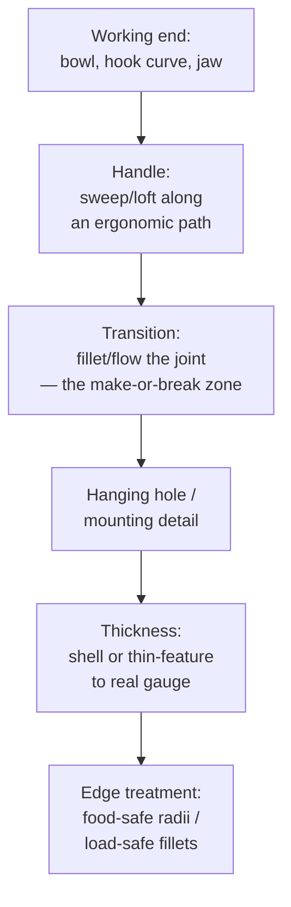

# Household Tools & Utensils

## For future agent
PL1 product-family page: spoon (#12/#29/#31), ladle skimmer (#73), clothes fork (#72: filled + swept), pea shooter (#76), harvester trimmer (#70), agriculture tool (#75), crane hook (#74), lifting ring (#66: boundary), badminton racket (#65), rubber handle (#56), door handle (#60 lofted), double ear clip (#61), dice (#63), triangle ring (#64), mounting boss (#81 cross-ref). Recipes inferred from title feature tags (TBC per-video). Manufacturing notes are general knowledge.

> **Why utensils train you well:** spoons and hooks are deceptively hard — doubly-curved bowls, swept handles with changing sections, hanging holes with strength requirements. Master these and "simple" parts stop surprising you.

---

## 1. The utensil workflow

**Bowl-first (spoons, ladles, skimmers):** the bowl is a filled/lofted depression — build it first, then grow the handle from its rim tangentially so the transition flows. Strainer holes (skimmer #73): pattern of small cuts AFTER thickening; hole count vs weaken tradeoff is real engineering (too many = floppy skimmer).

**Hook-first (crane hook #74, lifting ring #66):** the load curve defines everything — swept profile along a hook centerline path, cross-section sized for the load path (thicker at inner throat where stress peaks — TBC: validate with SimulationXpress, not gut feel). Lifting ring via Boundary (#66) shows planar-alternative construction.

## 2. Playlist build map

| Build | Core lesson (TBC per-video) |
|---|---|
| #12 Spoon, #29 Spoon, #31 Soup Spoon | Bowl depression + handle flow; compare three for technique range |
| #73 Ladle skimmer/strainer | Perforation patterning on a curved bowl; rim stiffening |
| #72 Clothes fork (filled + swept) | Pronged geometry: filled webs + swept arms (the combo in the title) |
| #56 Rubber handle, #60 Door handle (lofted), #43-family handle logic | Grip ergonomics: ovalizing sections, finger grooves, overmold thinking |
| #74 Crane hook, #66 Lifting ring (boundary) | Load-path parts: throat sizing, safety-latch detail (TBC if modeled) |
| #65 Racket, #70 Trimmer, #75 Agri tool, #76 Pea shooter | Shaft + head assemblies; tube/frame construction |
| #61 Ear clip, #63 Dice, #64 Triangle ring, #86 Exhaust nozzle | Small precision: spring tension shapes, marked faces, formed transitions |

## 3. Grip ergonomics (handles that don't hurt)

- **Section morphing:** round where fingers wrap, oval/flattened where palms press — loft with 2–3 sections, guides along the top ridge.
- **Length/diameter rules of thumb (TBC: confirm with ergonomics references):** power grips ~30–40 mm diameter; precision handles smaller; length must clear the widest palm + glove allowance for tools.
- **Overmold thinking:** hard core + soft grip = two bodies/materials in the model (multi-body part or assembly) — the rubber handle (#56) is the intro.

## 4. Material DFM split

| | Stamped/formed metal (forks, clips, rings) | Molded plastic (handles, bowls) | Forged/cast (hooks, agri) |
|---|---|---|---|
| Model bias | Uniform thin walls, bend radii | Draft + ribs + bosses | Generous fillets, parting-aware |
| Watch for | Sharp bends that crack, springback (awareness) | Sink at thick zones, undercuts | Shrink, gating (foundry's problem, your awareness) |
| Finish in model | Break all sharp edges (safety) | Texture-ready faces | Machined faces called out on drawing |

## 5. Failure clinic

| Symptom | Cause → Fix |
|---|---|
| Bowl-handle joint creases | Profiles meet at angle → tangent constraints + transition fillet; rebuild handle start tangent to rim |
| Strainer pattern distorts near rim | Pattern on curved face → use face-curved pattern fill or split-line zones first |
| Hook throat looks thin/weak | Aesthetic sweep, no sizing → thicken inner-throat section, SimulationXpress sanity check |
| Hanging hole too close to edge | Tear-out risk → hole diameter ≥ ~1.5× edge distance rule of thumb (TBC: confirm with strength references) |

---

## 6. Worked example: soup spoon + crane hook (two sweeps, two disciplines)

**Spoon (food-safe surfacing):**
1. Bowl: Top Plane ellipse 50×35 (TBC illustrative) → Lofted/Filled depression 12 deep with Tangent rim continuity → rim fillet 3 (mouth-feel radius — TBC: food-safe radii are generous by design, confirm with product references).
2. Handle path: Right Plane spline from rim tangent, 110 long with a gentle S (wrist clearance curve) → sections: rim-end wide flat (20×3) morphing to mid oval (14×6) → swept/lofted surface → thicken 2.5.
3. Joint: handle start TANGENT to rim (non-negotiable — the crease test) + transition fillet 4.
4. Hanging hole Ø6, 8 from end (edge-distance rule from §5) → all-over food-safe edge breaks 1 mm → polish-ready (appearance: brushed steel).

**Crane hook (load-path sweep):**
1. Centerline path: J-curve (shank straight 60 → throat radius 25 → tip curling back 70% toward shank — TBC illustrative; real hooks follow standards like DIN 15405 — confirm with rigging references, NOT this page).
2. Sections: shank Ø20 → throat 24×18 (fattened INSIDE where stress peaks — the anti-aesthetic move that marks engineering) → tip taper 12.
3. Swept solid along path with 3 sections → safety latch (spring flap envelope + pivot — TBC depth) → shank thread (modeled learning-grade per [[bottles-containers#6-worked-example]]).
4. SimulationXpress: shank fixed, rated load at saddle (TBC: use a nominal load, confirm with standards) → read stress at inner throat (peak location prediction) + safety factor vs yield. If it fails: throat section grows, NOT the whole hook (targeted redesign — the simulation habit).

**Strainer appendix (#73):** bowl per spoon above → hole pattern (Ø3 on 6 grid, TBC illustrative) via Fill Pattern on the bowl face → rim roll (swept bead for stiffness + safe edge) → handle. Pattern AFTER thickening (cut the solid — §4's lesson restated).

---

## 7. Handle-path design + overmold thinking (the professional layer)

**Path-first handle design:** draw the handle CENTERLINE path before any sections (side view spline = the ergonomic gesture: drop angle, palm swell position, hook at end?). Sections get placed ALONG it at 3–5 stations, each sized for its station's job (palm zone fattest, neck thinnest, end flared anti-slip — TBC: confirm with grip-design references for real products). Path-first keeps handles honest; section-first produces lumpy accidents. This ordering generalizes: path → stations → sections → loft/sweep → dress-up.

**Overmold construction (rubber handle #56-class):** hard PP core (extruded/lofted, WITH mechanical interlocks — undercuts, holes, ribs the soft shot grips; chemical bonding alone is a TBC claim, confirm with materials references) → soft TPE grip (offset-surface shell over the core zones, 1.5–2.5 mm — TBC illustrative) → assembly of two materials with interference ZERO (kiss fit) + shutoff faces where the mold halves meet. Model as multi-body part (Core + Grip bodies, different appearances/densities) or assembly — TBC taste; multi-body keeps the interlock references live.

**Metal utensil appendix (fork #72-class):** tines via patterned extruded cuts or formed sheet (TBC per construction) → tine-tip radii (mouth safety — generous) → neck-to-handle transition (the stress zone: cyclic bending every use → fatigue awareness, TBC depth; generous fillets + no sharp section changes) → hanging hole + edge breaks. Stamped construction reads as uniform-thickness sheet with bend radii — model it that way (constant gauge!).

**Verify in-app:** model the spoon end-to-end, section it for wall uniformity, then the hook path + sections. Run the hook through SimulationXpress once — even a rough run teaches where stress lives.

**Next:** [[complex-showcase]].

## CROSS-REFERENCES
- [[INDEX]] · [[consumer-electronics]] · [[complex-showcase]] · [[lofted-boss-boundary]] · [[dressup-productivity]]
