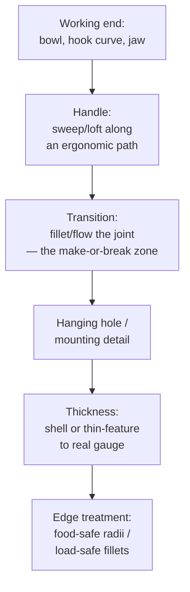

# Household Tools & Utensils

## For future agent
PL1 product-family page: spoon (#12/#29/#31), ladle skimmer (#73), clothes fork (#72: filled + swept), pea shooter (#76), harvester trimmer (#70), agriculture tool (#75), crane hook (#74), lifting ring (#66: boundary), badminton racket (#65), rubber handle (#56), door handle (#60 lofted), double ear clip (#61), dice (#63), triangle ring (#64), mounting boss (#81 cross-ref). Recipes inferred from title feature tags (TBC per-video). Manufacturing notes are general knowledge.

> **Why utensils train you well:** spoons and hooks are deceptively hard — doubly-curved bowls, swept handles with changing sections, hanging holes with strength requirements. Master these and "simple" parts stop surprising you.

---

## 1. The utensil workflow

**Bowl-first (spoons, ladles, skimmers):** the bowl is a filled/lofted depression — build it first, then grow the handle from its rim tangentially so the transition flows. Strainer holes (skimmer #73): pattern of small cuts AFTER thickening; hole count vs weaken tradeoff is real engineering (too many = floppy skimmer).

**Hook-first (crane hook #74, lifting ring #66):** the load curve defines everything — swept profile along a hook centerline path, cross-section sized for the load path (thicker at inner throat where stress peaks — TBC: validate with SimulationXpress, not gut feel). Lifting ring via Boundary (#66) shows planar-alternative construction.

## 2. Playlist build map

| Build | Core lesson (TBC per-video) |
|---|---|
| #12 Spoon, #29 Spoon, #31 Soup Spoon | Bowl depression + handle flow; compare three for technique range |
| #73 Ladle skimmer/strainer | Perforation patterning on a curved bowl; rim stiffening |
| #72 Clothes fork (filled + swept) | Pronged geometry: filled webs + swept arms (the combo in the title) |
| #56 Rubber handle, #60 Door handle (lofted), #43-family handle logic | Grip ergonomics: ovalizing sections, finger grooves, overmold thinking |
| #74 Crane hook, #66 Lifting ring (boundary) | Load-path parts: throat sizing, safety-latch detail (TBC if modeled) |
| #65 Racket, #70 Trimmer, #75 Agri tool, #76 Pea shooter | Shaft + head assemblies; tube/frame construction |
| #61 Ear clip, #63 Dice, #64 Triangle ring, #86 Exhaust nozzle | Small precision: spring tension shapes, marked faces, formed transitions |

## 3. Grip ergonomics (handles that don't hurt)

- **Section morphing:** round where fingers wrap, oval/flattened where palms press — loft with 2–3 sections, guides along the top ridge.
- **Length/diameter rules of thumb (TBC: confirm with ergonomics references):** power grips ~30–40 mm diameter; precision handles smaller; length must clear the widest palm + glove allowance for tools.
- **Overmold thinking:** hard core + soft grip = two bodies/materials in the model (multi-body part or assembly) — the rubber handle (#56) is the intro.

## 4. Material DFM split

| | Stamped/formed metal (forks, clips, rings) | Molded plastic (handles, bowls) | Forged/cast (hooks, agri) |
|---|---|---|---|
| Model bias | Uniform thin walls, bend radii | Draft + ribs + bosses | Generous fillets, parting-aware |
| Watch for | Sharp bends that crack, springback (awareness) | Sink at thick zones, undercuts | Shrink, gating (foundry's problem, your awareness) |
| Finish in model | Break all sharp edges (safety) | Texture-ready faces | Machined faces called out on drawing |

## 5. Failure clinic

| Symptom | Cause → Fix |
|---|---|
| Bowl-handle joint creases | Profiles meet at angle → tangent constraints + transition fillet; rebuild handle start tangent to rim |
| Strainer pattern distorts near rim | Pattern on curved face → use face-curved pattern fill or split-line zones first |
| Hook throat looks thin/weak | Aesthetic sweep, no sizing → thicken inner-throat section, SimulationXpress sanity check |
| Hanging hole too close to edge | Tear-out risk → hole diameter ≥ ~1.5× edge distance rule of thumb (TBC: confirm with strength references) |

**Verify in-app:** model a soup spoon end-to-end (bowl fill + swept handle + joint fillet + hanging hole), then a crane-hook-style curve on a swept path. Section both; check wall uniformity.

**Next:** [[complex-showcase]].

## CROSS-REFERENCES
- [[INDEX]] · [[consumer-electronics]] · [[complex-showcase]] · [[lofted-boss-boundary]] · [[dressup-productivity]]
