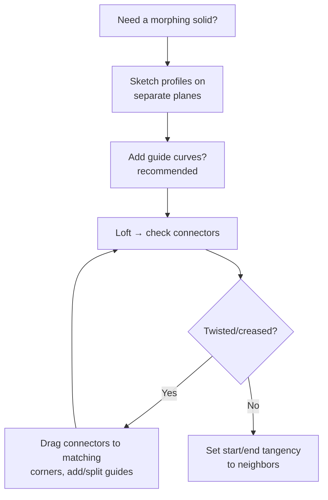

# Loft & Boundary: Morphing Between Profiles

## For future agent
Second solid-features page. Loft/boundary are the bridge from prismatic modeling to surfacing (same math ideas as [[lofted-boundary-surfaces]], in solid form). Grounded in PL1 transcripts #43 (handle: Lofted Boss/Base + Offset + Thicken + Split Line) and #82 (Lofted Boss/Base shower head). Version-stable core features.

> **Why these exist:** extrude/revolve/sweep keep ONE cross-section. Real products morph — a handle swells from oval to round, a nozzle necks down, a mouse rises and falls. Loft and Boundary skin between *different* profiles. If extrude is pushing dough through one cookie cutter, loft is stretching it across several.

---

## 1. Lofted Boss/Base (profiles + optional rails)

Pick **2+ profiles** (sketches on different planes) → SolidWorks skins a solid between them. Controls:

- **Connectors** (the green dots/lines between profiles): they decide how points map to each other. Misaligned connectors = twisted loft. Drag them to matching corners — the #1 loft fix.
- **Guide curves** (rails the skin must touch): force the bulge path (a handle's top ridge line, a bottle's shoulder curve). Without guides the loft takes the shortest path — often wrong-looking.
- **Start/End constraints** (tangency/direction): make the loft leave its neighbors smoothly (tangent to an adjacent face) instead of creasing. This is what makes multi-feature bodies look like one designed object.
- **Centerline loft**: spine-driven variant when profiles must stay perpendicular to a curving spine.

**Beginner recipe (PL1 #43 handle pattern):** profile 1 (grip oval) on one plane → profile 2 (neck circle) offset along the handle axis → optional top-ridge guide curve → Lofted Boss → Offset Surface/Thicken tricks come later in surfacing; at solid level, follow with fillets ([[dressup-productivity]]).

## 2. Boundary Boss/Base (finer control)

Same idea, more explicit: **two directions** of curves (like a net). Direction 1 = profiles, Direction 2 = guides — both fully constrain the skin. Rule of thumb from practice: **Loft for speed, Boundary for control** — when a loft twists no matter how you drag connectors, rebuild it as a Boundary with explicit Direction-2 curves.

## 3. Where they earn their keep (playlist map)

| Build | Feature used | Why not extrude? |
|---|---|---|
| Handle (#43) | Lofted Boss/Base + guides | Oval-to-round morph along a curve |
| Shower head (#82) | Lofted Boss/Base | Dome rising from a neck ring |
| Hair-dryer nozzle (#44) | Boundary (surface twin) | Rectangular-to-oval transition — see [[lofted-boundary-surfaces]] |
| Taps, jugs, vases | Loft/revolve mixes | Shoulder curves no single profile can give |

**Real-world anchor:** consumer-product housings (power tools, appliances, automotive ducts) are loft/boundary territory. Interviewers and clients read smooth transitions as design quality — creased, lumpy lofts scream beginner. Tangency constraints + zebra-stripe checks ([[surfacing-utilities-troubleshooting]]) are the polish step.

## 4. Failure clinic

| Symptom | Cause → Fix |
|---|---|
| Twisted/creased loft | Connector mismatch → drag connectors to corresponding corners; equalize profile segment counts (split entities so both profiles have same number of segments) |
| Loft bulges wrong way | Missing guides → add guide curves defining the silhouette |
| Self-intersecting / rebuild error | Profiles too different in size/position, or guide pierces profiles badly → intermediate profile(s) between them |
| Wrinkled surface | Too few profiles for a long transition → add 1–2 intermediate sections |
| Can't select profiles | Profiles must be open-or-closed consistently; check sketch planes are distinct and roughly facing each other |

**Verify in-app:** loft a rounded-rectangle to a circle (30 mm apart) with one guide curve; rebuild it as Boundary; compare, then break the connectors on purpose and fix them — the debugging rep matters more than the success.

**Next:** [[dressup-productivity]] (fillets/patterns that finish these bodies) → surfacing track [[surfacing-methodology]].

## CROSS-REFERENCES
- [[INDEX]] · [[extrude-revolve-sweep]] · [[lofted-boundary-surfaces]] (surface twins) · [[consumer-electronics]] · [[../development-of-surfaces]] (the projection theory behind profile morphing)
