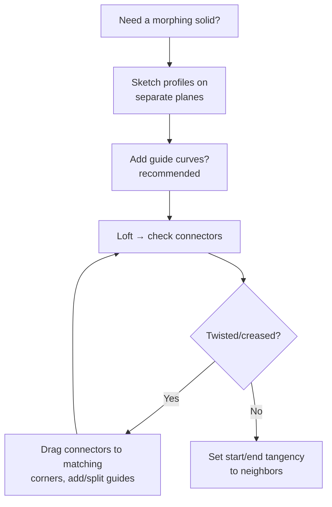

# Loft & Boundary: Morphing Between Profiles

## For future agent
Second solid-features page. Loft/boundary are the bridge from prismatic modeling to surfacing (same math ideas as [[lofted-boundary-surfaces]], in solid form). Grounded in PL1 transcripts #43 (handle: Lofted Boss/Base + Offset + Thicken + Split Line) and #82 (Lofted Boss/Base shower head). Version-stable core features.

> **Why these exist:** extrude/revolve/sweep keep ONE cross-section. Real products morph — a handle swells from oval to round, a nozzle necks down, a mouse rises and falls. Loft and Boundary skin between *different* profiles. If extrude is pushing dough through one cookie cutter, loft is stretching it across several.

---

## 1. Lofted Boss/Base (profiles + optional rails)

Pick **2+ profiles** (sketches on different planes) → SolidWorks skins a solid between them. Controls:

- **Connectors** (the green dots/lines between profiles): they decide how points map to each other. Misaligned connectors = twisted loft. Drag them to matching corners — the #1 loft fix.
- **Guide curves** (rails the skin must touch): force the bulge path (a handle's top ridge line, a bottle's shoulder curve). Without guides the loft takes the shortest path — often wrong-looking.
- **Start/End constraints** (tangency/direction): make the loft leave its neighbors smoothly (tangent to an adjacent face) instead of creasing. This is what makes multi-feature bodies look like one designed object.
- **Centerline loft**: spine-driven variant when profiles must stay perpendicular to a curving spine.

**Beginner recipe (PL1 #43 handle pattern):** profile 1 (grip oval) on one plane → profile 2 (neck circle) offset along the handle axis → optional top-ridge guide curve → Lofted Boss → Offset Surface/Thicken tricks come later in surfacing; at solid level, follow with fillets ([[dressup-productivity]]).

## 2. Boundary Boss/Base (finer control)

Same idea, more explicit: **two directions** of curves (like a net). Direction 1 = profiles, Direction 2 = guides — both fully constrain the skin. Rule of thumb from practice: **Loft for speed, Boundary for control** — when a loft twists no matter how you drag connectors, rebuild it as a Boundary with explicit Direction-2 curves.

## 3. Where they earn their keep (playlist map)

| Build | Feature used | Why not extrude? |
|---|---|---|
| Handle (#43) | Lofted Boss/Base + guides | Oval-to-round morph along a curve |
| Shower head (#82) | Lofted Boss/Base | Dome rising from a neck ring |
| Hair-dryer nozzle (#44) | Boundary (surface twin) | Rectangular-to-oval transition — see [[lofted-boundary-surfaces]] |
| Taps, jugs, vases | Loft/revolve mixes | Shoulder curves no single profile can give |

**Real-world anchor:** consumer-product housings (power tools, appliances, automotive ducts) are loft/boundary territory. Interviewers and clients read smooth transitions as design quality — creased, lumpy lofts scream beginner. Tangency constraints + zebra-stripe checks ([[surfacing-utilities-troubleshooting]]) are the polish step.

## 4. Failure clinic

| Symptom | Cause → Fix |
|---|---|
| Twisted/creased loft | Connector mismatch → drag connectors to corresponding corners; equalize profile segment counts (split entities so both profiles have same number of segments) |
| Loft bulges wrong way | Missing guides → add guide curves defining the silhouette |
| Self-intersecting / rebuild error | Profiles too different in size/position, or guide pierces profiles badly → intermediate profile(s) between them |
| Wrinkled surface | Too few profiles for a long transition → add 1–2 intermediate sections |
| Can't select profiles | Profiles must be open-or-closed consistently; check sketch planes are distinct and roughly facing each other |

---

## 5. Worked example: grip handle (oval → circle, 120 mm long)

The PL1 #43-class handle as a SOLID loft (surface version lives in [[lofted-boundary-surfaces]]).

1. **Profile 1 (grip):** Front Plane → ellipse 40×30 centered on origin → fully define (major/minor dims + center coincident). This is the palm end.
2. **Profile 2 (neck):** new plane offset 120 along the handle axis (Plane → Offset 120 from Front) → circle Ø24 centered on origin (same axis! — off-axis lofts bend; keep centers colinear unless bending is the design).
3. **Guide (top ridge):** Right Plane → spline from profile-1 top point to profile-2 top point with a gentle crown (+8 mm mid-height bump — the palm swell) → tangent relations at both ends → fully define via 3 spline-point dims.
4. **Lofted Boss:** select profiles in order → add the spline as Guide Curve → preview: connectors should run cleanly end-to-end; if twisted, drag green connectors to matching quadrant points.
5. **End treatment:** Start constraint: Normal To Profile (flat mounting face); End: Tangent (flows into whatever mounts next — TBC per design). Cap the mounting end with a flange extrude (bolt holes per [[extrude-revolve-sweep#7-worked-example]]).
6. **Segment-count check:** ellipse (1 spline entity) vs circle (1 entity) — compatible. If you'd used a rounded rectangle (4+ entities) vs a circle, SPLIT the circle into matching arcs first (split entities at quadrant points) — the #1 twist prevention nobody teaches.

**Centerline loft variant:** same profiles + a centerline spine sketch (the handle's curved axis) instead of straight offset — profiles stay ⊥ spine automatically. Use when the handle itself curves (bicycle grip, tool handles with bends).

**Verify in-app:** build the handle, then change neck Ø24→Ø30 and profile spacing 120→150 — clean rebuild means your guides were properly pierced/constrained; failures point at the exact weak reference (fix it, that's the rep).

---

## 6. Loft planning lab: three transitions, three decisions

**Round-to-square duct adapter (HVAC-style):** circle Ø100 → 80×80 square, 60 apart. Decision: solid loft is FINE (it's a fabricated transition, TBC: real duct adapters are sheet-metal developments — the solid version is your geometric proof before unfolding). Segment compatibility: circle (1) vs square-with-fillets (4+ straights + 4 fillets = 8 entities!) → split the circle into 8 arcs at matching angular positions FIRST. Skip this and the twist is guaranteed. Guides: 4 corner rails (the square's corners mapped to circle quadrants) — the loft then behaves.

**Ergonomic knob (sphere-ish swell on a shaft):** shaft Ø20 → swell Ø45 → shaft Ø20, total 70. Decision: THREE profiles (in/mid/out) not two — two profiles give a football, three give a designed swell with controllable crown position. Guides optional here (short transition, symmetric) — connectors + tangency do the work. End constraints: Tangent into the shaft shoulders both ends (no crease where fingers grip).

**Y-branch duct (one-to-two split):** inlet Ø80 → two Ø50 outlets at 45°. Decision: NOT one loft — two separate lofts (inlet→left, inlet→right) sharing the inlet profile, then Combine (Add) the bodies. Branching in a single loft feature self-intersects; the multi-body + combine pattern is the standard escape (TBC per version: Combine → Add merges them; fillet the crotch generously — stress + flow both punish sharp crotches).

**The segment-count rule, stated once more because it decides 80% of loft outcomes:** both profiles must have the SAME number of segments, mapped corner-to-corner. Count segments (every split point counts!) before lofting, split the simpler profile to match, THEN loft. Five minutes of splitting saves an hour of connector wrestling.

**Next:** [[dressup-productivity]] (fillets/patterns that finish these bodies) → surfacing track [[surfacing-methodology]].

## CROSS-REFERENCES
- [[INDEX]] · [[extrude-revolve-sweep]] · [[lofted-boundary-surfaces]] (surface twins) · [[consumer-electronics]] · [[../development-of-surfaces]] (the projection theory behind profile morphing)
