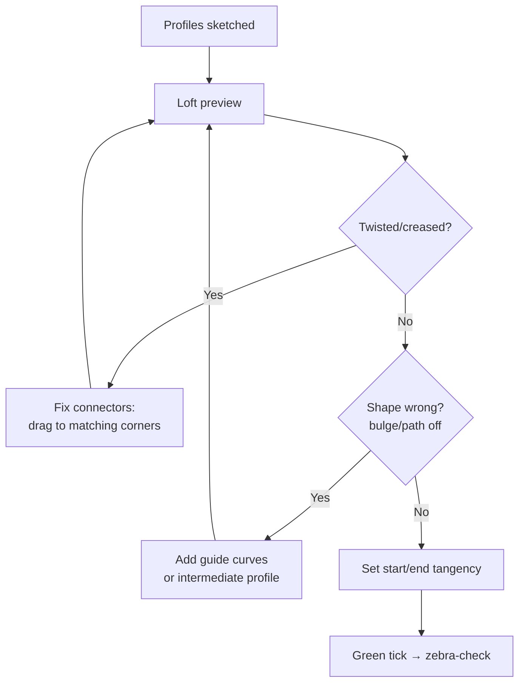

# Lofted Surface & Boundary Surface (Deep)

## For future agent
Surfacing workhorse page. Directly grounded in PL1 transcripts #10 (Lofted Surface), #48 (SURFACE LOFT), #44 (Boundary hair-dryer nozzle), #67/#89 (Boundary tutorials). Same connector/guide logic as solid loft ([[lofted-boss-boundary]]) minus the solid constraint — more freedom, more ways to fail.

> **The pair that builds half the playlist:** Lofted Surface skins between profiles fast; Boundary Surface does it with explicit two-direction control. Mouse shells, nozzles, handles, helmets, jugs — all of them are these two features plus trim/fill.

---

## 1. Lofted Surface (from transcript #10/#48)

Pick profiles on different planes → skinned patch. What the primers demonstrate, step by step:

1. **Profiles first, clean and compatible** — same segment character on each profile where possible (split lines/arcs so corner counts match; mismatched segmentation is twist source #1).
2. **Connectors are the whole game** — the green mapping lines between profiles. Drag each connector to its *corresponding* corner/vertex. A loft that looks "drunk" is 90% connector misalignment — fix before touching any other setting.
3. **Guide curves optional but decisive** — rails the skin must pass through (ridge lines, shoulder curves). The primers add guides when the straight shortest-path skin looks wrong.
4. **Start/End tangency** — Normal To Profile (leaves square), Tangent To Face / Curvature To Face (blends into neighbors). Visible consumer skins want tangency at minimum.

## 2. Boundary Surface (from #44/#67/#89)

Two explicit directions: **Direction 1** (profiles across) + **Direction 2** (guides along). The hair-dryer nozzle (#44) is the canonical demo: rectangular intake morphing to an oval outlet, controlled in both directions so walls stay fair.

**When Boundary beats Loft:** complex transitions (nozzle, helmet shell zones, taps), curvature-continuity demands (set C2 on an edge to blend into adjacent styling), or any loft that stays twisted after connector repair. Cost: more setup (you must supply both directions well).

**Continuity controls per edge:** Contact (C0) / Tangent (C1) / Curvature (C2) — match or exceed the neighbor's level, else a visible seam. Visible outer skins: aim C1 minimum, C2 where reflections matter.

## 3. Shared craft rules

- **Profile quality decides everything:** fair splines in (curvature combs clean) → fair surfaces out. Garbage splines cannot be fixed downstream — go back to the sketch.
- **Few, deliberate profiles:** 2–4 well-placed sections beat 8 noisy ones. Add intermediate profiles only where the shape actually changes behavior.
- **Plan the seam:** where patch edges land becomes a visible line — put seams on style lines, parting lines, or hidden faces, never mid-cheek on a visible skin.
- **Trim after, not during:** build patches slightly oversized, then [[filled-knit-trim-thicken|trim]] to exact boundaries — cleaner edges than trying to loft exactly-to-size.

## 4. Playlist application map

| Build | Surface strategy (inferred from titles + primer patterns; TBC against full video) |
|---|---|
| Logitech/Apple mouse (#24/#25, #50) | Lofted top shell + side patches + bottom fill + trim wheel slot |
| Hair-dryer nozzle (#44) | Boundary rectangle→oval (the demo itself) |
| Jug (#58: revolved + swept + trim) | Revolve body + swept handle + trim intersections |
| Handle (#43 family) | Lofted surface → offset → thicken (the documented combo) |
| Shower head (#82) | Lofted dome + trim face + thicken |
| Helmet (#16–18) | Boundary shell zones + trim visor + edge sweep (see [[complex-showcase]]) |

## 5. Failure clinic

| Symptom | Cause → Fix |
|---|---|
| Twist/crease | Connectors → drag to matching corners; equalize segments |
| Wrinkles along length | Too few sections → add intermediate profile(s) |
| Edge won't meet neighbor | Gap exceeds knit tolerance → extend surface or add fill patch; don't crank tolerance |
| Lumpy reflections | Bad input spline → curvature-comb the sketches, rebuild the worst profile |
| Boundary fails to solve | Direction-2 curves don't properly intersect Direction-1 → check pierce/intersection at every crossing |

**Verify in-app:** loft circle→rounded-rectangle→circle (three profiles, one guide), rebuild the same as Boundary with explicit Direction-2 curves, zebra-stripe both. Then fix a deliberately-twisted loft via connectors only.

**Next:** [[filled-knit-trim-thicken]].

## CROSS-REFERENCES
- [[INDEX]] · [[surfacing-methodology]] · [[filled-knit-trim-thicken]] · [[lofted-boss-boundary]] (solid twins) · [[consumer-electronics]]
