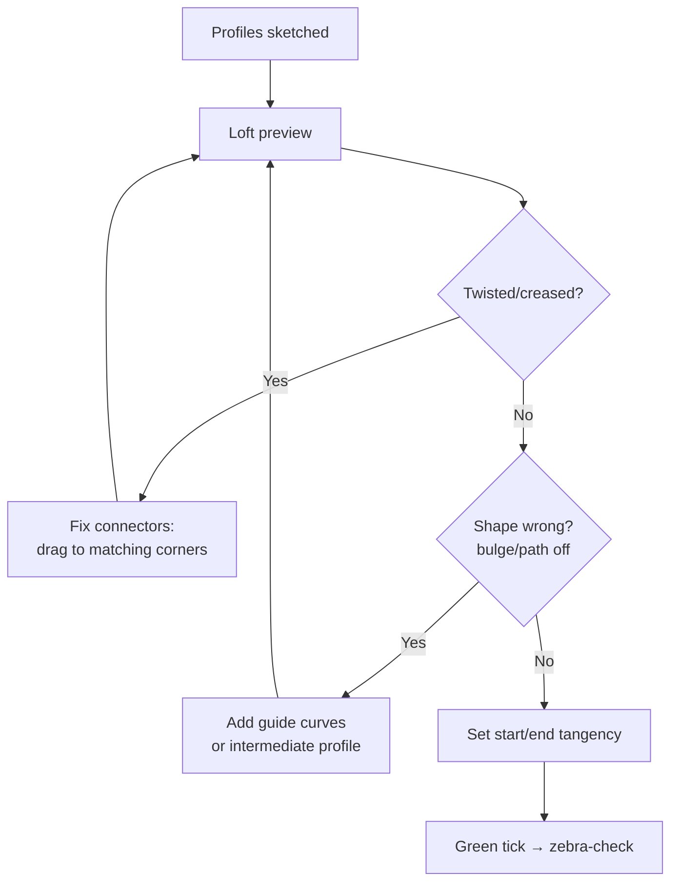

# Lofted Surface & Boundary Surface (Deep)

## For future agent
Surfacing workhorse page. Directly grounded in PL1 transcripts #10 (Lofted Surface), #48 (SURFACE LOFT), #44 (Boundary hair-dryer nozzle), #67/#89 (Boundary tutorials). Same connector/guide logic as solid loft ([[lofted-boss-boundary]]) minus the solid constraint — more freedom, more ways to fail.

> **The pair that builds half the playlist:** Lofted Surface skins between profiles fast; Boundary Surface does it with explicit two-direction control. Mouse shells, nozzles, handles, helmets, jugs — all of them are these two features plus trim/fill.

---

## 1. Lofted Surface (from transcript #10/#48)

Pick profiles on different planes → skinned patch. What the primers demonstrate, step by step:

1. **Profiles first, clean and compatible** — same segment character on each profile where possible (split lines/arcs so corner counts match; mismatched segmentation is twist source #1).
2. **Connectors are the whole game** — the green mapping lines between profiles. Drag each connector to its *corresponding* corner/vertex. A loft that looks "drunk" is 90% connector misalignment — fix before touching any other setting.
3. **Guide curves optional but decisive** — rails the skin must pass through (ridge lines, shoulder curves). The primers add guides when the straight shortest-path skin looks wrong.
4. **Start/End tangency** — Normal To Profile (leaves square), Tangent To Face / Curvature To Face (blends into neighbors). Visible consumer skins want tangency at minimum.

## 2. Boundary Surface (from #44/#67/#89)

Two explicit directions: **Direction 1** (profiles across) + **Direction 2** (guides along). The hair-dryer nozzle (#44) is the canonical demo: rectangular intake morphing to an oval outlet, controlled in both directions so walls stay fair.

**When Boundary beats Loft:** complex transitions (nozzle, helmet shell zones, taps), curvature-continuity demands (set C2 on an edge to blend into adjacent styling), or any loft that stays twisted after connector repair. Cost: more setup (you must supply both directions well).

**Continuity controls per edge:** Contact (C0) / Tangent (C1) / Curvature (C2) — match or exceed the neighbor's level, else a visible seam. Visible outer skins: aim C1 minimum, C2 where reflections matter.

## 3. Shared craft rules

- **Profile quality decides everything:** fair splines in (curvature combs clean) → fair surfaces out. Garbage splines cannot be fixed downstream — go back to the sketch.
- **Few, deliberate profiles:** 2–4 well-placed sections beat 8 noisy ones. Add intermediate profiles only where the shape actually changes behavior.
- **Plan the seam:** where patch edges land becomes a visible line — put seams on style lines, parting lines, or hidden faces, never mid-cheek on a visible skin.
- **Trim after, not during:** build patches slightly oversized, then [[filled-knit-trim-thicken|trim]] to exact boundaries — cleaner edges than trying to loft exactly-to-size.

## 4. Playlist application map

| Build | Surface strategy (inferred from titles + primer patterns; TBC against full video) |
|---|---|
| Logitech/Apple mouse (#24/#25, #50) | Lofted top shell + side patches + bottom fill + trim wheel slot |
| Hair-dryer nozzle (#44) | Boundary rectangle→oval (the demo itself) |
| Jug (#58: revolved + swept + trim) | Revolve body + swept handle + trim intersections |
| Handle (#43 family) | Lofted surface → offset → thicken (the documented combo) |
| Shower head (#82) | Lofted dome + trim face + thicken |
| Helmet (#16–18) | Boundary shell zones + trim visor + edge sweep (see [[complex-showcase]]) |

## 5. Failure clinic

| Symptom | Cause → Fix |
|---|---|
| Twist/crease | Connectors → drag to matching corners; equalize segments |
| Wrinkles along length | Too few sections → add intermediate profile(s) |
| Edge won't meet neighbor | Gap exceeds knit tolerance → extend surface or add fill patch; don't crank tolerance |
| Lumpy reflections | Bad input spline → curvature-comb the sketches, rebuild the worst profile |
| Boundary fails to solve | Direction-2 curves don't properly intersect Direction-1 → check pierce/intersection at every crossing |

---

## 6. Worked example: reducer nozzle DN50 → DN25, 100 mm long (numbers included)

The #44-class problem as lofted surface first, then boundary — feel the difference.

**Loft version:**
1. Profile 1: Front Plane → circle Ø50 (inlet) centered on origin → fully define.
2. Profile 2: offset plane 100 → circle Ø25 centered on origin. Segment check: circle vs circle — trivially compatible.
3. Straight loft, no guides → conical frustum skin (correct but boring — real nozzles ease the transition).
4. Add character: intermediate ellipse profile at 60 (Ø38×Ø34, slightly flattened — ovalization for wrench flats? no — for flow easing; keep it honest) → rebuild loft with 3 profiles → smooth S-transition. Connectors: verify each profile's seam point (circle start) aligns angularly — rotate the intermediate profile's start if the loft spirals.

**Boundary version (control upgrade):**
1. Same profiles as Direction 1.
2. Direction 2: two guide splines (top + bottom) from inlet to outlet with a gentle S (fast contraction early, easing late — the flow-friendly shape; TBC: real nozzle contours follow fluid-design rules, this is CAD practice).
3. Set outlet edge continuity to Curvature (C2) where it meets the downstream pipe face (TBC per assembly) → zebra-check: stripes should flow unbroken across the joint.

**Comparison verdict (write in your notes):** loft = 5 minutes, fair result; boundary = 15 minutes, controlled result with C2 joint. Price the control honestly per project — visible plumbing showpiece? Boundary. Internal duct nobody sees? Loft and move on.

**Verify in-app:** build both versions, zebra-stripe the outlet joint on each, screenshot the difference. Then change outlet Ø25→Ø20 and confirm both rebuild — the guide-piercing quality decides.

---

## 7. Connector surgery + Direction-2 mastery (the advanced reps)

**Connector surgery drill (15 minutes, do it once):** loft a square (4 sharp corners) to a circle. Default connectors will map square-corner-1 to circle-seam — twist. Fix sequence: (1) add split points to the circle at 0/90/180/270° (now 4 segments, matching the square); (2) drag each connector to its corresponding corner; (3) preview — clean. Now ROTATE one profile 45° in its sketch and watch the twist return; fix by re-dragging. This drill teaches that connectors are MAPPINGS, not decorations — you now understand loft at the level most users never reach.

**Direction-2 design (Boundary's real power):** beginners treat Direction 2 as "extra guides." Reframe: Direction 1 says WHERE the surface goes (profile to profile), Direction 2 says HOW it behaves along the way (flat? crowned? S-curved?). Same profiles + straight Direction-2 rails = honest transition; same profiles + crowned Direction-2 = bellied showpiece. The profiles didn't change — the behavior did. Practice: rebuild the §6 nozzle with three different Direction-2 sets (straight / crowned / S-curved) and zebra all three. One model, three characters — that's Boundary fluency.

**Continuity ladder, applied:** rebuild the nozzle-to-pipe joint three times (C0 / C1 / C2 on the outlet edge) and zebra each. C0: visible crease line (acceptable inside, never on show surfaces). C1: smooth but highlight hesitates (the working standard). C2: reflections flow (the premium read). Knowing what each LOOKS like beats memorizing definitions — your eyes become the spec.

**Next:** [[filled-knit-trim-thicken]].

---

## 9. Industrial applications tour (where loft/boundary earn salaries)

**Aerospace fairings (TBC depth — awareness):** wheel pants, wingtips, cowlings — drag-critical skins where patch count stays LOW (fewer seams = less drag + easier composite layup — TBC: confirm with aero-composites references) and continuity runs C2 (laminar flow cares — TBC). CAD consequence: long clean Boundary patches with minimal trims; fastener zones as separate small patches (don't break the hero skin for screws).

**Automotive closures (awareness):** hoods/decklids/fenders — stamped sheet (draw-depth limits! — TBC: confirm with stamping references; deep draws tear, shallow draws oil-can; the panel design respects press limits) → hemmed edges (fold-over flanges for stiffness + safety, modeled as edge rolls at learning level — TBC) → hinge/latch reinforcements (doubler patches inside — TBC per construction). CAD consequence: outer skin + inner frame as SEPARATE patch sets sharing boundary curves (the helmet shell/liner pattern from §5-liner generalized to cars).

**Consumer housings (the playlist's home turf):** parting-line-driven patch layout (every patch edge is EITHER a style line OR the parting line — no accidental seams; TBC per product) → texture-ready faces (grain hides C1 — budget C2 only for gloss zones per [[artistic-organic]] §9-finish-spec) → snap/hook integration modeled into the shell patches (not added later — TBC per enclosure practice; hooks grown from the wall share its strength).

**Marine/boat hulls (awareness — TBC depth):** developable-ish surfaces (plywood/steel plate bends ONE way — ruled-surface thinking from [[surfacing-utilities-troubleshooting]] §6!) → chine hulls (hard creases BETWEEN developable panels — C0 as DESIGN, the inverse of automotive) → fairing battens in CAD = curvature combs on sections (the wooden-boat tool, digitized). CAD consequence: chine rails as explicit rails, panels as ruled/lofted-between — the one genre where creases are correct.

---

## 8. Surface continuity showcase: fender-crown exercise (eyes-first training)

**The exercise (no dimensions — pure fairness training):** loft 3 profiles (flat-ish ends + crowned middle, all same width) → Boundary the SAME profiles with C2 end rails → zebra both → overlay-compare. The loft shows end kinks (C0-ish leaves); the Boundary flows. Same inputs, different math respect — the lesson is visceral, not verbal. Screenshot the pair into your daily note; revisit monthly as your fairness eye develops (it WILL develop — stripe-reading is a trained sense, TBC: confirm with your own before/after archive, not my claim).

**Guide-rail count experiment:** rebuild any loft with 0 → 1 → 2 → 4 guides, zebra each stage. Watch: 0 guides = shortest-path (often wrong character), 1 = direction set, 2 = character locked, 4 = diminishing returns + rebuild cost. The experiment teaches the budget: guides are the MOST EXPENSIVE loft input (each must pierce cleanly forever) — spend 1–2 where they change character, never 6 where 2 suffice.

**Tangency-weight tuning (Boundary's hidden dials — TBC exact labels per version):** start/end constraints carry WEIGHT/magnitude values (how FAR the tangency influence reaches). Low weight = tight local blend (crisp styling break); high weight = long flowing blend (soft transitions). Same C1, different character — tune weights while watching zebra COMB movement (the comb slides with weight — visual feedback for an abstract number). This dial separates Boundary operators from Boundary artists; practice it on the §6 nozzle outlet until the joint reads premium.

**Profile-reduction challenge (advanced discipline):** take any working 4-profile loft and rebuild it with 3, then 2 (adding guides to compensate). If the 2-profile version matches the 4-profile zebra, the extra profiles were scaffolding you didn't need — delete them permanently (fewer profiles = faster rebuilds + fewer failure points). Minimal-profile modeling is the efficiency endgame of this entire page.

## CROSS-REFERENCES
- [[INDEX]] · [[surfacing-methodology]] · [[filled-knit-trim-thicken]] · [[lofted-boss-boundary]] (solid twins) · [[consumer-electronics]]
