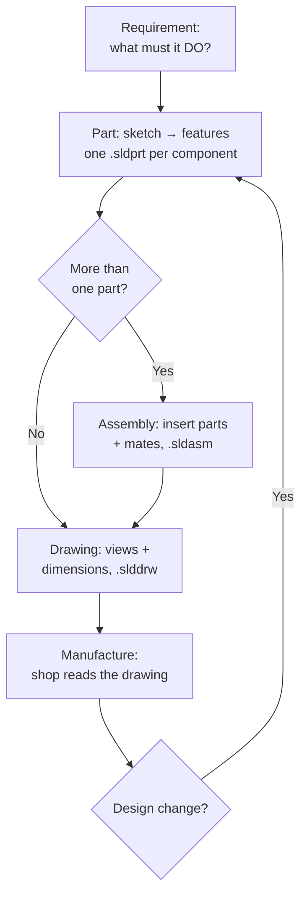
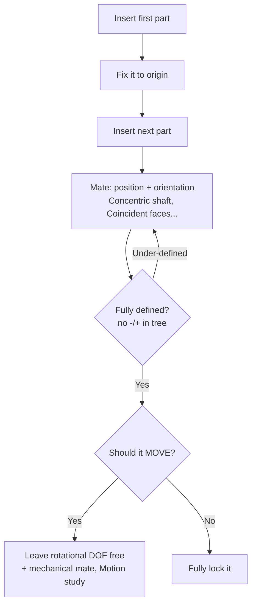

# Part → Assembly → Drawing: The Master Workflow

## For future agent
Foundation page 3. Establishes the document pipeline every later page assumes: PL1 ≈ Part-level, PL2 ≈ Part + Assembly. Mates and in-context editing grounded in standard SolidWorks behavior (version-stable for a decade+). Links forward to machine-build pages.

> **The mental model:** Part = one manufactured piece. Assembly = how pieces fit and move. Drawing = the legal document the workshop builds from. A model without a drawing can't be manufactured; an assembly without mates is just overlapping solids.

---

## 1. The pipeline



**Real-world anchor:** in industry the **drawing is the contract** — machine shops quote and cut from it, not from your 3D file. Dimensions, tolerances, surface-finish marks, title block: that's what turns geometry into a purchasable part. Your ED theory ([[../overview]]) is exactly this language.

---

## 2. Part modeling order (the combo all builds share)

```
1. Base feature  — biggest shape first (extrude/revolve of the main profile)
2. Major form    — cuts and adds that change the silhouette (cut-extrude, loft)
3. Functional    — holes (Hole Wizard!), threads, mounting bosses
4. Dress-up LAST — fillets, chamfers, shells, drafts
5. Check         — mass properties, section view, interference (if multi-body)
```

**Why dress-up last:** fillets consume edges by identity — later features referencing filleted edges break constantly. Shell near the end (it hollows using existing faces). Every playlist build that "suddenly broke" violates this order (TBC per-video, but the pattern is universal).

**Multi-body vs assembly:** you can model several solid bodies inside one Part (great for weldments, mold halves, master-model technique). Split into an assembly when parts **move relative to each other** or are **manufactured separately** (gearbox: separate parts; mold core/cavity: multi-body then split).

---

## 3. Assemblies & mates (PL2 territory)

An assembly positions parts with **mates** (geometric constraints between faces/edges):

| Mate family | Examples | Used for |
|---|---|---|
| Standard | Coincident, Concentric, Parallel, Perpendicular, Tangent, Distance, Angle | 95% of static assemblies (gearbox housings, shafts, press frames) |
| Advanced | Symmetric, Width, Path, Linear/Linear-coupler | Symmetric mechanisms, sliding elements |
| Mechanical | **Gear mate** (ratio!), Rack-pinion, Screw, Hinge, Cam | Moving machines — PL2 gearboxes come alive here |



**Rules that prevent assembly hell:**
- First part **fixed** at origin; build outward from it.
- Mate to **planes and origins** where possible, not decorative faces (faces disappear in redesigns; planes don't).
- **One mate at a time**, watch the part move, confirm before adding the next.
- Gear mate needs the ratio (teeth counts from [[gearbox-fundamentals]]) — wrong ratio = lying prototype.
- Large assemblies: **Lightweight mode**, SpeedPak, sub-assemblies — open only what you're working on.

---

## 4. In-context editing (top-down design)

Edit a part **inside** the assembly (right-click → Edit Part) so it references neighboring geometry — e.g., size the gearbox cover from the housing it closes. Power + danger: creates **external references** (part depends on assembly context). Rules: keep references to stable things (planes, major faces), never to fillets/edges; lock them (`List External Refs → Break All`) before sending files anywhere — a part that can't find its assembly won't open correctly on another machine (TBC: exact freeze behavior varies by version; the caution doesn't).

## 5. Drawings (manufacturing output)

Standard sheet flow: model views (Front/Top/Isometric) → dimensions pulled from the model (they **update** when the model changes — never fake with static text) → tolerances on mating features → notes (material, finish) → title block. **Section views** ([[../orthographic-projections]] theory, now one click) reveal interiors of housings and gearboxes. For PL2 machines, add an **exploded view + BOM (bill of materials)** — the assembly instruction sheet.

## 6. Verify-in-app checklist (per build)

- [ ] FeatureManager tree reads like a recipe (named features, sensible order)
- [ ] Mass properties sane (a steel bracket the size of your palm shouldn't weigh 40 kg — wrong units/material is the classic)
- [ ] Section view shows intended interiors, no accidental voids/overlaps
- [ ] Assembly: no `-` (under-defined) or errors; drag moving parts through full travel
- [ ] Drawing views + BOM update after a model edit (change one dimension, rebuild, confirm)

**Next:** solid features — [[extrude-revolve-sweep]].

## CROSS-REFERENCES
- [[INDEX]] · [[sketch-mastery]] · [[extrude-revolve-sweep]] · [[gearbox-fundamentals]] (assembly-heavy) · [[../overview]]
