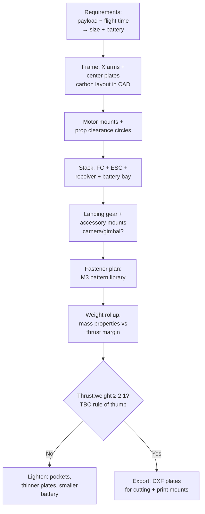

# Presses, Forming Machines & the Drone Build

## For future agent
PL2 closer page. Videos: #11 10-ton H-frame press #335 · #16 press brake · #6 sheet rolling #377 · #30 manual sheet cutting #394 · #33 screw turbine · #29 pump gearbox (cross-ref) · #15 drone #309 (flagship). Per-video specifics TBC vs bulk transcripts. Force-frame thinking + sheet-metal rematch + the drone frame that connects to the user's builds.

> **Why end PL2 here:** presses teach force (frames that must not bend), forming machines teach sheet metal in motion, and the drone build cashes out everything — frames, mounts, fasteners, weight discipline — into a flying machine. This page closes the machine track.

---

## 1. H-frame hydraulic press (#335): force made visible

```
CROWN (cylinder mount) + TWO COLUMNS + BED (adjustable height via pins) = H
   hydraulic CYLINDER pushes RAM down onto work on the BED
   return by spring/cylinder-retract; PRESSURE GAUGE + PUMP + VALVE + HOSES
```

- **10-ton frame math (awareness):** columns in tension, crown/bed in bending — size members for stiffness (deflection ruins work) not just strength. CAD lesson: ,model the load path first (cylinder → ram → work → bed → columns → crown → back to cylinder), then flesh out.
- **Bed adjustment:** pin-holed columns + movable bed (patterned holes — the pattern feature earning its keep).
- **Cylinder:** bought-out hydraulic cylinder modeled as envelope (barrel OD, stroke, ports) — same bought-out discipline as bearings/motors.
- Safety (awareness): pressure relief, guarded pinch zones, slow-approach control — model guards closed; note relief valve presence.

## 2. Press brake (#16) + sheet rolling (#377) + sheet cutting (#394): forming trio

- **Press brake:** C-frames + punch + V-die + backgauge fingers — long-machine precision (bed straightness matters); tooling (punches/dies) as swappable library parts; tonnage awareness.
- **Sheet rolling machine (#377):** 3-roll pyramid (two fixed + one adjustable roll) — roll gap adjustment screws, frame side plates, drive to rolls. The forming lesson: curvature from pressure position, springback compensation (awareness).
- **Manual sheet cutting (#394):** lever shear — pivot, blade gap adjustment, hold-down, table + fences. Linkage + blade-clearance thinking (cut quality lives in blade gap — TBC values = shop data).

## 3. Screw turbine (#33) + pump gearbox (#29): rotating iron

- **Screw turbine:** helical screw rotor in a trough — big slow rotation from water flow (or reverse as pump/auger). Rotor = helical flights (swept/helix geometry!) on a central tube + trough + bearings + drive. The helix-modeling rep connects straight back to helical gears and coils.
- **Pump gearbox:** motor-to-pump speed matching with coupling guards + alignment registers — the "boring but billable" interface work real clients pay for.

## 4. Drone design (#309): the flagship application

The build that ties the module to real flying hardware:



- **Weight discipline:** every gram modeled (mass properties = truth); thrust-to-weight ≈ 2:1 minimum for agile flight (TBC: confirm with flight references — treat as starting rule, not gospel).
- **Vibration awareness:** soft-mount the flight controller (vibration kills IMU performance); stiff arms (carbon plates, not spindly 3D prints — TBC per build size).
- **Crash thinking:** arms as sacrificial/replaceable parts; prop guards for indoor (TBC per use); battery ejection-safe mounting.
- Connects to: [[../cad-design-interview-prep]] (existing drone-team round prep) and the [[solidworks-project-ideas]] quadcopter brief.

## 5. Failure clinic

| Symptom | Cause → Fix |
|---|---|
| Press frame looks spindly for 10 tons | Members sized by eye → check load path; upsize columns/bed depth (stiffness scales fast with depth) |
| Rolls/blades misaligned in assembly | No adjustment modeled → gap/position screws + slots at every working interface |
| Drone overweight in mass rollup | Late weight check → weigh (mass props) after EVERY major part, not at the end |
| Turbine flights intersect trough | Helix clearance ignored → radial clearance around full rotation (rotate-check by hand) |

**Verify in-app:** model the H-frame press skeleton (crown + columns + bed + cylinder envelope) with a layout sketch driving all positions; then start the drone frame (center plates + 4 arms + motor hole patterns) with a live mass-properties window open. Two skeletons, two disciplines: force vs weight.

**Next:** capstone — [[flowcharts-master]] → [[solidworks-cheatsheet]] → [[solidworks-project-ideas]].

## CROSS-REFERENCES
- [[INDEX]] · [[conveyors-material-handling]] · [[gearbox-fundamentals]] · [[solidworks-project-ideas]] · [[../cad-design-interview-prep]]
