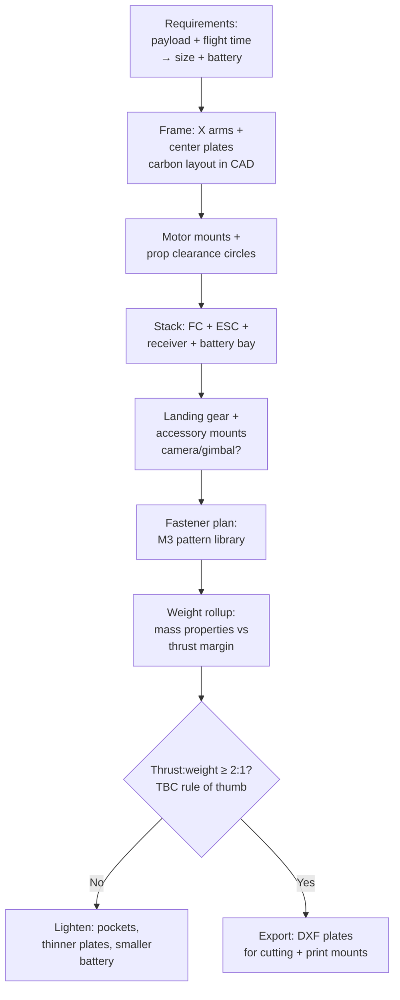

# Presses, Forming Machines & the Drone Build

## For future agent
PL2 closer page. Videos: #11 10-ton H-frame press #335 · #16 press brake · #6 sheet rolling #377 · #30 manual sheet cutting #394 · #33 screw turbine · #29 pump gearbox (cross-ref) · #15 drone #309 (flagship). Per-video specifics TBC vs bulk transcripts. Force-frame thinking + sheet-metal rematch + the drone frame that connects to the user's builds.

> **Why end PL2 here:** presses teach force (frames that must not bend), forming machines teach sheet metal in motion, and the drone build cashes out everything — frames, mounts, fasteners, weight discipline — into a flying machine. This page closes the machine track.

---

## 1. H-frame hydraulic press (#335): force made visible

```
CROWN (cylinder mount) + TWO COLUMNS + BED (adjustable height via pins) = H
   hydraulic CYLINDER pushes RAM down onto work on the BED
   return by spring/cylinder-retract; PRESSURE GAUGE + PUMP + VALVE + HOSES
```

- **10-ton frame math (awareness):** columns in tension, crown/bed in bending — size members for stiffness (deflection ruins work) not just strength. CAD lesson: ,model the load path first (cylinder → ram → work → bed → columns → crown → back to cylinder), then flesh out.
- **Bed adjustment:** pin-holed columns + movable bed (patterned holes — the pattern feature earning its keep).
- **Cylinder:** bought-out hydraulic cylinder modeled as envelope (barrel OD, stroke, ports) — same bought-out discipline as bearings/motors.
- Safety (awareness): pressure relief, guarded pinch zones, slow-approach control — model guards closed; note relief valve presence.

## 2. Press brake (#16) + sheet rolling (#377) + sheet cutting (#394): forming trio

- **Press brake:** C-frames + punch + V-die + backgauge fingers — long-machine precision (bed straightness matters); tooling (punches/dies) as swappable library parts; tonnage awareness.
- **Sheet rolling machine (#377):** 3-roll pyramid (two fixed + one adjustable roll) — roll gap adjustment screws, frame side plates, drive to rolls. The forming lesson: curvature from pressure position, springback compensation (awareness).
- **Manual sheet cutting (#394):** lever shear — pivot, blade gap adjustment, hold-down, table + fences. Linkage + blade-clearance thinking (cut quality lives in blade gap — TBC values = shop data).

## 3. Screw turbine (#33) + pump gearbox (#29): rotating iron

- **Screw turbine:** helical screw rotor in a trough — big slow rotation from water flow (or reverse as pump/auger). Rotor = helical flights (swept/helix geometry!) on a central tube + trough + bearings + drive. The helix-modeling rep connects straight back to helical gears and coils.
- **Pump gearbox:** motor-to-pump speed matching with coupling guards + alignment registers — the "boring but billable" interface work real clients pay for.

## 4. Drone design (#309): the flagship application

The build that ties the module to real flying hardware:



- **Weight discipline:** every gram modeled (mass properties = truth); thrust-to-weight ≈ 2:1 minimum for agile flight (TBC: confirm with flight references — treat as starting rule, not gospel).
- **Vibration awareness:** soft-mount the flight controller (vibration kills IMU performance); stiff arms (carbon plates, not spindly 3D prints — TBC per build size).
- **Crash thinking:** arms as sacrificial/replaceable parts; prop guards for indoor (TBC per use); battery ejection-safe mounting.
- Connects to: [[../cad-design-interview-prep]] (existing drone-team round prep) and the [[solidworks-project-ideas]] quadcopter brief.

## 5. Failure clinic

| Symptom | Cause → Fix |
|---|---|
| Press frame looks spindly for 10 tons | Members sized by eye → check load path; upsize columns/bed depth (stiffness scales fast with depth) |
| Rolls/blades misaligned in assembly | No adjustment modeled → gap/position screws + slots at every working interface |
| Drone overweight in mass rollup | Late weight check → weigh (mass props) after EVERY major part, not at the end |
| Turbine flights intersect trough | Helix clearance ignored → radial clearance around full rotation (rotate-check by hand) |

---

## 6. Worked example: drone frame numbers + H-frame member logic

**Drone frame (5-inch-class illustrative — TBC: size to YOUR motors/props per §4):**
1. Prop clearance math: 5-inch props = Ø127 → motor-center distance ≥ 127 + 15 margin = 142 minimum (TBC: confirm margin practice; tight builds clip props in crashes) → arm layout at 90° X, centers on Ø142+ circle → layout sketch FIRST.
2. Center plates: 140×140 bottom + 120×120 top (TBC illustrative), 2 thick carbon envelopes (model as extruded plates with pocketing — pocket pattern 4× lightening cutouts keeping edge rails for stiffness).
3. Arms 4×: ONE arm part (tapered 25→18 wide, TBC illustrative, motor Ø16 hole pattern at tip + wire slot) → circular pattern ×4 in assembly (not 4 modeled arms!).
4. Stack: 30.5×30.5 holes (TBC: confirm current FC/ESC standard) on 25 standoffs (M3×25 + nuts as envelope hardware) → FC + ESC + receiver envelopes → battery bay 75×35 pad + strap slots (TBC per battery).
5. Mass rollup live: frame + hardware + motors + battery vs thrust (4× motor max thrust; target ≥2:1 — TBC per §4). Overweight? Pockets deepen, plates thin 2→1.5 (TBC per stiffness check), battery downsizes — in THAT order (structure last, payload first... actually payload is fixed: lighten STRUCTURE, never silently shrink the battery the flight-time depends on — TBC judgment per mission).

**H-frame member logic (#335-class, 10-ton illustrative — TBC: confirm with press-design references for real builds):**
1. Load path closed loop: cylinder (10 t = ~100 kN — TBC: confirm ton-force conversion) pushes ram → work → bed → columns (tension!) → crown → back to cylinder. Draw this loop before any geometry.
2. Columns: 2× tension members (area for 100 kN at allowable stress with factor of safety ≥3 on yield for press frames — TBC: confirm with machine-design references, NOT this page) → bed/crown: bending members, depth sized for STIFFNESS (deflection at full load in fractions of mm — TBC per duty; stiffness, not strength, sizes press frames).
3. Bed height adjustment: pin holes every 100 (TBC illustrative) through columns + 2 shear pins (double-shear calc — TBC per references) → model pins as envelope hardware with a home (hang them on the frame when unused — the operator's detail).
4. Cylinder envelope: barrel Ø + stroke + ports + clevis mount → pressure line to pump + gauge + relief valve (model the relief — unrelieved hydraulics burst; the safety lesson).
5. SimulationXpress: bed simply-supported at columns, 100 kN center load → deflection read FIRST (stiffness gate), stress second. Redesign loop: deepen bed section (stiffness ∝ depth³ — the cubic that makes depth the cheapest fix).

**Screw-turbine appendix (#33 numbers-first):** tube Ø150 × 1200 (TBC illustrative) + helical flights (pitch 150, thickness 4 — swept along helix) + trough (half-pipe + 10 radial clearance — rotate-check!) + end bearings + drive coupling. Flights nibble the clearance budget everywhere — the rotate-by-hand check is the whole QA.

**Verify in-app:** model the H-frame skeleton with a layout sketch driving all positions; then start the drone frame with a live mass-properties window open. Two skeletons, two disciplines: force vs weight.

**Next:** capstone — [[flowcharts-master]] → [[solidworks-cheatsheet]] → [[solidworks-project-ideas]].

## CROSS-REFERENCES
- [[INDEX]] · [[conveyors-material-handling]] · [[gearbox-fundamentals]] · [[solidworks-project-ideas]] · [[../cad-design-interview-prep]]
