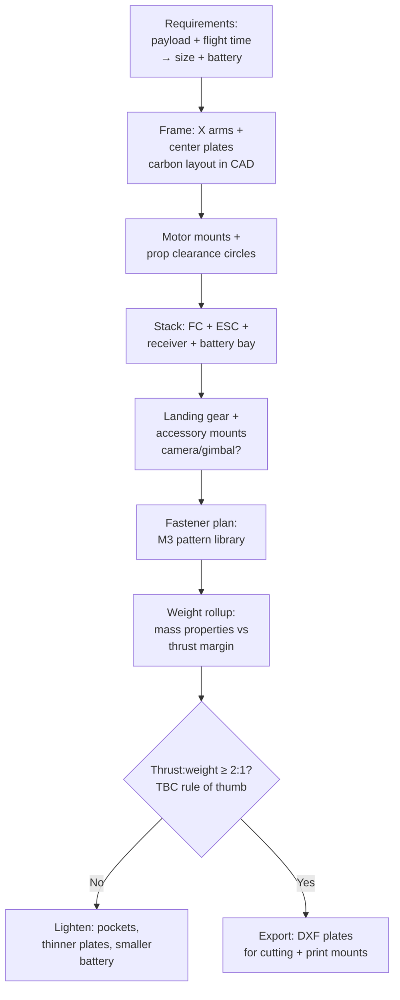

# Presses, Forming Machines & the Drone Build

## For future agent
PL2 closer page. Videos: #11 10-ton H-frame press #335 · #16 press brake · #6 sheet rolling #377 · #30 manual sheet cutting #394 · #33 screw turbine · #29 pump gearbox (cross-ref) · #15 drone #309 (flagship). Per-video specifics TBC vs bulk transcripts. Force-frame thinking + sheet-metal rematch + the drone frame that connects to the user's builds.

> **Why end PL2 here:** presses teach force (frames that must not bend), forming machines teach sheet metal in motion, and the drone build cashes out everything — frames, mounts, fasteners, weight discipline — into a flying machine. This page closes the machine track.

---

## 1. H-frame hydraulic press (#335): force made visible

```
CROWN (cylinder mount) + TWO COLUMNS + BED (adjustable height via pins) = H
   hydraulic CYLINDER pushes RAM down onto work on the BED
   return by spring/cylinder-retract; PRESSURE GAUGE + PUMP + VALVE + HOSES
```

- **10-ton frame math (awareness):** columns in tension, crown/bed in bending — size members for stiffness (deflection ruins work) not just strength. CAD lesson: ,model the load path first (cylinder → ram → work → bed → columns → crown → back to cylinder), then flesh out.
- **Bed adjustment:** pin-holed columns + movable bed (patterned holes — the pattern feature earning its keep).
- **Cylinder:** bought-out hydraulic cylinder modeled as envelope (barrel OD, stroke, ports) — same bought-out discipline as bearings/motors.
- Safety (awareness): pressure relief, guarded pinch zones, slow-approach control — model guards closed; note relief valve presence.

## 2. Press brake (#16) + sheet rolling (#377) + sheet cutting (#394): forming trio

- **Press brake:** C-frames + punch + V-die + backgauge fingers — long-machine precision (bed straightness matters); tooling (punches/dies) as swappable library parts; tonnage awareness.
- **Sheet rolling machine (#377):** 3-roll pyramid (two fixed + one adjustable roll) — roll gap adjustment screws, frame side plates, drive to rolls. The forming lesson: curvature from pressure position, springback compensation (awareness).
- **Manual sheet cutting (#394):** lever shear — pivot, blade gap adjustment, hold-down, table + fences. Linkage + blade-clearance thinking (cut quality lives in blade gap — TBC values = shop data).

## 3. Screw turbine (#33) + pump gearbox (#29): rotating iron

- **Screw turbine:** helical screw rotor in a trough — big slow rotation from water flow (or reverse as pump/auger). Rotor = helical flights (swept/helix geometry!) on a central tube + trough + bearings + drive. The helix-modeling rep connects straight back to helical gears and coils.
- **Pump gearbox:** motor-to-pump speed matching with coupling guards + alignment registers — the "boring but billable" interface work real clients pay for.

## 4. Drone design (#309): the flagship application

The build that ties the module to real flying hardware:



- **Weight discipline:** every gram modeled (mass properties = truth); thrust-to-weight ≈ 2:1 minimum for agile flight (TBC: confirm with flight references — treat as starting rule, not gospel).
- **Vibration awareness:** soft-mount the flight controller (vibration kills IMU performance); stiff arms (carbon plates, not spindly 3D prints — TBC per build size).
- **Crash thinking:** arms as sacrificial/replaceable parts; prop guards for indoor (TBC per use); battery ejection-safe mounting.
- Connects to: [[../cad-design-interview-prep]] (existing drone-team round prep) and the [[solidworks-project-ideas]] quadcopter brief.

## 5. Failure clinic

| Symptom | Cause → Fix |
|---|---|
| Press frame looks spindly for 10 tons | Members sized by eye → check load path; upsize columns/bed depth (stiffness scales fast with depth) |
| Rolls/blades misaligned in assembly | No adjustment modeled → gap/position screws + slots at every working interface |
| Drone overweight in mass rollup | Late weight check → weigh (mass props) after EVERY major part, not at the end |
| Turbine flights intersect trough | Helix clearance ignored → radial clearance around full rotation (rotate-check by hand) |

---

## 6. Worked example: drone frame numbers + H-frame member logic

**Drone frame (5-inch-class illustrative — TBC: size to YOUR motors/props per §4):**
1. Prop clearance math: 5-inch props = Ø127 → motor-center distance ≥ 127 + 15 margin = 142 minimum (TBC: confirm margin practice; tight builds clip props in crashes) → arm layout at 90° X, centers on Ø142+ circle → layout sketch FIRST.
2. Center plates: 140×140 bottom + 120×120 top (TBC illustrative), 2 thick carbon envelopes (model as extruded plates with pocketing — pocket pattern 4× lightening cutouts keeping edge rails for stiffness).
3. Arms 4×: ONE arm part (tapered 25→18 wide, TBC illustrative, motor Ø16 hole pattern at tip + wire slot) → circular pattern ×4 in assembly (not 4 modeled arms!).
4. Stack: 30.5×30.5 holes (TBC: confirm current FC/ESC standard) on 25 standoffs (M3×25 + nuts as envelope hardware) → FC + ESC + receiver envelopes → battery bay 75×35 pad + strap slots (TBC per battery).
5. Mass rollup live: frame + hardware + motors + battery vs thrust (4× motor max thrust; target ≥2:1 — TBC per §4). Overweight? Pockets deepen, plates thin 2→1.5 (TBC per stiffness check), battery downsizes — in THAT order (structure last, payload first... actually payload is fixed: lighten STRUCTURE, never silently shrink the battery the flight-time depends on — TBC judgment per mission).

**H-frame member logic (#335-class, 10-ton illustrative — TBC: confirm with press-design references for real builds):**
1. Load path closed loop: cylinder (10 t = ~100 kN — TBC: confirm ton-force conversion) pushes ram → work → bed → columns (tension!) → crown → back to cylinder. Draw this loop before any geometry.
2. Columns: 2× tension members (area for 100 kN at allowable stress with factor of safety ≥3 on yield for press frames — TBC: confirm with machine-design references, NOT this page) → bed/crown: bending members, depth sized for STIFFNESS (deflection at full load in fractions of mm — TBC per duty; stiffness, not strength, sizes press frames).
3. Bed height adjustment: pin holes every 100 (TBC illustrative) through columns + 2 shear pins (double-shear calc — TBC per references) → model pins as envelope hardware with a home (hang them on the frame when unused — the operator's detail).
4. Cylinder envelope: barrel Ø + stroke + ports + clevis mount → pressure line to pump + gauge + relief valve (model the relief — unrelieved hydraulics burst; the safety lesson).
5. SimulationXpress: bed simply-supported at columns, 100 kN center load → deflection read FIRST (stiffness gate), stress second. Redesign loop: deepen bed section (stiffness ∝ depth³ — the cubic that makes depth the cheapest fix).

**Screw-turbine appendix (#33 numbers-first):** tube Ø150 × 1200 (TBC illustrative) + helical flights (pitch 150, thickness 4 — swept along helix) + trough (half-pipe + 10 radial clearance — rotate-check!) + end bearings + drive coupling. Flights nibble the clearance budget everywhere — the rotate-by-hand check is the whole QA.

**Verify in-app:** model the H-frame skeleton with a layout sketch driving all positions; then start the drone frame with a live mass-properties window open. Two skeletons, two disciplines: force vs weight.

**Next:** capstone — [[flowcharts-master]] → [[solidworks-cheatsheet]] → [[solidworks-project-ideas]].

---

## 13. Automation + press-line appendix (presses that run themselves — TBC per press-automation references)

**Feed systems (stock in, parts out — TBC per coil/blank practice):** coil reels + straighteners (coil set removal — TBC per material!) → servo-roll feeds (pitch accuracy per part tolerance — TBC per feed spec!) → blank destackers (magnetic vs vacuum separation — TBC per blank type!) → scrap conveyors OUT (skeleton + slugs + trim — TBC per §9-conveyor thinking at press side!) → CAD consequence: feed-line ENVELOPES in the press layout (coil width + loop pits + straightener footprints — the press is one station in a LINE, model the line!).

**Transfer + progressive destiny (multi-hit automation — TBC depth):** transfer rails + fingers (part motion between stations synchronized to stroke — TBC per timing!) → progressive strip layout (pitch + carrier design — TBC per die practice!) → press SPEED vs feed capability (strokes-per-minute gated by the SLOWEST element — TBC per line balancing!) → CAD consequence: TIMING diagram awareness (crank angle vs feed vs transfer — TBC per controls; automation designed on paper first, modeled second, debugged NEVER (it works because the paper was right)!).

**Lights-out considerations (unattended running — TBC per lights-out practice):** slug/batch monitoring (vision + tonnage signatures detect doubles/slugs — TBC per sensing!) → tool protection (in-die sensors stopping on misfeed — TBC per die protection!) → remote alerting + auto-shutdown ladders (TBC per controls!) → CAD consequence: SENSOR mounts + sight windows modeled (the §9-controls lesson: automation hardware needs DESIGNED space, and sight needs sightlines!).

---

## 12. Additive + hybrid appendix (printing presses tools and parts — TBC per AM references)

**Printed tooling (plastic + composite tooling for short runs — TBC: confirm with tooling references, NOT this page):** forming dies in filled nylon/CF (hundreds of hits, not hundred-thousands — TBC per life data!) → thermoform molds (printed + sealed + cooled? — TBC per process!) → jig/fixture prints (overnight workholding per §11-CNC appendix — printed soft jaws + nests!) → CAD consequence: tooling designed FOR printing (no undercuts the printer can't resolve, TBC per resolution; draft STILL matters for molding off printed tools!) + shrinkage-per-process (resin vs FDM vs SLS scale factors differ — TBC per machine/material!).

**Printed press parts (end-use components — TBC per AM-for-production references):** wear plates in hardened tool steel via bound-metal DED (TBC depth: the process menu is wide — confirm per vendor!) → topology-optimized brackets (stiffness-per-gram past machining — TBC per analysis; the §8-H-frame stiffness lesson with freeform answers!) → conformal-cooling inserts for mold-adjacent work (TBC depth) → CAD consequence: DfAM rules replace DfM rules (overhangs vs draft, anisotropy vs isotropy — TBC per process; the §8-printing appendix generalized from prototyping to production!).

**Hybrid routes (print + machine finishing — the practical middle — TBC per shop practice):** near-net print + machined datums (print fast, machine what matters — TBC per tolerance economics!) → printed patterns for casting (lost-PLA + sand per §6-Hook? No — per FOUNDRY practice, TBC: confirm with casting references, NOT this page!) → CAD consequence: machining ALLOWANCES modeled on print files (stock-on faces per §11-CNC appendix — the allowance habit across processes!).

---

## 11. CNC + shop-floor appendix (from CAD to chips)

**Machinability by design (the model IS the quote — TBC: confirm with machining references, NOT this page):** tool access (every pocket needs a cutter path IN — deep narrow pockets need long tools that chatter; TBC per length/diameter rules!) → standard tool sizes (design fillets/pockets to catalog endmill diameters — TBC per tooling; odd radii need custom ground tools = money + weeks!) → setup count (faces machined per setup — fewer setups = cheaper + more accurate; TBC per quoting: the setup IS the cost!) → tolerance vs process (general ±0.1 milled freely; ±0.01 needs grinding/finishing passes — TBC per capability; tolerance tighter than function = paying for nothing!).

**Fixture thinking (holding work beats cutting work — TBC: confirm with fixturing references):** vise + parallels (first-op standard — TBC per shop) → soft jaws (conforming grip for finished faces — TBC per practice; model the JAW geometry for repeat jobs!) → vacuum/magnetic (thin flat parts that vise would crush — TBC per workholding!) → CAD consequence: fixture features ON the part (tabs for holding, ground LATER off — TBC per process planning; sacrificial stock is designed, not accidental!).

**Drawing-to-shop handoff (the package that gets quoted — TBC per shop practice):** STEP + PDF drawing + material + qty + finish + tolerance intent stated UP FRONT (incomplete RFQs get padded quotes — vagueness taxes you!) → critical-feature flagging (which 3 dims actually matter? — TBC: mark them, shops focus effort where flagged!) → revision control (REV + date on EVERY send — the §10-revision habit at the money interface!) → the feedback loop (ask what drove cost on YOUR quote — machinists teach DFM free with every quote breakdown; TBC per experience — request it explicitly!).

---

## 10. Press safety + two-hand control appendix (force demands respect)

**Hazard inventory (10 tons ignores fingers — TBC: confirm with press-safety standards like OSHA/EN 693, NOT this page):** closing pinch (ram vs bed — the primary killer: guarded, light-curtained, or two-hand-controlled — pick PER the risk assessment, never by convenience!) → stored energy (hydraulic accumulators + gravity-held rams drift DOWN on seal failure — TBC: counterbalance/brake valves modeled in circuit + mechanical prop for die work! — TBC per practice) → ejected parts/tools (flying blanks + broken tooling — TBC per guarding: polycarbonate screens rated, not hopeful!) → noise + oil injection (pinhole leaks cut SKIN at pressure — TBC: confirm with hydraulics-safety references; cardboard-test for leaks, NEVER hands!).

**Safeguarding selection (awareness — the hierarchy, TBC: confirm with safety standards):** fixed guards (simplest, always-closed — the §6-guard-closed rule restated) → interlocked gates (access WITH auto-stop — TBC per interlock category) → light curtains + laser scanners (presence-sensing — TBC per application) → two-hand control (simultaneous press, anti-tie-down + anti-repeat — TBC per control reliability!) → pullbacks/hold-outs (TBC depth) → the CAD consequence: EVERY safeguarding device needs mounts + cable routes + adjustment (retrofits on presses never align — design the WHOLE safety system in the assembly, not the machine alone!).

**Die-setting procedure (the most dangerous 10 minutes — TBC: confirm with shop practice, NOT this page):** ram LOCKED + de-energized (mechanical prop IN — gravity is patient!) → dies staged on the cart (die-cart envelope in the layout! — TBC per lean practice) → alignment checked at LOW pressure first (kiss, inspect, then full tonnage — TBC per practice) → CAD consequence: prop-storage clips ON the frame (props left on the floor migrate away exactly when needed!) + pressure-gauge visibility from the setup position (operator sees what the machine feels!).

---

## 9. Hydraulics + tooling appendix (force plumbing and press tooling)

**Hydraulic circuit literacy (awareness — TBC: confirm with hydraulics references, NOT this page):** pump (fixed vs pressure-compensated — TBC per duty) → relief valve (THE safety device — set below weakest-component rating; TBC per design; model it + tag it, never omit) → directional valve (advance/retract/hold — TBC per circuit) → flow control (approach-fast + press-slow two-speed circuits — TBC per cycle-time needs) → cylinder sizing (bore for force, rod for return + buckling! — long thin rods buckle in compression; TBC: confirm with column references) → filtration + tank hygiene (dirty oil kills pumps/valves — TBC per maintenance; breather + return filtration modeled as hardware!) → hoses vs hardline (flex where motion, steel where static — TBC per routing; burst sleeves on pressure lines near operators — TBC per safety).

**Press tooling (dies + fixtures — the shape-givers):** blanking/forming dies as matched sets (punch + die + stripper + guides — TBC per tooling practice; clearance per material/thickness — TBC per die references) → die shoe + shank mounting to ram/bed (TBC per press standard) → stripper action (spring vs positive — TBC per stock thickness) → progression for multi-hit work (TBC depth: progressive dies are their own profession) → CAD consequence: tooling modeled as SEPARATE assemblies with their own BOMs (tools wear + get reordered independently of the press! — the lifecycle thinking from §8-wear generalized).

**Bed tooling + fixturing (holding work right):** T-slot/V-block/angle-plate standards (TBC per shop) → dedicated fixtures for repeat jobs (locate + clamp + clear the tool path — the 3-2-1 locating principle, awareness — TBC: confirm with fixturing references, NOT this page) → quick-change (die carts, pre-staged tooling — TBC per lean practice; changeover time dominates small-batch economics!) → CAD consequence: fixture envelopes in the press assembly (collision-check the stroke against EVERYTHING — the §5-rotate-check generalized to linear axes).

---

## 8. Press-brake tooling + rolling-machine mechanics appendix (forming depth)

**Press-brake tooling library (the toolroom within the machine):** punch profiles (gooseneck for deep boxes, straight for open bends, hemming dies for closed edges — TBC per tooling catalogs; model punches/dies as a TOOL LIBRARY, not per-job geometry!) → V-die openings (V ≈ 6–8× thickness starting rule — TBC: confirm with press-brake references; narrow V = more tonnage + tighter radius, wide V = gentler) → tonnage math per bend (TBC: confirm with air-bending force charts, NOT this page — awareness that length × thickness × V-width sizes the machine) → backgauge fingers (positioning automation — model finger envelopes + travel range, TBC per control) → crowning (bed deflection compensation for long parts — TBC depth; long thin parts bend the MACHINE, and the machine pushes back).

**Rolling mechanics (3-roll pyramid from §2, expanded):** pinch + pre-bend (leading/trailing flats stay FLAT without pre-bending — TBC: confirm with rolling references; flat ends are the signature defect of skipped pre-bend!) → roll crown for wide sheets (TBC depth) → cone rolling (tilted top roll — TBC per machine capability; asymmetric setups need the manual + practice, NOT this page) → springback allowance (over-roll past target, material relaxes back — TBC per material/thickness; stainless springs more than mild steel — TBC) → weld-seam placement (seam AWAY from max-stress zones + accessible for welding — TBC per fabrication practice).

**Shear/blanking appendix (#394-class expanded):** blade gap ≈ 5–10% of thickness per side (TBC: confirm with shearing references; tight gap = clean edge + high force, loose gap = burr + rollover) → rake angle (guillotine tilt reduces force — TBC per machine) → hold-down pressure (sheet must NOT lift — TBC per tonnage) → burr-side awareness (cut edge has a ROLL side + BURR side — orient burrs away from handling surfaces and mating faces; TBC per finishing practice) → CAD consequence: sheared edges modeled STRAIGHT (no edge breaks in CAD that the shear doesn't make — TBC taste; deburr notes live on the drawing).

---

## 7. Drone deep dive: full build script + weight budget + preflight (the flagship mastery)

**Weight budget FIRST (the spreadsheet before the CAD — illustrative 5-inch class, TBC per YOUR parts):**

| Item | Qty | Unit mass (illustrative) | Subtotal |
|---|---|---|---|
| Frame plates + arms (carbon) | 1 set | 120 g | 120 |
| Motors (2207-class) | 4 | 32 g | 128 |
| Props (5-inch pairs) | 2 pairs | 8 g | 16 |
| ESC 4-in-1 + FC stack | 1 | 25 g | 25 |
| Receiver + buzzer + misc | — | 15 g | 15 |
| Battery 4S 1300 | 1 | 170 g | 170 |
| Camera + VTX + antenna | 1 set | 30 g | 30 |
| Hardware (M3 set) | 1 set | 20 g | 20 |
| **AUW estimate** | | | **~524 g** |
| Thrust needed (2:1 → 4× max) | | | ~1050 g total / ~260 g per motor |

Rule: AUW from the budget must sit ≤ half the 4-motor max thrust (the 2:1 rule from §4) BEFORE modeling — if the budget fails, change PARTS (lighter battery? smaller motors?) not CAD. CAD can't fix a bad budget.

**Full build script (plates → flying machine):**
1. Layout sketch (top view): arm axes at 90° X, motor centers on the clearance circle from §6 (≥ prop Ø + margin) → stack-hole pattern (30.5×30.5 — TBC per YOUR FC/ESC) → battery bay rectangle + strap slots → camera-plate front width.
2. Bottom plate: extrude 2 (TBC per stiffness — confirm with §6 SimulationXpress: pocket first, thin second) + pocket pattern (4× cutouts keeping edge rails + arm-root doublers — roots carry crash loads, never pocket them thin) + arm-mount holes + battery-pad recess.
3. Arms ×1 modeled → ×4 patterned in assembly: tapered plate + tip motor pattern (16×16/19×19 M3 per motor — TBC per YOUR motors) + wire slot (ESC wires route INSIDE arm slots, not zip-tied outside — crash + prop-strike protection) + root doubler overlap onto bottom plate (sandwich joint: plate-arm-plate, TBC per construction).
4. Top plate: extruded + camera-cage side plates (front opening sized to camera + tilt range — TBC per camera; FPV tilt 20–35° typical, confirm per flying style) + buzzer/LED mounts + antenna tube mount (TBC per VTX).
5. Stack: standoffs M3×25 (TBC per stack height!) + FC + 4-in-1 ESC + receiver envelopes + capacitor (low-ESR across battery pads — TBC: confirm with build references; the cap saves ESCs from voltage spikes) → wiring envelopes (battery leads with XT60 + routing path clear of props!).
6. Landing gear: wire/skid envelopes + mounts positioned for stable sit (CG inside the gear triangle with battery aboard — CHECK with mass properties + CG marker, not eyeballing) + prop-to-ground clearance at full tilt (TBC: confirm per terrain).
7. Fastener pass: every hole gets its screw+nut/standoff envelope (no empty holes in the final assembly — empty holes are unfinished design) → thread engagement check (M3 into aluminum ≥ 4.5 mm — TBC: confirm with fastener references).
8. Preflight CAD audit: mass properties (AUW vs budget ±5%?) → CG vs geometric center (offset CG flies crooked — TRIM in firmware covers small offsets, rebuild covers large ones; TBC per flight-controller capability) → prop clearance circles vs arms/battery/leads at full gimbal... full stick deflection (TBC: check max tilt angles per tune) → screw lengths vs stack (long screws short electronics — the classic smoke event; TBC: confirm with build references, measure twice) → BOM + DXF plates + print mounts (TPU parts: motor soft-mounts? battery pad? GoPro mount? — TBC per payload).

**Crash-worthiness appendix (design for the inevitable):** arms as replaceable modules (2 screws each, not 6 — field repair matters) → camera recessed behind cage (lenses die first — TBC per crash data) → battery ejects forward not into stack (strap slots angled — TBC per practice) → antenna in tube, never bare (TBC) → conformal-coat note on drawing for electronics (TBC per climate). Design the crash response, not just the flight.

## CROSS-REFERENCES
- [[INDEX]] · [[conveyors-material-handling]] · [[gearbox-fundamentals]] · [[solidworks-project-ideas]] · [[../cad-design-interview-prep]]
