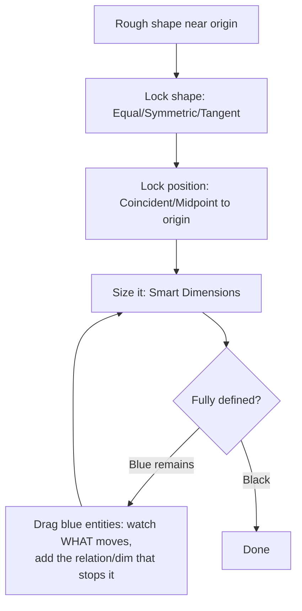

# Sketch Mastery

## For future agent
Foundation page 2. The single highest-leverage skill in the module: every extrude, loft, sweep, and surface in all 25 other pages consumes sketches. Grounded in PL1 primer narration patterns (dimension-first demo style) + standard SolidWorks sketch behavior (long-standing, version-stable). 3D-sketches and sketch-picture sections support surfacing pages.

> **The one rule:** a sketch is done only when every entity is **black (fully defined)**. Blue = floppy = future failure. This discipline separates beginners from employable modelers.

---

## 1. What a sketch is (and the three states)

A sketch = 2D geometry (lines, arcs, circles, splines) + **relations** (geometric rules: horizontal, coincident, tangent…) + **dimensions** (numeric sizes/positions), lying on a plane.

| Color | State | Meaning |
|---|---|---|
| **Blue** | Under-defined | Entities can still move — NOT done |
| **Black** | Fully defined | Position + size locked — the goal |
| **Red/Brown** | Over-defined or dangling | Conflicting dims, or referenced geometry deleted — must repair |

Watch the status bar, not just colors: it reads "Under Defined" / "Fully Defined" explicitly.

---

## 2. Entity toolkit (what to draw with)

| Entity | Used for | Beginner note |
|---|---|---|
| Line, Rectangle, Circle, Arc | 90% of sketches | Slots/center-rectangle variants save relations later |
| Spline | Organic curves (mouse bodies, helmet shells, vase profiles) | Control with dimensions on spline points; more points ≠ better |
| Ellipse, Parabola, Polygon | Special profiles | Polygon + inscribed/circumscribed choice matters for prisms |
| Fillet/Chamfer (sketch) | Corner treatment *in the profile* | Prefer feature fillets later (editable); sketch fillets only when the profile demands it |
| Text | Engraving (PL1 #7: 3D text on sphere) | Needs a curve/face to wrap onto; keep font simple |
| Convert Entities / Intersection | Steal edges from existing geometry | Fast but creates **external references** — child of that face; prefer clean redraw for robust models (TBC per workflow taste) |
| Trim / Extend / Offset / Mirror | Sketch surgery | **Mirror** about centerlines halves your dimensioning work |

---

## 3. Relations (geometry's grammar)

Relations used constantly across both playlists: **Horizontal, Vertical, Coincident, Midpoint, Equal, Parallel, Perpendicular, Tangent, Concentric, Coradial, Symmetric, Fix**. How to think about them:

**The drag test** is the core debugging move: grab a blue entity and drag it. Whatever moves freely tells you exactly which relation or dimension is missing. Repeat until nothing moves.

**Symmetric sketching pattern** (used in nearly every playlist model): draw centerline → sketch half → **Mirror Entities** → dimension one side. Half the work, guaranteed symmetry, survives edits.

---

## 4. Dimensions that survive change

- **Smart Dimension** does everything (length, diameter vs radius toggle, angle). Dimension to **origin/planes** for position, not edge-to-edge chains that accumulate error.
- Fully define with the **minimum** set: over-dimensioning (red) is as bad as under-. If it goes red, delete the last dim and use a relation instead.
- Functional dims first: mounting positions, thicknesses, heights — the values a real engineer would revise.

---

## 5. 3D sketches (surfacing prerequisite)

Some surface work needs curves floating in space (loft guide curves, sweep paths that leave a plane). **3D Sketch** mode: Tab key flips the sketch plane (XY → YZ → ZX); sketch points get x/y/z triads. Rules: keep them simple (lines/splines only), fully define with position dims along all three axes, and prefer **projected/composite curves** (derived from clean 2D sketches) over hand-drawn 3D splines — they update when parents update. Used in helmet/mouse-class builds ([[complex-showcase]], [[consumer-electronics]]).

## 6. Sketch Picture (reverse-engineering on-ramp)

PL1 #100 imports an image to trace (art vase). Workflow: Tools → Sketch Tools → **Sketch Picture** onto a plane → scale it with a known dimension in the image → transparent tracing sketch on top → build features from *your* sketch, then delete/hide the picture. Real-world name: **reverse engineering**. Accuracy is limited by image perspective — front/side orthographic images only; never trust a perspective photo for dimensions (TBC: calibrate with at least two known measurements).

---

## 7. Repair clinic

| Symptom | Fix |
|---|---|
| Dangling (brown) after deleting a feature | Edit sketch → re-attach or delete the dangling relation/dimension |
| Over-defined (red) | Delete the newest conflicting dim; replace with a relation |
| Tiny loop/overlap breaking extrude | **Repair Sketch** (Tools → Sketch Tools) + magnify corners; **Check Sketch for Feature** before exiting |
| Spline misbehaves | Fewer points, dimension the points, add tangency relations at ends |
| Imported/DWG sketch chaos | **Fully Define Sketch** tool (applies relations/dims automatically) then audit the result — never trust it blind |

## 8. Drills (do until boring)

1. Rectangle + circle + slot, fully defined from origin, three different ways (dims vs relations mix).
2. Symmetric bottle-half profile mirrored about a centerline (prepares [[bottles-containers]]).
3. Spline car-door-ish curve with tangent ends, fully defined via spline points (prepares surfacing).
4. Import any simple image via Sketch Picture, scale, trace (prepares [[artistic-organic]]).

---

## 9. Worked example: bottle-half profile, fully defined (follow click-by-click)

The profile you'll reuse in [[bottles-containers]] — right half of a 60 mm-diameter, 150 mm-tall bottle, revolved later. Front Plane, MMGS.

1. **Centerline:** Sketch tab → Centerline → draw vertical through origin, 0 to 150. This is your revolve axis AND mirror axis AND dimension backbone.
2. **Profile polyline (rough, left-to-right from base):** Line tool → start at origin → right 30 (base radius) → up 100 (body) → up-right curve zone (leave rough) → up to 150 at x=12 (neck radius). End with a short horizontal to the centerline at top (closes the profile later).
3. **Relations:** bottom line Horizontal + Coincident to origin; body vertical line Vertical; top neck line Vertical + its top endpoint Coincident to centerline; bottom-right corner Coincident to nothing yet (position comes from dims).
4. **Dimensions:** base radius 30 (origin → bottom-right corner horizontal), body height 100 (vertical dim), neck radius 12, total height 150, neck straight length 20 (vertical dim on the neck segment).
5. **Shoulder spline:** delete the rough diagonal; Spline from body-top point to neck-bottom point → add **Tangent** relations at both ends (select spline end + adjacent line) → dimension one spline control point (e.g., 15 right of centerline at mid-height) to lock curvature. Drag-test: nothing should move.
6. Status bar reads Fully Defined. Close the profile: line from neck-top across to centerline (Coincident both ends) — revolve needs a closed (or axis-touching) profile; this one touches the axis at top and bottom (origin), so it revolves into a closed solid (TBC: open profiles revolving to solids depend on version behavior — closed is always safe).

**What you just practiced:** centerline-as-backbone, relation-before-dimension ordering, tangent spline control, axis-touching revolve profiles. This exact sequence builds every bottle in [[bottles-containers]].

---

## 10. Power tools (learn in this order)

- **Dynamic Mirror** (Sketch tab → Mirror while sketching): sketch one side, the mirror updates LIVE as you draw — symmetric profiles at double speed. Set the centerline first, toggle on, draw half.
- **Fully Define Sketch** (Tools → Fully Define Sketch): auto-applies relations + dimensions to imported/DWG geometry. Always audit after — it over-dimensions curves and picks daft datums. Trust-but-verify tool, not autopilot.
- **Sketch Fillet vs Feature Fillet decision:** profile corners that are *design* (the shape IS rounded there, e.g., bottle shoulder) → sketch fillet or spline; edges that are *manufacturing* (break sharp edge, mold radius) → feature fillet later. Wrong choice = uneditable tree.
- **Convert Entities + Offset Entities:** steal-and-offset in one move for gaskets, walls, and clearance copies (e.g., offset the bottle profile inward 2 mm = wall inner line for thin-feature revolve). Watch the external-reference parentage ([[part-assembly-drawing-workflow#4-in-context-editing-top-down-design]]).
- **SketchXpert (red sketches):** when over-defined, SolidWorks offers solutions — read each option (it tells you WHICH relation/dim conflicts), don't just accept "solve." The diagnosis teaches; the button doesn't.

**Next:** [[part-assembly-drawing-workflow]].

---

## 11. Constraint strategy: the order professionals sketch in

Amateurs draw-then-constrain (rough shape, then fight it into definition). Professionals constrain-while-drawing in a fixed order that minimizes rework:

1. **Origin + centerlines first** (before ANY geometry): the skeleton everything hangs on. Two minutes here saves twenty later.
2. **Shape relations second** (Equal, Symmetric, Tangent, Concentric): lock the DESIGN (a square stays square, holes stay coaxial) before sizes exist.
3. **Position third** (Coincident to origin/planes, Midpoint): lock WHERE it sits.
4. **Size last** (Smart Dimensions, fewest possible): lock HOW BIG. Functional dims only — ask "what would change in a redesign?" and dimension exactly those.

**Why this order:** relations are cheap and stable; dimensions are expensive and brittle. A sketch defined by 12 relations + 3 dims edits gracefully; the same shape with 2 relations + 13 dims fights every change. Count your dims per sketch — trending DOWN over weeks means you're learning (target: simple profiles fully defined with ≤6 dims + relations).

**Construction geometry (the invisible scaffolding):** any entity toggled "For construction" (dashed) constrains without becoming solid — centerlines, symmetry axes, clearance envelopes, bolt-circle guides. Heavy construction geometry + light solid geometry = the professional sketch signature. If your sketches have no dashed lines, you're under-scaffolding.

## CROSS-REFERENCES
- [[INDEX]] · [[solidworks-basics-setup]] · [[part-assembly-drawing-workflow]] · [[surfacing-methodology]] (why sketches decide surface quality)

---

## 14. Sketch performance + audit rituals (speed at scale)

**Sketch weight discipline (complex sketches stay fast):** entity count awareness (100+ entity sketches solve slowly — TBC per hardware; SPLIT at ~50 into staged sketches with derived references — the §4-simple-sketches rule quantified) → construction geometry costs too (hidden doesn't mean free — purge dead construction monthly per §10-hygiene) → spline point economy (§13-fewer-points restated as performance: every point is solver load) → pattern-in-sketch vs pattern-as-feature (pattern the FEATURE — sketch patterns multiply solver load per instance; TBC per version behavior).

**The 60-second sketch audit (run on EVERY sketch before exiting):** all black? (status bar, not vibes) → drag-test survivors? (grab each region once — nothing moves) → dims minimal? (count vs §11-strategy: relations-heavy?) → references stable? (planes/origin, not faces — the §9-ladder check) → intent readable? (would a stranger dimension-edit correctly? — the §4-name-everything habit applied to dims: rename driving dims `MountSpacing`, `WallThk` — TBC per version's dim-naming UX).

**Sketch reuse ladder (never redraw twice):** Copy Entities within sketch (quick duplicates) → Derived Sketch across features/parts (linked copies — change master, all follow; TBC per version) → Blocks for mechanisms/symbols (§12) → Library Features for standard details ([[dressup-productivity]] §9) → the progression: copy (fast, dumb) → derive (linked, smart) → block (movable, mechanism-grade) → library (managed, team-grade). Climb it as reuse frequency justifies — one-off copies stay copies, ten-time details become library assets.

---

## 13. Spline mastery + conic curves (curvature you command)

**Spline anatomy (control points vs poles — TBC exact terminology per version):** through-points the curve PASSES (interpolating — predictable, stable) vs control vertices it BENDS toward (approximating — smoother, looser). Beginners grab whichever default appears; professionals CHOOSE per need (interpolation for must-hit datums like mounting points, approximation for fair styling where smoothness beats precision).

**Handles/tangency vectors (the fairness dials):** each spline end carries magnitude + direction (TBC UI per version — drag handles watch combs LIVE). Long handles = strong directional pull (flat entry, automotive shoulder lines); short handles = weak pull (tight turns, hook throats). Symmetric handles across a centerline = guaranteed fair mirror (set once via relation, not by eye-matching both sides!).

**Conics (rho-value curves — TBC availability per version: look for conic/ellipse-arc tools):** single-span curves with ONE fairness parameter (rho 0–1: parabola-ish → ellipse-ish; TBC: confirm with curve references NOT this page) — automotive styling staple (one conic replaces 5-point splines with guaranteed fairness). Where available, prefer conics over multi-point splines for hero curves: fewer points = fewer wiggles = better zebra with less effort.

**Spline repair sequence (lumpy curve triage):** combs FIRST (locate the spike span) → delete offending point(s) — fewer points first, always → re-add ONLY if the shape can't be held (one point back with tangency locked) → check neighbors didn't shift (splines are global-ish — local edits leak; TBC per spline type) → zebra downstream patches (the diagnostic loop closed: sketch → surface → stripes → sketch).

---

## 12. Sketch blocks + layout sketches (design at the top level)

**Blocks (reusable sketch mechanisms):** belt/chain layouts (pulley circles + tangent lines as a BLOCK — insert per conveyor, resize parametrically — TBC per version's block behavior) → linkage mechanisms (4-bar sketch blocks that actually MOVE in-sketch: drag to verify motion BEFORE modeling links — the §3-gripper habit from [[solidworks-project-ideas]] generalized) → logo/symbol library (one master sketch block, inserted everywhere — change once, update all).

**Layout sketches (the master-control pattern):** ONE top-level sketch in the assembly (or master part) carrying ALL interface dimensions (shaft centers, mounting holes, envelope limits — the gearbox layout from [[helical-spur-gearboxes]] §5, the conveyor layout from [[conveyors-material-handling]] §6, the drone layout from [[presses-forming-drone]] §7 — same pattern thrice because it IS the pattern) → parts derive via Convert/derived sketches (single source of truth — change the layout, all parts follow; TBC: derived-sketch update behavior per version — test the propagation once and trust it thereafter) → layout sketch lock-down (fully define + FOLDER it at the tree top + name it `MASTER-LAYOUT-DO-NOT-DELETE` — future-you protection).

**Envelope sketches (packaging-first modeling):** maximum-allowed volumes sketched FIRST (motor envelopes, battery boxes, hand clearances, swing radii — TBC per project) → parts must fit INSIDE envelopes (interference WITH envelopes = design violation caught in seconds, not at assembly) → envelope configs (max-component vs nominal — tolerance-stack thinking at sketch level, TBC depth). Envelopes turn "oops it doesn't fit" from assembly-day disasters into sketch-day notifications.
