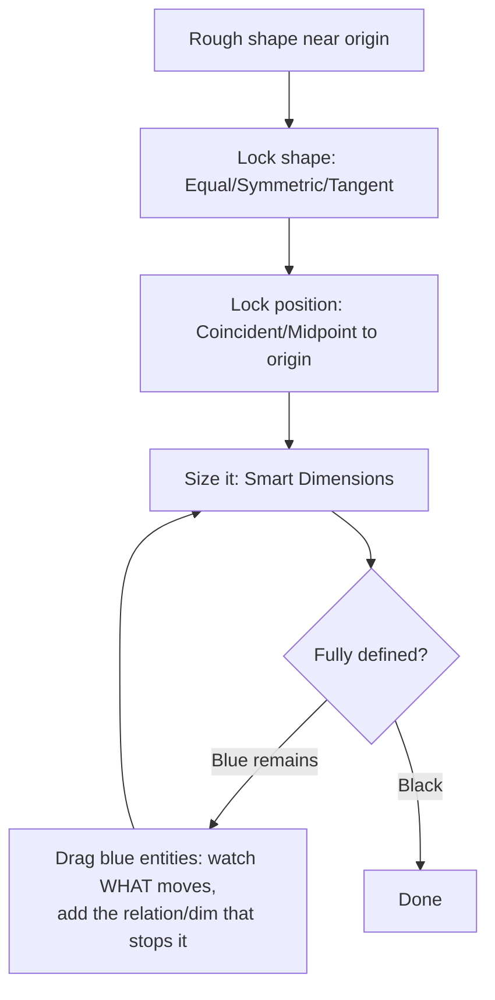

# Sketch Mastery

## For future agent
Foundation page 2. The single highest-leverage skill in the module: every extrude, loft, sweep, and surface in all 25 other pages consumes sketches. Grounded in PL1 primer narration patterns (dimension-first demo style) + standard SolidWorks sketch behavior (long-standing, version-stable). 3D-sketches and sketch-picture sections support surfacing pages.

> **The one rule:** a sketch is done only when every entity is **black (fully defined)**. Blue = floppy = future failure. This discipline separates beginners from employable modelers.

---

## 1. What a sketch is (and the three states)

A sketch = 2D geometry (lines, arcs, circles, splines) + **relations** (geometric rules: horizontal, coincident, tangent…) + **dimensions** (numeric sizes/positions), lying on a plane.

| Color | State | Meaning |
|---|---|---|
| **Blue** | Under-defined | Entities can still move — NOT done |
| **Black** | Fully defined | Position + size locked — the goal |
| **Red/Brown** | Over-defined or dangling | Conflicting dims, or referenced geometry deleted — must repair |

Watch the status bar, not just colors: it reads "Under Defined" / "Fully Defined" explicitly.

---

## 2. Entity toolkit (what to draw with)

| Entity | Used for | Beginner note |
|---|---|---|
| Line, Rectangle, Circle, Arc | 90% of sketches | Slots/center-rectangle variants save relations later |
| Spline | Organic curves (mouse bodies, helmet shells, vase profiles) | Control with dimensions on spline points; more points ≠ better |
| Ellipse, Parabola, Polygon | Special profiles | Polygon + inscribed/circumscribed choice matters for prisms |
| Fillet/Chamfer (sketch) | Corner treatment *in the profile* | Prefer feature fillets later (editable); sketch fillets only when the profile demands it |
| Text | Engraving (PL1 #7: 3D text on sphere) | Needs a curve/face to wrap onto; keep font simple |
| Convert Entities / Intersection | Steal edges from existing geometry | Fast but creates **external references** — child of that face; prefer clean redraw for robust models (TBC per workflow taste) |
| Trim / Extend / Offset / Mirror | Sketch surgery | **Mirror** about centerlines halves your dimensioning work |

---

## 3. Relations (geometry's grammar)

Relations used constantly across both playlists: **Horizontal, Vertical, Coincident, Midpoint, Equal, Parallel, Perpendicular, Tangent, Concentric, Coradial, Symmetric, Fix**. How to think about them:

**The drag test** is the core debugging move: grab a blue entity and drag it. Whatever moves freely tells you exactly which relation or dimension is missing. Repeat until nothing moves.

**Symmetric sketching pattern** (used in nearly every playlist model): draw centerline → sketch half → **Mirror Entities** → dimension one side. Half the work, guaranteed symmetry, survives edits.

---

## 4. Dimensions that survive change

- **Smart Dimension** does everything (length, diameter vs radius toggle, angle). Dimension to **origin/planes** for position, not edge-to-edge chains that accumulate error.
- Fully define with the **minimum** set: over-dimensioning (red) is as bad as under-. If it goes red, delete the last dim and use a relation instead.
- Functional dims first: mounting positions, thicknesses, heights — the values a real engineer would revise.

---

## 5. 3D sketches (surfacing prerequisite)

Some surface work needs curves floating in space (loft guide curves, sweep paths that leave a plane). **3D Sketch** mode: Tab key flips the sketch plane (XY → YZ → ZX); sketch points get x/y/z triads. Rules: keep them simple (lines/splines only), fully define with position dims along all three axes, and prefer **projected/composite curves** (derived from clean 2D sketches) over hand-drawn 3D splines — they update when parents update. Used in helmet/mouse-class builds ([[complex-showcase]], [[consumer-electronics]]).

## 6. Sketch Picture (reverse-engineering on-ramp)

PL1 #100 imports an image to trace (art vase). Workflow: Tools → Sketch Tools → **Sketch Picture** onto a plane → scale it with a known dimension in the image → transparent tracing sketch on top → build features from *your* sketch, then delete/hide the picture. Real-world name: **reverse engineering**. Accuracy is limited by image perspective — front/side orthographic images only; never trust a perspective photo for dimensions (TBC: calibrate with at least two known measurements).

---

## 7. Repair clinic

| Symptom | Fix |
|---|---|
| Dangling (brown) after deleting a feature | Edit sketch → re-attach or delete the dangling relation/dimension |
| Over-defined (red) | Delete the newest conflicting dim; replace with a relation |
| Tiny loop/overlap breaking extrude | **Repair Sketch** (Tools → Sketch Tools) + magnify corners; **Check Sketch for Feature** before exiting |
| Spline misbehaves | Fewer points, dimension the points, add tangency relations at ends |
| Imported/DWG sketch chaos | **Fully Define Sketch** tool (applies relations/dims automatically) then audit the result — never trust it blind |

## 8. Drills (do until boring)

1. Rectangle + circle + slot, fully defined from origin, three different ways (dims vs relations mix).
2. Symmetric bottle-half profile mirrored about a centerline (prepares [[bottles-containers]]).
3. Spline car-door-ish curve with tangent ends, fully defined via spline points (prepares surfacing).
4. Import any simple image via Sketch Picture, scale, trace (prepares [[artistic-organic]]).

**Next:** [[part-assembly-drawing-workflow]].

## CROSS-REFERENCES
- [[INDEX]] · [[solidworks-basics-setup]] · [[part-assembly-drawing-workflow]] · [[surfacing-methodology]] (why sketches decide surface quality)
