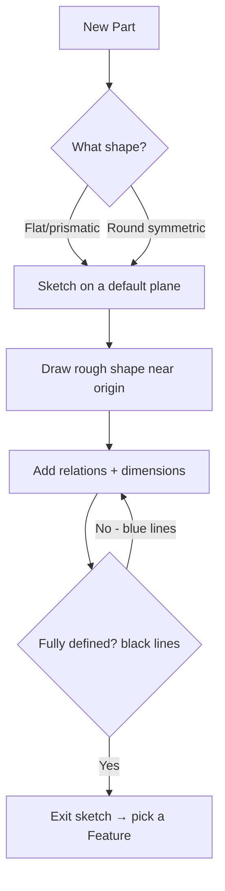
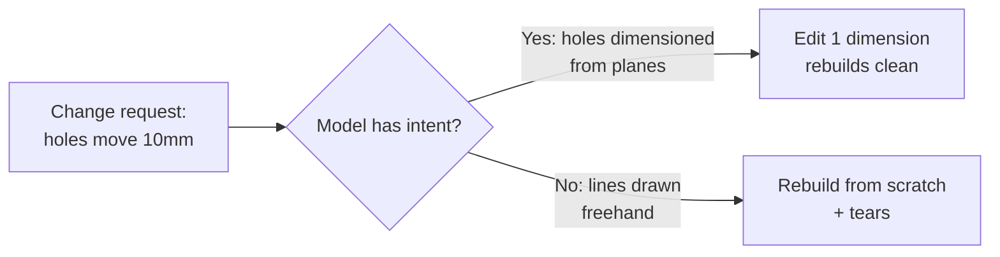

# SolidWorks Basics & Setup

## For future agent
Page 1 of the foundation track. Covers interface literacy + design intent for an absolute beginner, grounded in PL1 primer transcripts (#4 standard views, #9/#30 surface basics intros). Menu paths are 2021–2026-era UI; if a tab moved, press `S` and search. No prior CAD assumed.

> **Why this page exists:** every confusing moment in later pages traces back to one of five things — planes, sketches, relations, the FeatureManager tree, or design intent. Learn them once, properly, and the other 25 pages are just combinations.

---

## 1. What SolidWorks actually is (30-second version)

SolidWorks is **parametric solid modeling software**: you describe a part as a history of operations (extrude this sketch 60 mm, cut that hole, round these edges), and the software keeps that history editable. Change the 60 to 80 and the whole part rebuilds.

Three facts that shape everything:

1. **History-based** — the FeatureManager tree (left panel) is a recipe, listed top-to-bottom in creation order. You can go back, edit step 2, and steps 3–10 update. This is your superpower and your biggest foot-gun (more in §5).
2. **Sketch-driven** — almost every 3D shape starts as a 2D sketch on a flat plane. Weak sketches → weak models. [[sketch-mastery]] is the highest-leverage page in this module.
3. **Three document types** — **Part** (one component), **Assembly** (parts mated together), **Drawing** (2D manufacturing sheet from the 3D model). PL1 lives almost entirely in Part; PL2 lives in Part + Assembly. The full pipeline is [[part-assembly-drawing-workflow]].

**Real-world anchor:** industry doesn't pay for pretty models — it pays for models that survive change. A bracket modeled with design intent (symmetric about planes, dimensions driven from mounting holes) updates in seconds when the hole pattern changes; a bracket drawn with random lines takes a rebuild from scratch. Employers test this.

---

## 2. Interface tour (know these five zones)

```
┌─────────────────────────────────────────────────┐
│ Menu bar + CommandManager tabs (Features/Sketch/│
│ Surfaces/Sheet Metal/...)          ▲ Search (S)  │
├──────────┬──────────────────────────┬───────────┤
│ Feature- │                          │ Property- │
│ Manager  │      GRAPHICS AREA       │ Manager   │
│ tree     │   (your model lives      │ (options  │
│ (history │    here; middle-mouse    │  for the  │
│  recipe) │    rotates, wheel zooms) │  active   │
│          │                          │  command) │
├──────────┴──────────────────────────┴───────────┤
│ Status bar: sketch state, units, edit mode       │
└─────────────────────────────────────────────────┘
```

| Zone | What it does | Beginner habit |
|---|---|---|
| **CommandManager** | Tabbed toolbars (Features, Sketch, Surfaces…). Right-click it → enable the **Surfaces** tab now, you'll live there | PL1 #4 shows setting **standard views** here — follow it once |
| **FeatureManager tree** | History of your part, top = oldest. Expand `+` to see the sketches inside each feature | Name features as you go (`Base-Extrude`, not `Boss-Extrude1`) |
| **PropertyManager** | Options for whatever command is active (depth, direction, profiles) | Read every checkbox once — defaults bite later |
| **Graphics area** | The model. Middle-mouse drag = rotate, wheel = zoom, right-drag = pan | Learn these three before anything else |
| **Status bar** | Shows units (set **MMGS**: millimeter-gram-second) and whether a sketch is under/fully defined | Glance at it every time you exit a sketch |

**Setup checklist (do once):**
- [ ] Units → MMGS (Tools → Options → Document Properties → Units). The playlists use mm throughout.
- [ ] Enable Surfaces + Sheet Metal tabs (right-click CommandManager → Tabs).
- [ ] Set standard views per PL1 #4 (front/top/right mapped sensibly — this matters when your sketches land on the "wrong" plane later).
- [ ] Dark background off if screenshots confuse you (your call; model readability first).

---

## 3. Planes, origin, and the first sketch

Every Part starts with three default planes: **Front, Top, Right** — infinite flat grids intersecting at the **origin** (the most important point in your model; anchor symmetric geometry to it).



Your first 10 minutes (do this now):
1. File → New → Part → OK.
2. Click **Front Plane** → **Sketch** tab → **Rectangle** → draw one crossing the origin.
3. **Smart Dimension** → set 100 × 60. Lines turn black = fully defined (the goal, always).
4. Exit sketch → **Features** → **Extruded Boss/Base** → 30 mm → green tick. You made a solid. Rotate it.

That loop — *plane → sketch → dimension → feature* — is 90% of all CAD. Everything else is vocabulary.

---

## 4. Design intent (the professional habit)

**Design intent** = modeling so future edits are easy. Four rules, worth more than any feature tutorial:

1. **Anchor to origin and default planes.** Center symmetric parts on the origin; dimension from planes, not from random edges. When the design changes, anchored models flex instead of breaking.
2. **Dimension the design, not the drawing.** Ask "what would the engineer change?" (mounting-hole spacing, wall thickness, overall height) and make *those* the driving dimensions.
3. **Simple sketches, many features.** One sketch = one simple profile. A 40-entity mega-sketch that extrudes five things is uneditable; five clean sketches are self-documenting.
4. **Name everything.** Features, sketches, mates. Future-you (and interviewers, teammates, manufacturers) read the tree like code.



---

## 5. Failure modes beginners hit (from the playlists)

| Symptom | Cause | Fix |
|---|---|---|
| Sketch lines stay blue | Under-defined (missing dims/relations) | Keep adding Smart Dimensions until all black |
| Feature fails after editing an old sketch | Child references lost (dangling relations) | Edit sketch → repair red/brown dangling entities; prefer plane/origin references over face references |
| Model looks right but shell/fillet fails later | Tiny gaps, overlapping entities, zero-thickness spots in sketch | Tools → Sketch Tools → **Check Sketch for Feature**; zoom into corners |
| Rebuild takes forever / tree is chaos | Mega-sketches, dozens of redundant features | Roll back, split into simple features, delete dead sketches |
| "It worked in the video but not for me" | Different plane selected, or direction flipped (blind vs symmetric) | Compare your PropertyManager to the video's, checkbox by checkbox |

---

## 6. Your first week (scope, not schedule)

- [ ] Setup checklist above + the 10-minute first extrude
- [ ] [[sketch-mastery]] drills until fully-defined sketches feel automatic
- [ ] Rebuild PL1 #9's simple demo model from the transcript in `raw-sources/solidworks/transcripts/` (extruded surface from a three-arc sketch — your first surface)
- [ ] Verify in-app: create a part, fully define two sketches, extrude + cut, rename all features, change one dimension and watch a clean rebuild

---

## 7. Guided first model: L-bracket, start to finish (with numbers)

Build this exact bracket — every click listed, nothing assumed. Units MMGS.

1. File → New → Part → OK. In the tree, right-click Front Plane → **Sketch**.
2. Sketch tab → **Corner Rectangle**: draw one roughly 80 wide × 60 tall, left edge near (not on) the origin.
3. **Add Relation**: select the left vertical line + the origin → Coincident (the line now passes through origin). Select the bottom horizontal line → **Horizontal** relation (it likely has it already — verify in the PropertyManager's Existing Relations).
4. **Smart Dimension**: width → 80, height → 60. All entities black? Check the status bar: "Fully Defined." If blue remains, drag-test to find the free entity (probably horizontal position — add a dimension from the origin to the right edge, or coincident the bottom-left corner to origin instead of the edge).
5. Exit sketch (top-right tick) → Features → **Extruded Boss/Base** → 10 mm, Blind → tick. Rename the feature in the tree: slow-double-click → `Base-Plate-10mm`.
6. Click the TOP face of the plate → Sketch (this starts a sketch on that face — note the tree now shows the sketch nested under nothing yet; it belongs to the next feature). Draw two **Circles** Ø11, positioned 10 mm from each adjacent edge (dimension center-to-edge twice per hole: 10 + 10).
7. Exit → **Hole Wizard** instead of plain cut (practice the professional habit now): Positions tab → click both circle centers (use the sketched points via Convert? simpler: place Hole Wizard holes directly — delete the sketch circles first to avoid clutter). M6 clearance, Through All → tick. Rename `M6-Mount-Holes`.
8. Features → **Fillet** → 2 mm → select the two long vertical outer edges → tick. Rename `Edge-Break-2mm`.
9. Save as `L-Bracket-01.sldprt`. Now the design-intent test: double-click `Base-Plate-10mm`, change 80 → 100, rebuild (traffic-light icon). Holes stay 10 mm from edges? They should — you dimensioned from edges, so they track. Change back.
10. **Break it on purpose:** edit the sketch, delete the width dimension, exit — watch downstream survive-or-fail, then undo. Knowing what breaks is the lesson from §5 made physical.

Why an L-bracket and not something exciting: brackets expose every fundamental (anchoring, hole positioning, dress-up order, rebuild testing) with zero surfacing noise. Speed here transfers everywhere.

---

## 8. Setup customization that pays off (one-time, 20 minutes)

- **Document templates:** after the setup checklist, File → Save As → Part Templates (*.prtdot) with MMGS + your preferred drafting standard. New parts inherit good settings forever.
- **Mouse gestures:** right-drag flick in each of 4/8 directions → assign your most-used commands (Smart Dimension, Trim, Exit Sketch, Normal To). Rebuilds the same gestures across Sketch and Part modes (TBC exact customization path per version — Tools → Customize → Mouse Gestures).
- **Keyboard:** `S` shortcut bar — drag your top-10 commands onto it (Extrude, Cut, Fillet, Smart Dimension, Trim, Mirror, Measure, Section View, Rebuild, Save). This bar alone is worth ~20% speed within a month.
- **Options discipline:** System Options (all documents: colors, performance, gestures) vs Document Properties (this file: units, drafting standard, image quality) — beginners mix these up and wonder why new files "forgot" settings. Units live in the TEMPLATE, not in today's file.

**Next:** [[sketch-mastery]] → then [[part-assembly-drawing-workflow]].

---

## 9. Rebuild survival guide (your first month of breakage, decoded)

Every beginner meets these five errors. What they MEAN, not just what to click:

1. **"The sketch is over-defined"** — you dimensioned something twice (e.g., width dim + two edge-to-origin dims that already fix width). SolidWorks is telling you your dimensions DISAGREE or duplicate. Fix: delete the newest dim; if numbers must all show, make one a REFERENCE dim (driven, gray — documents without constraining).
2. **Dangling relations (brown entities)** — a feature you referenced is gone/suppressed. The sketch is homesick. Fix: right-click the dangling relation → replace with a plane/origin reference (stable) instead of re-attaching to another face (fragile). Rule: planes outlive faces, faces outlive edges, edges outlive vertices — reference UP the stability ladder.
3. **"Rebuild errors" (red traffic light + ! in tree)** — work TOP-DOWN: fix the FIRST failed feature (lowest ! in the tree); later failures are usually its children crying, not independent bugs. Suppress-half debugging: roll back the bar above the suspect, rebuild forward one feature at a time.
4. **Zero-thickness geometry** — a cut or extrude that touches at exactly one point/edge (tangent cone tip, coincident faces). Reality can't have zero thickness; neither can the kernel. Fix: overlap generously (0.5 mm into the body) or gap deliberately — never exact-touch.
5. **"Future version" files (awareness)** — SolidWorks is NOT backward compatible: a file saved in 2026 won't open in 2024. Before sharing with college labs/teammates, confirm their version FIRST (File → Find References shows version info — TBC exact path per version). Neutral formats (STEP/Parasolid) bridge versions but LOSE the feature tree (dumb solids — fine for manufacturing, dead for editing).

---

## 10. File hygiene + version strategy (the unsexy superpower)

**Naming convention (decide ONCE, enforce forever):** project-part-variant scheme (`Drone-Arm-v3`, NOT `Part1`) → NO spaces (underscores/hyphens — spaces break scripts, PDM, and some exporters — TBC per toolchain; the habit costs nothing) → revision suffix discipline (v3 vs FINAL_v2_REAL — the joke that kills: FINAL is a lie, version NUMBERS are truth) → shared-library parts named by SPEC (M3x25-SHCS, 608-Bearing-Envelope — searchable, reusable across briefs per [[solidworks-project-ideas]] hardware habits).

**Folder structure (mirror the pipeline):** per-project folders (01_Parts / 02_Assemblies / 03_Drawings / 04_Exports-STEP-STL-DXF / 05_Renders / 99_Archive-dead-versions — TBC taste; the principle is separation of live vs dead vs shared) → library folder OUTSIDE projects (fasteners, bearings, motors — referenced, never copied — TBC: broken references when folders move; Pack-and-Go before restructuring, per [[part-assembly-drawing-workflow]] §8) → daily backup (cloud sync on the working folder — TBC per provider; CAD files corrupt rarely but catastrophically — version history is the insurance).

**Performance hygiene (speed as you scale):** image quality slider DOWN while modeling (tessellation is display-only — TBC per version location; crank up for renders only) → large-assembly mode thresholds (TBC per hardware — find YOUR part-count where slowdown starts and set lightweight rules before it) → kill cosmetic threads/decals in working configs (the §8-config habit restated) → purge dead features monthly (the §7-reorder-surgery pass as calendar habit) → SSD + RAM reality (assemblies eat RAM linearly-ish — TBC per hardware; close other projects, not just other apps).

## CROSS-REFERENCES
- [[INDEX]] (hub) · [[sketch-mastery]] · [[part-assembly-drawing-workflow]] · [[../overview]] (drawing conventions behind the 3D)
