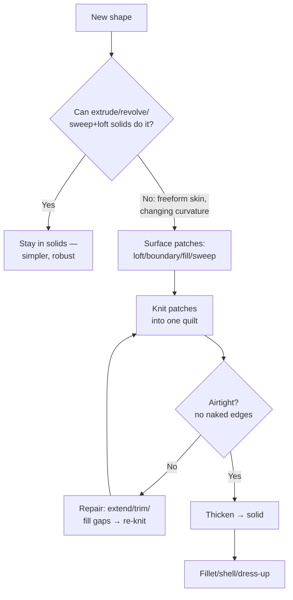

# Surfacing Methodology: Think Before You Click

## For future agent
Surfacing-track cornerstone. Frames all PL1 content: 102 videos are applications of this one workflow. Grounded in PL1 primer transcripts (#9/#30 basics, #10 lofted, #11 filled+knit, #36 extruded surface). Continuity-level details are standard CAD theory, version-independent.

> **Why surfacing exists (read this twice):** solids are watertight lumps — great for brackets, terrible for a mouse shell, a helmet, or a car door. Those shapes are *skins*: complex curvature with no meaningful "inside" until you give them thickness. Surfacing lets you build the skin patch by patch, then solidify it. Every bottle, helmet, and electronic casing in PL1 follows this exact arc.

---

## 1. What a surface is (vs a solid)

- **Solid body:** closed, watertight, has volume and mass. You can shell it, weigh it, mold it.
- **Surface body:** zero thickness, has area but no volume. It can be open, single-sided-looking (it's not — it just has no inside yet).
- **The arc of every surfacing build:** sketch profiles → lay surface patches → **Knit** (stitch patches into one quilt) → check airtight → **Thicken** (give walls) → solid body → dress-up.

**Beginner trap:** surfacing everything. If an extrude does the job, extrude — surfaces add rebuild cost and failure points. The flowchart's first question saves more time than any feature skill.

## 2. Continuity: why some models look "designed" and others lumpy

Where two patches meet, the math can agree at three levels:

| Level | Name | Meaning | Where needed |
|---|---|---|---|
| C0 | Contact/positional | Edges touch, visible crease | Hidden zones, parting areas |
| C1 | Tangent | Same direction, smooth but highlight "kinks" | Most consumer surfaces |
| C2 | Curvature-continuous | Same bend rate — reflections flow | Class-A visible skins (car bodies, premium casings) |

Playlist builds mostly achieve C0–C1 (fine for learning and most products); C2 comes from Boundary with curvature controls + zebra-stripe verification ([[surfacing-utilities-troubleshooting]]). Knowing the ladder exists is what matters now.

## 3. Patch-planning (the skill, honestly)

Before clicking: decompose the object into regions of *consistent curvature behavior* — each region becomes one patch or a small set:

- Mouse (PL1 #1/#24): top shell (sweep/loft) + side walls (extruded/ruled) + bottom (fill) + wheel cutout (trim).
- Bottle (#20): revolved lower body + lofted shoulder + neck (revolve) + cap (separate part).
- Helmet (#16–18): outer shell (boundary patches) + visor opening (trim) + edge roll (sweep) + inner liner (offset).

**Rules:** patches should meet along *clean, deliberate* boundaries (sharp style lines are good seams); avoid tiny sliver patches (they knit badly); keep patch count low — 5 great patches beat 20 fussy ones.

## 4. Knit → Thicken, precisely

- **Knit Surface:** selects patches, stitches matching edges within a **gap tolerance**. Small tolerance = honest (fails on real gaps, good); cranking tolerance hides problems that explode at thicken/mold stage. Fix gaps (extend surfaces, fill) instead of tolerating them.
- **Check airtight:** after knitting, verify no naked edges (wireframe + selection tools; try Thicken — it refuses non-watertight quilts, which is itself the test).
- **Thicken:** wall thickness outward/inward/both. Plastic housings 1.5–3 mm typical (confirm per material/process — TBC as universal spec); inward keeps outer styling exact (preferred for visible skins).
- **Cut With Surface / Thickened Cut** (PL1 #35): use a surface as a knife — trim solids with styled parting surfaces, or cut thin slots.

## 5. Quality checks (the professional finish)

1. **Zebra stripes** (View → Display): flowing stripes = smooth; kinks/bunching = continuity breaks. Run it on every visible skin.
2. **Curvature combs** on key splines: smooth comb decay = fair curve; spikes = wiggles to fix at the *sketch* level (surfaces inherit sketch sins).
3. **Draft analysis** if molded: green = releasable, red/yellow = undercut redesign (ties to [[solidworks-project-ideas]] mold brief).
4. **Section view** through the thickened body: uniform walls, no zero-thickness pinches.

---

## 6. Three patch plans, worked (think like a patch planner)

**Computer mouse (styling skin, ~150 mm long):** (a) top shell — lofted surface over 3 profiles (front/middle/rear) + center-ridge guide; (b) left/right side walls — extruded surfaces trimmed to the shell edge; (c) bottom plate — filled surface on the parting loop; (d) wheel slot + button gaps — standard trims; knit all → thicken inward 2 mm. Seams: parting line at the silhouette, button gaps as designed seams. Why this decomposition: each region has ONE curvature behavior (crown / flat-ish wall / flat plate).

**Helmet crown zone (double curvature):** split crown into 3 boundary patches (top-center + two sides) meeting along ridge style-lines; each patch = 2 profiles × 2 guides; mutual-trim overlaps; fill the visor opening LAST (it's a hole, not a patch). Seams on ridges read as design lines — decomposition doubling as styling.

**Water-tap spout (tube with changing section):** inlet circle → swept surface along the spout centerline path (the path IS the design) → outlet ellipse via lofted end segment → trim at valve body intersection (mutual) → thicken 3 mm (brass-weight feel — TBC: wall per manufacturing, confirm with plumbing references). One path, two sections, one trim — restrained patch count.

**Cost honesty (why solids-first matters):** each surface feature + knit edge adds rebuild time and failure surface. A 12-patch quilt that an extrude+fillet could have matched is not skill — it's debt. Count your patches; justify each against the flowchart in §1. The professional question is never "can I surface this?" but "does this NEED surfacing?"

---

## 7. Continuity in plain sight (train your eyes before your hands)

**The reflection test you can do without SolidWorks:** pick up any glossy object (phone, mug, bottle) and rock it under a light. Styling lines where reflections kink = C0 seams (deliberate — designers PUT seams on style lines). Broad faces where reflections glide = C1/C2. Dull matte objects hide everything (texture forgives curvature sins — TBC: grain depth ~0.05–0.1 mm typical kills reflections; confirm with molding references). Do this with five objects on your desk right now — you're calibrating the instrument (your eyes) that zebra stripes will later formalize.

**Continuity budget (where to spend C2 effort):** hero surfaces (top shell, outer body) get C2 attention; hidden zones (bottom plates, internal ribs) get C0 and zero guilt; transition zones get C1. A beginner spends C2 effort everywhere and burns out; a professional budgets it where eyes land. Every playlist build implicitly follows this budget — rewatch any finish pass and notice WHERE the YouTuber fusses (visible skin) vs where they accept (hidden closures).

**The two-sentence continuity summary for interviews/shop talk:** "Patches meet at contact, tangent, or curvature continuity — I match the joint to the surface's job: hidden zones get contact, visible skins get tangent minimum, hero reflections get curvature." Say it once, correctly, and you sound like you belong.

**Verify in-app:** rebuild PL1 #9's demo from `raw-sources/solidworks/transcripts/` (three-arc sketch → extruded surface both-directions 30/30) → knit → thicken. Then deliberately leave a gap, watch knit/thicken fail, repair it. That failure rep is the lesson.

---

## 8. Surfacing for 3D printing (mesh export without tears)

**Watertight-or-nothing:** slicers need CLOSED solids (or explicitly shelled meshes) — run Import Diagnostics + Check (Tools → Evaluate — TBC exact menu per version) before export; naked edges that thicken forgave will crash slicers (different kernels, different mercy). The thicken-test from §1 doubles as the print-readiness test.

**Tolerance + tessellation (STL/3MF export options — TBC exact dialog per version):** finer deviation = bigger files + smoother curves (TBC: start ~0.05 mm deviation / 15° angle illustrative — confirm per printer; coarse on flat zones is free filesize savings, fine ONLY on curvature). Export Binary STL (smaller) or 3MF (colors/units travel — TBC per slicer support).

**Orientation = quality + strength:** layer lines follow Z — orient show faces vertically-ish (stair-stepping hides on curves? No: it SHOWS on shallow slopes — TBC: confirm with printing references; steep walls print cleanest) → overhangs >45° need support (TBC per printer/material) → design AWAY supports (chamfered bottoms, teardrop holes, 45° rules — TBC per design-for-printing references) rather than accepting forests of support.

**Shrink + fit (printed assemblies):** plastics shrink (holes print small — TBC: confirm per filament, typically +0.2–0.3 mm allowance illustrative) → print test coupons FIRST (hole tower + clearance gauge — one 20-minute print beats three failed assemblies) → document YOUR printer's allowances in your notes (they're yours, not universal — the calibration habit from [[shredders-recycling-machines]] §6 restated).

**Next:** [[lofted-boundary-surfaces]] → [[filled-knit-trim-thicken]] → [[surfacing-utilities-troubleshooting]].

---

## 10. Reverse-engineering master appendix (scan-to-CAD at learning level)

**Measurement toolkit (ranked by access):** calipers + radius gauges + contour gauge (the $50 kit that measures 90% of parts — TBC per sourcing; contour gauges copy curves mechanically!) → phone photogrammetry (multi-angle photo sets → mesh via free apps — TBC per app quality; meshes are REFERENCE, not product — §10-sculpt rule restated) → borrowed CMM time (college/makerspace — TBC per access; datums + patience required) → 3D scanner ( structured-light/handheld — TBC per access; shiny/transparent parts need spray — TBC per scanning practice).

**Measure-plan discipline (measure ONCE, completely):** datum scheme first (which faces are A/B/C? — the drawing discipline from [[part-assembly-drawing-workflow]] §10 applied to measurement) → critical fits flagged (bores, threads, seals get 3+ readings each + min/max recorded, not averaged! — variation IS data) → freeform zones sampled as sections (slice the form every 10–20 mm with contour gauge → section sketches → loft BETWEEN measurements — the reverse of normal lofting: profiles FROM the part!) → photo-log every setup (which face was zeroed? which orientation? — unlogged measurements are rumors).

**Deviation sign-off (how close is close enough?):** overlay CAD-vs-scan colormap where scanning exists (TBC per software) → hand-check critical dims with calipers on the FIRST article (printed/machined copy measured against the ORIGINAL part, not against CAD — the loop closes on reality!) → tolerance-graded verdict (green: fit/function zones within spec — TBC per your tolerance callouts; yellow: cosmetic drift documented; red: remodel the zone) → the reverse-engineering report (deviation table + photos — the deliverable that proves diligence, per the §8-publishing habit generalized).

---

## 9. Patch-count economics + rebuild-speed discipline (surfacing at scale)

**Patch budget (the number behind the philosophy):** each knit edge costs rebuild time + failure surface + drawing complexity. Working budgets (TBC: calibrate against YOUR machine — these are starting points, not specs): consumer shells 5–12 patches (mouse-class), helmets 8–15 zones, automotive panels per-zone similar with tighter continuity. Exceeding budget doesn't mean failure — it means each extra patch needs JUSTIFICATION (a behavior change the existing patches can't express). Count patches at plan time (§6), count again at finish; growth beyond 30% signals strategy drift, not diligence.

**Rebuild-speed tactics (big quilts stay editable):** freeze/suppress downstream (work with quilt suppressed while editing parents? No — parents drive children; instead: lightweight configs hiding fasteners/decals/small fills — the §8-printing config habit generalized) → knit LAST per stage (patches edit fast solo, knit once per session milestone) → appearances suppressed while modeling (rendering taxes rebuilds — TBC per hardware) → save versions as Pack-and-Go milestones before risky surgery (rollback insurance beyond Undo depth — TBC per version's undo limits).

**Quilt documentation (future-you insurance):** name patches by region (`Crown-Center`, `Side-L`, `Visor-Trim` — the Bodies-folder habit from [[lofted-boss-boundary]] §7 applied to surfaces) → sketch-naming that maps to patches (parent traceability: which sketch drove which patch? — Folder organization in the tree mirrors the patch plan) → a README sketch-note IN the file (first feature: a text sketch listing patch plan + tolerances + author + date — TBC taste; teams do this, solo modelers benefit equally).

## CROSS-REFERENCES
- [[INDEX]] · [[lofted-boundary-surfaces]] · [[filled-knit-trim-thicken]] · [[surfacing-utilities-troubleshooting]] · [[flowcharts-master]] · [[../development-of-surfaces]] (projection theory behind these patches)
