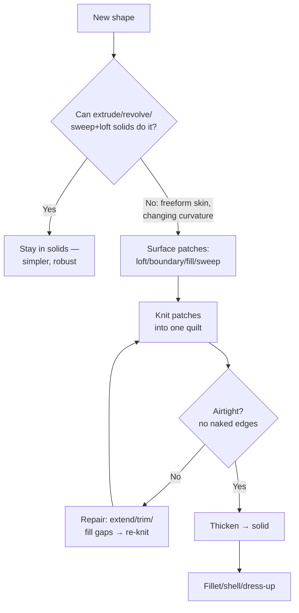

# Surfacing Methodology: Think Before You Click

## For future agent
Surfacing-track cornerstone. Frames all PL1 content: 102 videos are applications of this one workflow. Grounded in PL1 primer transcripts (#9/#30 basics, #10 lofted, #11 filled+knit, #36 extruded surface). Continuity-level details are standard CAD theory, version-independent.

> **Why surfacing exists (read this twice):** solids are watertight lumps — great for brackets, terrible for a mouse shell, a helmet, or a car door. Those shapes are *skins*: complex curvature with no meaningful "inside" until you give them thickness. Surfacing lets you build the skin patch by patch, then solidify it. Every bottle, helmet, and electronic casing in PL1 follows this exact arc.

---

## 1. What a surface is (vs a solid)

- **Solid body:** closed, watertight, has volume and mass. You can shell it, weigh it, mold it.
- **Surface body:** zero thickness, has area but no volume. It can be open, single-sided-looking (it's not — it just has no inside yet).
- **The arc of every surfacing build:** sketch profiles → lay surface patches → **Knit** (stitch patches into one quilt) → check airtight → **Thicken** (give walls) → solid body → dress-up.

**Beginner trap:** surfacing everything. If an extrude does the job, extrude — surfaces add rebuild cost and failure points. The flowchart's first question saves more time than any feature skill.

## 2. Continuity: why some models look "designed" and others lumpy

Where two patches meet, the math can agree at three levels:

| Level | Name | Meaning | Where needed |
|---|---|---|---|
| C0 | Contact/positional | Edges touch, visible crease | Hidden zones, parting areas |
| C1 | Tangent | Same direction, smooth but highlight "kinks" | Most consumer surfaces |
| C2 | Curvature-continuous | Same bend rate — reflections flow | Class-A visible skins (car bodies, premium casings) |

Playlist builds mostly achieve C0–C1 (fine for learning and most products); C2 comes from Boundary with curvature controls + zebra-stripe verification ([[surfacing-utilities-troubleshooting]]). Knowing the ladder exists is what matters now.

## 3. Patch-planning (the skill, honestly)

Before clicking: decompose the object into regions of *consistent curvature behavior* — each region becomes one patch or a small set:

- Mouse (PL1 #1/#24): top shell (sweep/loft) + side walls (extruded/ruled) + bottom (fill) + wheel cutout (trim).
- Bottle (#20): revolved lower body + lofted shoulder + neck (revolve) + cap (separate part).
- Helmet (#16–18): outer shell (boundary patches) + visor opening (trim) + edge roll (sweep) + inner liner (offset).

**Rules:** patches should meet along *clean, deliberate* boundaries (sharp style lines are good seams); avoid tiny sliver patches (they knit badly); keep patch count low — 5 great patches beat 20 fussy ones.

## 4. Knit → Thicken, precisely

- **Knit Surface:** selects patches, stitches matching edges within a **gap tolerance**. Small tolerance = honest (fails on real gaps, good); cranking tolerance hides problems that explode at thicken/mold stage. Fix gaps (extend surfaces, fill) instead of tolerating them.
- **Check airtight:** after knitting, verify no naked edges (wireframe + selection tools; try Thicken — it refuses non-watertight quilts, which is itself the test).
- **Thicken:** wall thickness outward/inward/both. Plastic housings 1.5–3 mm typical (confirm per material/process — TBC as universal spec); inward keeps outer styling exact (preferred for visible skins).
- **Cut With Surface / Thickened Cut** (PL1 #35): use a surface as a knife — trim solids with styled parting surfaces, or cut thin slots.

## 5. Quality checks (the professional finish)

1. **Zebra stripes** (View → Display): flowing stripes = smooth; kinks/bunching = continuity breaks. Run it on every visible skin.
2. **Curvature combs** on key splines: smooth comb decay = fair curve; spikes = wiggles to fix at the *sketch* level (surfaces inherit sketch sins).
3. **Draft analysis** if molded: green = releasable, red/yellow = undercut redesign (ties to [[solidworks-project-ideas]] mold brief).
4. **Section view** through the thickened body: uniform walls, no zero-thickness pinches.

**Verify in-app:** rebuild PL1 #9's demo from `raw-sources/solidworks/transcripts/` (three-arc sketch → extruded surface both-directions 30/30) → knit → thicken. Then deliberately leave a gap, watch knit/thicken fail, repair it. That failure rep is the lesson.

**Next:** [[lofted-boundary-surfaces]] → [[filled-knit-trim-thicken]] → [[surfacing-utilities-troubleshooting]].

## CROSS-REFERENCES
- [[INDEX]] · [[lofted-boundary-surfaces]] · [[filled-knit-trim-thicken]] · [[surfacing-utilities-troubleshooting]] · [[flowcharts-master]] · [[../development-of-surfaces]] (projection theory behind these patches)
