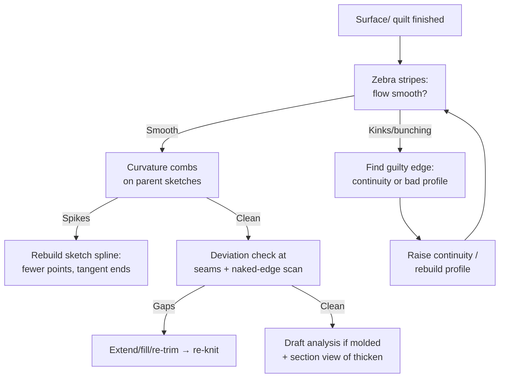

# Surface Utilities & Troubleshooting

## For future agent
Surfacing-track closer. Utilities grounded in PL1 transcripts #36 (Extruded Surface), #14 (Freeform), #62 (Delete Hole), #43 (Offset in the handle combo); diagnostics are standard SolidWorks display/evaluation tools (version-stable). Marks the boundary where surfacing mechanics end and build libraries begin.

> **Two jobs in one page:** the utility features that handle special cases (offset, freeform, sweep-based skins, hole repair) — and the diagnostic toolkit that tells you whether any surface you ever make is actually good.

---

## 1. The utility features

| Feature | What it does | Playlist use |
|---|---|---|
| **Extruded Surface** (#36) | Push a profile into a zero-thickness sheet | Base patches, side walls, quick ribbon surfaces; #37/#42 exercise combos |
| **Revolved Surface** | Spin a profile into a skin | Vessel bodies pre-thicken; jug/vase workflows (#58) |
| **Swept Surface** (#47) | Profile along a path as a skin | Rails, edge rolls, handle ridges; trim + thicken after |
| **Offset Surface** (#43 handle) | Copy faces/patches at a distance | Inner liners from outer skins (helmet!), clearance shells, mold cavity offsets |
| **Ruled Surface** | Draft-direction ribbon off an edge | Parting-line surfaces for molds, flanges (TBC depth — rare in these playlists) |
| **Freeform** (#14) | Push/pull control points and curves on a face | Organic tweaks: mouse thumb rests, ergonomic swells — small moves, big feel |
| **Delete Hole** (#62) | Remove a hole from a surface and heal it | Design cleanup, filling unwanted openings without rebuilding |

**Offset discipline:** offsetting outward grows curvature problems (tight concave zones self-intersect) — fair the parent first. Helmet-style double-wall builds (outer styling skin + offset inner liner) are the signature application ([[complex-showcase]]).

**Freeform discipline:** move *few* points *small* amounts with tangency preserved; freeform after knit (work on the quilt, not fragments); always zebra-check after — eyes can't judge fairness, stripes can.

## 2. Diagnostics toolkit (run these on every skin)

| Tool | Location (TBC exact menu per version — search by name) | Reads as |
|---|---|---|
| Zebra Stripes | View → Display | Flowing = smooth; kinks = continuity breaks; bunching = curvature jumps |
| Curvature Combs | Right-click spline/sketch entity | Smooth taper = fair; spikes = wiggles |
| Deviation Analysis | Evaluate tab | Numeric gap between two edges — knit-confidence data |
| Naked-edge display | Wireframe + selection | Any free edge on a "closed" quilt = leak to fix |
| Draft Analysis | Evaluate/View | Green releasable / red undercut (mold-bound parts) |
| Thickness Analysis | Evaluate | Thin spots in thickened bodies before they fail in production |

## 3. Repair playbook (ordered — don't skip steps)

1. **Identify:** zebra + combs + deviation say *where* and *how big*.
2. **Sketch first:** 80% of surface defects are parent-spline defects — fix the sketch, the surface follows.
3. **Localize:** work on the guilty patch (suppress/isolate neighbors), not the whole quilt.
4. **Extend-then-trim:** extend failing edges past each other, mutual-trim to clean intersections, re-fill slivers.
5. **Re-knit in stages**, tight tolerance; thicken-test at the end.
6. **Never** crank knit tolerance to "make it pass" — downstream (mold, shell, drawing) will expose it expensively.

## 4. Real-world anchor: why quality checks are billable skills

A lumpy-but-closed model 3D-prints fine and molds terribly: reflections expose every continuity break on glossy plastic, undercuts lock steel molds shut, non-uniform walls warp in cooling. The zebra-stripe + draft-analysis habit is literally what separates a ₹-per-hour CAD operator from a product designer — and it's free to practice on every playlist build.

---

## 5. Worked example: helmet inner liner via Offset (double-wall construction)

The signature offset application from §1 — outer styling skin in, comfort liner out (geometry-wise: liner = offset inward).

1. **Parent:** assume the helmet crown patch set (outer skin, knitted, zebra-verified — garbage in, garbage out; offset AMPLIFIES parent unfairness, so verify the parent first).
2. **Offset Surface:** select the crown quilt → offset **inward 8 mm** (liner gap for foam — TBC: confirm per helmet construction; the number is illustrative) → preview for self-intersections: tight concave zones (temple curves) wrinkle first. If wrinkling: fair the parent locally OR split the offset into zones with different distances (TBC per case).
3. **Trim liner to coverage:** liner covers crown + sides, NOT the visor opening or edge roll — trim with the same opening curves used on the shell (reuse sketches! one opening definition driving both shell and liner = design intent).
4. **Edge close-out:** the 8 mm gap between shell and liner at the rim needs closing — ruled/extruded rim strip lofted between the two boundary loops, then knit all three (shell + liner + rim) if a single solid is wanted, or keep as assembly of two parts + foam envelope (better: separate parts, separate materials — the assembly-honest approach from [[part-assembly-drawing-workflow]]).
5. **Vents:** liner vent holes aligned to shell vents (same sketch positions! — misaligned vents whistle and overheat; the shared-sketch habit prevents it).

**Freeform mini-lab (same session):** on a copy of any shell, Freeform-push ONE control point 3 mm with tangency preserved → zebra before/after screenshots. Then push FIVE points 10 mm without tangency → zebra the damage. The pair teaches restraint faster than any paragraph.

**Delete-hole drill:** drill a Ø10 hole in a practice patch → Delete Hole to heal it → compare healed vs rebuilt-from-scratch (healed is faster, rebuilt is cleaner — price per situation).

**Verify in-app:** take any finished surface model → zebra stripes → find the worst seam → curvature-comb its parent sketch → rebuild the spline → re-run stripes and compare. Before/after screenshots in your daily note.

**Next:** build libraries — [[beginner-exercises]] → [[bottles-containers]] → …

## CROSS-REFERENCES
- [[INDEX]] · [[surfacing-methodology]] · [[filled-knit-trim-thicken]] · [[beginner-exercises]] · [[flowcharts-master]] · [[solidworks-cheatsheet]]
