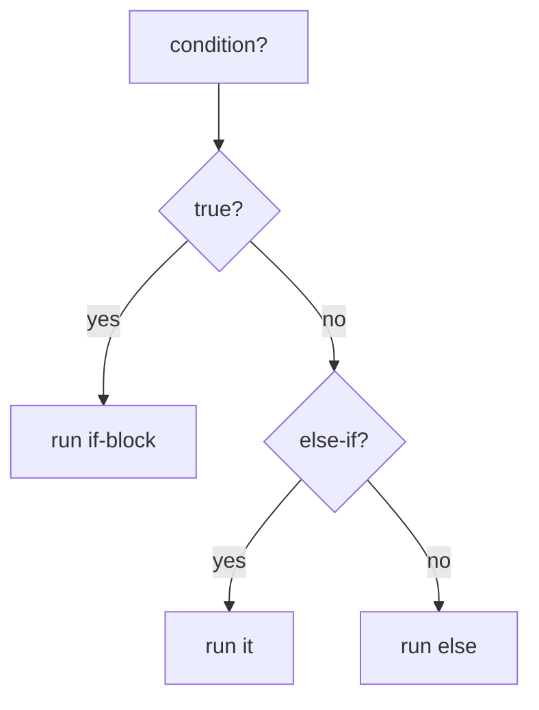
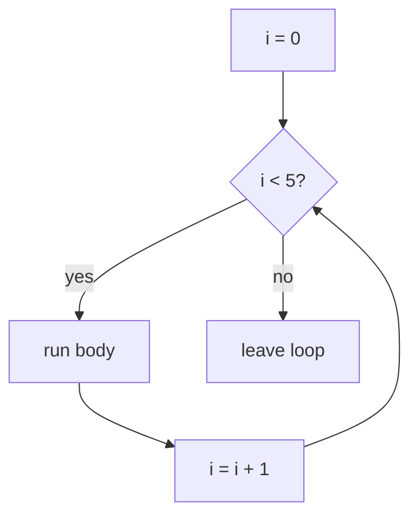
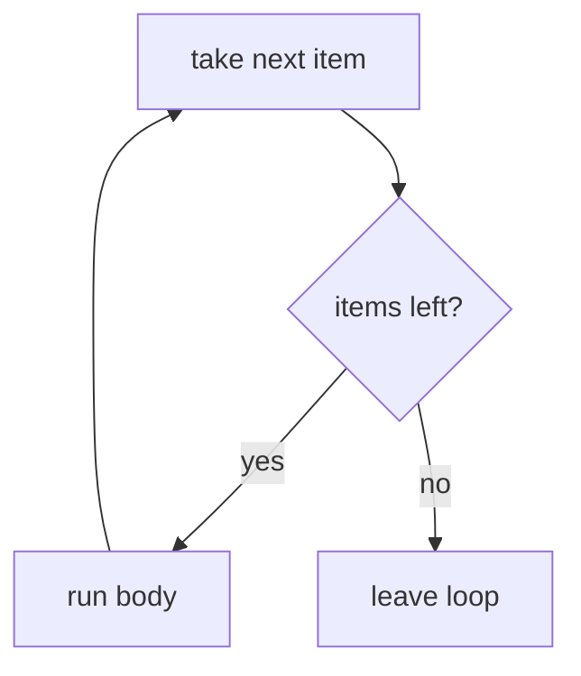
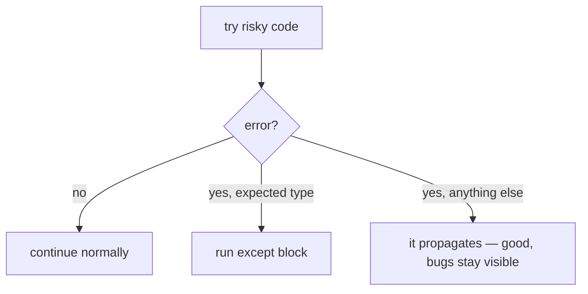
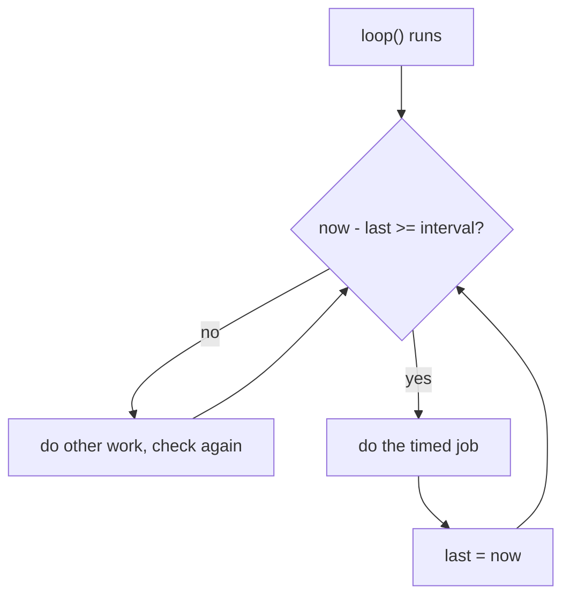
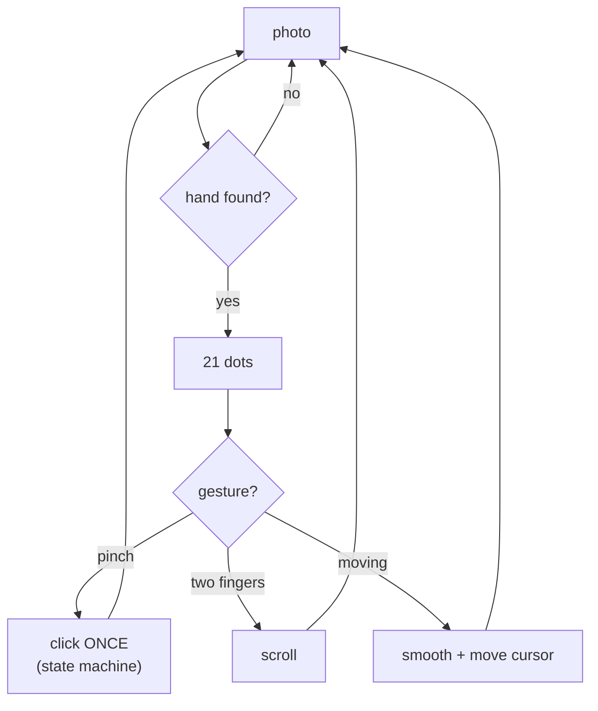
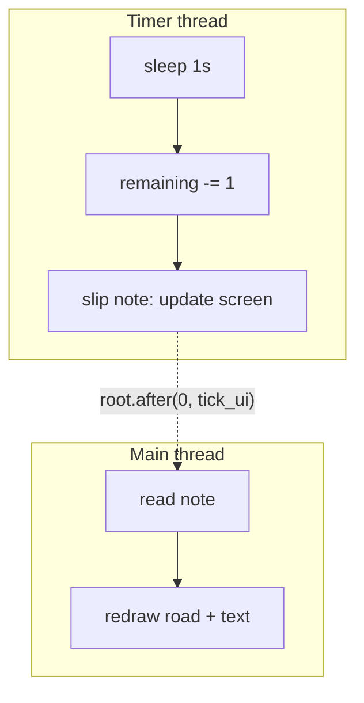

## For future agent
Morning-of single sheet for the [[01-Areas/Engineering/nexus-robotics/INDEX|Nexus interview]] (2026-10-06). Condenses [[01-Areas/Programming/c-revision-eli5]], [[01-Areas/Programming/python-revision-eli5]], [[01-Areas/Engineering/nexus-robotics/nexus-theory-rapidfire]] core, [[00-Current-Projects/projects/handsens101-eli5|handsens101 ELI5]], [[00-Current-Projects/roadtrip-pomodoro-eli5|roadtrip ELI5]], and [[01-Areas/Engineering/nexus-robotics/nexus-interview-fallbacks]] §4+§6. Rule: rows teach nothing new — they point back. If this page ever crosses 25 KB, trim examples, never rows.

# Master Cheat Sheet — Everything on One Page

> Read top to bottom once. Then cover the middle column and say each row out loud.

---

## 1. C essentials

| Concept | One line | Tiny example |
|---|---|---|
| Program starts | everything begins at `main`, `return 0` = success | `int main(void) { ... return 0; }` |
| Variables | labelled boxes: `int` whole, `float` decimal, `char` ONE letter | `int age = 20;` |
| Integer division | two whole numbers → whole answer, decimal binned | `5 / 2` → `2`, not 2.5 |
| `=` vs `==` | one stores, two asks | `x = 5` stores · `if (x == 5)` asks |
| Truth | only `0` is false; everything else true | `-1` is **true** |
| Arrays | row of same-type boxes, counting from **0** | `marks[4]` = last of 5 |
| Array length | `sizeof` gives **bytes**, divide for elements | `sizeof(m)/sizeof(m[0])` = 5 |
| Strings | char row ending in stop byte `'\0'` | `"Asha"` needs 5 slots, not 4 |
| `strcmp` | returns **0 when equal** | `strcmp(a,b)==0` means same |
| Functions | named machine: inputs in, one answer out | `int add(int a,int b){return a+b;}` |
| Pass by value | function gets a **copy**; original untouched | changing param inside changes nothing outside |
| Pointers | variable holding an address | `int *p = &x;` — chit with house address |
| `&` and `*` | `&` = address of, `*` = value at | `&x` → address · `*p` → 42 |
| Through-pointer write | reach through the chit, change the house | `*p = 0;` zeroes `x` |
| Structs | one record, different types | `s.cgpa` · via pointer: `ptr->cgpa` |
| `&` PDOA loop | `for` = fixed count: start → condition → step | `for(i=0;i<5;i++)` runs 5× (0–4) |
| `break` / `continue` | break exits now, continue skips a round | — |
| Bitwise | switches: `&` both, `\|` either, `^` differs (toggle) | `12 & 10` = 8 · `12 ^ 10` = 6 |
| Shifts | `<<` doubles, `>>` halves | `1<<3` = 8 · `12>>2` = 3 |
| BIT macros | set / clear / test one switch | `BIT_SET(v,3)` · `BIT_CLR(v,0)` · `BIT_TST(v,3)` |
| `volatile` | re-read from memory every time, never cache | `volatile uint8_t flag;` (ISR-shared) |
| ISR rule | short, no blocking, set flag, leave; loop does work | flag LAST, after data is valid |
| `static` local | remembers between calls | counter that never resets |

**Say:** *"C does exactly what I say — direct memory, exact timing. Integer division truncates, arrays start at zero, and a pointer is just an address I can follow."*

---

## 2. C traps (12 — read before sleep)

| # | Trap | Example |
|---|---|---|
| 1 | `=` vs `==` in `if` | `if (x = 5)` always true — assigns! |
| 2 | Integer division | `5/2` = 2 |
| 3 | Arrays start at 0 | 5 boxes → indexes 0–4 |
| 4 | `sizeof` = bytes | `sizeof(marks)` = 20, not 5 |
| 5 | Strings need `'\0'` room | `"Asha"` = 5 slots |
| 6 | `strcpy`/`strcat` unchecked | destination must fit — your job |
| 7 | Missing `break` falls through | `case` runs into the next one |
| 8 | Missing `{ }` | only the next line belongs to the `if` |
| 9 | Return `&local` | house demolished — chit points at rubble |
| 10 | `"w"` erases file | `fopen(f,"w")` truncates |
| 11 | `1<<31` signed = UB | use `1u` |
| 12 | `volatile` ≠ atomic | shared read-modify-write still needs a critical section |

---

## 3. Python essentials

| Concept | One line | Tiny example |
|---|---|---|
| Variables | sticky notes on objects, no fixed type | `x = 5` then `x = "hi"` is legal |
| Strings | sliceable text, 0-based, negatives from end | `s[1:4]` = indexes 1,2,3 (end excluded) |
| f-strings | fill-in-the-braces text | `f"{name} scored {score}"` |
| `list` | numbered shelf, ordered + editable | `[1, 2, 3]` |
| `tuple` | shelf behind glass — frozen | `(1, 2, 3)` |
| `set` | lucky-dip bag — no order, no duplicates | `{1, 2, 3}` |
| `dict` | labelled drawers, name → thing | `{"a": 1}` |
| Membership speed | list walks all, set jumps straight | `x in my_set` is instant |
| Counting trick | `Counter` does it in one line | `Counter(["a","b","a"])` → `{'a':2,'b':1}` |
| `for` | walks items directly, no counter needed | `for name in names:` |
| `enumerate` | index + item together | `for i, n in enumerate(names):` |
| `range(5)` | 0–4, five rounds | same shape as C's loop |
| Functions | `def`, no types declared | `def add(a, b): return a + b` |
| Missing `return` | silently gives `None` | `x = add(2,3)` → `None`, not 5 |
| Defaults/keywords | defaults fill gaps, keywords free the order | `greet(name="friend")` |
| `import` | borrow a toolbox | `import math` · `from math import sqrt` |
| `with open` | auto-closes even on crash — always use it | `with open("f") as fh:` |
| Classes | cutter (class) vs cookie (object) | `__init__` sets up, `self` = this one |
| try/except | plan for a NAMED failure | `except ValueError:` — never bare `except:` |
| Comprehensions | loop-that-appends in one line | `[x*x for x in range(5)]` |

**Say:** *"Python trades control for writing speed — dynamic types, huge libraries, no compile step. I parse and analyse in Python, and the robot runs C where timing matters."*

---

## 4. Python traps (10 — read before sleep)

| # | Trap | Example |
|---|---|---|
| 1 | `=` vs `==` (same as C) | `if x = 5:` assigns, always true |
| 2 | Slices exclude end | `[1:4]` → indexes 1,2,3 |
| 3 | `range(5)` = 0–4 | not 1–5 |
| 4 | Falsy values | `""`, `[]`, `0`, `None` all false |
| 5 | Missing `return` → `None` | silent, no warning |
| 6 | Bare `except:` | swallows your own typos — name the error |
| 7 | `"w"` erases | same as C |
| 8 | Indentation IS structure | mixed tabs/spaces breaks quietly |
| 9 | `is` vs `==` | identity vs value — `is None`, never `== None` |
| 10 | `import` runs the file | hence `if __name__ == "__main__":` guard |

> **Python vs C in one breath:** *"Python for data and iteration speed, C for hardware — exact memory, exact timing, no interpreter in the way. Telemetry parsing is Python-shaped; the control loop is C-shaped."*

---

## 5. Embedded core-10

| Concept | One breath | Anchor example |
|---|---|---|
| `volatile` | re-read every time — ISR flags, hardware registers | `volatile uint8_t ready;` |
| ISR discipline | short, no blocking, flag LAST after data | main loop does the work |
| Stack vs heap | stack auto/fixed, heap manual/risky on MCU | firmware prefers fixed `static` boxes |
| ADC | 10-bit → 0–1023 counts | `volts = raw/1023 × Vref` |
| PWM | on-fraction = brightness/speed | duty 0–255 on Arduino |
| Debounce | contacts bounce — confirm after settle time | edge + 20 ms timer, not `delay` |
| PID in one line | P pushes now, I removes leftover error, D damps swings | clamp output = anti-windup |
| UART | agreed-speed serial, no clock wire | 9600 8N1 = 9600 baud, 8 data bits |
| Pull-up | button pin rests HIGH, press pulls LOW | active-low: pressed reads 0 |
| `millis` rollover | unsigned subtraction stays correct across wrap | `now - last >= interval` — always |

**Say:** *"Non-blocking timing: never freeze with delay, check the clock each loop and act when the interval has passed. Unsigned maths makes it rollover-safe."*

---

## 6. handsens101 — half page

| Stage | One line |
|---|---|
| See | webcam → frame of numbers, 30×/sec (OpenCV) |
| Find | frame → 21 hand dots, 85%+ sure (MediaPipe, pre-trained) |
| Decide | dot distances → pinch = click, two fingers = scroll (your rules) |
| Smooth | blend new with old — tremor dies here |
| Act | real cursor moves/clicks/scrolls (pyautogui) |

| Import | Why |
|---|---|
| `cv2` | eyes — camera frames as numbers |
| `mediapipe` | hand-finder — 21 stickers, pre-trained, not yours |
| `pyautogui` | hands — moves the real cursor (`PAUSE=0`) |

> **60-sec script:** *"Webcam hand-mouse: OpenCV grabs frames, MediaPipe marks 21 hand points, my code measures dot distances — pinch clicks, two fingers scroll — maps to screen pixels, smooths with an exponential average so tremor doesn't shake the cursor, and pyautogui drives the real mouse. Confidence at 0.85 because a false positive means a phantom click. AI-assisted build; the gesture rules and smoothing choices are mine."*

---

## 7. roadtrip-pomodoro — half page

| Job | One line |
|---|---|
| Count without freezing | daemon thread counts, `root.after` draws — worker never touches screen |
| Road from maths | distance → sine-winding centre + perspective curve + parallax hills + scrolling dashes; no image files |
| Sound from maths | numpy noise beds + hum via sounddevice; silent fallback if missing |
| Save itself | session appended to daily note — vault IS the database, JSON is just cache |

| Import | Why |
|---|---|
| `tkinter` | window + canvas road + buttons |
| `threading` | second worker for the countdown (`daemon=True` = dies with app) |
| `numpy` + `sounddevice` | build + play noise buffer (optional, silent fallback) |
| `winsound` / `plyer` | beeps / toast on arrival |

> **60-sec script:** *"Focus timer as a night drive: pick a route length, car cruises an endless procedural road while you work, session logs into my notes. Threading: daemon-thread countdown, all screen updates via root.after. World and sound are generated from a distance number — no assets — which is why the Next.js port reused the same maths. No app database; markdown vault is the record. AI-assisted; threading, procedural world, and vault-as-database are my decisions."*

---

## 8. Survival footer (morning-of)

- **IDK line (pre-committed):** *"I haven't touched that part — here's how I'd find out: check the datasheet, then run the smallest version that works."*
- **90-second rule:** never silent past ~90 s — brute force aloud, tiny case by hand, or restate what you know.
- **Narrate decisions, not keystrokes:** "looping because input is unsorted" scores; "typing a for loop" doesn't.
- **Rig:** earphones + phone mic tested · charger in · editor open, font big · water, pen, paper for hand-tracing.
- **STAR in 4 beats:** situation → task → action → result-with-a-number. Six stories written, not improvised.
- **After:** debrief within 2 h — every question asked, where you stumbled, what they pushed on.

*Depth behind every row: [[01-Areas/Programming/c-revision-eli5]] · [[01-Areas/Programming/python-revision-eli5]] · [[01-Areas/Engineering/nexus-robotics/nexus-theory-rapidfire]] · [[00-Current-Projects/projects/handsens101-eli5\|handsens101 ELI5]] · [[00-Current-Projects/roadtrip-pomodoro-eli5\|roadtrip ELI5]] · [[01-Areas/Engineering/nexus-robotics/nexus-interview-fallbacks]] · Home: [[01-Areas/Engineering/nexus-robotics/INDEX]]*
