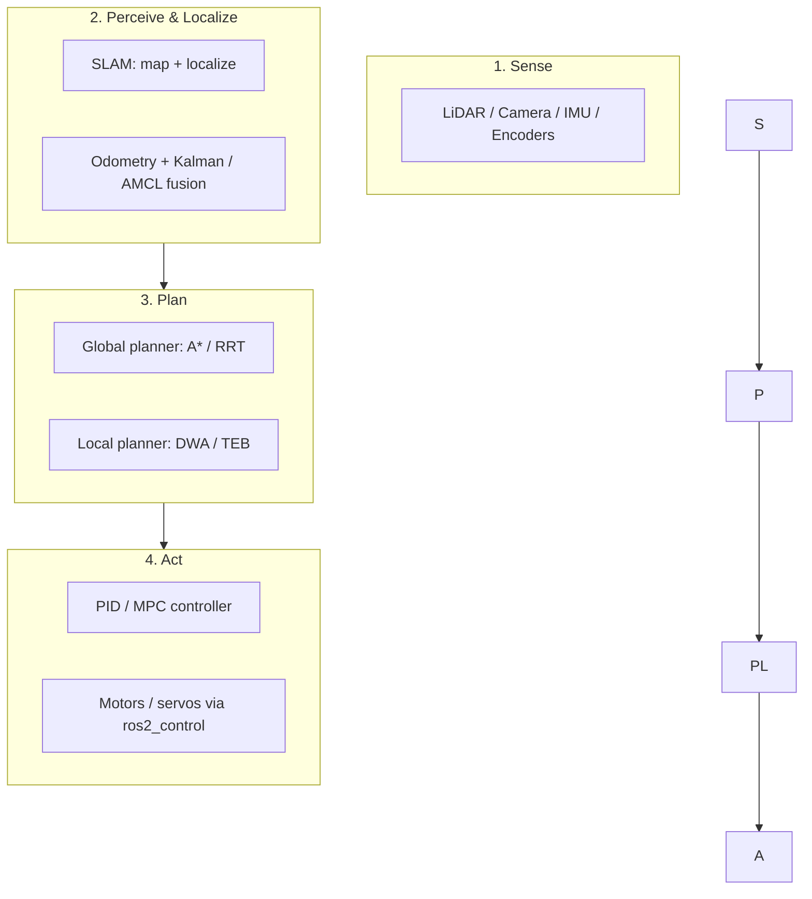

# Robotics & ROS2 — Module Hub

> Complete study library for **robotics fundamentals + ROS 2 (Robot Operating System 2)** — the open-source middleware that runs the world's robots.
> **Sources:** [docs.ros.org](https://docs.ros.org/) (official tutorials & concepts) · [design.ros2.org](https://design.ros2.org/) (architecture/QoS design docs) · [docs.nav2.org](https://docs.nav2.org/) (Navigation 2) · The Construct ("ROS in 5 mins") · Kevin Wood / Edouard Renard ROS2 courses.
> **Related:** [[wiki/index|Modules Catalog]] · [[wiki/index|Wiki Home]]

## Start Here

This module is written at **engineering-student depth**: every topic carries the derivation/math, the mechanics, and the ROS2 mapping — not just vocabulary.

- **[[roadmap]]** — **Robotics & AI Engineering Roadmap (2026)**: the modern, job-ready learning path — classical backbone (math, C++/Python, ROS2, SLAM, control) **+** the 2026 AI stack (VLA foundation models, sim-to-real, imitation/RL, edge AI). 8 stages, 12-month timeline, tool cheat-sheet, master checklist.
- **[[overview]]** — Robotics as a closed-loop dynamical system: state/control/sensors/timing, latency budgets, the trade-off triangle, software stack, vault connections.
- **[[robotics-fundamentals]]** — The engineering core at derivation level: SE(3) transforms, DH kinematics, differential-drive model, Euler–Lagrange dynamics, PID/LQR/MPC control, Kalman/EKF/particle estimation, graph SLAM, A\*/RRT/DWA planning, pinhole-camera perception + algorithm→package map.
- **[[ros2-architecture]]** — Internals: the rcl → rmw → DDS layer stack, **executor scheduling** (wait sets, callback groups, timer priority, real-time limits, Events/CBG executor), ROS vs system time, lifecycle nodes, zero-copy components.
- **[[ros2-communication]]** — Protocol layer: RTPS heartbeat/AckNack, SPDP/SEDP discovery, domain-ID port math, all QoS policies + **the dependency chain**, compatibility matrix, discovery server, SROS2 security.
- **[[ros2-installation-setup]]** — Build system internals: colcon → ament_cmake → CMake pipeline, `package.xml`, rosidl generation, **underlay/overlay env mechanics**, distro cadence (Jazzy recommended).
- **[[ros2-beginner-guide]]** — The full hands-on path with **rclpy + rclcpp** code, executors & callback groups, tf2/URDF/Xacro with the transform math, Gazebo physics, Nav2 node-by-node + Simple Commander API.
- **[[worked-example-odom-ekf]]** — **Worked example**: differential-drive odometry + 2D EKF in runnable rclpy, with a fake-robot simulator and verification (theory → code, end to end).
- **[[ros2-tools-debugging]]** — Engineering debugging: full `ros2` CLI, rosbag time-travel repro, **tracing/CARET latency analysis**, threading & real-time failures, Nav2 evidence pipeline.
- **[[ros2-cheatsheet]]** — Compressed reference: CLI, launch, colcon, QoS, lifecycle, rclpy/rclcpp skeletons, tf2, bag, tracing, Nav2.

## Reading Order

1. **[[overview]]** — get the 30,000-ft picture (1 hr).
2. **[[robotics-fundamentals]]** — the engineering vocabulary (2–3 hrs).
3. **Install ROS2** ([[ros2-installation-setup]]) on Ubuntu (1–2 hrs).
4. Run the **[[ros2-beginner-guide]]** path start-to-finish (a weekend).
5. Revisit **[[ros2-architecture]]** + **[[ros2-communication]]** as you hit "why?" questions.
6. Debug with **[[ros2-tools-debugging]]**; keep **[[ros2-cheatsheet]]** open.

## The Autonomy Stack (how this module fits together)



```
┌──────────┐   ┌───────────────────────┐   ┌──────────────┐   ┌───────────────┐
│  Sense   │──▶│ Perceive + Localize    │──▶│     Plan     │──▶│      Act      │
│ sensors  │   │ SLAM · odom · AMCL     │   │ A* / RRT/DWA │   │ PID / motors  │
└──────────┘   └───────────────────────┘   └──────────────┘   └───────────────┘
     ▲                                                                │
     └────────────────────────────────── feedback loop ◀─────────────┘
     Everything streams over ROS2 topics/services/actions (DDS).
```

## Module Map

| Page | What you learn |
|---|---|
| [[roadmap]] | **Start here for the big picture**: 8-stage learning path + 12-month timeline + 2026 AI/robotics trends |
| [[overview]] | Robot as a dynamical system, real-time budgets, trade-offs, stack |
| [[robotics-fundamentals]] | SE(3)/DH kinematics, dynamics, PID/LQR/MPC, KF/EKF/PF, graph SLAM, A\*/RRT/DWA, perception — all derived |
| [[ros2-architecture]] | rcl/rmw/DDS layers, executor internals, callback groups, time, lifecycle |
| [[ros2-communication]] | RTPS, discovery, domain port math, QoS + dependency chain, security |
| [[ros2-installation-setup]] | Build pipeline, ament/rosidl, underlay/overlay, distros |
| [[ros2-beginner-guide]] | rclpy + rclcpp path: turtlesim → Nav2 with full code |
| [[worked-example-odom-ekf]] | Odometry + EKF derived AND implemented in runnable rclpy |
| [[ros2-tools-debugging]] | CLI, bags, tracing/CARET, threading, Nav2 evidence pipeline |
| [[ros2-cheatsheet]] | Commands + code + QoS + lifecycle on one page |

## Related Modules

- **[[wiki/index|Modules Catalog]]** — index of all cross-cutting modules.
- **[[01-Areas/Programming/index|Programming Module Hub]]** — Python & CS fundamentals, the language ROS2 nodes are written in.
- **[[01-Areas/AI-Data/ai/index|AI / Machine Learning]]** — perception & decision layers of robots (vision, RL control).
- **[[01-Areas/Engineering/mathematics/overview|Mathematics]]** — linear algebra, trigonometry & probability behind kinematics, Kalman filters & SLAM.
- **[[01-Areas/AI-Data/ai-ml/reinforcement-learning-ppo|Reinforcement Learning — PPO]]** — learned control policies on top of the ROS2 stack.
- **[[01-Areas/AI-Data/ai-ml/matching-engine-cpp|Matching Engine (C++)]]** — low-latency C++ systems thinking, same discipline as robot controllers.
- **[[01-Areas/Self-Dev/self-mastery/overview|Self-Mastery]]** — the learning engine: how to actually run a multi-week robotics curriculum to completion.
