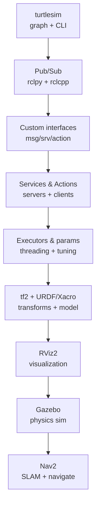

# ROS2 Beginner-to-Engineer Guide — The Full Hands-on Path

> The complete path from `turtlesim` to a Nav2-navigating robot, at engineering depth: rclpy **and** rclcpp, executors & callback groups, custom interfaces, tf2/URDF math, Gazebo physics, and the Nav2 pipeline node-by-node. Zero hardware required.
> **Sources:** docs.ros.org (all Beginner+Intermediate tutorials), The Construct, Kevin Wood, Edouard Renard (ROS2/Nav2), Robotisim Nav2 guide, docs.nav2.org.
> **Related:** [[01-Areas/Engineering/robotics/index|Robotics & ROS2 Hub]] · [[robotics-fundamentals]] · [[ros2-architecture]] · [[ros2-installation-setup]] · [[wiki/index|Modules Catalog]] · [[wiki/index|Wiki Home]]

## The Roadmap



```
1  turtlesim ............... the computation graph, live
2  pub/sub ................. your first distributed program (2 languages)
3  custom interfaces ....... your own message types
4  services & actions ...... request/response + long goals with feedback
5  executors & params ...... concurrency control + runtime tuning
6  tf2 + URDF/Xacro ........ coordinate frames & robot description
7  rviz2 ................... visualize transforms, laser, costmaps
8  gazebo .................. simulated physics, real robot
9  nav2 .................... SLAM map → autonomous navigation
```

---

## Step 1 — turtlesim (see the graph live)

```bash
ros2 run turtlesim turtlesim_node                 # terminal 1
ros2 run turtlesim turtle_teleop_key              # terminal 2
ros2 node list && ros2 topic list                 # terminal 3
ros2 topic echo /turtle1/cmd_vel                  # the velocity stream
ros2 topic info /turtle1/cmd_vel -v               # type + QoS of both sides
ros2 run rqt_graph rqt_graph                      # the live topic graph
```

**What you're actually seeing:** a publisher node, a subscriber node, one topic, decoupled via DDS discovery. Everything else in ROS2 is this pattern, scaled.

## Step 2 — Publisher & Subscriber (Python + C++)

### rclpy

```python
import rclpy
from rclpy.node import Node
from std_msgs.msg import String

class Talker(Node):
    def __init__(self):
        super().__init__("talker")
        self.pub = self.create_publisher(String, "chatter", 10)   # depth=10
        self.timer = self.create_timer(1.0, self.callback)
        self.i = 0

    def callback(self):
        msg = String()
        msg.data = f"Hello {self.i}"
        self.pub.publish(msg)
        self.i += 1

def main(args=None):
    rclpy.init(args=args)
    rclpy.spin(Talker())          # hand control to the executor
    rclpy.shutdown()
```

### rclcpp (same semantics)

```cpp
#include <rclcpp/rclcpp.hpp>
#include <std_msgs/msg/string.hpp>

class Talker : public rclcpp::Node {
public:
  Talker() : Node("talker"), i_(0) {
    pub_ = create_publisher<std_msgs::msg::String>("chatter", 10);
    timer_ = create_wall_timer(std::chrono::seconds(1),
                [this] { auto m = std_msgs::msg::String();
                         m.data = "Hello " + std::to_string(i_++);
                         pub_->publish(m); });
  }
private:
  rclcpp::Publisher<std_msgs::msg::String>::SharedPtr pub_;
  rclcpp::TimerBase::SharedPtr timer_;
  int i_;
};
int main(int argc, char** argv){ rclcpp::init(argc, argv); rclcpp::spin(std::make_shared<Talker>()); rclcpp::shutdown(); }
```

**Language choice is an engineering decision:** Python = rapid dev, easier to read, fine for slow loops; C++ = real-time, low latency, memory control — the language of controllers and anything >100 Hz. The API is 1:1, so learn both once.

## Step 3 — Custom interfaces (msg / srv / action)

Best practice: a dedicated package `interfaces_pkg`.

```yaml
# msg/RobotStatus.msg   (nested + arrays + constants)
# constants
uint8 STATUS_OK=0
uint8 STATUS_ERR=1
# fields
uint8 status
string name
float32[] wheel_speeds          # arrays
geometry_msgs/PoseStamped pose  # nested message (add DEPENDENCIES)

# srv/TogglePower.srv
bool enable
---
bool success
string message

# action/Patrol.action
string[] waypoints
---
int32 visited
---
string report
```

```bash
ros2 pkg create interfaces_pkg --build-type ament_cmake \
    --dependencies geometry_msgs rosidl_default_generators
colcon build --packages-select interfaces_pkg
source install/setup.bash
ros2 interface show interfaces_pkg/action/Patrol
```

Wire into your node:

```python
from interfaces_pkg.msg import RobotStatus
pub = self.create_publisher(RobotStatus, "robot_status", 10)
```

## Step 4 — Services & Actions (server + client)

### A service (rclpy)

```python
from interfaces_pkg.srv import TogglePower

class PowerNode(Node):
    def __init__(self):
        super().__init__("power")
        self.srv = self.create_service(TogglePower, "toggle_power", self.cb)
        self.on = False
    def cb(self, req, res):            # req / res = the two halves of the .srv
        self.on = req.enable
        res.success, res.message = True, "power on" if self.on else "off"
        return res
```

Client (from anywhere): `ros2 service call /toggle_power interfaces_pkg/srv/TogglePower "{enable: true}"`.

### An action (goal + feedback + result)

```python
from interfaces_pkg.action import Patrol

class PatrolServer(Node):
    def __init__(self):
        super().__init__("patrol_server")
        self.act = self.create_action_server(Patrol, "patrol", self.goal_cb)

    def goal_cb(self, goal_handle):
        wp = goal_handle.request.waypoints
        for i, w in enumerate(wp):
            goal_handle.publish_feedback(Patrol.Feedback(visited=i))   # progress
            # ... actually drive ...
        goal_handle.succeed()
        return Patrol.Result(report=f"visited {len(wp)}")
```

**Decision rule:** continuous data → topic; quick op → service; long op with progress/cancel → action. Nav2's whole interface (`/navigate_to_pose`) is an **action** — that's the pattern to internalize.

## Step 5 — Executors & parameters (concurrency + tuning)

```python
from rclpy.executors import MultiThreadedExecutor
from rclpy.callback_groups import MutuallyExclusiveCallbackGroup

slow = MutuallyExclusiveCallbackGroup()              # image processing
fast = MutuallyExclusiveCallbackGroup()              # /cmd_vel safety

self.create_subscription(Image, "image_raw", self.slow_cb, 10, callback_group=slow)
self.create_subscription(Twist, "cmd_vel",  self.fast_cb, 10, callback_group=fast)

executor = MultiThreadedExecutor(num_threads=2)
executor.add_node(self)
executor.spin()                                       # both callbacks now parallel
```

```bash
ros2 param list /talker
ros2 param get /talker use_sim_time
ros2 run my_pkg my_node --ros-args --params-file params.yaml
```

## Step 6 — tf2 + URDF/Xacro (frames & the robot model)

### The math (see [[robotics-fundamentals]] §2): every frame = an SE(3) transform `T`.

```python
from tf2_ros import TransformBroadcaster, Buffer, TransformListener
from geometry_msgs.msg import TransformStamped

class OdomNode(Node):
    def __init__(self):
        super().__init__("odom_pub")
        self.tfb = TransformBroadcaster(self)
        self.timer = self.create_timer(0.05, self.publish)      # 20 Hz
    def publish(self):
        t = TransformStamped()
        t.header.stamp = self.get_clock().now().to_msg()
        t.header.frame_id = "odom"
        t.child_frame_id = "base_link"
        t.transform.translation.x = self.x           # from odometry integration
        t.transform.rotation.w = 1.0
        self.tfb.sendTransform(t)
```

Look up any transform (with timeout — the standard trap):

```python
self.buf = Buffer()
self.lis = TransformListener(self.buf, self)
t = self.buf.lookup_transform("map", "laser", rclpy.time.Time(), timeout=rclpy.duration.Duration(seconds=1))
```

### URDF/Xacro — the body

```xml
<?xml version="1.0"?>
<robot name="my_robot" xmlns:xacro="http://www.ros.org/wiki/xacro">
  <link name="base_link">
    <visual><geometry><cylinder radius="0.10" length="0.05"/></geometry></visual>
    <collision><geometry><cylinder radius="0.10" length="0.05"/></geometry></collision>
    <inertial>                        <!-- REQUIRED for Gazebo physics -->
      <mass value="1.5"/>
      <inertia ixx="0.01" iyy="0.01" izz="0.01" ixy="0" ixz="0" iyz="0"/>
    </inertial>
  </link>
  <link name="laser"/>
  <joint name="laser_joint" type="fixed">
    <parent link="base_link"/> <child link="laser"/>
    <origin xyz="0.10 0 0.05" rpy="0 0 0"/>     <!-- a tf2 transform -->
  </joint>
</robot>
```

- **Xacro** = XML macros → parametrize (wheel radius, base dimensions) instead of copy-paste.
- **Gazebo needs the `<inertial>` block**, RViz only cares about `<visual>`/`<joint>` — a model can look right in RViz and explode in Gazebo.

## Step 7 — RViz2 (the model view)

```bash
ros2 run rviz2 rviz2
# add: RobotModel (URDF), TF, LaserScan, Map, Path
```

RViz renders **what the system believes** (transforms, scans, maps, paths). If RViz is wrong but Gazebo looks fine, the TF/model layer is broken — not the physics.

## Step 8 — Gazebo (the physics view)

```bash
sudo apt install -y ros-jazzy-gazebo-ros-pkgs
export TURTLEBOT3_MODEL=burger
ros2 launch turtlebot3_gazebo turtlebot3_world.launch.py
```

- Gazebo numerically integrates dynamics (§3 of [[robotics-fundamentals]]) via ODE/Bullet/DART.
- The same URDF → RViz (visual) + Gazebo (physics). World files are **SDF**, robots are URDF; plugins bridge them to ROS2 topics (`gazebo_ros_*`).
- `use_sim_time:=true` so everyone reads `/clock`.

## Step 9 — Nav2 (map, then navigate)

### 9.1 The pipeline, node by node

```
                  ┌──────────────────────────  Nav2  ──────────────────────────┐
                  │                                                            │
  /scan ─▶ slam_toolbox ─▶ /map ─▶ [map_server] ─▶ global costmap (static layer)
                                        │
  /odom + /imu ─▶ EKF ─▶ [AMCL] ◀───────┘  map→odom transform
                                        │
  "Nav2 Goal" (action /navigate_to_pose) ─▶ [behavior tree navigator]
                                              │
                    ┌─────────────────────────┼───────────────────┐
              [planner_server]          [controller_server]    [recovery]
              global costmap             local costmap          backup/clear
              A*/Smac → /plan            DWA/TEB/MPPI → /cmd_vel
                                                        │
                                                        ▼
                                              robot base → /odom feedback
```

| Component | Job | Key topics/actions |
|---|---|---|
| `map_server` | Serve the saved map | `/map`, `/map_server/...` |
| `AMCL` | Particle-filter localization | `/amcl_pose`, `/initialpose`, `map→odom` tf |
| `planner_server` | Global path | action `/compute_path_to_pose` → `/plan` |
| `controller_server` | Local path → velocities | action `/follow_path`, pubs `/cmd_vel` |
| `costmap_2d` (global + local) | Obstacle inflation | `/global_costmap/...`, `/local_costmap/...` |
| BT navigator | Orchestrate (behavior tree) | action `/navigate_to_pose` |
| Recovery | Spin/backup/clear when stuck | behavior nodes |

### 9.2 Doing it with TurtleBot3

```bash
# map the world
ros2 launch turtlebot3_gazebo turtlebot3_world.launch.py
ros2 launch turtlebot3_navigation2 navigation2.launch.py use_sim_time:=True
ros2 run slam_toolbox online_async_launch.py            # start SLAM
ros2 run nav2_map_server map_saver_cli -f ~/my_map      # save map
# navigate on the saved map
ros2 launch turtlebot3_navigation2 navigation2.launch.py map:=~/my_map.yaml
# RViz: 2D Pose Estimate (AMCL init) → Nav2 Goal → watch it go
```

### 9.3 Driving it programmatically — Simple Commander

```python
from nav2_simple_commander.robot_navigator import BasicNavigator
nav = BasicNavigator()
nav.setInitialPose((0.0, 0.0, 0.0))
nav.waitUntilNav2Active()
nav.goToPose((1.0, 2.0, 0.0))        # (x, y, yaw)
while not nav.isTaskComplete():
    print(nav.getFeedback())          # distance_remaining, nav_msgs ...
nav.getResult()
```

## Step 10 — Testing (engineering discipline)

```bash
# pytest for Python nodes, gtest for C++  — run with:
colcon test --packages-select my_pkg && colcon test-result --verbose
```

Pattern: `ros2 launch` the node in-process or against a bag, assert on topic outputs (pytest-ros2 style). A robotics codebase without automated tests is an untestable one.

## Practice Projects (engineering tier)

1. **Square-drawing turtle** — trajectory generator: publish `(v, ω)` from a timed pattern; generalize to a waypoint follower.
2. **Safety node** — subscribe `/scan`, publish an emergency stop on `/cmd_vel` when min range < threshold (use QoS `best_effort`, add latency budget analysis).
3. **Robot description** — author a TurtleBot-like URDF/Xacro with correct inertials; spawn in Gazebo; verify it doesn't explode and drives with `teleop`.
4. **Waypoint patrol** — TurtleBot3 + Simple Commander: build a map, save it, patrol 3 waypoints with feedback logging and recovery on failure.
5. **Performance pass** — instrument the pipeline with ros2_tracing/CARET, measure end-to-end latency, and switch a node to a better executor/callback-group layout. Report the delta.

## Resources (ranked)

| Resource | Level | What |
|---|---|---|
| docs.ros.org/en/jazzy/Tutorials | all | authoritative, complete |
| The Construct — "ROS in 5 mins" | beginner | each concept in 5 min |
| Kevin Wood — ROS2 Tutorials | beginner→int | tf2/SLAM/Nav2 walkthroughs |
| Edouard Renard — ROS2 + Nav2 courses | beginner→pro | structured, custom-robot adaptation |
| Robotisim — Nav2 beginner guide | intermediate | Nav2 debug pipeline & evidence flow |
| docs.nav2.org | reference | every plugin/behavior |
| rclcpp/rclpy API docs | reference | exact signatures |

Next: **[[ros2-tools-debugging]]** — measurement, tracing, and the systematic debug loop.
