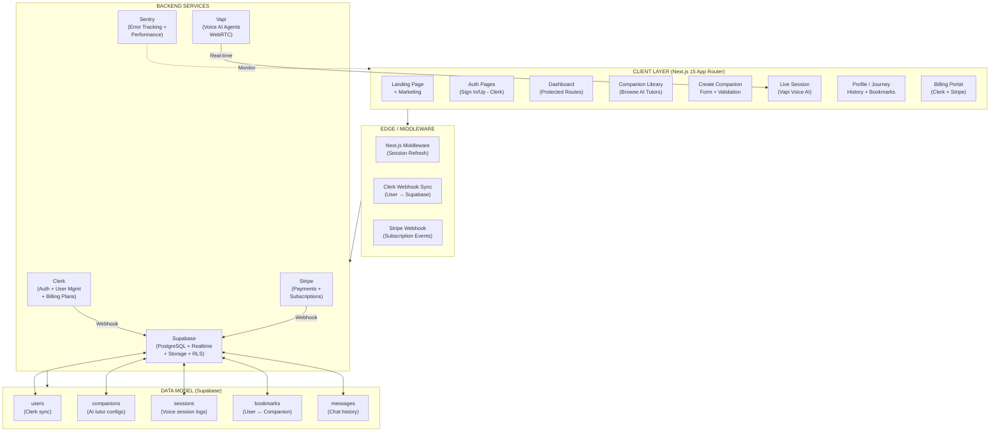
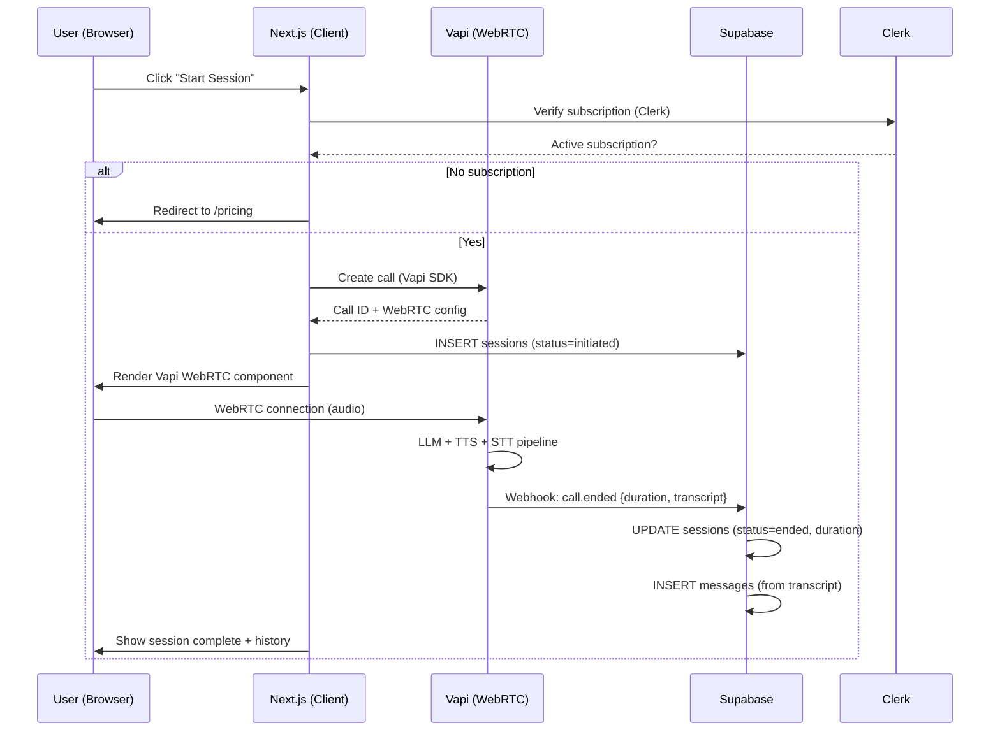

# SAAS_BUILD_NOTES.md — Complete Breakdown of "SaaS App Full Course 2026"

> **Video**: *SaaS App Full Course 2026 | Launch Your SaaS in Under 7 Days with Next JS, Supabase & Payments*  
> **Channel**: JavaScript Mastery (Adrian Hajdin) — 1M+ views, 437★ GitHub repo  
> **Stack**: Next.js 15 • Supabase (PostgreSQL) • Clerk (Auth + Billing) • Stripe • Vapi AI Voice • Sentry • Tailwind + shadcn/ui • TypeScript  
> **Product Built**: **Converso** — LMS with AI voice tutors, real-time sessions, subscriptions, bookmarks, session history

---

## 1. ARCHITECTURAL ROADMAP

### 1.1 High-Level System Architecture



### 1.2 Tech Stack Decision Matrix

| Layer | Choice | Rationale | Alternative Considered |
|-------|--------|-----------|------------------------|
| **Framework** | Next.js 15 (App Router) | RSC, Server Actions, Streaming, Edge Middleware | Remix, Astro |
| **Auth** | Clerk | Embeddable UI, Billing built-in, Webhooks, 50k+ Discord | NextAuth, Supabase Auth, Kinde |
| **Database** | Supabase (PostgreSQL) | Instant API, Realtime, RLS, SQL, Generous free tier | PlanetScale, Neon, Firebase |
| **ORM** | **None** (Supabase JS Client) | Direct SQL, type-safe via generated types | Prisma, Drizzle |
| **Payments** | Stripe (via Clerk Billing) | Clerk handles portal, webhooks, subscriptions | LemonSqueezy, Paddle |
| **Voice AI** | Vapi | WebRTC, Low latency, Multilingual, Tool calling | LiveKit + Custom, Twilio Media Streams |
| **Error Tracking** | Sentry | Source maps, Replay, Performance, Alerting | LogRocket, Datadog |
| **UI** | shadcn/ui + Tailwind | Accessible, Customizable, Copy-paste, No runtime | MUI, Chakra, Radix raw |
| **Validation** | Zod | TS-first, Inference, Composability | Yup, Valibot |
| **Deployment** | Vercel | Native Next.js, Edge, Preview deploys | Netlify, Cloudflare Pages |

### 1.3 Data Schema (Supabase)

```sql
-- users (synced from Clerk via webhook)
CREATE TABLE users (
  id UUID PRIMARY KEY REFERENCES auth.users(id), -- Clerk user_id
  clerk_id TEXT UNIQUE NOT NULL,
  email TEXT UNIQUE NOT NULL,
  first_name TEXT,
  last_name TEXT,
  image_url TEXT,
  created_at TIMESTAMPTZ DEFAULT NOW(),
  updated_at TIMESTAMPTZ DEFAULT NOW()
);

-- companions (AI tutors)
CREATE TABLE companions (
  id UUID PRIMARY KEY DEFAULT gen_random_uuid(),
  user_id UUID REFERENCES users(id) ON DELETE CASCADE,
  name TEXT NOT NULL,
  subject TEXT NOT NULL,
  topic TEXT NOT NULL,
  style TEXT NOT NULL, -- 'encouraging', 'strict', 'casual', 'socratic'
  voice_id TEXT NOT NULL, -- Vapi voice ID
  instructions TEXT, -- System prompt
  is_public BOOLEAN DEFAULT TRUE,
  created_at TIMESTAMPTZ DEFAULT NOW(),
  updated_at TIMESTAMPTZ DEFAULT NOW()
);

-- sessions (voice conversations)
CREATE TABLE sessions (
  id UUID PRIMARY KEY DEFAULT gen_random_uuid(),
  user_id UUID REFERENCES users(id) ON DELETE CASCADE,
  companion_id UUID REFERENCES companions(id) ON DELETE SET NULL,
  vapi_call_id TEXT UNIQUE,
  status TEXT DEFAULT 'initiated', -- 'initiated', 'active', 'ended', 'failed'
  duration_seconds INT DEFAULT 0,
  started_at TIMESTAMPTZ,
  ended_at TIMESTAMPTZ,
  created_at TIMESTAMPTZ DEFAULT NOW()
);

-- bookmarks
CREATE TABLE bookmarks (
  id UUID PRIMARY KEY DEFAULT gen_random_uuid(),
  user_id UUID REFERENCES users(id) ON DELETE CASCADE,
  companion_id UUID REFERENCES companions(id) ON DELETE CASCADE,
  created_at TIMESTAMPTZ DEFAULT NOW(),
  UNIQUE(user_id, companion_id)
);

-- messages (chat history per session)
CREATE TABLE messages (
  id UUID PRIMARY KEY DEFAULT gen_random_uuid(),
  session_id UUID REFERENCES sessions(id) ON DELETE CASCADE,
  role TEXT NOT NULL, -- 'user', 'assistant', 'system'
  content TEXT NOT NULL,
  created_at TIMESTAMPTZ DEFAULT NOW()
);

-- RLS Policies
ALTER TABLE users ENABLE ROW LEVEL SECURITY;
ALTER TABLE companions ENABLE ROW LEVEL SECURITY;
ALTER TABLE sessions ENABLE ROW LEVEL SECURITY;
ALTER TABLE bookmarks ENABLE ROW LEVEL SECURITY;
ALTER TABLE messages ENABLE ROW LEVEL SECURITY;

-- Users see only their own data
CREATE POLICY "Users can view own data" ON users FOR SELECT USING (auth.uid() = id);
CREATE POLICY "Users can insert own data" ON users FOR INSERT WITH CHECK (auth.uid() = id);

-- Companions: public read, owner write
CREATE POLICY "Public companions readable" ON companions FOR SELECT USING (is_public = TRUE);
CREATE POLICY "Owner full access" ON companions FOR ALL USING (auth.uid() = user_id);

-- Sessions: owner only
CREATE POLICY "Owner sessions access" ON sessions FOR ALL USING (auth.uid() = user_id);

-- Bookmarks: owner only
CREATE POLICY "Owner bookmarks access" ON bookmarks FOR ALL USING (auth.uid() = user_id);

-- Messages: owner via session
CREATE POLICY "Owner messages access" ON messages FOR ALL USING (
  EXISTS (SELECT 1 FROM sessions WHERE sessions.id = messages.session_id AND sessions.user_id = auth.uid())
);
```

### 1.4 Request Flow: Live Voice Session



---

## 2. ERROR MITIGATION MATRIX

| # | Failure Mode | Detection | Mitigation | Recovery | Severity |
|---|--------------|-----------|------------|----------|----------|
| **E1** | Clerk webhook fails (user not synced) | Sentry alert + Supabase `users` missing `clerk_id` | Idempotent webhook handler; `upsert` on `clerk_id`; retry with exponential backoff (3x) | Manual sync script: `npm run sync:clerk` | 🔴 Critical |
| **E2** | Stripe webhook signature verification fails | Sentry `WebhookSignatureVerificationError` | Raw body parser (`stripe.webhooks.constructEvent`); store raw payload for replay | Stripe Dashboard → "Resend webhook" | 🔴 Critical |
| **E3** | Vapi WebRTC connection fails (ICE/TURN) | Vapi SDK `onError` + Sentry `WebRTCError` | Fallback to TURN servers (configured in Vapi); show user-friendly retry UI | Auto-reconnect (3 attempts) → fallback to text chat | 🟠 High |
| **E4** | Supabase RLS policy blocks legitimate query | Sentry `PostgrestError: 42501` + 401/403 | Test policies in Supabase Dashboard SQL editor; `auth.uid()` vs `request.headers` | Temporarily disable RLS → fix policy → re-enable | 🟠 High |
| **E5** | Next.js Server Action mutation fails silently | Sentry `ServerActionError` + no UI feedback | Always wrap in `try/catch`; return `{ success: boolean, error?: string }`; toast on client | User retries; idempotency keys for payments | 🟠 High |
| **E6** | Clerk session expires mid-session | Middleware redirect to `/sign-in` | `middleware.ts` refreshes session via `auth()`; `NEXT_PUBLIC_CLERK_SIGN_IN_URL` | Auto-redirect preserves `redirect_url` | 🟡 Medium |
| **E7** | Supabase Realtime subscription drops | `channel.on('system', {event: 'phx_error'})` | Auto-reconnect with backoff; `Realtime.setOptions({reconnectAfterMs: ...})` | Manual refresh button on UI | 🟡 Medium |
| **E8** | Vapi call transcript incomplete | `call.ended` webhook missing `transcript` | Poll Vapi REST API `/call/{id}` as fallback; store raw audio for async transcription | Async job to fetch transcript later | 🟡 Medium |
| **E9** | Image/asset upload to Supabase Storage fails | Sentry `StorageError` + 4xx/5xx | Client-side validation (type, size < 5MB); signed URLs with 60s expiry | Retry with new signed URL | 🟡 Medium |
| **E10** | TypeScript build fails on Vercel (not locally) | Vercel build logs `tsc` errors | `npm run build` + `npm run lint` in CI; strict `tsconfig.json`; `vercel.json` ignore | Fix types; `git push --force-with-lease` | 🟡 Medium |
| **E11** | Stripe price ID mismatch (plan not found) | Clerk Billing portal shows "Plan unavailable" | Sync Clerk plans ↔ Stripe products via Dashboard; env var validation at startup | Manual Clerk Dashboard sync | 🟢 Low |
| **E12** | Vapi voice latency > 2s | Sentry `PerformanceMetric` + user complaints | Pre-warm Vapi assistant; use `gpt-4o-mini` for speed; edge deployment | Fallback to text-only mode | 🟢 Low |
| **E13** | Supabase connection pool exhausted | Sentry `PoolTimeoutError` | Supabase `pool_mode: transaction`; limit concurrent Server Actions; connection pooling | Upgrade Supabase plan | 🟢 Low |
| **E14** | Clerk organization/team invites broken | User reports invite link 404 | Test invite flow in staging; `NEXT_PUBLIC_CLERK_AFTER_SIGN_UP_URL` | Manual user creation + org assignment | 🟢 Low |

### 2.1 Error Handling Patterns (Code)

```typescript
// lib/actions/base.ts — Standard Server Action wrapper
export async function safeAction<T>(
  action: () => Promise<T>,
  errorMessage = "Something went wrong"
): Promise<{ success: true; data: T } | { success: false; error: string }> {
  try {
    const data = await action();
    return { success: true, data };
  } catch (err) {
    const message = err instanceof Error ? err.message : errorMessage;
    Sentry.captureException(err); // Auto-reported
    return { success: false, error: message };
  }
}

// lib/validations/companion.ts — Zod schemas
export const companionSchema = z.object({
  name: z.string().min(2).max(50),
  subject: z.string().min(2).max(50),
  topic: z.string().min(2).max(100),
  style: z.enum(['encouraging', 'strict', 'casual', 'socratic']),
  voiceId: z.string().min(1),
  instructions: z.string().max(2000).optional(),
});

// app/api/webhooks/clerk/route.ts — Idempotent Clerk sync
export async function POST(req: Request) {
  const payload = await req.json();
  const eventType = payload.type;

  if (eventType === 'user.created' || eventType === 'user.updated') {
    const { id, email_addresses, first_name, last_name, image_url } = payload.data;
    await supabase.from('users').upsert({
      clerk_id: id,
      email: email_addresses[0]?.email_address,
      first_name,
      last_name,
      image_url,
      updated_at: new Date().toISOString(),
    }, { onConflict: 'clerk_id' });
  }
  return NextResponse.json({ received: true });
}
```

---

## 3. STEP-BY-STEP EXECUTION PLAN

### Phase 0: Prerequisites & Setup (Day 0 — 2 hrs)

| Step | Action | Verification |
|------|--------|--------------|
| 0.1 | Install: Node 20+, Git, npm, VS Code | `node -v`, `npm -v`, `git --version` |
| 0.2 | Create accounts: GitHub, Vercel, Supabase, Clerk, Stripe, Vapi, Sentry | All dashboards accessible |
| 0.3 | Clone repo: `git clone https://github.com/adrianhajdin/saas-app && cd saas-app` | `ls` shows `package.json` |
| 0.4 | Install deps: `npm install` | No peer dep warnings |
| 0.5 | Copy `.env.example` → `.env` and fill **all** keys | `npm run dev` starts without errors |

**Required Environment Variables:**
```env
# Sentry
SENTRY_AUTH_TOKEN=
NEXT_PUBLIC_SENTRY_DSN=

# Vapi
NEXT_PUBLIC_VAPI_WEB_TOKEN=
VAPI_PRIVATE_KEY=

# Clerk
NEXT_PUBLIC_CLERK_PUBLISHABLE_KEY=
CLERK_SECRET_KEY=
NEXT_PUBLIC_CLERK_SIGN_IN_URL=/sign-in
NEXT_PUBLIC_CLERK_SIGN_IN_FALLBACK_REDIRECT_URL=/
NEXT_PUBLIC_CLERK_SIGN_UP_FALLBACK_REDIRECT_URL=/

# Supabase
NEXT_PUBLIC_SUPABASE_URL=
NEXT_PUBLIC_SUPABASE_ANON_KEY=
SUPABASE_SERVICE_ROLE_KEY=  # Server-only

# Stripe (via Clerk Billing — optional if using Clerk plans)
STRIPE_SECRET_KEY=
STRIPE_WEBHOOK_SECRET=
```

### Phase 1: Foundation (Day 1 — Modules 01–04)

| Module | Task | Key Files | Done? |
|--------|------|-----------|-------|
| 01 | Project init, folder structure, TypeScript config | `tsconfig.json`, `next.config.ts`, `eslint.config.mjs` | ☐ |
| 02 | Next.js 15 App Router setup: routes, layouts, metadata | `app/layout.tsx`, `app/page.tsx`, `app/(auth)/`, `app/(dashboard)/` | ☐ |
| 03 | Route groups: `(auth)`, `(dashboard)`, `(marketing)` | `app/(auth)/layout.tsx`, `app/(dashboard)/layout.tsx` | ☐ |
| 04 | Navbar: responsive, Clerk sign-in/out, mobile menu | `components/navbar.tsx`, `components/ui/button.tsx` | ☐ |

**Deliverable**: Running dev server with navigation, auth routes protected.

### Phase 2: Marketing & Companion UI (Day 2 — Modules 05–07)

| Module | Task | Key Files | Done? |
|--------|------|-----------|-------|
| 05 | Landing page: hero, features, social proof, CTA | `app/page.tsx`, `components/hero.tsx`, `components/companion-card.tsx` | ☐ |
| 06 | Companions list: grid, filters, search, CTA | `app/companions/page.tsx`, `components/companion-filters.tsx` | ☐ |
| 07 | Create Companion form: Zod validation, Server Action, image upload | `app/companions/create/page.tsx`, `lib/actions/companion.ts`, `components/companion-form.tsx` | ☐ |

**Deliverable**: Public landing + authenticated companion creation with Supabase insert.

### Phase 3: Authentication & Billing (Day 3 — Modules 08–09, 18)

| Module | Task | Key Files | Done? |
|--------|------|-----------|-------|
| 08 | Clerk Auth: Sign-in/Up pages, middleware, webhook sync | `app/(auth)/sign-in/[[...sign-in]]/page.tsx`, `middleware.ts`, `app/api/webhooks/clerk/route.ts` | ☐ |
| 09 | Clerk Billing: Plans, pricing page, subscription gate | `app/pricing/page.tsx`, `lib/clerk/billing.ts`, `components/pricing-table.tsx` | ☐ |
| 18 | Billing v2: Manage subscription, upgrade/downgrade, cancel | `app/settings/billing/page.tsx`, `components/billing-portal.tsx` | ☐ |

**Deliverable**: Full auth flow + gated dashboard + working subscription checkout.

### Phase 4: Supabase Integration (Day 4 — Modules 10–12)

| Module | Task | Key Files | Done? |
|--------|------|-----------|-------|
| 10 | Supabase client (server + browser), Clerk → Supabase sync | `lib/supabase/server.ts`, `lib/supabase/client.ts`, `lib/actions/sync.ts` | ☐ |
| 11 | RLS policies, database types, CRUD Server Actions | `supabase/migrations/`, `types/supabase.ts`, `lib/actions/*` | ☐ |
| 12 | Companion Library: infinite scroll, optimistic updates | `app/library/page.tsx`, `components/companion-grid.tsx` | ☐ |

**Deliverable**: Typed Supabase client, RLS enforced, real-time companion library.

### Phase 5: AI Voice Agents (Day 5 — Modules 13–14)

| Module | Task | Key Files | Done? |
|--------|------|-----------|-------|
| 13 | Vapi setup: assistant config, web token, tool calling | `lib/vapi/client.ts`, `lib/vapi/tools.ts`, `app/api/vapi/webhook/route.ts` | ☐ |
| 14 | Live conversation: WebRTC component, transcript, session logging | `app/companions/[id]/session/page.tsx`, `components/vapi-call.tsx`, `lib/actions/session.ts` | ☐ |

**Deliverable**: Working voice AI tutor with session persistence.

### Phase 6: Polish & Features (Day 6 — Modules 15–17, 19)

| Module | Task | Key Files | Done? |
|--------|------|-----------|-------|
| 15 | Sentry: error tracking, performance, source maps | `sentry.edge.config.ts`, `sentry.server.config.ts`, `instrumentation.ts` | ☐ |
| 16 | Session history: list, replay, duration, messages | `app/history/page.tsx`, `components/session-card.tsx` | ☐ |
| 17 | Profile / Journey: stats, streak, bookmarks, avatar | `app/profile/page.tsx`, `components/profile-stats.tsx` | ☐ |
| 19 | Bookmarks: toggle, filtered library view | `lib/actions/bookmark.ts`, `components/bookmark-button.tsx` | ☐ |

**Deliverable**: Production-grade monitoring + user engagement features.

### Phase 7: Deployment & Launch (Day 7 — Module 20)

| Step | Action | Command / Dashboard |
|------|--------|---------------------|
| 7.1 | Push to GitHub (triggers Vercel preview) | `git push origin main` |
| 7.2 | Vercel: Import project, add all env vars | Vercel Dashboard → Settings → Environment Variables |
| 7.3 | Supabase: Run migrations on production DB | `supabase db push --linked` or Dashboard SQL editor |
| 7.4 | Clerk: Update authorized redirect URLs (production) | Clerk Dashboard → Domains |
| 7.5 | Stripe: Add production webhook endpoint | Stripe Dashboard → Developers → Webhooks |
| 7.6 | Vapi: Update webhook URL to production | Vapi Dashboard → Assistants → Webhooks |
| 7.7 | Sentry: Verify source maps upload | Sentry Dashboard → Releases |
| 7.8 | Smoke test: Auth → Create Companion → Voice Session → Billing | Manual QA checklist |
| 7.9 | Custom domain + SSL | Vercel → Domains → Add |
| 7.10 | Analytics: Vercel Analytics + Sentry Performance | Enable in dashboards |

---

## 4. 10 FAIL-PROOF MICRO-SAAS CONCEPTS

> **Criteria**: Vertical niche, workflow depth, AI-resistant moat, < 4 weeks to MVP, $500–5k MRR potential, solo-founder friendly.

### 4.1 **ContractorComply** — OSHA/Safety Compliance for Subcontractors
- **Problem**: GCs require subcontractor safety docs (OSHA 300, SDS, toolbox talks) before site access. Manual email/PDF chaos.
- **Solution**: White-label portal. Subs upload once → auto-expiry alerts → GC dashboard with compliance score.
- **Moat**: Regulatory knowledge base (state-specific), document parsing, GC network effects.
- **Stack**: Same as course + DocuSign API + PDF parsing.
- **Pricing**: $49/mo per GC company + $9/mo per subcontractor seat.
- **TAM**: 800k+ GCs in US; 4M subcontractors.

### 4.2 **DentalLabTrack** — Crown/Bridge Case Management for Dental Labs
- **Problem**: Labs track 50+ cases/week via whiteboard/text. Lost cases, missed deadlines, no client visibility.
- **Solution**: Kanban board per case (Received → Design → Mill → QC → Ship). Dentist portal for RX upload + approval.
- **Moat**: DICOM/STL viewer, shade-matching photo compare, FDA 21 CFR Part 11 audit trail.
- **Stack**: Same + Three.js for 3D model viewer + WebRTC for dentist consult.
- **Pricing**: $199/mo lab + $29/mo per dentist client.
- **TAM**: 7k US dental labs; 200k dentists.

### 4.3 **WeddingVendorSync** — Timeline & Payment Coordinator for Wedding Planners
- **Problem**: Planners juggle 15+ vendors per wedding. Deposits, final payments, timeline changes via text/email.
- **Solution**: Shared timeline (Gantt), auto-payment schedule (Stripe Connect), vendor portal for deliverables.
- **Moat**: Wedding-specific workflow (rehearsal → ceremony → reception), vendor marketplace integration.
- **Stack**: Same + Cal.com for scheduling + Stripe Connect for payouts.
- **Pricing**: $79/mo planner (unlimited weddings) + 1% payment volume.
- **TAM**: 15k US planners; 2M weddings/year.

### 4.4 **HVACServicePro** — Preventive Maintenance Contract Manager
- **Problem**: HVAC companies manage 500+ maintenance agreements. Filter changes, coil cleaning, refrigerant logs — all paper.
- **Solution**: Recurring work orders (quarterly), technician mobile app (offline-first), customer portal for history/invoices.
- **Moat**: EPA 608 compliance tracking, refrigerant inventory, equipment lifespan predictions.
- **Stack**: Same + PWA (service worker) + Expo React Native for tech app.
- **Pricing**: $149/mo per truck/tech + $19/mo office admin.
- **TAM**: 100k US HVAC companies; 400k techs.

### 4.5 **VetVaccineTrack** — Pet Vaccination & Reminder System for Mobile Vets
- **Problem**: Mobile vets visit farms/shelters. No clinic software fits. Rabies tags, health certificates, state reporting.
- **Solution**: Offline-first mobile app. Scan microchip → pull history → administer → auto-generate certs → sync when online.
- **Moat**: USDA/state form generator (CVIs, rabies certs), inventory lot tracking, shelter discount logic.
- **Stack**: Same + Expo + SQLite (WatermelonDB) + PDFKit for certificates.
- **Pricing**: $99/mo vet + $9/mo per clinic location.
- **TAM**: 15k mobile vets; 50k shelter vets.

### 4.6 **LandscapeBidGrid** — Commercial Property Bidding Platform
- **Problem**: HOAs/property managers send bid packages via email. Contractors reply with PDFs. No comparison.
- **Solution**: Standardized bid template (line items: mowing, fert, irrigation, snow). Auto-comparison matrix. Award → contract.
- **Moat**: Industry cost database (regional pricing), multi-year contract escalator, insurance/license verification.
- **Stack**: Same + DocuSign + Google Maps API for property measurement.
- **Pricing**: $199/mo property manager + $49/mo per contractor (first 3 free).
- **TAM**: 300k US property managers; 600k landscape contractors.

### 4.7 **FireExtinguisherLog** — NFPA 10 Compliance for Facilities Managers
- **Problem**: Monthly visual inspections + annual maintenance + 6-year teardown + hydrotest. Paper tags get lost.
- **Solution**: QR code per extinguisher. Mobile scan → log inspection → auto-schedule next → compliance dashboard.
- **Moat**: NFPA 10 rule engine, vendor marketplace for recharge/hydrotest, insurance audit export.
- **Stack**: Same + QR code generator + Zebra printer integration for tags.
- **Pricing**: $0.50/extinguisher/mo (min $49/mo).
- **TAM**: 5M US commercial buildings; 50M+ extinguishers.

### 4.8 **NotarySigningAgent** — Loan Signing Scheduling & Document Prep
- **Problem**: Notary signing agents get orders via email/platform. Print 150pg packages, track FedEx, invoice title companies.
- **Solution**: Order intake → auto-split docs by borrower → print queue (duplex, tray mapping) → tracking → invoice.
- **Moat**: Lender-specific package configs, eClosing integration (Simplifile), E&O insurance tracker.
- **Stack**: Same + PDF-lib for doc manipulation + EasyPost for shipping.
- **Pricing**: $39/mo agent + $1/signing (volume discounts).
- **TAM**: 500k US notaries; 100k active signing agents.

### 4.9 **FoodTruckRoute** — Permit & Location Optimization for Food Trucks
- **Problem**: Trucks need city permits, health dept approvals, event bookings, commissary schedules. All separate portals.
- **Solution**: Unified calendar. City permit tracker (expiry alerts), event marketplace, commissary slot booking, route optimizer.
- **Moat**: City-specific permit rules database, health inspection checklist, POS integration (Square/Toast).
- **Stack**: Same + Google Maps Routes API + Square API + Cal.com.
- **Pricing**: $49/mo truck + $19/mo per additional city.
- **TAM**: 35k US food trucks; growing 7%/yr.

### 4.10 **MarinaSlipManager** — Dock Assignment & Billing for Marinas
- **Problem**: Marinas manage 100–1000 slips. Waitlists, seasonal/transient rates, electric metering, insurance certs.
- **Solution**: Visual marina map (drag-drop assignments), automated billing (monthly/seasonal), insurance expiry alerts, work order system.
- **Moat**: Tidal/weather integration, pump-out scheduling, fuel inventory + tax reporting, QuickBooks sync.
- **Stack**: Same + Leaflet.js for map + Stripe Metered Billing + QuickBooks API.
- **Pricing**: $1/slip/mo (min $199/mo).
- **TAM**: 12k US marinas; 1M+ slips.

---

## 5. CROSS-CUTTING PATTERNS FOR ALL 10 CONCEPTS

| Pattern | Implementation |
|---------|----------------|
| **Auth** | Clerk (email + SMS), role-based access (admin/tech/client) |
| **Payments** | Stripe Connect (marketplace) or Clerk Billing (simple subs) |
| **Database** | Supabase + RLS per tenant/customer |
| **Offline** | Service Worker + IndexedDB (WatermelonDB) for mobile field apps |
| **PDF/Docs** | PDF-lib + DocuSign/API for contracts, certificates, forms |
| **Notifications** | Resend (email) + Twilio (SMS) + Supabase Realtime (in-app) |
| **Scheduling** | Cal.com embed or custom availability engine |
| **Maps/Geo** | Google Maps / Mapbox for routing, property measurement |
| **AI** | Vapi (voice) or OpenAI (document parsing, classification) |
| **Observability** | Sentry + Vercel Analytics + custom business metrics dashboard |

---

## 6. QUICK REFERENCE: FILE STRUCTURE

```
saas-app/
├── app/
│   ├── (auth)/           # Clerk sign-in, sign-up
│   ├── (dashboard)/      # Protected routes
│   │   ├── companions/   # Browse, create, session
│   │   ├── library/      # My companions
│   │   ├── history/      # Session history
│   │   ├── profile/      # Journey, bookmarks
│   │   ├── settings/     # Billing, account
│   │   └── layout.tsx    # Dashboard shell + nav
│   ├── api/
│   │   ├── webhooks/
│   │   │   ├── clerk/    # User sync
│   │   │   ├── stripe/   # Subscription events
│   │   │   └── vapi/     # Call ended, transcript
│   │   └── vapi/         # Token generation
│   ├── layout.tsx        # Root layout + providers
│   ├── page.tsx          # Landing
│   ├── pricing/page.tsx  # Plans
│   └── globals.css
├── components/
│   ├── ui/               # shadcn/ui components
│   ├── navbar.tsx
│   ├── companion-card.tsx
│   ├── companion-form.tsx
│   ├── vapi-call.tsx     # WebRTC voice component
│   ├── pricing-table.tsx
│   └── session-card.tsx
├── lib/
│   ├── actions/          # Server Actions (mutations)
│   ├── supabase/
│   │   ├── server.ts     # Server client (cookies)
│   │   └── client.ts     # Browser client
│   ├── vapi/
│   │   ├── client.ts     # Vapi SDK wrapper
│   │   └── tools.ts      # Function calling definitions
│   ├── clerk/
│   │   └── billing.ts    # Plan helpers
│   ├── validations/      # Zod schemas
│   ├── sentry.ts         # Sentry config
│   └── utils.ts
├── types/
│   └── supabase.ts       # Generated DB types
├── supabase/
│   └── migrations/       # SQL migrations
├── middleware.ts         # Clerk session refresh
├── instrumentation.ts    # Sentry server instrumentation
├── instrumentation-client.ts
├── next.config.ts
├── package.json
└── tsconfig.json
```

---

## 7. LAUNCH CHECKLIST (Pre-Flight)

- [ ] All env vars set in Vercel (Production + Preview)
- [ ] Supabase migrations run on prod DB
- [ ] Clerk: Production domain authorized, webhook URL updated
- [ ] Stripe: Webhook endpoint live, price IDs match Clerk plans
- [ ] Vapi: Assistant deployed, webhook URL production
- [ ] Sentry: Source maps uploading, alerts configured (error rate > 1%, p95 latency > 3s)
- [ ] RLS policies tested with 2+ test users
- [ ] Stripe test mode → Live mode switch
- [ ] Custom domain + SSL verified
- [ ] Vercel Analytics + Speed Insights enabled
- [ ] `robots.txt`, `sitemap.xml`, Open Graph tags
- [ ] Error pages: `error.tsx`, `not-found.tsx`, `global-error.tsx`
- [ ] Load test: `k6` or `artillery` (100 VU, 5 min)
- [ ] Backup: Supabase PITR enabled, Clerk export scheduled

---

**Built from**: JavaScript Mastery "SaaS App Full Course 2026" (XUkNR-JfHwo)  
**Repo**: `github.com/adrianhajdin/saas-app` (437★)  
**Course**: `jsmastery.com/module/build-and-deploy-a-lms-saas-with-next-js-supabase-payments`  
**Discord**: `discord.gg/59D22kNjYB` (50k+ members)