# C Programming — Flowcharts & Visuals

> Every core concept as a picture. Mermaid diagrams render natively in Obsidian (`Ctrl/Cmd+Shift+P` → "Preview"); ASCII versions work anywhere.

---

## 1. Compile & run pipeline

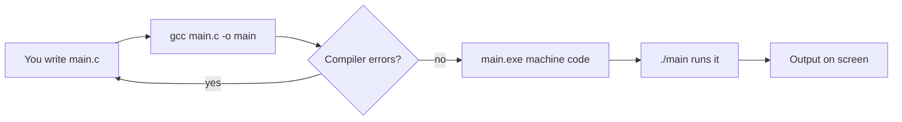

```
 main.c ──► gcc main.c -o main ──► main.exe ──► ./main ──► OUTPUT
   ▲                                │
   └────────── (fix errors) ◄───────┘
```

---

## 2. The program lifecycle — `main()` to `return 0`

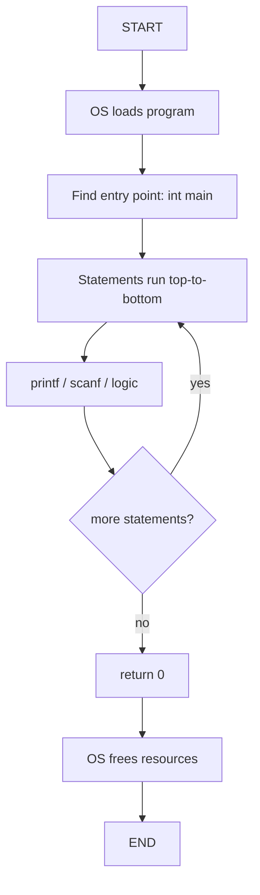

---

## 3. Data types decision tree

```mermaid
flowchart TD
    A[What value am I storing?] --> B{Number?}
    B -- no --> C{One character?}
    C -- yes --> D[char  %c  'A']
    C -- no --> E[String: char[]  %s  &quot;Hi&quot;]
    B -- yes --> F{Decimal point?}
    F -- no --> G[int  %d  25]
    F -- yes --> H{Need precision?}
    H -- no --> I[float  %f  19.99]
    H -- yes --> J[double  %lf  3.14159]
    B -- bool --> K[bool  true/false  <stdbool.h>]
```

---

## 4. `if / else if / else` — decision flowchart

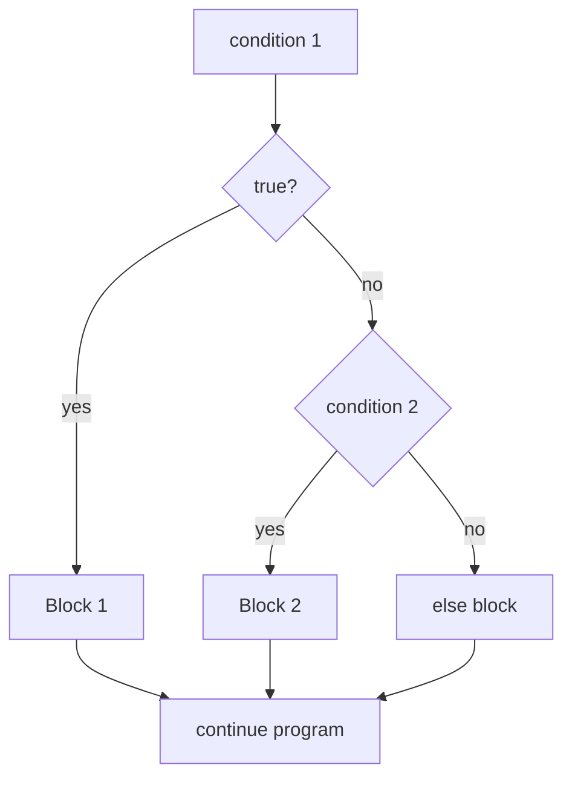

```
if (cond1) { … }        cond1? ──true──► Block1 ─┐
else if (cond2) { … }        │false              │
else { … }                   ▼                   ▼
                         cond2? ──true──► Block2 ─┤──► continue
                              │false              │
                              ▼                   ▼
                           Block3 ────────────────┘
```

---

## 5. Nested `if` (movie-ticket discounts)

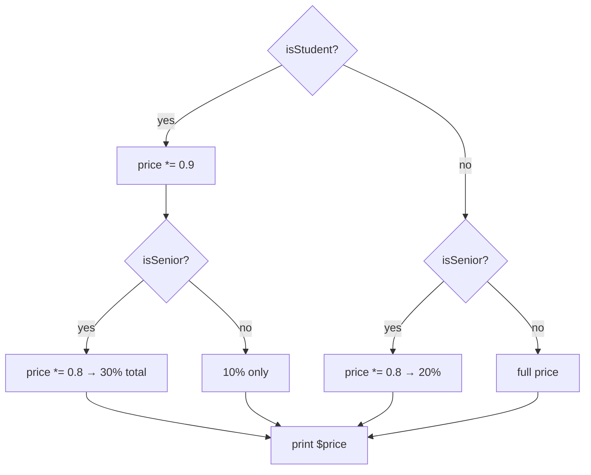

---

## 6. `switch` — dispatch by value

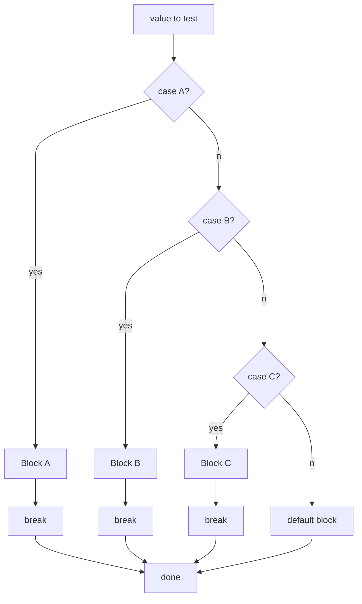

---

## 7. Ternary — one-line branch

```
condition ? X : Y

   condition?
      │
   yes▼    no▼
     X      Y
```

---

## 8. `while` loop — check first

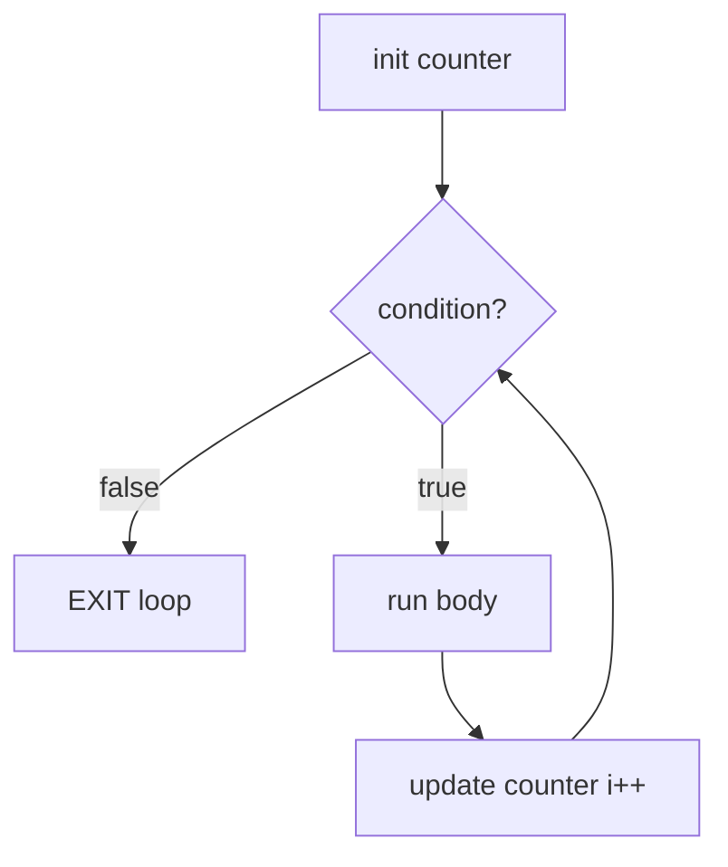

> Risk: forget the update → condition never false → **infinite loop**.

## 9. `do while` loop — body runs once minimum

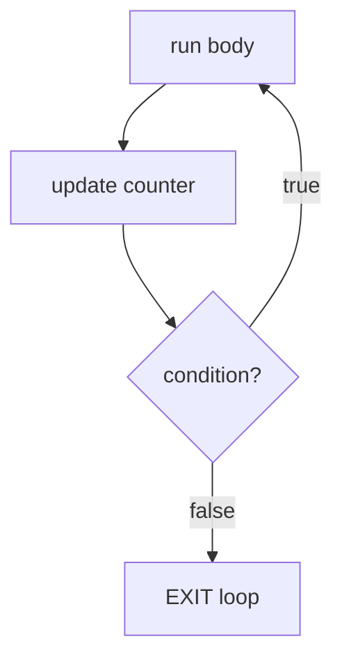

> Perfect for **menus & validation**: prompt the user, then ask "is the input valid?".

---

## 10. `for` loop — three parts, one line

```
for ( int i = 1 ; i <= 5 ; i++ )
       ▲           ▲        ▲
      start     condition  update
       │           │        │
       ▼           ▼        ▼
     runs ONCE  checked     runs AFTER
                EVERY run   each body run
       ┌───────────────────────┐
       │        body           │
       └───────────┬───────────┘
                   ▼
              condition false → exit
```

---

## 11. Nested loops — rows × columns (2D grid)

```
OUTER i = 1    i = 2    i = 3
   ┌─────────┐ ┌─────┐ ┌─────┐
   │ j=1,2,3 │ │j=…  │ │j=…  │   outer = rows
   └─────────┘ └─────┘ └─────┘
    inner loop = columns inside each row
```

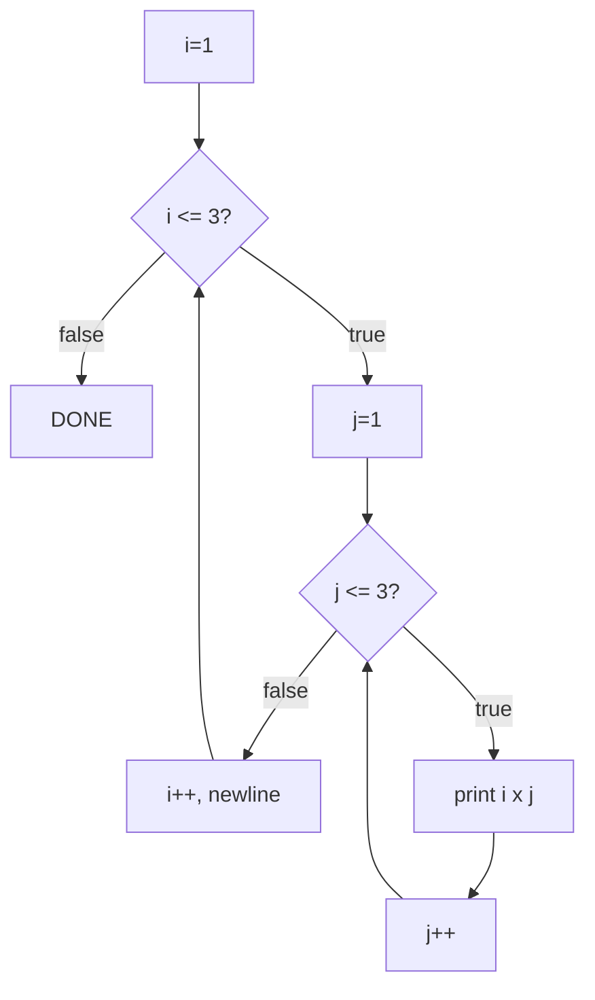

---

## 12. Function call — pass by value vs. pointer

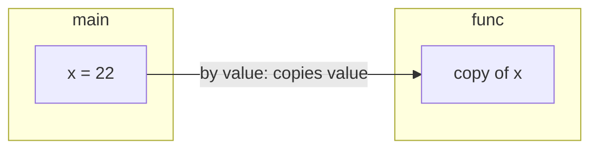

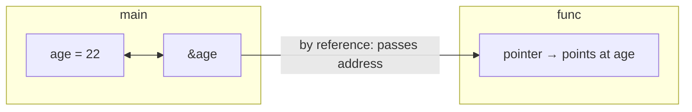

> **By value:** function gets a copy — original unchanged.
> **By pointer:** function gets the address — it can modify the original (like `scanf`).

---

## 13. 2D array — address & index map

```
numbers[3][3]        col 0    col 1    col 2
              row 0  [ 1 ]    [ 2 ]    [ 3 ]
              row 1  [ 4 ]    [ 5 ]    [ 6 ]
              row 2  [ 7 ]    [ 8 ]    [ 9 ]

numbers[2][1]  =  row 2, col 1  =  8
numbers[0][0]  =  row 0, col 0  =  1
```

---

## 14. Pointers — the star-shaped key

```
  memory (RAM)
  ┌──────────────┐
  │  age = 30    │  address 0x7ffd12
  └──────────────┘
        ▲
        │
  ┌─────┴──────┐
  │ pAge = 0x7ffd12 │  pAge points AT age
  └────────────┘

  &age   → 0x7ffd12   (address of age)
  *pAge  → 30         (dereference: the value age holds)
```

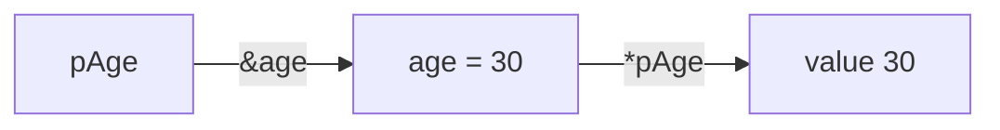

---

## 15. File I/O lifecycle

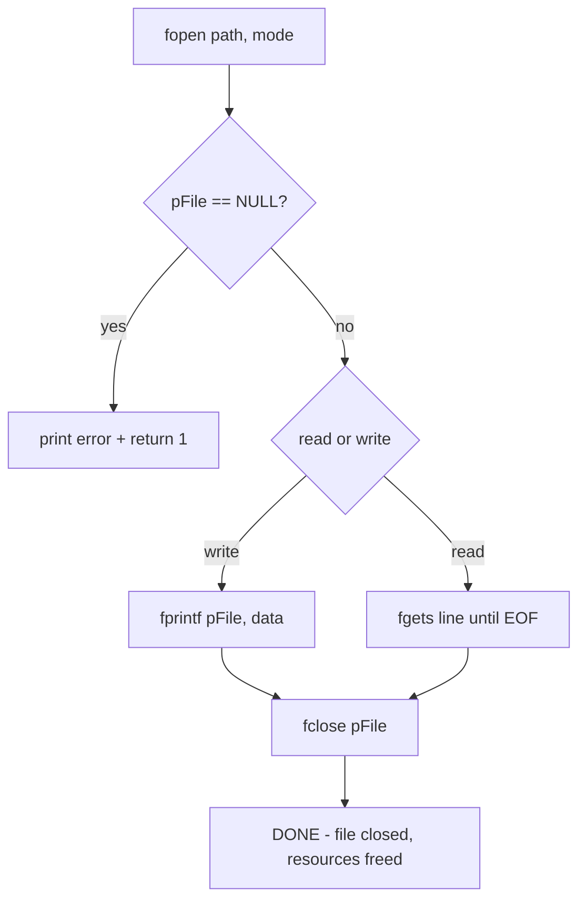

---

## 16. Dynamic memory — malloc → use → free

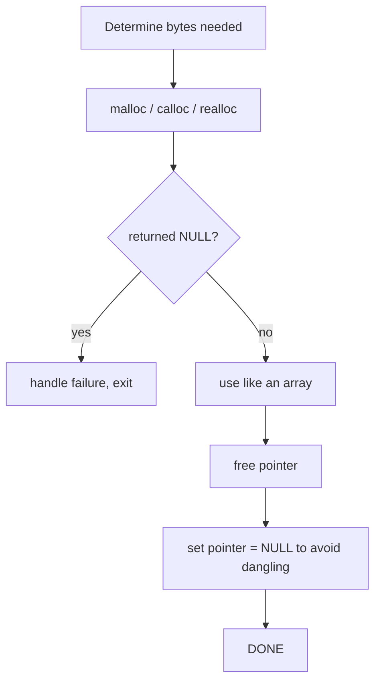

---

## 17. Project logic flowcharts

### A. Circle circumference

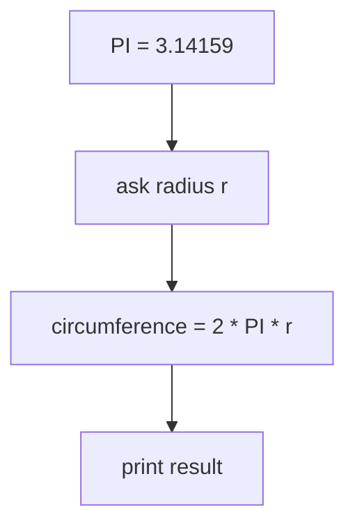

### B. Hypotenuse calculator

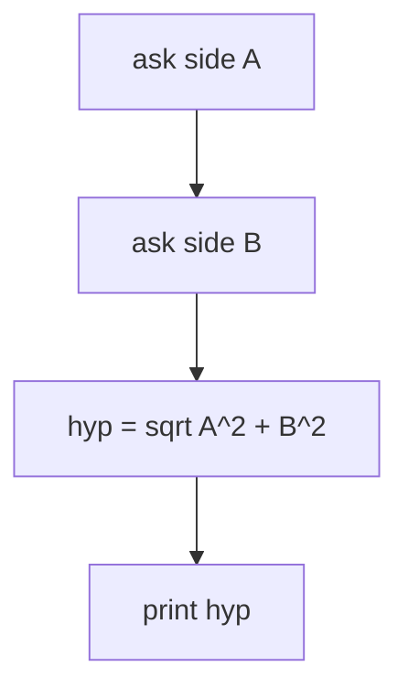

### C. Number guessing game

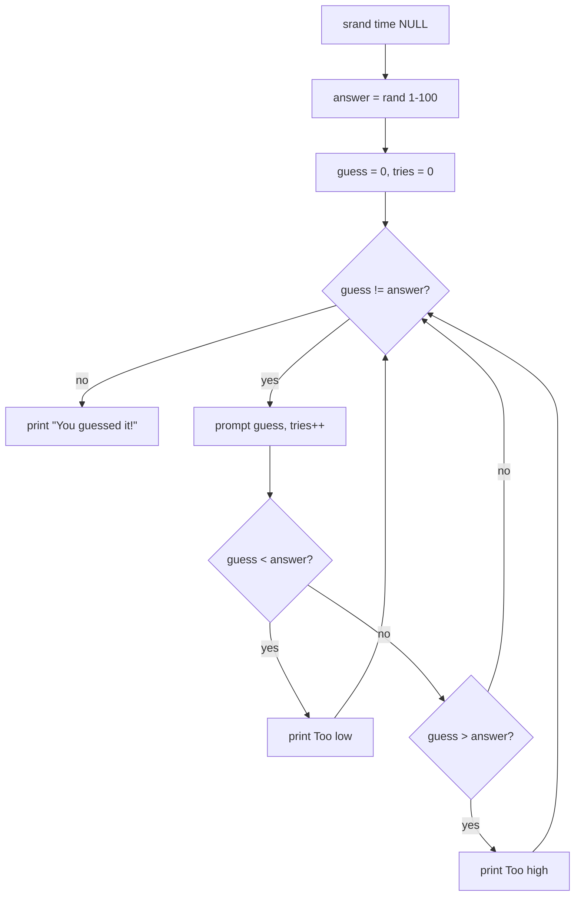

### D. Rock-paper-scissors

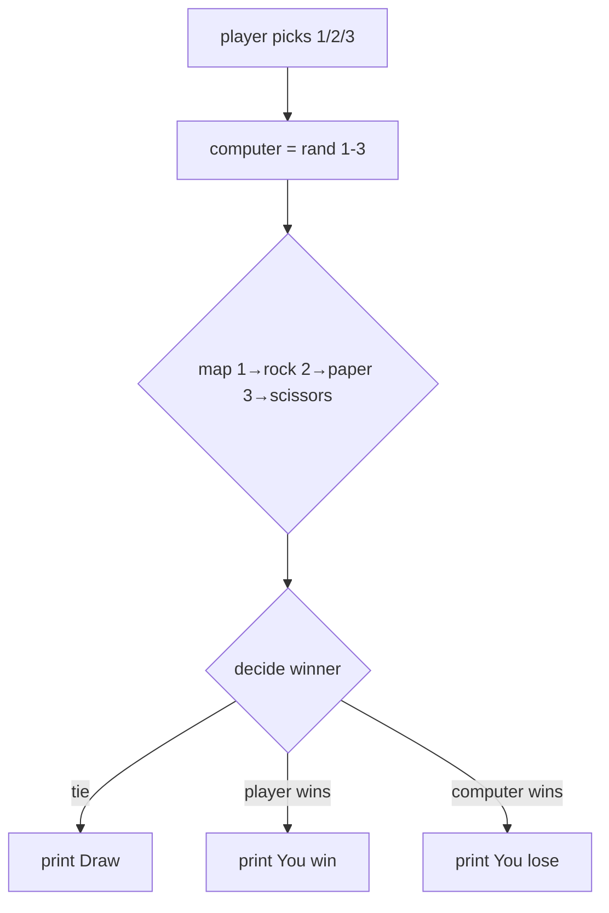

### E. Digital clock (final project)

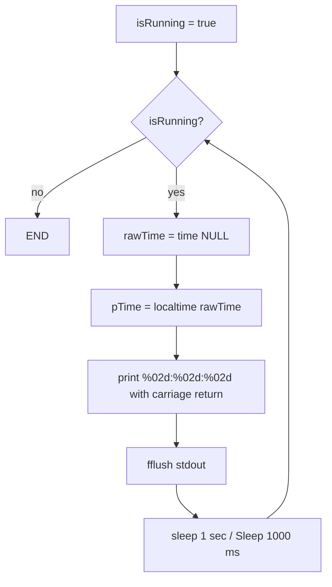

---

## 18. Beginner's debugging flowchart

```mermaid
flowchart TD
    A[Program won't compile] --> B{Read the FIRST error}
    B --> C{Missing ; or { }?}
    C -- yes --> D[add it, recompile]
    C -- no --> E{undefined main?}
    E -- yes --> F[check spelling: int main]
    E -- no --> G{unknown type?}
    G -- yes --> H[add missing #include e.g. stdbool.h]
    G -- no --> I[google the exact error text]
    D --> J{compiles now?}
    F --> J
    H --> J
    I --> J
    J -- no --> A
    J -- yes --> K[Wrong output? add printf debug lines]
    K --> L[compare against expected values]
```

---

**Companion pages:** [[c-programming/detailed-notes|Detailed notes]] · [[c-programming/projects|Projects]] · [[c-programming/beginners-guide|Beginner's guide]]