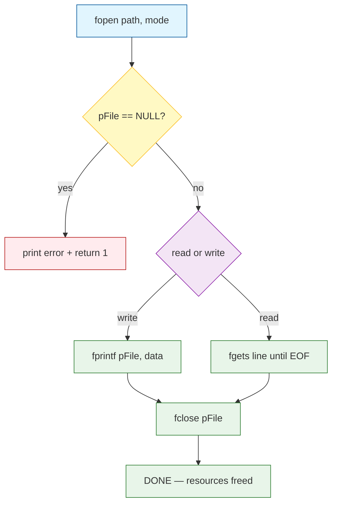
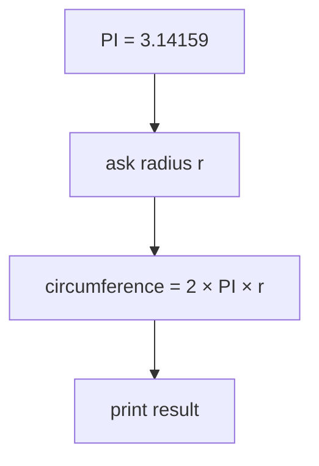
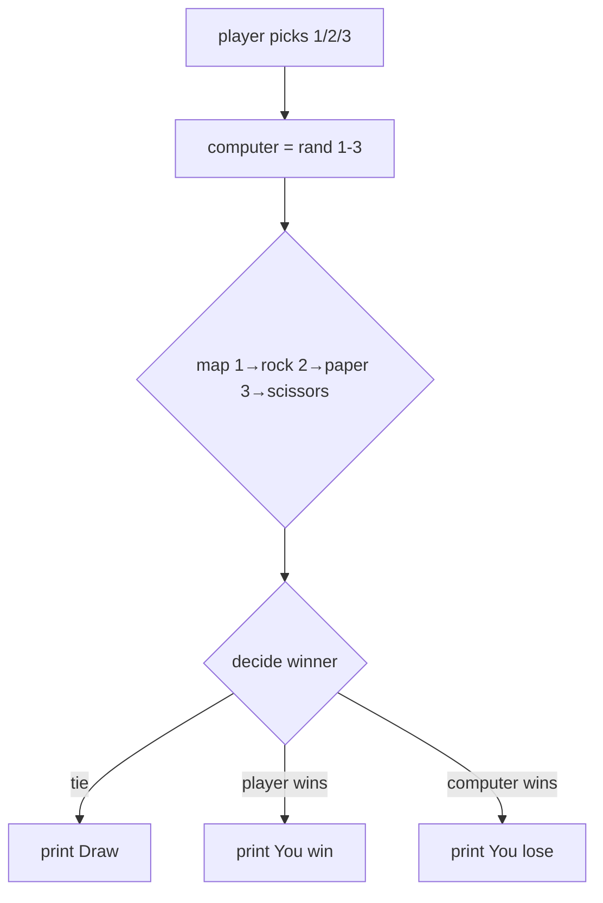
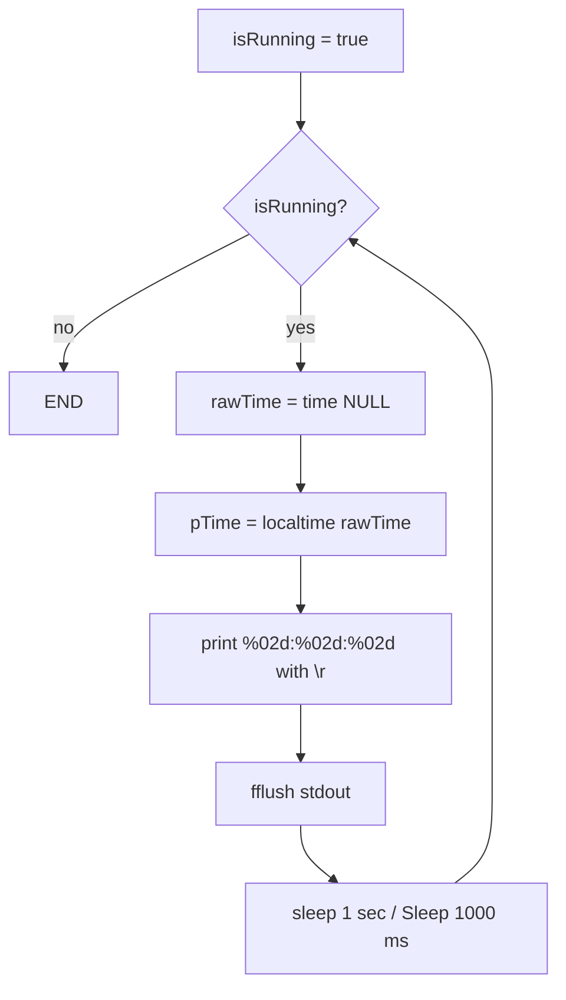

# C Memory Management — Flowcharts & Visuals

> Every core memory concept as a visual diagram. Mermaid diagrams render natively in Obsidian (`Ctrl/Cmd+Shift+P` → "Preview"); ASCII versions work anywhere.

---

## 1. Stack vs Heap — Decision Tree

```mermaid
flowchart TD
    A[Need to store data?] --> B{Known size at compile time?}
    B -- yes --> C{Size small enough for stack?}
    B -- no --> D[Heap via malloc/calloc/realloc]
    
    C -- yes --> E[Stack (auto, LIFO, fast)]
    C -- no --> F[Heap (manual, explicit free, flexible)]
    
    E --> G[Stack overflow risk if too big]
    F --> H[Memory leak risk if forgot to free]
    
    G --> I[Consider heap or reduce stack usage]
    H --> J[Use RAII pattern / goto cleanup / smart allocator]
```

```
┌─────────────────────────────────────────────────────────────────┐
│                      Stack vs Heap Decision                       │
│                                                                 │
│  KNOWN SIZE AT COMPILE TIME? ── YES ──────────────────────────> │
│  │                                                                 │
│  │  SMALL? ── YES ──► STACK (fast, auto-cleaned) │            │
│  │                                                                 │
│  │  LARGE? ── NO ────► HEAP (manual, flexible) │            │
│  │                                                                 │
│  │                                                                 │
│  NO ──────────────────────────────► HEAP (always) │            │
│                                                                 │
│  ┌─────────────────────────────────────────────────────────────┐ │
│  │  Remember: Stack = LIFO, Heap = explicit free (you choose) │ │
│  └─────────────────────────────────────────────────────────────┘ │
└─────────────────────────────────────────────────────────────────┘
```

---

## 2. `malloc` / `calloc` / `realloc` / `free` Lifecycle

```mermaid
flowchart TD
    A[Declare pointer: int *p] --> B[Check: ptr valid?]
    B -- no --> C[Dereference: CRASH / UB]
    B -- yes --> D{malloc/calloc/realloc?}
    
    D -- malloc --> E[Allocate on heap, ptr → user data]
    D -- calloc --> F[Allocate + ZERO-INIT, ptr → user data]
    D -- realloc --> G[Resize block, preserve old data]
    
    E --> H[Check: returned NULL?]
    F --> H
    G --> H
    
    H -- YES --> I[Handle allocation failure: exit / retry]
    H -- NO --> J[Use ptr like array: ptr[0], ptr[1], ...]
    
    J --> K{Still need memory?}
    K -- no --> L[free(ptr); ptr = NULL;]
    K -- yes --> M[realloc(ptr, new_size)]
    
    L --> N[DONE — safe dangling avoided]
    M --> O[Loop back to J]
```

```
┌─────────────────────────────────────────────────────────────────┐
│                   Malloc/calloc/realloc/free Lifecycle          │
│                                                                 │
│  DECLARE ──► ALLOCATE ──► VALIDATE ──► USE ──► FREE ──► DONE   │
│                                                                 │
│  arrows show:                                                       │
│  ┌───────────────┐  ┌───────────────┐  ┌───────────────┐           │
│  │ malloc        │  │ returned NULL │  │ use like array │           │
│  └───────┬───────┘  └───────┬───────┘  └───────┬───────┘           │
│          │                  │                  │                       │
│          ▼                  ▼                  ▼                       │
│  ┌─────────────────────────────────────────────────────────────────┐ │
│  │ After free: ptr is DANGLING — set to NULL immediately!         │ │
│  └─────────────────────────────────────────────────────────────────┘ │
│                                                                 │
│  CRITICAL: free(ptr) then using ptr = USE AFTER FREE (CRASH!)   │ │
│                                                                 │
└─────────────────────────────────────────────────────────────────┘
```

---

## 3. Pointer Arithmetic — Scaling Rules

```
┌─────────────────────────────────────────────────────────────────┐
│                   Pointer Arithmetic Scaling                     │
│                                                                 │
│  ASSUME: p = 0x1000 starting address                             │
│                                                                 │
│  TYPE          sizeof    p+0      p+1      p+2      p+3      │
│  char *        1 byte    0x1000   0x1001   0x1002   0x1003   │
│  short *       2 bytes   0x1000   0x1002   0x1004   0x1006   │
│  int *         4 bytes   0x1000   0x1004   0x1008   0x100C   │
│  double *      8 bytes   0x1000   0x1008   0x1010   0x1018   │
│  struct Node *16 bytes  0x1000   0x1010   0x1020   0x1030   │
│                                                                 │
│  FORMULA: p + i → advances i × sizeof(*p) bytes                │
│                                                                 │
│  p - q → ptrdiff_t: elements between (not bytes!)              │
│                                                                 │
│  ⚠️  One-past-end: p + N (where N = array size) is LEGAL        │
│       but p + N + 1 and p - 1 are UNDEFINED BEHAVIOR           │
│                                                                 │
│  ❌  Arithmetic between unrelated pointers = UB                   │
│                                                                 │
└─────────────────────────────────────────────────────────────────┘
```

### ASCII Visual: Pointer Arithmetic

```
INT ARRAY: int arr[5] = {10, 20, 30, 40, 50};  base = 0x1000

       Byte Address:  0x1000  0x1004  0x1008  0x100C  0x1010
       Value:         10     20      30      40      50

       int *p = arr;       // p = 0x1000, points to arr[0]
       p + 1 → 0x1004       // advances sizeof(int) = 4 bytes
       p + 2 → 0x1008       // arr[2] = 30
       p + 3 → 0x100C       // arr[3] = 40
       p + 4 → 0x1010       // arr[4] = 50 — ONE PAST END
       p + 5 → 0x1014       // UB — past one-past-end
```

---

## 4. `if / else if / else` — Memory Decision Tree

```mermaid
flowchart TD
    A[Need dynamic memory?] --> B{Size known at runtime?}
    B -- yes --> C{might exceed stack limit?}
    B -- no --> D{compile-time constant?}
    
    C -- yes --> E[Heap: malloc/calloc/realloc]
    C -- no --> F[Stack array: int arr[size]]
    
    D -- yes --> G[Stack: int arr[SIZE]]
    D -- no --> E[Heap: malloc/calloc]
    
    E --> H{Need to free later?}
    F --> I[auto-free when scope exits]
    
    H -- yes --> J[heap + explicit free()]
    H -- no --> K[VLA (C99) or stack — free automatic]
    
    I --> L[Must track ownership: ptr = NULL after free]
    M --> N[Use goto cleanup / RAII / arena pattern]
```

```
┌─────────────────────────────────────────────────────────────────┐
│                Runtime-Size Memory Decision Tree                │
│                                                                 │
│  SIZE KNOWN AT RUNTIME? ── YES ──►                                                 │
│  │                                                                 │
│  │  MIGHT EXCEED STACK? ── YES ──► HEAP (malloc/calloc) │            │
│  │                                                                 │
│  │  MIGHT EXCEED STACK? ── NO  ──► STACK or VLA (C99) │            │
│  │                                                                 │
│  NO ──────────────────────────────────────► STACK (auto-free) │            │
│                                                                 │
│  KNOWN COMPILE-TIME CONSTANT? ── YES ──► STACK (fixed size) │            │
│  NO ──────────────────────────────────────► HEAP (flexible) │            │
│                                                                 │
│  CLEANUP:                               │              │
│  Heap → explicit free() needed        │              │
│  Stack  → auto-free at scope exit     │              │
│                                                                 │
└─────────────────────────────────────────────────────────────────┘
```

---

## 5. Nested `if` — Movie Ticket Discount with Memory Context

```
┌─────────────────────────────────────────────────────────────────┐
│               Nested if (Ticket Discount) + Memory Pattern    │
│                                                                 │
│  isStudent? ── YES ──► price *= 0.9  (10% off) ──►                │
│           │                                                │
│           └─ isSenior? ── YES ──► price *= 0.8  (total 30%) │
│                                               │                 │
│                                               └─ isSenior? ── NO │
│                                                                 │
│  isStudent? ── NO ──►                                                 │
│           │                                                             │
│           └─ isSenior? ── YES ──► price *= 0.8  (20% off)         │
│                 │                                                     │
│                 └─ isSenior? ── NO ──► full price                   │
│                                                                 │
│  ⚠️  Memory analogy: nested if = stacking discounts on original │
│     price (NOT compounding). Same principle: each condition      │
│     evaluates independently; avoid nested malloc/free without   │
│     clear ownership model.                                        │
│                                                                 │
└─────────────────────────────────────────────────────────────────┘
```

---

## 6. `switch` — Dispatch by Value (with Memory Pattern)

```
┌─────────────────────────────────────────────────────────────────┐
│                   switch — Memory Dispatch Pattern              │
│                                                                 │
│  SELECT ONE:                                                │
│                                                                 │
│  case A:  allocate & process ──► break                        │
│          │                                                 │
│  case B:  allocate & process ──► break                        │
│          │                                                 │
│  case C:  allocate & process ──► break                        │
│          │                                                 │
│  default: handle error / fallback                           │
│                                                                 │
│  ⚠️  Without break: fall-through executes next case           │
│     ─► intentional fall-through requires explicit comment     │
│                                                                 │
│  💡  Pattern: each case should own its resources; free in     │
│     cleanup or at end of case block                            │
│                                                                 │
└─────────────────────────────────────────────────────────────────┘
```

---

## 7. Ternary — One-Line Branch (Memory Safety)

```
┌─────────────────────────────────────────────────────────────────┐
│                 ternary ? a : b — Memory Safety               │
│                                                                 │
│  result = (condition) ? malloc(sz) : malloc(sz2);             │
│                                                                 │
│  ⚠️  PROBLEM: ternary mixes allocation with assignment          │
│      → hard to free both paths cleanly                         │
│                                                                 │
│  ❌  DON'T:  p = cond ? malloc(10) : malloc(20);                │
│           │                     (who frees which?)             │
│                                                                 │
│  ✅  DO:           tmp = malloc(10);                          │
│           │                     if (cond) p = tmp; else {       │
│           │                       free(tmp); /* path 2 */     │
│           │                     }                              │
│           │                     // p owns allocation      │
│                                                                 │
│  ✅  BETTER: use if/else for clear ownership, or arena allocator│
│                                                                 │
└─────────────────────────────────────────────────────────────────┘
```

---

## 8. `while` Loop — Check First (with Memory Pattern)

```
┌─────────────────────────────────────────────────────────────────┐
│               while — Memory Safety Pattern                    │
│                                                                 │
│  while (condition) {                                          │
│      // allocate inside loop:                               │
│      int *p = malloc(sizeof(int));                           │
│      // must free each iteration (or track ownership)         │
│      free(p);                                                 │
│  }                                                            │
│                                                                 │
│  ⚠️  PROBLEM: if allocation succeeds every iteration but      │
│     free is forgotten → MEMORY LEAK (accumulates!)            │
│                                                                 │
│  ✅  FIX: use goto cleanup inside loop, or arena allocator    │
│       to batch-free all at once after loop exits              │
│                                                                 │
└─────────────────────────────────────────────────────────────────┘
```

### ASCII Visual: while Loop with Memory

```
                ┌───────────────────────────────────────┐
                │  condition (e.g., i < N  or  key)    │
                └──────────────┬────────────────────────┘
                               │
                               ▼ Yes
                 ┌────────────────────────────────┐
                 │  Loop Body                       │
                 │  ──► allocate (malloc)           │
                 │  ──► use (read/write)            │
                 │  ──► free(p)                     │
                 │  ──► update counter/index        │
                 └──────────────┬───────────────────┘
                                │
                                ▼ No
                         Exit Loop
```

---

## 9. `do while` Loop — Body Runs Once Minimum

```
┌─────────────────────────────────────────────────────────────────┐
│                 do while — Minimum One Run                      │
│                                                                 │
│  do {                                                         │
│      // allocate, use, ...                                    │
│  } while (condition);                                         │
│                                                                 │
│  ✅  GUARANTEED: body executes at least ONCE                    │
│                                                                 │
│  💡  Perfect for: menus, validation, first-prompt scenarios    │
│                                                                 │
│  ⚠️  Same leak risk as while if free forgotten inside body     │
│                                                                 │
└─────────────────────────────────────────────────────────────────┘
```

### ASCII Visual: do while with Memory

```
         ┌─────────────────────────────────────┐
         │  1. Run body (once guaranteed)      │
         │       ──► allocate (malloc)           │
         │       ──► use data                  │
         │       ──► free(p)                    │
         │  2. Update condition                │
         │  3. Is condition true? ──► YES ──► go to 1 │
         │                │                      │
         │                └────── NO ──────────► Exit │
         └─────────────────────────────────────┘
```

---

## 10. `for` Loop — Three Parts in One Line

```
┌─────────────────────────────────────────────────────────────────┐
│                 for Loop — Init/Cond/Update                     │
│                                                                 │
│  for (init; condition; update) {                              │
│      // body                                                  │
│  }                                                              │
│                                                                 │
│  ┌─────────────────┐  ┌─────────────────┐  ┌─────────────────┐ │
│  │ init runs ONCE  │  │ cond checked   │  │ update runs     │ │
│  │ (before first)   │  │ BEFORE each    │  │ AFTER each      │ │
│  │                  │  │ body run       │  │ body run        │ │
│  └──────┬───────────┘  └──────┬───────────┘  └──────┬──────────┘ │
│         │                    │                    │              │
│         ▼                    ▼                    ▼              │
│  ┌───────────────────────────────────────────────────────────────┐ │
│  │  visual:                                                    │ │
│  │  init ──▼───────────────────────┐                               │ │
│  │                                     │                               │ │
│  │          condition?             │                               │ │
│  │          │                       │                               │ │
│  │          │         yes           │                               │ │
│  │          │         ▼             │                               │ │
│  │          │   ┌─────────────────┐│                               │ │
│  │          │   │     body      ││                               │ │
│  │          │   └───────┬─────────┘│                               │ │
│  │          │           │       │                               │ │
│  │          │           ▼       │                               │ │
│  │          │   ┌─────────────┴───────────┐                       │ │
│  │          │   │   update (i++)      │                       │ │
│  │          │   └───────────────────────┘                       │ │
│  │          │                                     │             │ │
│  │          └─────── loop exits when condition false    │             │ │
│  └───────────────────────────────────────────────────────────────┘ │
│                                                                 │
└─────────────────────────────────────────────────────────────────┘
```

### ASCII Visual: for Loop Memory Arithmetic

```
FOR LOOP over ARRAY: int arr[5] = {10, 20, 30, 40, 50}

       for (int *p = arr; p < arr + 5; p++) {   // init, cond, update
            printf("%d\n", *p);                   // dereference current
       }

       iteration 0: p = arr + 0 = 0x1000 → *p = 10
       iteration 1: p = arr + 1 = 0x1004 → *p = 20
       iteration 2: p = arr + 2 = 0x1008 → *p = 30
       iteration 3: p = arr + 3 = 0x100C → *p = 40
       iteration 4: p = arr + 4 = 0x1010 → *p = 50
       iteration 5: p = arr + 5 = 0x1014 → CONDITION false → EXIT
```

---

## 11. Nested Loops — 2D Grid / Matrix Memory Layout

```
┌─────────────────────────────────────────────────────────────────┐
│              Nested Loops — Row × Column Grid                   │
│                                                                 │
│  for (int i = 0; i < rows; i++) {        // outer: rows       │
│      for (int j = 0; j < cols; j++) {    // inner: columns   │
│          printf("%d ", arr[i][j]);        // access element    │
│      }                                                              │
│      printf("\\n");                                                   │
│  }                                                                    │
│                                                                 │
│  💡  Convention: i = outer (rows), j = inner (columns)          │
│                                                                 │
│  💡  Memory: arr[i][j] → arr[i * cols + j] (row-major order)    │
│                                                                 │
┌─────────────────────────────────────────────────────────────────┐
│  VISUAL: 3×3 matrix with index calculation                      │
│                                                                 │
│  int arr[3][3] = {                         │
│      {1, 2, 3},     // row 0              │
│      {4, 5, 6},     // row 1              │
│      {7, 8, 9}      // row 2              │
│  };                                       │
│                                                                 │
│  Index math (row-major):                   │
│      arr[0][0] → offset 0  = 1           │
│      arr[0][1] → offset 1  = 2           │
│      arr[0][2] → offset 2  = 3           │
│      arr[1][0] → offset 3  = 4           │   ← row 1 starts at byte 3 × sizeof(int)│
│      arr[1][1] → offset 4  = 5           │
│      arr[1][2] → offset 5  = 6           │
│      arr[2][0] → offset 6  = 7           │
│      arr[2][1] → offset 7  = 8           │
│      arr[2][2] → offset 8  = 9           │
│                                                                 │
│  Formula: arr[i][j] → &arr[0][0] + (i × cols + j) × sizeof(int)│
│                                                                 │
└─────────────────────────────────────────────────────────────────┘
```

---

## 12. Function Call — Pass by Value vs Pointer (Memory)

```
┌─────────────────────────────────────────────────────────────────┐
│               Pass by Value vs Pass by Pointer                  │
│                                                                 │
│  void by_value(int x) { x = 100; }                              │
│       │ caller's original unchanged (copy)                        │
│                                                                 │
│  void by_pointer(int *p) { *p = 100; }                          │
│       │ caller's variable CHANGED (address passed)                │
│                                                                 │
│                                                                 │
│  ANAL YSIS:                                                   │
│                                                                 │
│  Call by value:                                                    │
│       │                                                           │
│       ▼                                                           │
│  main:        x = 5                                                 │
│           │                                                       │
│  call:        copy = 5                                              │
│           │                                                       │
│  by_value:    copy = 100                                            │
│           │                                                       │
│  main:        x = 5  ← UNCHANGED                                    │
│                                                                 │
│  Call by pointer:                                                    │
│       │                                                           │
│       ▼                                                           │
│  main:        x = 5                                                 │
│           │                                                       │
│  call:        &x → 0x7ffd1234                                        │
│           │                                                       │
│  by_pointer:  *p = 100 → writes to 0x7ffd1234                     │
│           │                                                       │
│  main:        x = 100  ← CHANGED                                    │
│                                                                 │
│  ⚠️  scanf is classic pass-by-pointer example!                    │
│                                                                 │
└─────────────────────────────────────────────────────────────────┘
```

### ASCII Visual: Pass by Value vs Pointer

```
                    ┌─────────────────────────────────────────────────┐
                    │                    MAIN (caller)                │
                    │  ┌───────────────┐    ┌─────────────────────┐ │
                    │  │  int x = 5    │    │   &x → address      │ │
                    │  └───────────────┘    └─────────────────────┘ │
                    │                                                    │
                    │                                                    │
                    │                                                    │
                    │                                                    │
                    ├─────────────────────────────────────────────────┤
                    │                    FUNCTION (callee)              │
                    │                                                   │
                    │  void by_value(int x) { x = 100; }              │
                    │       │ x = copy of 5 → 100 (local)               │
                    │                                                   │
                    ├─────────────────────────────────────────────────┤
                    │                    void by_pointer(int *p)        │
                    │                                                   │
                    │  main calls:  by_pointer(&x);                     │
                    │                                                   │
                    │  p points at x's address  (0x7ffd1234)          │
                    │  *p = 100;                                        │
                    │  │──────────────────────►  writes 100 at addr      │
                    │                                                   │
                    │  x becomes 100                                    │
                    │                                                   │
                    └─────────────────────────────────────────────────┘
```

---

## 13. 2D Array — Address & Index Map (Memory Layout)

```
┌─────────────────────────────────────────────────────────────────┐
│              2D Array — Memory Layout Visual                    │
│                                                                 │
│  int numbers[3][3] = {                        │
│      {1, 2, 3},     // row 0                │
│      {4, 5, 6},     // row 1                │
│      {7, 8, 9}      // row 2                │
│  };                                           │
│                                                                 │
│  ┌─────────────┬─────────────┬─────────────┐              │
│  │     1     │     2     │     3     │              │
│  │     4     │     5     │     6     │              │
│  │     7     │     8     │     9     │              │
│  └─────────────┴─────────────┴─────────────┘              │
│                                                                 │
│  Memory (row-major, 4-byte ints):            │
│  Byte Offset: 0    4    8   12   16   20   24   28   32   │
│  Value:          1    2    3   4   5   6   7   8   9       │
│                                                                 │
│  Index formula:                              │
│      numbers[i][j] → numbers[0][0] + (i × 3 + j) × 4  │
│      (where 3 = number of columns, 4 = sizeof(int))      │
│                                                                 │
│  Access:                                     │
│      numbers[0][0] → *(numbers[0][0])       │
│      numbers[1][1] → *(numbers[0][0] + (1×3+1)×4) = *(+16)│
│                                                                 │
└─────────────────────────────────────────────────────────────────┘
```

---

## 14. Pointers — The Star-Shaped Key (Memory Map)

```
┌─────────────────────────────────────────────────────────────────┐
│                 Pointers — Memory Map Visual                    │
│                                                                 │
│  ┌───────────────────────┐   ┌───────────────────────┐    │
│  │  age = 30 (int)       │   │  pAge = 0x7ffd1234    │    │
│  │  address: 0x7ffd1234 │   │  (pointer variable)   │    │
│  │  occupies 4 bytes     │   └───────────────────────┘    │
│  └───────────────────────┘              ▲                     │
│                                              │                     │
│  ┌───────────────────────┐                │                     │
│  │  &age = 0x7ffd1234     │                │                     │
│  │  address-of operator │                │                     │
│  └───────────────────────┘                │                     │
│                                              │                     │
│  ┌───────────────────────┐                │                     │
│  │ *pAge = 30 (deref)    │                │                     │
│  │  follow the key →     │                │                     │
│  │  value at that addr   │                │                     │
│  └───────────────────────┘                │                     │
│                                                                 │
│  KEY:                                                         │
│  ┌───────────────────────────────────────────────────────┐ │
│  │ * in declaration   → "this is a pointer to..."        │ │
│  │ &                  → "address of" (operator)          │ │
│  │ * in use           → "dereference: follow key to     │ │
│  │                    value"                              │ │
│  └───────────────────────────────────────────────────────┘ │
│                                                                 │
└─────────────────────────────────────────────────────────────────┘
```

### ASCII Visual: Memory Map

```
MEMORY (RAM — simplified):

Address: 0x7ffd1230   0x7ffd1234   0x7ffd1238   0x7ffd123C
─────────────────────────────────────────────────────────────────────
Data:    [padding]    age = 30      [padding]    [padding]
         (4 bytes)      (int, 4 bytes)          (4 bytes)

Address: 0x7ffd1234  ← pAge points here
─────────────────────────────────────────────────────────────────────
Data:    0x7ffd1234  ← pAge VALUE = address of age

When we do *pAge:
   - Follow the address 0x7ffd1234
   - Read the value stored there: 30

When we do &age:
   - Get the address of age: 0x7ffd1234

Flow:
   &age   → 0x7ffd1234   (address-of: "where is age?")
   *pAge  → 30           (dereference: "what value is at that address?")
   *pAge = 31 → writes 31 to age
```

---

## 15. File I/O Lifecycle



```
┌─────────────────────────────────────────────────────────────────┐
│                   File I/O Lifecycle                            │
│                                                                 │
│  ┌─────────────────────────────────────────────────────────┐ │
│  │  fopen("file.txt", "w")   → open for writing          │ │
│  │       │                                                   │ │
│  │       │  check: pFile == NULL?  (handle error)          │ │
│  │       │                                                   │ │
│  │       │  fprintf(pFile, "data") → write               │ │
│  │       │                                                   │ │
│  │       │  fclose(pFile) → close + free resources         │ │
│  │       └─────────────────────────────────────────────────┘ │
│  │                                                                 │ │
│  │  fopen("file.txt", "r")   → open for reading          │ │
│  │       │                                                   │ │
│  │       │  check: pFile == NULL?  (handle error)          │ │
│  │       │                                                   │ │
│  │       │  fgets(line, size, pFile) → read line           │ │
│  │       │                                                   │ │
│  │       │  fclose(pFile) → close + free resources         │ │
│  │       └─────────────────────────────────────────────────┘ │
│  │                                                                 │ │
│  ⚠️  THE 3 GOLDEN RULES:                                     │ │
│  │  1. Always check fopen return                           │ │
│  │  2. Use appropriate mode ("r", "w", "a")                │ │
│  │  3. Always fclose when done (release OS resources)      │ │
│  │                                                                 │ │
└─────────────────────────────────────────────────────────────────┘
```

---

## 16. Dynamic Memory — malloc → use → free Lifecycle

```mermaid
flowchart TD
    A[Determine bytes needed] --> B[malloc / calloc / realloc]
    B --> C{returned NULL?}
    C -- yes --> D[handle failure: exit or retry]
    C -- no --> E[use like an array: ptr[0], ptr[1], ...]
    E --> F[free(ptr)]
    F --> G[ptr = NULL (avoid dangling)]
    G --> H[DONE — memory returned to OS]
    
    style A fill:#e1f5fe,stroke:#01579b
    style B fill:#e8f5e9,stroke:#2e7d32
    style C fill:#fff9c4,stroke:#fbc02d
    style D fill:#ffebee,stroke:#b71c1c
    style E fill:#f3e5f5,stroke:#8e24aa
    style F fill:#f3e5f5,stroke:#8e24aa
    style G fill:#f3e5f5,stroke:#8e24aa
    style H fill:#e8f5e9,stroke:#2e7d32
```

```
┌─────────────────────────────────────────────────────────────────┐
│                   Dynamic Memory Lifecycle                      │
│                                                                 │
│  1. DETERMINE bytes needed (sizeof *type * count)             │ │
│                                                                 │
│  2. ALLOCATE: malloc(bytes)                                   │ │
│      │ if (ptr == NULL) → allocation FAILED                  │ │
│      │ ptr = malloc(bytes);                                │ │
│                                                                 │
│  3. USE:  ptr[0] = value;  ptr[i] = ...                     │ │
│      │ treat like array (but size known only at runtime)   │ │
│                                                                 │
│  4. FREE:   free(ptr);                                        │ │
│      │ returns memory to heap for reuse                     │ │
│                                                                 │
│  5. SAFETY: ptr = NULL;                                       │ │
│      │ prevents use-after-free if accidentally dereferenced │ │
│                                                                 │
│                                                                 │
│  💡  COMMON PATTERNS:                                         │ │
│                                                                 │
│  ────────────────────────────────────────────────────────────── │ │
│  malloc + free (single block)                                 │ │
│                                                                 │
│  calloc(n, sz)   → zero-init all n*sz bytes                   │ │
│                                                                 │
│  realloc(p, n)   → resize block, preserves old data up to min │ │
│                                                                 │
│  malloc + memset  → allocate then initialize manually        │ │
│                                                                 │
│  ── malloc → use → free → NULL  (repeat as needed)           │ │
│                                                                 │
│  ⚠️  pitfalls:                                                  │ │
│      │ forgot to free     → MEMORY LEAK (accumulates)        │ │
│      │ free then use      → USE AFTER FREE (UB / crash)     │ │
│      │ double free        → CORRUPTED HEALTH / CRASH       │ │
│      │ no NULL check      → dereference NULL if fail       │ │
│                                                                 │
│  🛡️  DEFENSIVE PATTERN:                                        │ │
│      if (ptr) free(ptr);  ptr = NULL;                         │ │
│                                                                 │
└─────────────────────────────────────────────────────────────────┘
```

---

## 17. Project Logic Flowcharts (Selected)

### A. Circle Circumference



### B. Hypotenuse Calculator

```mermaid
flowchart TD
    A[ask side A] --> B[ask side B]
    B --> C[hyp = sqrt(A² + B²)]
    C --> D[print hyp]
```

### C. Number Guessing Game

```mermaid
flowchart TD
    A[srand time NULL] --> B[answer = rand 1-100]
    B --> C[guess = 0, tries = 0]
    C --> D{guess != answer?}
    D -- no --> E[print "You guessed it!"]
    D -- yes --> F[prompt guess, tries++]
    F --> G{guess < answer?}
    G -- yes --> H[print "Too low"]
    G -- no --> I{guess > answer?}
    I -- yes --> J[print "Too high"]
    I -- no --> D
    H --> D
    J --> D
```

### D. Rock-Paper-Scissors



### E. Digital Clock (Final Project)



---

## 18. Beginner's Debugging Flowchart

```mermaid
flowchart TD
    A[Program won't compile] --> B{Read the FIRST error}
    B --> C{Missing ; or { }?}
    C -- yes --> D[add it, recompile]
    C -- no --> E{undefined main?}
    E -- yes --> F[check spelling: int main]
    E -- no --> G{unknown type?}
    G -- yes --> H[add missing #include e.g. stdbool.h]
    G -- no --> I[google the exact error text]
    D --> J{compiles now?}
    F --> J
    H --> J
    I --> J
    J -- no --> A
    J -- yes --> K[Wrong output? add printf debug lines]
    K --> L[compare against expected values]
```

```
┌─────────────────────────────────────────────────────────────────┐
│               Beginner's Debugging Flowchart                    │
│                                                                 │
│  ┌─────────────────────────────────────────────────────────┐ │
│  │  A: Program won't compile                              │ │
│  │       │                                                 │ │
│  │       │  B: Read the FIRST compiler error               │ │
│  │       │                                                 │ │
│  │       │  C: Missing ; or { }?                           │ │
│  │       │      │  D: Add it, recompile                       │ │
│  │       │      │                                                 │ │
│  │       │  E: undefined main?                             │ │
│  │       │      │  F: check spelling — is it int main?     │ │
│  │       │      │                                                 │ │
│  │       │  G: unknown type (e.g. bool)?                    │ │
│  │       │      │  H: add missing #include (stdbool.h)      │ │
│  │       │      │                                                 │ │
│  │       │  I: google the exact error text                 │ │
│  │       │                                                 │ │
│  │       │  J: Does it compile now?                        │ │
│  │       │      │  │  if NO → go back to A                   │ │
│  │       │      │  │  if YES → goto K (wrong output)         │ │
│  │       │      │                                                 │ │
│  │       │  K: Wrong output?                               │ │
│  │       │      │  L: add printf debug lines                 │ │
│  │       │      │                                                 │ │
│  │       │      │  M: compare output against expected values │ │
│  │       └─────────────────────────────────────────────────┘ │
│  │                                                                 │ │
│  │  💡  TIPS:                                              │ │
│  │       • Fix errors top-to-bottom (first error may mask     │ │
│  │         others)                                          │ │
│  │       • Recompile after each fix                         │ │
│ │       • Use -Wall -Wextra for maximum warnings           │ │
│ │       • Add printf at strategic points to trace flow     │ │
│ │       • For memory bugs: compile with -fsanitize=address   │ │
│  │                                                                 │ │
└─────────────────────────────────────────────────────────────────┘
```

---

## 19. Common Memory Bugs — Visual Taxonomy

```mermaid
flowchart TD
    A[Memory Bugs] --> B[Allocation Failures]
    A --> C[Use-After-Free (UAF)]
    A --> D[Buffer Overflows]
    A --> E[Memory Leaks]
    A --> F[Uninitialized Memory]
    A --> G[Aliasing / Alignment]
    A --> H[Fragmentation]
    
    B --> B1[Not checking NULL]
    B --> B2[Integer overflow in size]
    B --> B3[Size mismatch: sizeof(ptr) vs sizeof(*ptr)]
    
    C --> C1[Dereference after free()]
    C --> C2[Double free: free(ptr); free(ptr)]
    C --> C3[Free non-heap pointer]
    C --> C4[Free middle of block]
    
    D --> D1[Heap overflow: write past boundary]
    D --> D2[Stack overflow: large local / recursion]
    D --> D3[Off-by-one: alloc n, write n+1]
    D --> D4[String overflow: strcpy without bounds]
    
    E --> E1[Lost pointer: p = malloc(); p = malloc()]
    E --> E2[Early return without free]
    E --> E3[Exception path missing free]
    
    F --> F1[malloc (not calloc) — garbage]
    F --> F2[Stack vars without init]
    F --> F3[Padding bytes in struct]
    
    G --> G1[Strict aliasing: int *p = (int*)&float_var]
    G --> G2[Misaligned access: *(int*)(char_ptr + 1)]
    
    H --> H1[External: many small free blocks]
    H --> H2[Internal: allocator rounds up]
```

```
┌─────────────────────────────────────────────────────────────────┐
│                Memory Bugs — Visual Taxonomy                    │
│                                                                 │
│  ┌─────────────────────────────────────────────────────────┐ │
│  │  Allocation Failures                              │ │
│  │     1. Not checking malloc return (NULL)          │ │
│  │     2. Integer overflow: n * size wraps            │ │
│  │     3. Size mismatch: sizeof(ptr) vs sizeof(*ptr) │ │
│  │                                                                 │ │
│  │  Use-After-Free (UAF)                           │ │
│  │     1. Dereference after free()                    │ │
│  │     2. Double free: free(ptr); free(ptr)           │ │
│  │     3. Free non-heap: free(&stack_var)             │ │
│  │     4. Free middle of block: free(ptr+offset)      │ │
│  │                                                                 │ │
│  │  Buffer Overflows                               │ │
│  │     1. Heap: write past malloc boundary            │ │
│  │     2. Stack: large array / deep recursion           │ │
│  │     3. Off-by-one: alloc n, write n elements         │ │
│  │     4. String: strcpy/strcat without bounds        │ │
│  │                                                                 │ │
│  │  Memory Leaks                                  │ │
│  │     1. Lost pointer: p = malloc(); p = malloc()    │ │
│  │     2. Early return without free                   │ │
│  │     3. Exception/error path missing free           │ │
│  │                                                                 │ │
│  │  Uninitialized Memory                         │ │
│  │     1. malloc (not calloc) — contains garbage      │ │
│  │     2. Stack vars without initializer              │ │
│  │     3. Padding bytes in structs                  │ │
│  │                                                                 │ │
│  │  Aliasing / Alignment                         │ │
│  │     1. Strict aliasing violation                 │ │
│  │     2. Misaligned access                         │ │
│  │                                                                 │ │
│  │  Fragmentation                                │ │
│  │     1. External: can't satisfy large request      │ │
│  │     2. Internal: allocator rounds up              │ │
│  └─────────────────────────────────────────────────────────┘ │
│                                                                 │
└─────────────────────────────────────────────────────────────────┘
```

---

## 20. Cross-References

- [[c-programming/memory-management-deep-dive|Memory Management Deep Dive]] — Analytical framework
- [[c-programming/detailed-notes|Detailed Notes]] — Sections 14, 16 (stack/heap, malloc/free)
- [[c-programming/flowcharts|Flowcharts]] — General C flowcharts
- [[SPM/c-programming-master-study-guide|SPM Master Guide]] — Exam drills for pointers/memory

---

*Next: [[c-programming/memory-beginners-guide|Beginner's Guide]] → [[c-programming/memory-code-examples|Code Examples]] → [[c-programming/memory-debugging-guide|Debugging Guide]]*