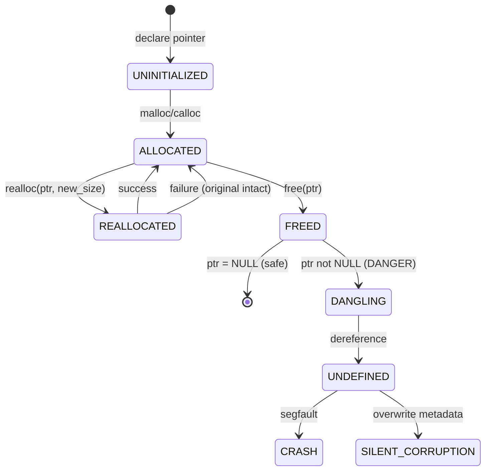

# C Memory Management — Deep Dive & Analytical Problem Solving

> **Complete analytical guide to C memory management** — from mental models to debugging strategies. Covers stack vs heap, allocation lifecycles, pointer arithmetic, common bugs, and a systematic **problem-solving framework** for memory issues.

---

## 🎯 Learning Objectives (Analytical Framework)

By the end of this module, you will be able to:

| Skill | Description | Analytical Approach |
|-------|-------------|---------------------|
| **Memory Mental Model** | Visualize stack/heap layout at any program point | Draw memory maps before coding |
| **Allocation Strategy** | Choose stack vs heap, malloc vs calloc vs realloc | Decision tree + cost analysis |
| **Pointer Reasoning** | Trace pointer chains, arithmetic, aliasing | Pointer-state diagrams |
| **Bug Classification** | Categorize: leak, dangling, double-free, buffer overflow, UAF | Taxonomy + root-cause patterns |
| **Debugging Workflow** | Systematic isolation → hypothesis → verification | Scientific method for memory bugs |

---

## 1. THE MENTAL MODEL: MEMORY AS A CITY

```
┌─────────────────────────────────────────────────────────────────────┐
│                        VIRTUAL ADDRESS SPACE                         │
│  ┌──────────────┐  ┌──────────────────┐  ┌──────────────────────┐  │
│  │    STACK     │  │      HEAP        │  │   CODE / DATA / BSS  │  │
│  │  (Auto Mgmt) │  │  (Manual Mgmt)   │  │    (Read-only/RO)    │  │
│  │              │  │                  │  │                      │  │
│  │  Grows DOWN  │  │   Grows UP       │  │  .text  .rodata      │  │
│  │  (high → low)│  │  (low → high)    │  │  .data  .bss         │  │
│  │              │  │                  │  │                      │  │
│  │  Frames:     │  │  Blocks:         │  │                      │  │
│  │  main()      │  │  malloc()        │  │                      │  │
│  │  func1()     │  │  calloc()        │  │                      │  │
│  │  func2()     │  │  realloc()       │  │                      │  │
│  │  ...         │  │  free()          │  │                      │  │
│  └──────────────┘  └──────────────────┘  └──────────────────────┘  │
│         ▲                                       ▲                   │
│         │                                       │                   │
│    Stack Pointer                          Heap Break (brk)        │
│    (rsp/rsp)                               (managed by allocator)   │
└─────────────────────────────────────────────────────────────────────┘
```

### Key Analogy: **The Restaurant**

| Memory Region | Restaurant Equivalent | Who Manages? | Lifetime |
|--------------|----------------------|--------------|----------|
| **Stack** | Your table — auto-cleaned when you leave | OS (automatic) | Function scope |
| **Heap** | Storage locker — you rent, you clean | You (manual) | Until `free()` |
| **Code/Data** | Kitchen & Menu — fixed, read-only | OS/Loader | Program lifetime |

---

## 2. STACK VS HEAP — DECISION FRAMEWORK

### Analytical Decision Tree

```
                    ┌─────────────────────────────┐
                    │  Need to store data?        │
                    └──────────────┬──────────────┘
                                   │
              ┌────────────────────┼────────────────────┐
              ▼                    ▼                    ▼
      ┌───────────────┐    ┌───────────────┐    ┌───────────────┐
      │ Known size at │    │ Size depends  │    │ Must survive  │
      │ compile time? │    │ on runtime    │    │ beyond func?  │
      └───────┬───────┘    └───────┬───────┘    └───────┬───────┘
              │                    │                    │
       ┌──────┴──────┐       ┌─────┴─────┐       ┌─────┴─────┐
       ▼             ▼       ▼           ▼       ▼           ▼
     YES            NO      YES          NO     YES          NO
       │             │       │           │       │           │
       ▼             ▼       ▼           ▼       ▼           ▼
   ┌───────┐    ┌──────────┐ ┌──────┐  ┌───────┐ ┌──────┐ ┌──────┐
   │ STACK │    │  HEAP    │ │ STACK│  │ HEAP  │ │ HEAP │ │STACK │
   │ array │    │ malloc/  │ │ VLA  │  │ malloc│ │ malloc│ │ ok   │
   │ fixed │    │ calloc   │ │ (C99)│  │       │ │       │      │
   └───────┘    └──────────┘ └──────┘  └───────┘ └──────┘ └──────┘
```

### Comparison Matrix

| Dimension | Stack | Heap |
|-----------|-------|------|
| **Allocation Speed** | ~1-3 CPU cycles (pointer bump) | ~50-200 cycles (allocator search) |
| **Deallocation Speed** | Free (pop frame) | `free()` — coalesce, bookkeeping |
| **Size Limit** | ~1-8 MB (thread stack) | Virtual memory (GBs) |
| **Fragmentation** | None (LIFO) | External + Internal |
| **Access Pattern** | Cache-friendly (hot) | Cache-miss prone (scattered) |
| **Thread Safety** | Per-thread (isolated) | Shared (needs locks) |
| **Failure Mode** | Stack overflow (crash) | `NULL` return (handle gracefully) |

---

## 3. ALLOCATION LIFECYCLE — STATE MACHINE

### `malloc` / `calloc` / `realloc` / `free` State Transitions



### Visual Lifecycle with Memory Map

```
TIME ────────────────────────────────────────────────────────────────►

CODE:     int *p = malloc(4 * sizeof(int));
          p[0] = 10; p[1] = 20; p[2] = 30; p[3] = 40;
          free(p);
          p = NULL;

HEAP:     ┌─────────────────────────────────────────────────────────┐
          │  BEFORE malloc                                          │
          │  [free space...]                                        │
          └─────────────────────────────────────────────────────────┘
                              │ malloc(16 bytes)
                              ▼
          ┌─────────────────────────────────────────────────────────┐
          │  AFTER malloc                                           │
          │  [metadata][10][20][30][40][padding][free space...]    │
          │     ▲                                                    │
          │     └─ p points here (user data starts after metadata)  │
          └─────────────────────────────────────────────────────────┘
                              │ p[0]=10 ... p[3]=40
                              ▼
          ┌─────────────────────────────────────────────────────────┐
          │  AFTER writes (same layout, values filled)              │
          └─────────────────────────────────────────────────────────┘
                              │ free(p)
                              ▼
          ┌─────────────────────────────────────────────────────────┐
          │  AFTER free                                             │
          │  [metadata: FREE][garbage][garbage][garbage][padding]  │
          │     ▲                                                    │
          │     └─ p is now DANGLING (points to freed block)        │
          └─────────────────────────────────────────────────────────┘
                              │ p = NULL
                              ▼
          ┌─────────────────────────────────────────────────────────┐
          │  AFTER NULL assignment — SAFE                           │
          │  p = 0x0 (NULL) — dereferencing = predictable crash     │
          └─────────────────────────────────────────────────────────┘
```

---

## 4. POINTER ARITHMETIC — ANALYTICAL REASONING

### The Fundamental Rule

> **Pointer arithmetic is scaled by `sizeof(pointed_type)`**

```
int *p = malloc(4 * sizeof(int));  // p points to int[4]
// p     = address of p[0]
// p + 1 = address of p[1] = p + 1*sizeof(int) = p + 4 bytes
// p + i = address of p[i] = p + i*sizeof(int)
```

### Visual: Pointer Arithmetic on Different Types

```
ASSUME: p = 0x1000 (starting address)

TYPE          sizeof    p+0      p+1      p+2      p+3      FORMULA
─────────────────────────────────────────────────────────────────────
char *        1 byte    0x1000   0x1001   0x1002   0x1003   p + i*1
short *       2 bytes   0x1000   0x1002   0x1004   0x1006   p + i*2
int *         4 bytes   0x1000   0x1004   0x1008   0x100C   p + i*4
double *      8 bytes   0x1000   0x1008   0x1010   0x1018   p + i*8
struct Node * 16 bytes  0x1000   0x1010   0x1020   0x1030   p + i*16
void *        1 byte*   0x1000   0x1001   0x1002   0x1003   p + i*1
─────────────────────────────────────────────────────────────────────
* void* arithmetic is GCC extension; standard C forbids void* arithmetic
```

### Pointer Arithmetic Rules (Analytical Checklist)

```c
// ✅ VALID: within same allocated block
int *arr = malloc(10 * sizeof(int));
int *p = &arr[3];
int *q = &arr[7];
ptrdiff_t diff = q - p;     // 4 (elements between)
int val = *(p + 2);         // arr[5]

// ✅ VALID: one-past-end (for iteration)
int *end = arr + 10;        // legal: points ONE PAST last element
for (int *it = arr; it != end; ++it) { /* ... */ }

// ❌ INVALID: before start
int *before = arr - 1;      // UB

// ❌ INVALID: beyond one-past-end
int *way_past = arr + 11;   // UB

// ❌ INVALID: different allocations
int *a = malloc(sizeof(int));
int *b = malloc(sizeof(int));
ptrdiff_t d = a - b;        // UB — unrelated pointers

// ❌ INVALID: after free
free(arr);
int x = arr[0];             // UB — use-after-free
```

---

## 5. COMMON MEMORY BUGS — TAXONOMY & ROOT CAUSES

### Bug Classification Framework

```
MEMORY BUGS
├── ALLOCATION FAILURES
│   ├── Not checking malloc/calloc/realloc return (NULL)
│   ├── Integer overflow in size calculation: malloc(n * size) where n*size wraps
│   └── Allocation size mismatch: malloc(sizeof(ptr)) instead of malloc(sizeof(*ptr))
│
├── USE-AFTER-FREE (UAF)
│   ├── Dereference after free()
│   ├── Double free: free(ptr); free(ptr);
│   ├── Free non-heap pointer: free(&stack_var)
│   └── Free middle of block: free(ptr + offset)
│
├── BUFFER OVERFLOWS
│   ├── Heap overflow: write past malloc'd boundary
│   ├── Stack overflow: large local array / recursion
│   ├── Off-by-one: alloc n, write n elements (0..n)
│   └── String overflow: strcpy/strcat without bounds
│
├── MEMORY LEAKS
│   ├── Lost pointer: p = malloc(); p = malloc(); // first block leaked
│   ├── Early return without free
│   ├── Exception/error path missing free
│   └── Circular references (manual refcount forgotten)
│
├── UNINITIALIZED MEMORY
│   ├── malloc (not calloc) — contains garbage
│   ├── Stack variables without initializer
│   └── Padding bytes in structs
│
├── ALIASING / ALIGNMENT
│   ├── Strict aliasing violation: int *p = (int*)&float_var
│   ├── Misaligned access: *(int*)(char_ptr + 1)
│   └── Type punning via union vs pointer cast
│
└── FRAGMENTATION
    ├── External: many small free blocks, can't satisfy large request
    └── Internal: allocator rounds up (e.g., 16-byte alignment)
```

### Root Cause Patterns (The "Why")

| Bug Symptom | Root Cause | Prevention Pattern |
|-------------|------------|-------------------|
| Segfault on `free()` | Double free / free non-heap | `ptr = NULL` after free; track ownership |
| Corrupted heap metadata | Buffer overflow adjacent to block | Bounds checking; canaries (ASan) |
| Random crashes later | Use-after-free / dangling ptr | Ownership model; `ptr = NULL` |
| Program grows until OOM | Memory leak | RAII pattern; valgrind/ASan in CI |
| Wrong values read | Uninitialized memory / aliasing | `calloc` for zero-init; `-Wuninitialized` |
| Bus error / SIGBUS | Misaligned access | `aligned_alloc`; `memcpy` for type punning |

---

## 6. ANALYTICAL DEBUGGING WORKFLOW

### The Memory Bug Scientific Method

```
┌────────────────────────────────────────────────────────────────────┐
│                    MEMORY BUG DEBUGGING LOOP                        │
└────────────────────────────────────────────────────────────────────┘

    ┌──────────────┐
    │  REPRODUCE   │ ◄── Minimal test case, deterministic if possible
    │  (Observe)   │
    └──────┬───────┘
           │
           ▼
    ┌──────────────┐
    │  CLASSIFY    │ ◄── Which taxonomy category? (leak, UAF, overflow, etc.)
    │  (Hypothesize)│
    └──────┬───────┘
           │
           ▼
    ┌──────────────┐
    │  INSTRUMENT  │ ◄── Tools: ASan, Valgrind, Dr. Memory, custom allocators
    │  (Test)      │
    └──────┬───────┘
           │
           ▼
    ┌──────────────┐
    │  ISOLATE     │ ◄── Binary search: comment half, bisect to exact line
    │  (Analyze)   │
    └──────┬───────┘
           │
           ▼
    ┌──────────────┐
    │  FIX & VERIFY│ ◄── Apply fix; re-run ALL tests; add regression test
    │  (Confirm)   │
    └──────┬───────┘
           │
           ▼
    ┌──────────────┐
    │  PREVENT     │ ◄── Code review checklist; static analysis; CI integration
    │  (Generalize)│
    └──────────────┘
```

### Tool Selection Matrix

| Tool | Best For | Overhead | Platform | Learning Curve |
|------|----------|----------|----------|----------------|
| **AddressSanitizer (ASan)** | UAF, overflow, leaks | ~2x slow, ~3x mem | Linux/Mac/Windows (Clang/GCC) | Low |
| **Valgrind Memcheck** | Leaks, UAF, uninit reads | ~20-50x slow | Linux/Mac | Medium |
| **Dr. Memory** | Windows equivalent of Valgrind | ~10-30x slow | Windows/Linux | Medium |
| **Electric Fence / DUMA** | Buffer overflow (page guards) | High mem | Unix | Low |
| **Custom Allocator + Canaries** | Production debugging | Tunable | Any | High |
| **Static Analysis (Clang-Tidy, Cppcheck)** | Compile-time detection | Zero runtime | Any | Low |

### ASan Quick Start (Recommended First Line)

```bash
# Compile with ASan
gcc -fsanitize=address -fno-omit-frame-pointer -g -O1 main.c -o main_asan

# Run — crashes with detailed report at exact bug location
./main_asan

# Common ASan flags:
# -fsanitize=address           # Enable ASan
# -fno-omit-frame-pointer      # Better stack traces
# -g                           # Debug symbols
# -O1                          # Optimize but keep debuggable
# -fsanitize=leak              # Leak detection only (faster)
```

### ASan Output Reading Guide

```
=================================================================
==12345==ERROR: AddressSanitizer: heap-use-after-free on address 0x602000000010
READ of size 4 at 0x602000000010 thread T0
    #0 0x401234 in main main.c:42          ← YOUR CODE LINE
    #1 0x7f8b... in __libc_start_main

0x602000000010 is located 0 bytes inside of 40-byte region [0x602000000010,0x602000000038)
freed by thread T0 here:
    #0 0x401180 in free
    #1 0x401210 in main main.c:38          ← WHERE IT WAS FREED
    #2 0x7f8b... in __libc_start_main

previously allocated by thread T0 here:
    #0 0x4011a0 in malloc
    #1 0x4011f0 in main main.c:35          ← WHERE IT WAS ALLOCATED
    #2 0x7f8b... in __libc_start_main
```

---

## 7. ADVANCED PATTERNS — PROFESSIONAL GRADE

### Pattern 1: Ownership Tracking (Single Owner)

```c
// Rule: Every allocation has exactly ONE owner responsible for free()
// Transfer ownership explicitly — never implicit

typedef struct {
    int *data;
    size_t size;
    size_t capacity;
    // Ownership: THIS struct owns data → must free in destroy()
} IntArray;

IntArray *array_create(size_t initial_cap) {
    IntArray *arr = malloc(sizeof(IntArray));
    if (!arr) return NULL;
    
    arr->data = malloc(initial_cap * sizeof(int));
    if (!arr->data) { free(arr); return NULL; }
    
    arr->size = 0;
    arr->capacity = initial_cap;
    return arr;  // Caller becomes owner
}

void array_destroy(IntArray *arr) {
    if (!arr) return;
    free(arr->data);   // Free owned resource FIRST
    free(arr);         // Then free self
    // Caller's pointer now dangling — document this!
}
```

### Pattern 2: RAII-Style Cleanup with `goto` (Error Handling)

```c
// The "goto cleanup" pattern — ensures every error path frees resources

int process_file(const char *path) {
    FILE *f = NULL;
    char *buffer = NULL;
    int *numbers = NULL;
    int result = -1;
    
    f = fopen(path, "r");
    if (!f) { perror("fopen"); goto cleanup; }
    
    buffer = malloc(BUFFER_SIZE);
    if (!buffer) { perror("malloc buffer"); goto cleanup; }
    
    numbers = malloc(MAX_NUMS * sizeof(int));
    if (!numbers) { perror("malloc numbers"); goto cleanup; }
    
    // ... processing logic ...
    result = 0;  // Success
    
cleanup:
    // Reverse order of allocation — LIFO
    free(numbers);
    free(buffer);
    if (f) fclose(f);
    return result;
}
```

### Pattern 3: Flexible Array Member (FAM) — Single Allocation

```c
// Instead of: struct { int n; int *data; }  // 2 allocations
// Use: single allocation with flexible array member

typedef struct {
    size_t count;
    int data[];  // Flexible array member — MUST be last member
} IntList;

IntList *list_create(size_t n) {
    // Single malloc for struct + array
    IntList *list = malloc(sizeof(IntList) + n * sizeof(int));
    if (!list) return NULL;
    list->count = n;
    return list;
}

void list_destroy(IntList *list) {
    free(list);  // Single free for everything
}
```

### Pattern 4: Arena Allocator (Bump Allocator) — Batch Free

```c
// For many short-lived allocations: allocate in bulk, free all at once

typedef struct {
    char *memory;
    size_t capacity;
    size_t offset;
} Arena;

Arena *arena_create(size_t capacity) {
    Arena *a = malloc(sizeof(Arena));
    a->memory = malloc(capacity);
    a->capacity = capacity;
    a->offset = 0;
    return a;
}

void *arena_alloc(Arena *a, size_t size, size_t alignment) {
    // Align offset
    size_t aligned_offset = (a->offset + alignment - 1) & ~(alignment - 1);
    if (aligned_offset + size > a->capacity) return NULL;  // Out of space
    
    void *ptr = a->memory + aligned_offset;
    a->offset = aligned_offset + size;
    return ptr;
}

void arena_reset(Arena *a) { a->offset = 0; }  // Instant "free all"
void arena_destroy(Arena *a) { free(a->memory); free(a); }

// Usage: per-frame, per-request, per-transaction
Arena *frame_arena = arena_create(1 << 20);  // 1 MB
for (each_object) {
    Object *obj = arena_alloc(frame_arena, sizeof(Object), alignof(Object));
    // ... use obj ...
}
arena_reset(frame_arena);  // All objects freed instantly
```

---

## 8. ALLOCATOR INTERNALS — UNDERSTANDING WHAT `malloc` DOES

### Simplified `malloc` Implementation (dlmalloc-style)

```
HEAP LAYOUT (simplified):

┌─────────────────────────────────────────────────────────────────┐
│  CHUNK HEADER (malloc metadata, typically 16 bytes on 64-bit)   │
│  ┌─────────────────┬─────────────────┐                          │
│  │ prev_size (8B)  │ size | flags (8B) │  ← size includes header│
│  └─────────────────┴─────────────────┘                          │
│  Flags (low 3 bits of size):                                     │
│  - PREV_INUSE (0x1): previous chunk is allocated                 │
│  - IS_MMAPPED (0x2): chunk from mmap, not heap                   │
│  - NON_MAIN_ARENA (0x4): thread-local arena                      │
├─────────────────────────────────────────────────────────────────┤
│  USER DATA (your malloc'd memory starts here)                    │
│  ┌─────────────────────────────────────────────────────────────┐│
│  │  Your data...                                                ││
│  │  ...                                                         ││
│  └─────────────────────────────────────────────────────────────┘│
├─────────────────────────────────────────────────────────────────┤
│  NEXT CHUNK HEADER (or top chunk / wilderness)                   │
└─────────────────────────────────────────────────────────────────┘
```

### How `free()` Works (Coalescing)

```
FREE(ptr):
1. Get chunk header: chunk = ptr - sizeof(chunk_header)
2. Check if adjacent chunks are free (using PREV_INUSE flag)
3. Coalesce with previous free chunk if available
4. Coalesce with next free chunk if available
5. Add merged chunk to appropriate free list (bin)
6. If merged chunk touches top of heap → shrink heap (return to OS)

BINS (free lists by size):
- Fast bins: small sizes (≤ 128B), LIFO, no coalescing → fast
- Small bins: ≤ 1024B, doubly-linked, FIFO
- Large bins: > 1024B, sorted by size
- Unsorted bin: recently freed, cache for quick reuse
```

### Why This Matters for Debugging

| Behavior | Implication |
|----------|-------------|
| **Metadata adjacent to user data** | Buffer overflow corrupts allocator state → crash later in unrelated `malloc`/`free` |
| **Free lists are doubly-linked** | Overflow can corrupt `fd`/`bk` pointers → arbitrary write on next `malloc` |
| **Coalescing on free** | Double-free creates fake chunks → allocator returns same pointer twice |
| **Fast bins don't coalesce** | Small double-frees harder to detect; use `malloc_usable_size` to verify |

---

## 9. PROBLEM-SOLVING EXERCISES (Analytical Practice)

### Exercise 1: Find the Bug (Classification)

```c
// Bug 1
void func1() {
    int *p = malloc(10 * sizeof(int));
    p[10] = 42;  // ← CLASSIFY THIS BUG
}

// Bug 2
void func2() {
    int *p = malloc(10 * sizeof(int));
    free(p);
    printf("%d\n", p[0]);  // ← CLASSIFY THIS BUG
}

// Bug 3
void func3() {
    int *p = malloc(10 * sizeof(int));
    free(p);
    free(p);  // ← CLASSIFY THIS BUG
}

// Bug 4
void func4() {
    int *p = malloc(10 * sizeof(int));
    p = malloc(20 * sizeof(int));  // ← CLASSIFY THIS BUG
}

// Bug 5
void func5() {
    char *buf = malloc(10);
    strcpy(buf, "Hello, World!");  // 13 chars + null = 14 > 10
}
```

<details>
<summary>Answers</summary>

| Bug | Classification | Root Cause | Fix |
|-----|---------------|------------|-----|
| 1 | Heap buffer overflow (off-by-one) | Index 10 = 11th element, only 10 allocated | `p[9] = 42` or allocate 11 |
| 2 | Use-after-free (UAF) | Dereference after `free()` | Move `printf` before `free`, or copy value |
| 3 | Double free | `free()` called twice on same pointer | `free(p); p = NULL;` |
| 4 | Memory leak | First allocation lost (no pointer to free) | `free(p);` before reassignment |
| 5 | Heap buffer overflow (string) | `strcpy` doesn't check bounds | `strncpy(buf, src, 9); buf[9] = '\0';` or `malloc(strlen(src)+1)` |

</details>

### Exercise 2: Trace the Pointer State

```c
void trace_pointers() {
    int *a = malloc(sizeof(int));
    int *b = a;
    *a = 10;
    free(a);
    // STATE: a = DANGLING, b = DANGLING, heap block = FREED
    a = malloc(sizeof(int));
    *a = 20;
    // STATE: a = VALID (new block), b = DANGLING (old block)
    free(a);
    // STATE: a = DANGLING, b = DANGLING
}
```

**Draw the memory map at each comment line.**

---

## 10. BEST PRACTICES CHECKLIST (Code Review Ready)

### Allocation
- [ ] Every `malloc`/`calloc`/`realloc` checked for `NULL`
- [ ] Size calculation uses `sizeof(*ptr)` not `sizeof(ptr)`
- [ ] `calloc` used when zero-initialization needed
- [ ] `realloc` assigned to temporary: `tmp = realloc(p, n); if (tmp) p = tmp;`
- [ ] Integer overflow checked: `if (n > SIZE_MAX / size) fail;`

### Deallocation
- [ ] Every allocation has exactly one `free` (ownership clear)
- [ ] `ptr = NULL` after `free(ptr)` (prevents UAF/double-free)
- [ ] No `free` on stack pointers, `NULL`, or middle of block
- [ ] Cleanup on ALL error paths (goto cleanup / RAII pattern)

### Pointer Usage
- [ ] No dereference of uninitialized pointers
- [ ] No pointer arithmetic past one-past-end
- [ ] No subtraction of unrelated pointers
- [ ] `const` correctness: `const int *p` vs `int *const p`

### Tools & CI
- [ ] ASan enabled in debug/CI builds
- [ ] Valgrind runs in CI pipeline
- [ ] Static analysis (clang-tidy, cppcheck) in CI
- [ ] Compiler warnings: `-Wall -Wextra -Wpedantic -Wshadow -Wconversion`

---

## 11. QUICK REFERENCE CARD

```
┌────────────────────────────────────────────────────────────────────┐
│                     MEMORY MANAGEMENT CHEAT SHEET                   │
├────────────────────────────────────────────────────────────────────┤
│ ALLOCATE          │ malloc(n)           │ uninit, returns void*    │
│                   │ calloc(n, sz)       │ zero-init, n*sz bytes    │
│                   │ realloc(p, n)       │ resize, preserves data   │
│                   │ aligned_alloc(a, n) │ aligned to 'a' bytes     │
├────────────────────────────────────────────────────────────────────┤
│ FREE              │ free(p)             │ p must be from malloc    │
│                   │ p = NULL            │ ALWAYS after free        │
├────────────────────────────────────────────────────────────────────┤
│ SIZE              │ malloc_usable_size(p)│ actual allocated bytes │
│                   │ sizeof(*p)          │ size of ONE element      │
├────────────────────────────────────────────────────────────────────┤
│ POINTER ARITHMETIC│ p + i               │ advances i * sizeof(*p)  │
│                   │ p - q               │ elements between (ptrdiff)│
│                   │ &arr[i] == arr + i  │ equivalence              │
├────────────────────────────────────────────────────────────────────┤
│ DEBUG             │ gcc -fsanitize=address -g                    │
│                   │ valgrind --leak-check=full ./prog            │
│                   │ export ASAN_OPTIONS=detect_leaks=1           │
└────────────────────────────────────────────────────────────────────┘
```

---

## Cross-References

- [[c-programming/detailed-notes|Detailed Notes]] — Basics (sections 14, 16)
- [[c-programming/flowcharts|Flowcharts]] — Visual memory lifecycle
- [[c-programming/memory-debugging-guide|Memory Debugging Guide]] — Tool deep-dive
- [[c-programming/code-examples|Code Examples]] — Runnable snippets
- [[SPM/c-programming-master-study-guide|SPM Master Guide]] — Exam-focused pointer/memory drills

---

*Next: [[c-programming/memory-flowcharts|Memory Management Flowcharts]] → [[c-programming/memory-beginners-guide|Beginner's Guide]] → [[c-programming/memory-code-examples|Code Examples]]*