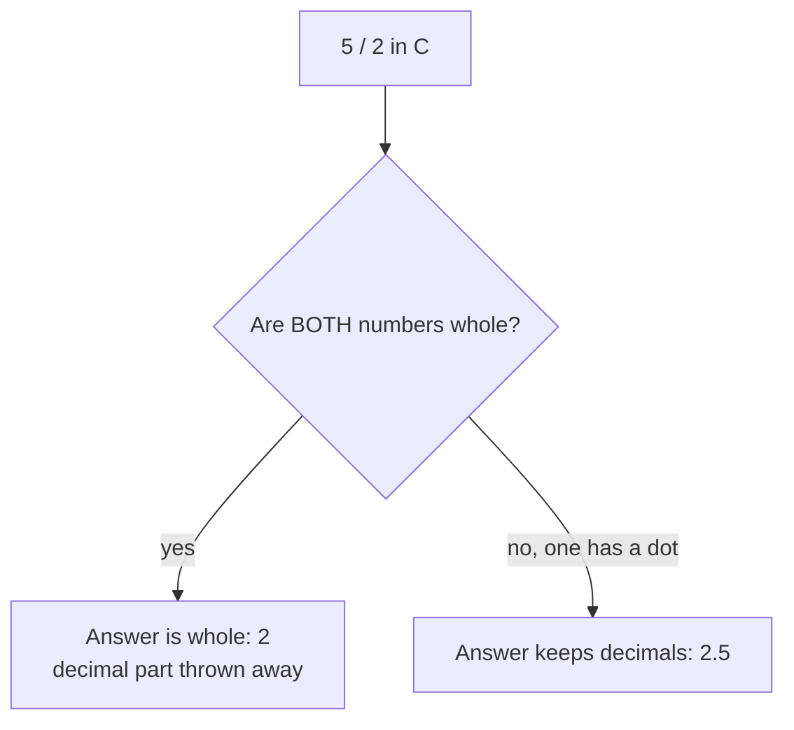
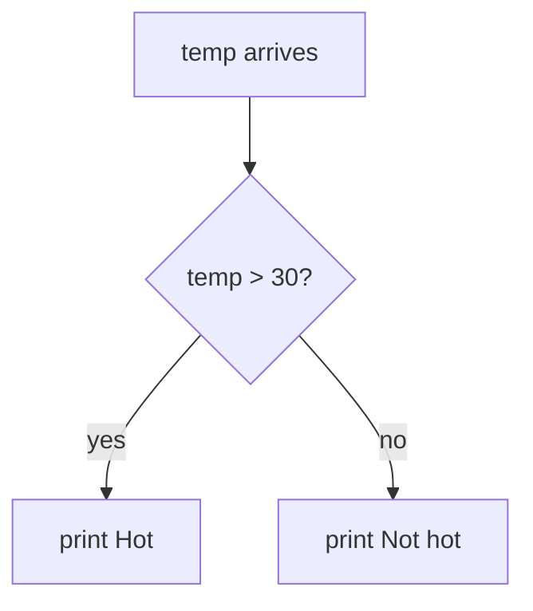
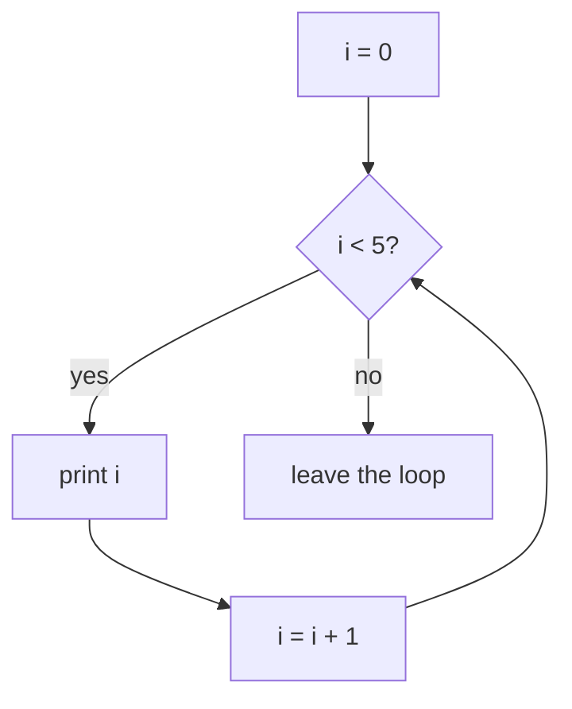

## For future agent
ELI5 (explain-like-I'm-five) C revision for the [[01-Areas/Engineering/nexus-robotics/INDEX|Nexus Robotics interview]] (2026-10-06). Reader level: Python decent, C basics only, Arduino basics only. Rule: **no jargon without a definition first, every concept gets a real-life analogy, control flow gets a flowchart.** This is the entry layer — the next steps up are [[01-Areas/Programming/c-interview-revision-plain-language]] (same structure, denser) and [[01-Areas/Programming/c-programming/detailed-notes]] (full course). Every snippet here is standard C taught in [[01-Areas/Engineering/SPM/module-1-spm-c-basics]] and Module 2.

# C — Explained Like You're Five

## 0. What is C, in one paragraph

The Arduino only understands ON and OFF — electricity or no electricity. C is a language for telling it exactly which switches to flip, in which order. Python is like telling a chef "make pasta" and trusting him. C is like standing in the kitchen saying "pick up the spoon, stir three times." More work, but nothing happens that you didn't say. That is why robots use it.

**Say in the interview:** *"C gives me direct control over memory and timing, which is what a microcontroller needs. Python is faster to write; C does exactly what I say."*

---

## 1. The shape of every C program

```c
#include <stdio.h>      // borrow the toolbox that knows print/scan

int main(void) {        // the front door — program starts HERE
    printf("Hello\n");  // do something
    return 0;           // 0 = "everything went fine", hand it to the computer
}
```

Think of it like a shop: `#include` stocks the shelves, `main` opens the front door, `return 0` closes up saying "no problems today."

**Say in the interview:** *"Every C program starts at main. Include gives me library tools. Returning zero means success."*

---

## 2. Variables — labelled boxes

```c
int   age   = 20;      // a box labelled age, holding a whole number
float price = 19.99f;  // a box holding a decimal number
char  grade = 'A';      // a box holding ONE letter
```

A variable is a box with a name sticker. `int` boxes hold whole numbers only. `float` boxes hold decimals. `char` boxes hold exactly one character — `'A'` fits, `'AB'` does not.

**Say in the interview:** *"A variable is named storage. int for whole numbers, float for decimals, char for a single character."*

**The trap that catches everyone:**

```c
int x = 5 / 2;     // x is 2, NOT 2.5!
```

C sees two whole numbers and does whole-number division — it throws the `.5` in the bin. If you want `2.5`, write `5.0 / 2`.

**Say in the interview:** *"Integer division truncates. Five divided by two is two in C unless I make one of them a float."*



---

## 3. `=` puts things in boxes, `==` asks questions

```c
x = 5;        // PUT 5 into box x
if (x == 5)   // ASK: does box x hold 5?
```

One `=` is an action (store it). Two `==` is a question (is it equal?). Mixing them up is the most common C bug in existence.

**Say in the interview:** *"Single equals assigns, double equals compares. Using one instead of the other inside an if silently changes the program."*

---

## 4. Decisions — `if` / `else`

```c
if (temp > 30) {
    printf("Hot\n");
} else {
    printf("Not hot\n");
}
```



Read it as English: "IF temperature is more than 30, say Hot. OTHERWISE say Not hot." The curly braces `{ }` group the lines that belong together.

**Say in the interview:** *"If runs a block only when the condition is true, else catches everything else. Anything non-zero counts as true in C — only zero is false."*

With three options, chain them:

```c
if (marks >= 90)      printf("A\n");
else if (marks >= 70) printf("B\n");
else                  printf("C\n");
```

Order matters — C stops at the FIRST true branch.

---

## 5. Loops — doing things again

**`for` = "do this a fixed number of times":**

```c
for (int i = 0; i < 5; i++) {
    printf("%d\n", i);   // prints 0 1 2 3 4
}
```

The three parts inside the brackets: **start** (`i = 0`) → **keep going while true** (`i < 5`) → **after each round** (`i++`, add one).



**`while` = "keep going until something changes":**

```c
while (battery > 0) {
    drive();
    battery--;
}
```

**Say in the interview:** *"For is for a known count, while is for an unknown count. Both need something that eventually becomes false, or they loop forever."*

**Trap:** `i < 5` runs 5 times (0–4). `i <= 5` runs 6 times. C counts from **0**, always.

`break` jumps out of the loop immediately. `continue` skips to the next round.

---

## 6. Arrays — a row of same-type boxes

```c
int marks[5] = {90, 85, 72, 88, 95};
marks[0];   // 90 — FIRST box, because counting starts at 0
marks[4];   // 95 — LAST box
```

Picture 5 boxes in a row, numbered 0 to 4. All hold the same type.

**Say in the interview:** *"An array is contiguous same-type storage. Index zero is the first element, so a 5-element array ends at index 4."*

**Two traps:**
- `marks[5]` does NOT error — C just reads whatever memory is next door. No safety net. (This is also why C is fast.)
- `sizeof(marks)` gives **bytes** (20), not elements. Element count = `sizeof(marks) / sizeof(marks[0])` = 5.

---

## 7. Strings — a row of letters ending in a stop sign

```c
char name[20] = "Asha";
```

A C string is just a `char` array with a zero byte (`'\0'`) at the end meaning STOP. `"Asha"` needs 5 slots: A-s-h-a-STOP.

**Say in the interview:** *"A C string is a character array terminated by a null byte. Every string function stops at that zero, so a buffer with no room for it overruns."*

Useful functions (`#include <string.h>`): `strlen` counts letters (not the stop byte), `strcpy` copies, `strcmp` compares (returns **0 when equal**), `strcat` glues two together. None of them check your buffer is big enough — your job.

---

## 8. Functions — named machines

```c
int add(int a, int b) {   // takes two ints, gives back an int
    return a + b;          // hand the answer back
}

int x = add(2, 3);         // x is 5
```

A function is a little machine: raw material in (parameters), finished product out (`return`). `void` means "gives nothing back."

**Say in the interview:** *"A function packages reusable steps with inputs and one output. C passes everything by value — the function gets a copy, so changing the parameter inside never touches the original."*

The exception that proves it: pass the **address** (see §9) and the function can reach the original through it.

---

## 9. Pointers — a chit with a house address

```c
int  x = 42;
int *p = &x;     // p holds the ADDRESS of x
*p;              // 42 — "go to that address and read what's there"
```

The analogy that makes it click: `x` is a house. `&x` is the house's street address. `p` is a chit of paper with the address written on it. `*p` means "go to the address on the chit and knock."

- `&` = "address of" (house → address)
- `*` = "value at" (address → house contents)

**Say in the interview:** *"A pointer stores a memory address. Ampersand takes the address, star follows it back to the value. Pointers let functions modify the caller's variables and let me work with memory the program gets at runtime."*

```c
void reset(int *p) { *p = 0; }   // reach through the chit, zero the house
int x = 42;
reset(&x);                        // x is now 0
```

**Trap:** never return the address of a local variable — the house is demolished when the function ends (stack memory), so the chit points at rubble.

---

## 10. Structs — one form, many fields

An array holds many of the SAME type. A `struct` holds ONE record made of DIFFERENT types — like one row of a register:

```c
struct Student {
    int   roll;
    char  name[30];
    float cgpa;
};

struct Student s = {101, "Asha", 8.9};
s.cgpa;                 // 8.9 — dot reaches a field
struct Student *ptr = &s;
ptr->cgpa;              // same thing through a pointer (-> means "follow, then dot")
```

**Say in the interview:** *"A struct groups different types into one record. Access fields with a dot, or arrow through a pointer."*

---

## 11. Bitwise — light switches

Every number is a row of tiny ON/OFF switches (bits). Bitwise operators flip them directly — this is how you talk to hardware registers.

```c
int a = 12;   // 1100 in binary
int b = 10;   // 1010 in binary

a & b;   // 1000 = 8   (AND: ON only if BOTH on)
a | b;   // 1110 = 14  (OR:  ON if EITHER on)
a ^ b;   // 0110 = 6   (XOR: ON only if DIFFERENT — this is a toggle)
```

- `<<` shifts left = **double** (`1 << 3` = 8)
- `>>` shifts right = **halve** (`12 >> 2` = 3)

**The three hardware helpers — memorise these cold:**

```c
#define BIT(n)       (1u << (n))
#define BIT_SET(v,n) ((v) |  BIT(n))    // switch n ON
#define BIT_CLR(v,n) ((v) & ~BIT(n))    // switch n OFF
#define BIT_TST(v,n) (((v) >> (n)) & 1u) // read switch n
```

**Say in the interview:** *"Bitwise ops manipulate individual bits, which is how firmware sets hardware register flags. OR sets a bit, AND with NOT clears exactly one bit, shifts multiply or divide by powers of two."*

---

## 12. `volatile` — "this box changes by itself"

Normally the compiler is clever: if your code never writes to a variable, it keeps a copy in a fast register and stops re-reading memory. But a variable shared with an **interrupt** (or hardware) CAN change behind your code's back:

```c
volatile uint8_t button_pressed;   // the interrupt writes this
```

`volatile` means: *"re-read this from memory every single time, never trust a cached copy."*

**Say in the interview:** *"Volatile tells the compiler a variable can change outside normal program flow — interrupt flags and hardware registers — so every access must hit real memory. It does not make access atomic."*

---

## 13. Interrupts in one paragraph

Something urgent happens (button pressed, timer fired, sensor ready). The chip **pauses your `loop()`**, runs a tiny function called an ISR, then resumes exactly where it stopped. Rule: the ISR must be **short and do almost nothing** — read the hardware, set a `volatile` flag, leave. The main loop sees the flag and does the real work.

**Say in the interview:** *"An interrupt pauses the main program to run a short handler. The handler sets a flag and exits fast; the main loop does the heavy work. Long ISRs break timing."*

---

## 14. The traps, all in one list (read before sleep)

1. `=` assigns, `==` compares.
2. `5 / 2` is `2` — integer division drops the decimal.
3. Arrays start at **0**; a 5-box array ends at index 4.
4. `sizeof(array)` is **bytes**, not elements.
5. Strings need one extra slot for the `'\0'` stop byte.
6. `strcpy`/`strcat` never check buffer size.
7. Missing `break` in `switch` falls into the next case.
8. Missing `{ }` means only the next line belongs to the `if`.
9. Never return the address of a local variable.
10. `"w"` mode in `fopen` **erases** the file.
11. `1 << 31` on a signed int is undefined — use `1u`.
12. `*` follows a pointer; `&` takes an address.

---

## Where next

- Same ideas, denser: [[01-Areas/Programming/c-interview-revision-plain-language]]
- Full course depth: [[01-Areas/Programming/c-programming/detailed-notes]]
- Exam edition: [[01-Areas/Engineering/SPM/module-4-structures-unions-pointers]] · [[01-Areas/Engineering/SPM/module-1-spm-c-basics]]
- Applied version (do these next): [[01-Areas/Engineering/nexus-robotics/nexus-c-embedded-drills]]
- Home: [[01-Areas/Engineering/nexus-robotics/INDEX]]
