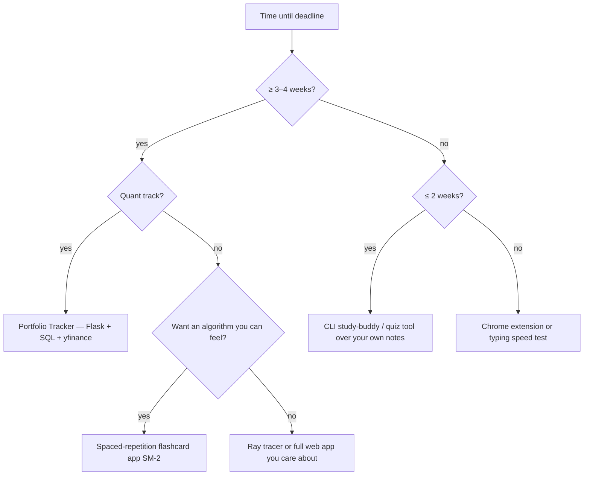

# CS50x Final Project Planner

> The **complete, proper version** of the final-project plan — from picking the idea to seeing the green "course completed" banner. This file is your working document: fill in the templates, tick the checkboxes, and treat the milestones as a calendar, not a wishlist.
>
> Requirements below are **verified against the official spec** (cs50.harvard.edu/x/2026/project/). Companion: [[cs50/final-project]] (the idea-selection guide this planner operationalizes).

---

## 0. The essentials in one screen

| Item | The rule (exact) |
|---|---|
| **What you build** | Any original software that *draws on the course's lessons* and solves a real problem. Any language(s). |
| **Collaboration** | 1–3 people (a group of 2 must be 2× scope, 3 must be 3×). Everyone contributes equally. |
| **AI use** | Allowed **for this project only**. Use as amplifier, not replacement. **Cite every use in code comments.** Staff audits submissions. |
| **Deadline** | **2026-12-31 23:59 UTC** — all 3 steps below must be done before this. |
| **Step 1 — Video** | ≤ 3 minutes. Opens with: title · your name · GitHub + edX usernames · city & country · recording date. Upload to YouTube, **unlisted is fine, never private.** Submit the video form. |
| **Step 2 — README** | Named exactly `README.md` in `project/`. Multiple paragraphs; include title + **video URL** + description of every file + design decisions. ~750 words is the "likely sufficient" neighborhood. Then `submit50 cs50/problems/2026/x/project`. |
| **Step 3 — Gradebook** | Visit **cs50.me/cs50x** a few minutes after submitting → triggers completion check + certificate generation → **claim the free certificate** before the deadline → green banner = done. |
| **AI policy for the PSets** | Third-party AI (ChatGPT, Copilot, etc.) stays **prohibited** for all problem sets — final project only. |

**Where your code lives:** in the CS50 Codespace, a directory called `project`. You may develop outside the Codespace too.

---

## 1. The blueprint — 8 phases, in order

> Principle behind the whole blueprint: **risk first.** The hard 20% (logic/schema/algorithm) is where projects die, so it comes before any UI. You should have a *working* end-to-end path within the first week.

```
Phase 0  Scope freeze ............ idea → one-line spec → good/better/best → "what I will NOT build"
Phase 1  Data & logic first ...... schema / core algorithm (no UI yet)
Phase 2  Vertical slice .......... thinnest input → stored row → screen (the app becomes "real")
Phase 3  Core features ........... one feature per day, app always runs, commit at every green point
Phase 4  Harden ................... empty states, bad input, secrets in env vars, parameterized SQL
Phase 5  Clean-machine test ...... fresh Codespace → follow your README → fix your docs' lies
Phase 6  README .................. the writeup (last, but given real time)
Phase 7  Video .................... ≤3-min demo with the required opening card
Phase 8  Submit & claim .......... submit50 → gradebook → claim certificate → green banner
```

---

## 2. Phase 0 — Scope freeze (Day 1, ~1 hour)

### 2.1 Pick the idea

**Decision tree:**



**My recommendation for you:** the **Portfolio Tracker** — it extends the Finance PSet (reuse proven auth + session code), adds genuine new skills (API integration, SQL aggregation, charts), and gives an interview story that matches your quant track.

### 2.2 Write the spec (fill in)

```
For [WHO], [APP] does [WHAT], better than [CURRENT ALTERNATIVE].
Example: For me, a portfolio tracker does live P/L + allocation tracking, better than a spreadsheet.
```

### 2.3 Define good / better / best

| Level | Definition (make this concrete!) |
|---|---|
| **Good** | The must-haves. If these aren't done, it's not the project. |
| **Better** | The should-haves. Realistic stretch. |
| **Best** | The wishlist. Only if everything else is solid. |

**Portfolio Tracker example:**

- **Good:** register/login, buy/sell, quote lookup, holdings dashboard with P/L, history page (== Finance + summary).
- **Better:** live prices via yfinance, allocation pie chart (Chart.js), empty-state handling, cached quotes.
- **Best:** cost basis / average buy price, benchmark comparison, CSV export.

### 2.4 Explicitly write what you will NOT build

> Example: *"I will not build: watchlists, alerts, mobile UI, real-time websockets, multi-currency."* This is a contract with yourself — when scope creep appears mid-project, point to this line.

### 2.5 Lock the stack + setup

- [ ] Stack decided (e.g., Flask + SQLite + Jinja + Chart.js, or pure Python CLI).
- [ ] Created `project/` directory.
- [ ] `git init` + first commit (`README` placeholder or `.gitignore`).
- [ ] Decide the daily work slot (e.g., 45 min every evening — never-zero-days).

---

## 3. Phase 1 — Data & logic first (Week 1, days 2–4)

> The data shape determines the features. Design this *before* any template or button.

### 3.1 Schema-first worksheet (SQL projects)

Design tables on paper, then create them:

| Table | Columns (example) | Purpose |
|---|---|---|
| `users` | `id, username, hash` | auth (reuse Finance) |
| `transactions` | `id, user_id, symbol, shares, price, timestamp` | every fill, one row |
| `quotes_cache` | `symbol, price, updated_at` | stop hammering the API |

**Design rule:** store **rows** (every fill), compute **derived state** (current holdings) with queries — never maintain a hand-updated `holdings` table that can drift.

**The one query that makes the project real (portfolio):**

```sql
SELECT symbol,
       SUM(shares)                              AS total_shares,
       SUM(shares * price)                      AS cost_basis,
       (SELECT price FROM quotes_cache q WHERE q.symbol = t.symbol)
                                                 AS current_price
FROM transactions t
GROUP BY symbol;
```

### 3.2 Logic-first worksheet (algorithm projects — SM-2, backtester, etc.)

Write the core recurrence in **pseudocode** before any web code:

```
SM-2 (rate = again/hard/good/easy):
  if rate == again:   interval = 1,  ease -= 0.2
  if rate == hard:    interval *= 1.2, ease -= 0.15
  if rate == good:    interval *= ease
  if rate == easy:    interval *= ease * 1.3, ease += 0.15
  due_date = now + interval days
```

### 3.3 Prove the risky 20% in a throwaway script

- [ ] Write the hardest function standalone (e.g., `get_quote(symbol)`, `backtest(...)`, `next_review(...)`) in a single `.py` file.
- [ ] Feed it sample data and check the output by hand.
- [ ] **Only then** build the UI around it.

---

## 4. Phase 2 — Vertical slice (Week 1, days 5–7)

> The thinnest path that is *real*: one input → one stored row → one screen.

**Portfolio example slice:** register → buy one share → see it on the dashboard with a price.

- [ ] Slice works end-to-end and compiles/runs with zero errors.
- [ ] Committed to git. 🎉 The project now exists.

---

## 5. Phase 3 — Core features (Weeks 2–3, one per day)

> Every day ends with a **running** app. Finish or revert before stopping.

**Order of attack (risk → polish):**
1. Hard logic features first (aggregation, algorithm, engine).
2. Then the CRUD/plumbing routes.
3. UI/styling last (it's the part you can't get wrong).

**Daily loop:**
- [ ] Pick ONE feature from the "Good" list.
- [ ] Write it, test it, commit it (message: `feat: buy route with validation`).
- [ ] If half-finished at end of day → finish it or `git checkout` it away.

**Portfolio feature queue (Good list):** register/login/logout · quote lookup · buy · sell · dashboard (holdings + P/L) · history.

---

## 6. Phase 4 — Harden (end of Week 3)

- [ ] **Empty states:** "You have no holdings yet" instead of a blank page.
- [ ] **Bad input:** negative shares, unknown symbol, empty form → friendly error, no crash.
- [ ] **API failures:** yfinance down → cached price or "price unavailable", never a 500.
- [ ] **Security:** parameterized SQL everywhere (no `f"SELECT ... {var}"`), password hashing (Finance's pattern), **secrets in env vars**, never hardcoded.
- [ ] **Error visibility:** `debug=False` in production mindset; useful messages, not stack traces on screen.

---

## 7. Phase 5 — Clean-machine test (start of Week 4)

- [ ] Open a **fresh** Codespace / fresh venv.
- [ ] Follow your own README instructions literally.
- [ ] Note every step where your docs were wrong or missing → fix the README.
- [ ] Confirm the app runs from zero on the clean machine.

> This single step catches 80% of "works on my machine" failures — the #1 rejection cause.

---

## 8. Phase 6 — README (Week 4, give it a real session)

### The official template (required shape)

```markdown
# YOUR PROJECT TITLE
#### Video Demo:  <URL HERE>
#### Description:
<several paragraphs>

- What the project is and the problem it solves.
- What each file/folder you wrote contains and does.
- Design decisions and why you made them (this is where 750+ words go).
- How to install, configure (env vars), and run it.
- Anything you used AI for (cite it!).
```

### The checklist

- [ ] Title + video URL at the top (the URL is **required**).
- [ ] ≥ multiple paragraphs; aim ~750+ words.
- [ ] Every file explained.
- [ ] Design choices justified.
- [ ] Install/run instructions that survived Phase 5.
- [ ] AI usage cited.

---

## 9. Phase 7 — Video (Week 4)

### The required opening card (must display all six)

```
Title:  <Project Title>
Name:   <Your Name>
GitHub: <username>    edX: <username>
City, Country: <City, Country>
Date:   <date recorded>
```

### Structure for a ≤3-minute video

| Time | Content |
|---|---|
| 0:00–0:10 | Opening card (the six items above). |
| 0:10–0:30 | One sentence: the problem + what your app does. |
| 0:30–2:30 | **Live demo of 2–3 features** (narrate: "this is... when I click... notice..."). |
| 2:30–3:00 | One design decision explained ("I chose to store every transaction as a row so I can compute holdings with GROUP BY — it can't drift"). |

**Rules:** no more than 3 minutes · narrated · upload to YouTube, **unlisted OK, never private** · submit via the official form.

---

## 10. Phase 8 — Submit & claim (the exact commands)

1. From inside `project/`:
   ```
   submit50 cs50/problems/2026/x/project
   ```
   (log in with GitHub credentials — input shows as asterisks)
2. **Wait a few minutes**, then open **https://cs50.me/cs50x**.
3. **Claim the free certificate** (link at the top of the gradebook).
4. Confirm the **green "you completed the course" banner**.

**If something goes wrong:**
- Too large to submit → ZIP everything except `README.md`, keep < 100 MB, submit the ZIP; or drag-and-drop onto the `cs50/problems/2026/x/project` branch of `github.com/me50/<USERNAME>`.
- Submitted but no gradebook result → resubmit with **only** the `README.md`.
- Video stuck "private" → it can't be watched → make it unlisted.

---

## 11. Master checklist (print this)

**Scope**
- [ ] One-line spec written.
- [ ] Good / better / best defined.
- [ ] "Will NOT build" list written.
- [ ] Stack + `project/` + git initialized.

**Build**
- [ ] Schema or core algorithm designed first.
- [ ] Risky 20% proven in a throwaway script.
- [ ] Vertical slice works end-to-end (end of week 1).
- [ ] All "Good" features done, one per day, committed.
- [ ] Empty states + bad input handled.
- [ ] Parameterized SQL + env-var secrets.
- [ ] Clean-machine test passed.

**Deliver**
- [ ] README ≥ 750 words, all files explained, video URL included, AI cited.
- [ ] Video ≤ 3 min, six-item opening card, narrated, unlisted (not private), form submitted.
- [ ] `submit50` ran successfully.
- [ ] Gradebook loaded → certificate claimed → green banner. ✅

---

## 12. Timebox (work backward from Dec 31, 2026)

| Week | Milestone | Exit criterion |
|---|---|---|
| W1 | Scope + schema + vertical slice | One end-to-end path works |
| W2 | Core feature set | All "Good" features done |
| W3 | Hardening + clean-machine test | Runs from zero on fresh Codespace |
| W4 | README + video + submit + claim | Green banner in gradebook |

**If you start late:** compress W2 (cut "Better" items), never cut the clean-machine test or the gradebook claim.

---

## 13. Sources

| Item | Detail |
|---|---|
| Official spec (verified) | https://cs50.harvard.edu/x/2026/project/ |
| Video submission form | https://forms.cs50.io/65ba090e-aba1-41de-a8f3-13f7701f399b |
| Gradebook | https://cs50.me/cs50x |
| Deadline | 2026-12-31T23:59:00+00:00 |
| Gallery of past projects | GitHub topic [`cs50-final-project`](https://github.com/topics/cs50-final-project) |
| AI honesty policy | https://cs50.harvard.edu/x/honesty/ |

**Related:** [[cs50/final-project|Final project — ideas & selection guide]] · [[cs50/index|CS50 course index]] · [[event-driven-backtesting|Backtesting architecture]] (for the quant pick)