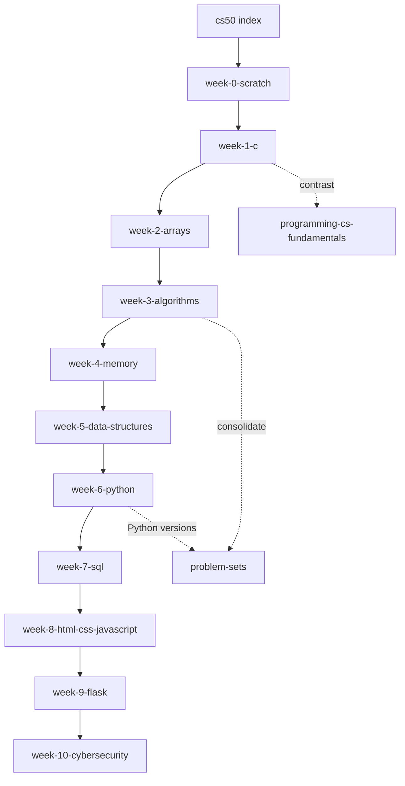

# Harvard CS50 — Introduction to Computer Science (Course Index)

> **CS50x** is Harvard University's on-campus *and* online introduction to the intellectual enterprises of computer science and the art of programming.
> Free on **edX** and **cs50.harvard.edu/x**. Institutional example behind the course: *"What ultimately matters in this course is not so much where you end up relative to your classmates but where you end up relative to yourself when you began."*
> **Fits the wiki:** the *substantive* backbone for [[programming-cs-fundamentals]] — CS50 is the concrete 10-week implementation of the abstract fundamentals, and the "single long-form course" recommended in [[learn-python-fast-system]].

---

## 1. The Cohort, the Method, the Tools

- **Instructors:** David J. Malan (and Brian Yu, Doug Lloyd, Carter Zenke in shorts/recaps).
- **Method:** Each week = a ~2h lecture that explores *one problem* end-to-end, backed by 1–3 concept shorts, and followed by a **Problem Set (PSet)** — designed to be co-completable with lectures via the "sections" structure.
- **Tooling:** Traditional C first (to feel close to the machine), then Python, SQL, HTML/CSS/JS, Flask — all edited in **CS50.dev** (VS Code in the browser) using the **CS50 library** (`cs50.h` / `cs50`), which wraps input and hides C's verbose I/O on the way in.

**The course arc in one line:**

```
C (close to machine) → Arrays → Algorithms → Memory → Data Structures
  → Python (same ideas, friendlier) → SQL (data) → Web front-end → Flask (web apps) → Cybersecurity + final project
```

---

## 2. Weekly Syllabus at a Glance

| Week | Title | Core ideas | Wiki page |
|---|---|---|---|
| 0 | Scratch | Computational thinking, binary & ASCII, abstraction, algorithms, pseudocode, Scratch | [[cs50/week-0-scratch]] |
| 1 | C | Compiled languages, data types, variables, functions, conditionals, loops, operators | [[cs50/week-1-c]] |
| 2 | Arrays | Preprocessing→linking, memory/RAM, arrays, strings-as-arrays, command-line args, cryptography | [[cs50/week-2-arrays]] |
| 3 | Algorithms | Linear/binary search, big-$O$/$\Omega$/$\Theta$, bubble/selection/insertion/merge sort, recursion | [[cs50/week-3-algorithms]] |
| 4 | Memory | Hexadecimal, pointers & addresses, stack vs heap, `malloc`/`free`, `valgrind`, structs, file I/O | [[cs50/week-4-memory]] |
| 5 | Data Structures | Stacks, queues, singly/doubly linked lists, binary search trees, hash tables, tries | [[cs50/week-5-data-structures]] |
| 6 | Python | Python as a friendlier C: syntax, `import`, same PSet ideas re-implemented, libraries | [[cs50/week-6-python]] |
| 7 | SQL | Flat-file vs relational databases, `SELECT`/`INSERT`/`UPDATE`/`DELETE`, `JOIN`, primary/foreign keys, SQL injection | [[cs50/week-7-sql]] |
| 8 | HTML, CSS, JavaScript | Internet basics, HTTP, HTML structure, CSS styling, JS interactivity & DOM | [[cs50/week-8-html-css-javascript]] |
| 9 | Flask | Web apps in Python: routes, templates (Jinja), forms, sessions/cookies, APIs, AJAX | [[cs50/week-9-flask]] |
| 10 | Cybersecurity & Final | Confidentiality/integrity/availability, phishing, encryption, passkeys + the Final Project | [[cs50/week-10-cybersecurity]] |

**Also in this folder:** [[cs50/problem-sets]] — the full PSet catalog (CS50 "suits") with key ideas and skill mappings. · [[cs50/final-project]] — final-project requirements, curated ideas, and selection guide. · [[cs50/final-project-planner]] — the full build-and-submit blueprint: scope freeze → schema → vertical slice → hardening → README → video → submission → certificate, with templates and master checklist.

---

## 3. The Big Lessons That Persist Across All 10 Weeks

1. **Abstraction everywhere.** Scratch blocks hide C; the CS50 library hides `scanf`; `printf`/`format strings` reference memory; Python hides pointers; Flask hides HTTP. The course's job is to *un-hide* each layer exactly once so abstractions never feel like magic.
2. **Computer science is applied math/information theory.** Binary, ASCII, Unicode, big-$O$ trade-offs, hash functions — every week reduces to "represent information, then process it."
3. **The same ideas recur at every level.** Searching/sorting in arrays (week 3) returns as lists/hash tables (week 5), then as Python collections (week 6), then as SQL queries (week 7). Recognize the pattern once and it transfers everywhere.
4. **Security mirrors correctness.** Week 4's buffer overflows and week 7's SQL injection show that *what you allow as input* determines both bugs and vulnerabilities.
5. **The final project is the point.** Everything scaffolds toward building something of your own — cross-link: [[winning-in-tech-art-of-winning]] (build-first), [[learn-python-fast-system]] (projects), [[overview]] (execution discipline).

---

## 4. Weekly Work Structure (how to actually take the course)

1. **Pre:** skim the problem set; note which lecture segments you'll need.
2. **Lecture:** follow Malan's single-problem narrative; pause and re-run any demo that interests you.
3. **Shorts:** watch the 2–6 min concept videos *after* the lecture to consolidate vocabulary.
4. **PSet:** attempt the "less comfortable" track first, "more comfortable" if time allows. Compare with `check50`/`submit50`.
5. **Extend:** re-solve two weeks later in Python (Algorithms → CS50P) to verify that the *idea* transferred, not just the syntax.

---

## 5. Reading Order Inside This Wiki



---

## 6. Cross-Links Out

- [[programming-cs-fundamentals]] — CS50 is the concrete embodiment of the 21-segment fundamentals (variables, conditionals, loops, functions, recursion, searching).
- [[learn-python-fast-system]] — CS50 Python is Video 5's recommended "best free intro"; the 6-step loop is how to *work* this course.
- [[math-for-programming]] — binary, ASCII, big-$O$, hash functions: the math CS50 makes concrete.
- [[mathematics-of-creativity]] — "quantity breeds quality": do the PSets, all of them.
- [[winning-in-tech-art-of-winning]] — the final project = build-first, visible portfolio piece.
- [[overview]] — weekly schedule + deep work are how you'll finish all ten weeks.
- [[event-driven-backtesting]] / [[quantitative-finance-foundations]] — C/Pointers/Data Structures are the explicit prerequisite bridge for C++/quant and AI/ML tooling.

---

## 7. Source & Format Registry

| Item | Detail |
|---|---|
| Course | CS50x — Introduction to Computer Science |
| Official | https://cs50.harvard.edu/x/ |
| Free video lectures | YouTube (@cs50) — one per week |
| Practice | https://cs50.dev (browser IDE with the CS50 library preinstalled) |
| Grading | `check50 <slug>` and `submit50 <slug>` command-line tools |
| Certification | Free certificate vs paid edX verified certificate |