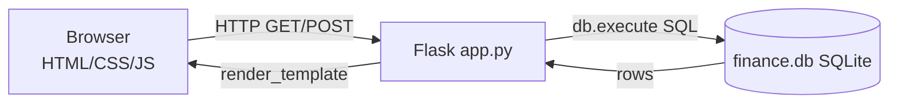

# Week 9 — Flask

> **Goal of the week:** assemble Weeks 6–8 into real **web applications** with **Flask** (Python backend), **Jinja templates** (HTML/CSS/JS front-end), **forms**, and **sessions** — the last big machine the course unpacks before you build your own Final Project.
> **PSet 9:** *Finance* — a full stock-trading web app (user accounts, quotes, buy/sell/history) = the capstone mini-SaaS.

---

## 1. The Pipeline: Browser ⇄ Flask ⇄ SQL



- Flask is a *micro-framework* — a library that turns Python functions into **routes** responding to HTTP.
- This is Week 8's search: the browser asks, Flask looks up in the database, and returns HTML.

---

## 2. Routes — The Core of a Flask App

```python
from flask import Flask, render_template, request, session, redirect
from cs50 import SQL

app = Flask(__name__)
db = SQL("sqlite:///finance.db")

@app.route("/")
def index():
    rows = db.execute("SELECT symbol, SUM(shares) AS total FROM portfolio GROUP BY symbol")
    return render_template("index.html", rows=rows)

@app.route("/register", methods=["GET", "POST"])
def register():
    if request.method == "POST":
        # pull form fields, validate, insert into db, set session
        return redirect("/")
    return render_template("register.html")
```

- `@app.route("/path", methods=[...])` maps URL → function; `methods` decides `GET` (show form page) vs `POST` (handle submitted form) — Week 8's contract, now on the server side.

---

## 3. Templates — Jinja (the glue)

- `render_template("index.html", rows=rows, name=name)` injects Python values into an HTML file.
- **Jinja syntax** in the `.html`:

```html
<table>
  
    <tr>
      <td>{{ stock.symbol }}</td>
      <td>{{ stock.total }}</td>
    </tr>
  
    <tr><td>No stocks.</td></tr>
  
</table>
```

- `` = logic (for/if); `{{ }}` = printed value. Jinja also gives **template inheritance** (``, ``) — reuse the same navbar/footer everywhere, CSS-free of duplication.

---

## 4. Forms → Data → Validation → SQL (the complete loop)

1. User submits `<form method="post" action="/buy">`.
2. Flask routes to the POST handler; read via `request.form.get("symbol")`.
3. **Validate everything** (non-empty, numeric, positive shares, symbol exists) — Week 2/7's "never trust input" now protects a *live* system.
4. Do the work: `db.execute("INSERT INTO transactions (user_id, symbol, shares, price) VALUES (?, ?, ?, ?)", ...)` (parameterized — Week 7's injection defense, always).
5. `redirect` (POST / redirect / GET pattern) → user lands on a fresh view with a success message (`flashes` / `error_helpers`).

---

## 5. Sessions & Cookies — "who is this user?"

- HTTP is stateless: each request is a stranger. **Cookies** (small values stored in the browser) + **sessions** (server-side state keyed by cookie) fix that.
- `session["user_id"] = id` after login; `@login_required` decorator guards every page from the guest.

```python
@app.route("/logout")
def logout():
    session.clear()
    return redirect("/")
```

- **Security echoes:** keep secrets out of cookies; treat session IDs like tokens; encrypt traffic (Week 10's encryption content).

---

## 6. APIs & AJAX — The Modern Web's Conversation

- **API** = a programmatic (JSON, not HTML) interface: `requests.get("...").json()` in Python or `fetch()` in JS. JSON is just text that grew up — parse it with lists/dicts (Week 5/6's structures).
- **AJAX** = the browser asks the server *without reloading the page* (Week 8's JS + fetch), keeping UI snappy — the technical basis of today's "endless scrolling" apps.

```javascript
fetch('/quote', { method: 'POST', body: new FormData(form) })
  .then(r => r.json())
  .then(data => { document.querySelector('#price').innerHTML = data.price; });
```

---

## 7. Security Checklist That Now Makes Sense

- Parameterized SQL (never string-concat inputs).
- Validate + coerce every input server-side.
- Session-based auth, not hand-rolled cookies with secrets.
- Current date/time helpers & CSRF awareness for state-changing POSTs.

> **The Final-Project unlock:** with routes + templates + SQL + sessions, you now have every tool to build the "SaaS/market app" of your choice — the exact capstone of [[learn-python-fast-system]] ("build your own SaaS: Stripe + Postgres + Tailwind…").

---

## 8. Vocabulary to Master

- web framework · route/decorator (`@app.route`) · render_template / Jinja (for-loop, `{{ }}`/``) · GET vs POST · form data (`request.form`) · redirect · session / cookie · login_required decorator · API / JSON · AJAX / `fetch` · CSRF · stateless HTTP

## 9. Cross-Links

- [[cs50/week-7-sql]] — the database layer Flask wraps.
- [[cs50/week-8-html-css-javascript]] — the front-end Flask renders.
- [[cs50/week-10-cybersecurity]] — hardening what Week 9's forms/sessions expose.
- [[cs50/problem-sets]] — PSet 9 (Finance).
- [[learn-python-fast-system]] — the "SaaS" step is exactly this week's build.
- [[winning-in-tech-art-of-winning]] — ship Finance, then ship *your* thing, visibly.