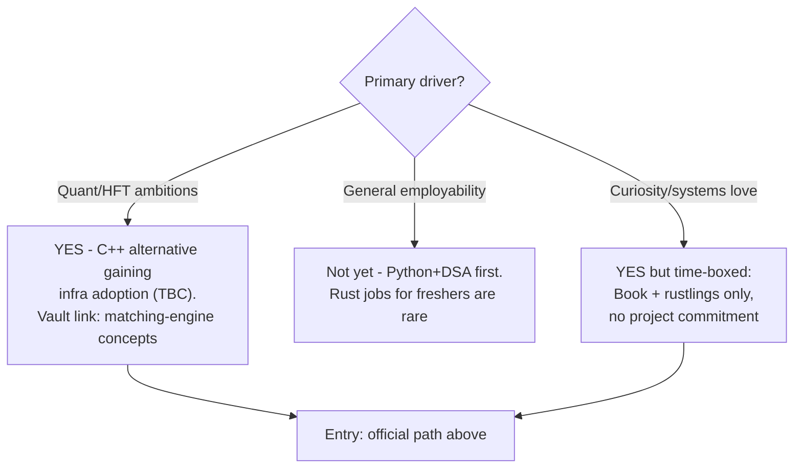
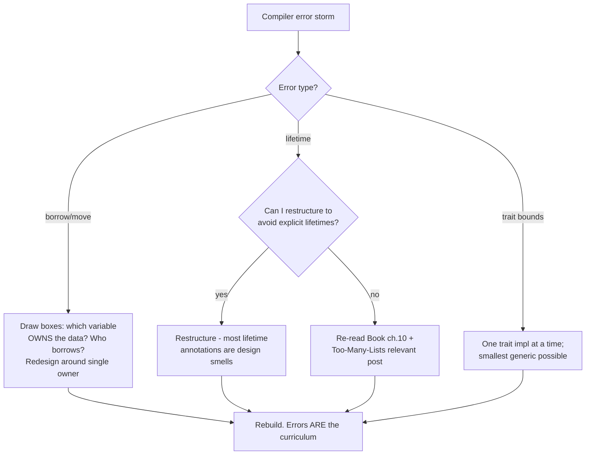

## For future agent
Deep edition of the Rust path. Adds the borrow-checker-fighting mechanism analysis (why Rust's learning curve is uniquely shaped), per-stage failure modes with counters (the famous linked-list wall), premortem of abandoned Rust learning, defeat-tackling flowchart, and an honest should-you-learn-Rust decision section. Sibling language pages: [[languages-polyglot]], [[languages-python-advanced]].

# Rust — Learning Path [Deep Edition]

## Part 1 — Why Rust Fights You (mechanism)

Rust's difficulty is not volume of syntax — it's that the compiler enforces invariants other languages let you violate silently. Every borrow-checker error is a *memory-safety bug you would have shipped in C++*. Reframing that changes the emotional experience:

> The compiler is a free senior reviewer who never gets tired and is always right about memory.

Learners who internalize this persist; those who read errors as hostility quit at the first lifetime puzzle.

## Part 2 — The Official Path (in order)

1. **[The Rust Programming Language ("the Book")](https://doc.rust-lang.org/stable/book/)** — canonical; cover-to-cover
2. **[Rustlings](https://github.com/rust-lang/rustlings)** — small exercises drilling reading/writing; do alongside the Book
3. **[Rust By Example](https://doc.rust-lang.org/stable/rust-by-example/)** — companion when prose is dense
4. **[The Rust Reference](https://doc.rust-lang.org/stable/reference/index.html)** — precise semantics lookup

## Part 3 — Failure Modes Per Stage

| Stage | Standard Death | Mechanism | Early Warning | Counter |
|-------|---------------|-----------|---------------|---------|
| Book ch.4 (ownership) | First real fight | Mental model still value/pointer-based | Re-reading ch.4 on loop | Draw stack/heap boxes for EVERY compiler error until it clicks |
| rustlings mid | Exercise grind fatigue | Exercises feel disconnected from real goals | Skipped days | Tie each exercise to "what bug does this prevent" |
| **Linked-lists wall** | The famous intermediate killer | Linked lists are the WORST case for ownership (shared mutable nodes) | Trying to build production-grade lists | **[Too Many Linked Lists](https://rust-unofficial.github.io/too-many-lists/)** exists precisely because of this — it teaches through failure |
| Async era | Pin/Send/Sync confusion arriving early | Async Rust compounds two hard things | Avoiding async entirely OR cargo-culting `tokio::main` | Defer async until sync ownership is instinct |

## Part 4 — Going Deeper

| Resource | What You Learn |
|----------|---------------|
| **[Too Many Linked Lists](https://rust-unofficial.github.io/too-many-lists/)** | Ownership/borrowing THROUGH failure — best intermediate text |
| **[Programming Rust (Blandy/Orendorff)](https://www.goodreads.com/book/show/25550614-programming-rust)** | ⭐ source's pick: best for experienced developers; systems depth |
| **[The Rustonomicon](https://doc.rust-lang.org/stable/nomicon/index.html)** | Unsafe Rust dark arts — only after ownership is instinct |
| [Hands-On Concurrency with Rust](https://www.amazon.com/dp/1788399978) | Memory-safe parallel design |
| [Hands-On DS&A with Rust](https://www.amazon.com/dp/178899552X) | Classic structures under borrow-checker |

## Part 5 — Alternative On-Ramps
[Easy Rust](https://github.com/Dhghomon/easy_rust) plain-English · [tl;dr Rust](https://christine.website/blog/TLDR-rust-2020-09-19) with Go comparisons · [OMG WTF RS roundup](https://web.archive.org/web/20200923111823/https://ferrous-systems.com/blog/omg-wtf-rs-resources-to-help-you-get-started-with-rust/) (archived) · **[Stanford CS110L](https://reberhardt.com/cs110l/spring-2020/)** full course using Rust to teach systems safety

## Part 6 — Web Frameworks
[Landscape analysis 2020 (lpalmieri)](https://www.lpalmieri.com/posts/2020-07-04-choosing-a-rust-web-framework-2020-edition/) — actix vs warp vs rocket reasoning. 2026 note `(TBC)`: ecosystem consolidated around axum since; verify current state before committing.

## Part 7 — Should YOU Learn Rust? (honest decision)

**Failure mode**: Rust as procrastination from interview-prep fundamentals. Rust complements a career; it doesn't substitute one at fresher stage.

## Part 8 — Defeat-Tackling Flowchart

## Part 9 — Life Integration

- Time-boxed track (recommended): Book chapters 1–10 + rustlings over ~6 weekends; reassess honestly after
- Vault synergy: implement CS50 Week-4 memory concepts' equivalents in Rust — pointers intuition transfers both ways
- Metrics: rustlings % complete · compiler-error journal entries (each = one mental model upgrade) · honest decision checkpoint reached

## Example Checkpoint Questions

1. Explain move semantics with a two-variable example — why did the first variable die?
2. Why do doubly-linked lists hurt Rust specifically? What ownership shape do they demand?
3. When would you reach for `unsafe` — and what contract are you then upholding?

## Cross-Vault Links

[[software-dev-general]] · [[languages-polyglot]] · [[01-Areas/Programming/cs50/week-4-memory]] · [[01-Areas/AI-Data/ai-ml/matching-engine-cpp]]