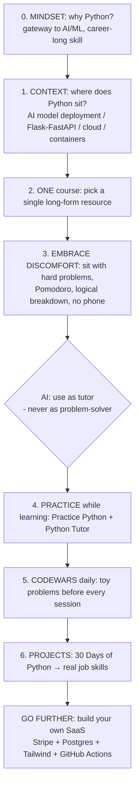

# How I Would Learn Python FAST (if I could start over)

> **Source:** *How I Would Learn Python FAST (if I could start over)* (Andrew — Digital Nomad Dev).
> **Video:** https://www.youtube.com/watch?v=ywjyvKzc8e4 — raw transcript: [[raw-sources/youtube-transcript-how-i-would-learn-python-fast.txt]].

---

## 0. The Author's Origin Story (why this matters)

- Taught himself Python at **32**, no prior problem-solving/coding background.
- **Struggled massively — because he learned the wrong way.**
- This video is his *complete replacement system*: mindset + resources + practice + projects.

---

## 1. The 6-Step Loop (Executable Plan)

---

## 2. Step 0 — The Right Mindset (and *why* Python)

- **Motivation:** Python is the **gateway to AI & machine learning** — the fastest-growing sector; any technical job in this industry expects it.
- **The truth about "vibe coding":** there's a kernel of truth to "you don't need to code" — but **people who can code make way better apps**.
- **Duration reality:** you *don't* learn Python in 6 months; it's a **career-long, compounding skill** (cross-link: [[mathematics-of-creativity]] — time compounds).
- **The big concept you're actually learning:** **problem-solving**, not Python. The value is in being *the kind of person who can help any project* — backend, Docker, machine learning — because you think in systems.

---

## 3. Step 1 — Context: Where Does Your Python Code Sit?

- Learn the **context of the software lifecycle** before you go deep (1–2 days at high level is enough).
- **AI/ML engineer path:** where does your trained model fit the product? Learn about AI *engineering* (deployment).
- **Backend path (Flask/FastAPI):** learn some **cloud**, **containerization**, and front-end/back-end boundaries.
- Benefit: your fundamentals have a place to live; none of this is deep — just orientation.

---

## 4. Step 2 — Pick ONE Long-Form Resource (hand-picked 4)

| Resource | Cost | Notes |
|---|---|---|
| **CS50 Python (Harvard)** | Free | "Best free introduction to Python on the internet" |
| **Bro Code** | Free | ~10-hour informal YouTube series |
| ***Automate the Boring Stuff with Python*** | Free ebook / paid book | Chaptered + projects |
| **Zero to Mastery** (Python) | Paid ~30–40h | Author's pick: good projects + AI/ML intro + teaching style |

> Choose **one**, go through it *thoroughly*. While doing the course: practice (Step 4) + Codewars (Step 5).

---

## 5. Step 3 — Embrace the Discomfort (the core skill)

When you finish the syntax chapters and stare at a blank editor thinking *"How do I solve this?"*:

- **The reflex to fight:** reach for your phone to distract yourself.
- **The correct move:** set a **Pomodoro timer**, sit with the unease, and **logically break the problem down**.
- **The rule:** *"If you're not feeling uncomfortable — if your brain isn't aching because you're pushing it to its limit — you're not doing it right."*
- Comfort with this feeling **is** problem-solving ability. Nobody (per the author) teaches this layer; it's the differentiator.

### AI as a personalized tutor (not a crutch)
- **What to do:** ask AI *specific* questions — *"explain decorators"*, *"how do loops work here?"* — like a private tutor you're paying.
- **What never to do:** let it *do* the problem-solving for you.
- **Self-test:** *If you're outsourcing your brain / your thinking / the problem-solving, you're doing it wrong.*

---

## 6. Step 4 — Deliberate Practice While Learning

**Trigger = halfway through the course** (you now know variables, loops, conditionals):

1. **Practice Python** (`practicepython.org`) — free; ~40 beginner exercises of slowly increasing difficulty (chili-pepper rating = spiciness). Learn to *write actual Python*.
2. **Python Tutor** (`pythontutor.com`) — free; **visualizes code execution step-by-step**; perfect when functions/decorators resist your mental model.
3. Specific blockers → **ask AI** the targeted question.

---

## 7. Step 5 — Start EVERY Session with a Toy Problem (Codewars)

- **Codewars = "the gym for coders."** Small, compartmentalized kata problems — isolated reps of logical thinking.
- Start at rank **8kyu** (easiest) and climb.
- **Why?** It trains *problem-solving* directly, the exact skill the whole system cultivates.
- **Note on LeetCode:** once you "graduate" from Codewars, you'll usually need **data structures & algorithms** (Cross-link: [[programming-cs-fundamentals]] §7, §14, §15 — arrays, searching, recursion).

---

## 8. Step 6 — Real Projects (30 Days of Python → SaaS)

After ~half the course + practice:

- **30 Days of Python** (GitHub repo): 30 projects, complexity added daily —
  - Day 1: install Python → strings, sets, loops (basic stuff)
  - → **job-real skills:** web scraping, **MongoDB** databases, building an **API**.
- After that you're "job-ready in theory." Then the far goal (author's brand promise):

### Build your own SaaS
- Tutorial stack mentioned: **Stripe** (payments), **Postgres** (database), **Tailwind** (styling), **GitHub Actions** (CI/CD).
- **Worst case:** a portfolio piece unlike "generic projects."
- **Best case:** $50/month × a few users = a side hustle / income.

---

## 9. Closing Wisdom

- *"If you follow these steps — I know it doesn't feel like it now — **you will learn this**."*
- **Enjoy the process.** The author's biggest regret: over-focusing on the destination, not enjoying the journey.

---

## 10. Cross-Links

- **[[programming-cs-fundamentals]]** — the language-agnostic base this system builds on.
- **[[winning-in-tech-art-of-winning]]** — build visibly, ship, iterate; identity catches up.
- **[[mathematics-of-creativity]]** — quantity breeds quality; stick with it.
- **[[overview]]** — Pomodoro, focus rituals, and consistency that make the 6-step loop stick.