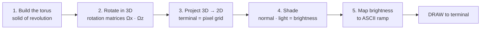

# Why Programming NEEDS Math — the ASCII Donut Case Study

> **Source:** *why you NEED math for programming* (Joma Tech).
> **Video:** https://www.youtube.com/watch?v=sW9npZVpiMI — raw transcript: [[raw-sources/youtube-transcript-why-you-need-math-for-programming.txt]].
> **Original idea/code:** Andy Sloan ("donut.c").

---

## 1. The Core Claim

> *"Even if 99% of the time you won't need it, there's a 1% chance that you might — and it's in those moments that separate a great programmer from an average one."*

A spinning 3D torus rendered as ASCII in the terminal looks like a magic trick — but every pixel is a math formula. If you *understand* the math you can modify the donut (bigger, different rotation, turn it into a cube). **Computer graphics, machine learning, and cryptography demand math.**

---

## 2. The Math Pipeline (Donut → Pixels)



### Step 1 — Model the donut (a solid of revolution)
A **torus** is formed by taking a circle (center radius $R_2$, tube radius $r_1$) and sweeping it around the y-axis:

$$
x = (R_2 + r_1\cos\theta)\cos\phi, \qquad y = r_1\sin\theta, \qquad z = (R_2 + r_1\cos\theta)\sin\phi
$$

(Show-off fact: the torus is the classic poseable doodle — the same surface appears on Renaissance architecture and programming-terminal art.)

### Step 2 — Spin it in 3D (rotation matrices)
Rotate around the **x-axis** and **z-axis** by multiplying the coordinates by rotation matrices:

$$
R_x(\alpha) =
\begin{bmatrix}
1 & 0 & 0\\
0 & \cos\alpha & -\sin\alpha\\
0 & \sin\alpha & \cos\alpha
\end{bmatrix}, \qquad
R_z(\beta) =
\begin{bmatrix}
\cos\beta & -\sin\beta & 0\\
\sin\beta & \cos\beta & 0\\
0 & 0 & 1
\end{bmatrix}
$$

Combined: $P' = R_z(\beta) \, R_x(\alpha) \, P$. The order of multiplication matters (non-commutative).

### Step 3 — Project 3D → 2D screen
Each terminal character becomes a **pixel**; the 3D coordinates are flattened to a 2D grid (perspective/orthographic projection).

### Step 4 — Shade with the dot product
Brightness of a surface point = **dot product of the surface normal $\vec n$ with the light direction $\vec L$**:

$$
\text{brightness} = \vec n \cdot \vec L = |\vec n||\vec L|\cos\theta
$$

- Normal facing the light ⇒ large dot product ⇒ **bright**.
- Normal pointing away ⇒ small/negative ⇒ **dark**.

### Step 5 — Map brightness → ASCII ramp
The scalar brightness is quantized into a character from darkest to brightest, e.g.:

```
. , : ; + * = $ @   (dark → bright)
```

The animation loop redraws the frame per rotation step — pure **trigonometry + linear algebra** executed every frame.

---

## 3. Where Elementary Math Shows Up in Programming

| Domain | Math needed |
|---|---|
| **Computer graphics / game dev** | Vectors, rotation matrices, projections, dot/cross products, quaternions |
| **Machine learning / AI** | Linear algebra (matrices), calculus (gradients), probability/statistics |
| **Cryptography** | Modular arithmetic, number theory, prime factorization, elliptic curves |
| **Data structures & algorithms** | Big-O, logarithms, recurrences (see [[programming-cs-fundamentals]] §14–15) |
| **Simulation / finance** | Continuous-time calculus — see [[stochastic-calculus-black-scholes]] |

---

## 4. The Takeaway

- Math is the **"1% edge"** — rare in daily CRUD work, decisive in graphics/ML/crypto.
- Knowing *why* a formula works (not just the syntax) lets you **extend** and **modify** implementations, exactly as the donut becomes a bigger donut, a cube, or a game engine.
- Cross-link into the quant module: the same **matrices + calculus** power [[quantitative-finance-foundations]] and [[markowitz-portfolio-theory]].