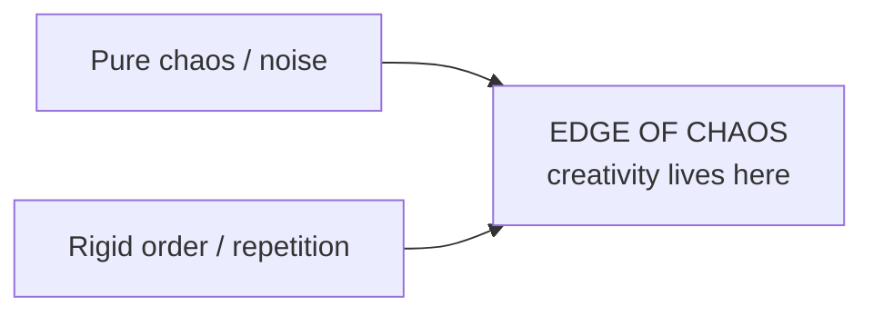

# The Mathematics of Creativity — Why Genius Follows a Formula

> **Source:** *The Mathematics of Creativity | Why Genius Follows a Formula*.
> **Video:** https://www.youtube.com/watch?v=6aohcF4XBSc — raw transcript: [[raw-sources/youtube-transcript-mathematics-of-creativity-genius-formula.txt]].

---

## 1. The Big Thesis

Creativity — usually imagined as wild, sudden, inexplicable lightning — **follows mathematical patterns**. The final formula distilled by the video:

$$
\text{Creativity} \;\approx\; \text{Attempts} \;\times\; \text{Combinations} \;\times\; \text{Time} \;\times\; (\text{Chaos} - \text{Order})
$$

Each term below is a chapter of the research-backed argument.

---

## 2. Chapter 1 — It's Not Random: The Law of Large Numbers

**Researcher:** Dean Keith Simonton (leading psychologist of creativity). Studied *thousands* of works by composers, scientists, and inventors.

**Finding:** creative success follows **statistical probability** — **the more attempts you make, the higher your odds of producing a masterpiece**. This is the *law of large numbers* applied to creation.

| Creator | Total output | Famous fraction |
|---|---|---|
| Thomas Edison | 1,000+ patents | Light bulb + phonograph hidden in the pile |
| Picasso | 20,000+ works | Only a fraction define him today |

> **Quantity breeds quality.** Every attempt increases the odds of a breakthrough. (In programming terms: ship more, experiment more — see [[winning-in-tech-art-of-winning]] and [[learn-python-fast-system]].)

---

## 3. Chapter 2 — Zipf's Law & the Distribution of Ideas

**Zipf's law** (from linguistics/math): in any large set, outcome frequency follows a **predictable power-law curve** — a few things are extremely common, most are mediocre, a tiny fraction is extraordinary.

Applied to creativity: **most of your ideas will be average, some good, and a rare few brilliant.**

```
   # of
  ideas     ▂▄▄█▅▄▂▂▁▁▁▁▁▁▁▁▁▁▁   ← most outputs are "meh"
   │
   └────────────────────────────► quality/impact
        ▲                ▲
       few common      tiny extraordinary  ← the outliers
```

**Implication:** mathematically, *most creativity is noise — the signal lives in the outliers*. Don't judge yourself by every idea; judge the distribution over a large volume of attempts.

---

## 4. Chapter 3 — Combinatorial Creativity

**Researcher:** Margaret Boden (pioneer in cognitive science).

**Argument:** creativity is **mostly combinatorial** — taking existing elements and recombining them in novel ways. Modeled mathematically as **permutations and combinations**:

$$
\text{\# distinct arrangements} \approx n! \quad \text{or} \quad \binom{n}{k}
$$

A *limited* set of building blocks can produce an *astronomical* number of new arrangements.

**Everyday proof:** hip-hop sampling, meme culture, and scientific theories all *feel* new but are assembled from recombining what already exists.

> **In code:** this is exactly why **imports, libraries, and frameworks** matter ([§12 in fundamentals](programming-cs-fundamentals.md)) — you combine curated primitives instead of reinventing them.

---

## 5. Chapter 4 — Time & the Exponential Growth Curve

The (debated) **10,000-hour rule** (Gladwell) echoes a real mathematical truth: **skill follows an exponential/compound-growth curve**.

$$
\text{skill}(t) \approx A\ e^{kt}
$$

- At first, progress is **slow**.
- As hours accumulate, **ability accelerates** and breakthroughs become more likely.
- Like **compound interest**: the longer you invest in practice, the *faster* your growth rate.

> Mastery looks like magic from outside — underneath, it's math (and [[overview|the productivity module's]] consistency pillars).

---

## 6. Chapter 5 — The Balance: Edge of Chaos

From **complexity theory**: creativity often emerges at the **edge of chaos** — the delicate point between total randomness and rigid order.

| State | Outcome |
|---|---|
| Too much chaos | Nothing makes sense |
| Too much order | Nothing new happens |
| **Edge of chaos** | **Unexpected but meaningful connections form** (the sweet spot) |

**Model:** systems like **cellular automata** show the richest patterns appear not in pure noise and not in rigid repetition — but right in the balance.



---

## 7. The Action Formula

To become *more* creative:

1. **Produce more** — quantity matters; law of large numbers.
2. **Recombine relentlessly** — mix old things into new forms (combinatorics).
3. **Stick with it** — time compounds growth (exponential curve).
4. **Find the edge of chaos** — balance structure with freedom.

**Applied to programming (this vault's context):** write more small projects, sample and combine libraries/patterns, practice daily so the curve compounds, and alternate disciplined technique (fundamentals) with unconstrained exploration (prototyping).

---

## 8. Cross-Links

- **[[math-for-programming]]** — math as the "1% edge" in programming.
- **[[winning-in-tech-art-of-winning]]** — "creativity game" of software engineers.
- **[[learn-python-fast-system]]** — a concrete way to *produce more* via projects.
- **[[overview]]** — the compounding, consistency backbone (habits, deep work).