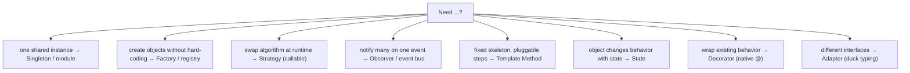

# Design Patterns in Python (GoF, made Pythonic)

> Design patterns are **reusable solutions to recurring problems** — a shared vocabulary ("Strategy", "Observer", "Factory") that short-circuits twenty lines of explanation. Python's first-class functions, duck typing, and simple namespaces dissolve much of the Java ceremony around them: **often the *language feature* *is* the pattern.**
> Sources: [Refactoring Guru — Patterns in Python](https://refactoring.guru/design-patterns/python), [Automate & Deploy — Python patterns](https://automateanddeploy.com/knowledge/python-fundamentals/design-patterns-in-python-factory-strategy-observer-and-singleton).

---

## 1. The Meta-Rule

> "Patterns are not about following rules — they're about communicating intent." — Automate & Deploy

| Java-style | Pythonic equivalent |
|---|---|
| Interface + one class per implementation | Function / callable / dict registry |
| Abstract Factory class hierarchy | Module-level factory function + `dict` |
| `getInstance()` Singleton | Module-level instance (modules are singletons) |
| Observer listener interfaces | Callback registry / decorators / signals |
| Iterator classes | `yield` (generators) |
| `final` methods | `@final` annotation (mypy-enforced) |
| Getters/setters | `@property` |

**When you genuinely need the full class-based form:** the algorithm is *stateful and complex*, you need *static typing* on the strategy object, or you're designing a public API that must *guide third-party implementers* through an explicit contract.

---

## 2. Pattern Quick Reference

| Category | Pattern | Problem it solves | Python note |
|---|---|---|---|
| **Creational** | Singleton | one shared instance | prefer module-level instance |
| | Factory / Factory Method | create objects without hard-coding classes | `dict` registry + function |
| | Abstract Factory | families of related objects | factory function returning factories |
| | Builder | complex multi-step construction | chained methods / `__init__` kwargs |
| **Structural** | Adapter | make incompatible interfaces work | duck typing makes it trivial |
| | Decorator | add behavior without subclassing | `@decorator` is language-native |
| | Facade | simplify a complex subsystem | thin wrapper class |
| | Proxy | lazy/guarded access | `__getattr__` forwarding |
| **Behavioral** | Strategy | swap algorithms at runtime | pass a callable / object |
| | Observer | notify many about one event | callback list / event bus |
| | Template Method | define skeleton, let subclasses fill steps | inheritance + `super()` |
| | State | object behavior changes with internal state | classes per state / dict of transitions |
| | Iterator | traverse without exposing internals | `__iter__`/`yield` |
| | Command | encapsulate an action as an object | functions/closures; GUI & undo |

---

## 3. Creational Patterns

### 3.1 Singleton — but the Pythonic way is a module

```python
# config.py  ← the whole module is a singleton
DATABASE_URL = "postgresql://..."
MAX_CONNECTIONS = 20

# db.py
import config
class _DatabaseConnection:
    def __init__(self): ...

db = _DatabaseConnection()      # export ONE instance; underscore = "private class"
```
Usage: `import db; db.db.connect()`. **One instance, zero `__new__` magic.**

If you truly need a class Singleton (rare), the decorator form is clean:
```python
def singleton(cls):
    instances = {}
    def get(*a, **k):
        if cls not in instances:
            instances[cls] = cls(*a, **k)
        return instances[cls]
    return get

@singleton
class DatabaseConnection: ...

a = DatabaseConnection(); b = DatabaseConnection()
a is b   # True
```

**Anti-pattern warning:** Singleton = global state with a nicer outfit. Prefer dependency injection; reach for it only for genuinely shared resources (config, pools, caches).

### 3.2 Factory — the Pythonic registry

**Class-based (for API contracts):**
```python
class EnemyFactory:
    @staticmethod
    def create(enemy_type: str) -> Enemy:
        if enemy_type == "orc": return Orc()
        if enemy_type == "dragon": return Dragon()
        raise ValueError(enemy_type)
```

**Pythonic dict registry (the idiomatic version):**
```python
class Animal: ...
class Dog(Animal): ...
class Cat(Animal): ...

ANIMALS = {"dog": Dog, "cat": Cat}          # classes are first-class → dict

def create_animal(kind: str) -> Animal:
    return ANIMALS[kind]()

create_animal("dog")   # Dog(...) — no if/elif, one line to add a type
```

**Decorator-based registry** (what PyTorch/scikit-learn do) — registration lives next to the class:
```python
REGISTRY = {}
def register(name):
    def deco(cls):
        REGISTRY[name] = cls
        return cls
    return deco

@register("dog")
class Dog: ...
```

### 3.3 Builder (complex construction)

```python
class QueryBuilder:
    def __init__(self): self._parts = []
    def select(self, *cols):  self._parts.append(f"SELECT {', '.join(cols)}"); return self
    def from_(self, table):   self._parts.append(f"FROM {table}"); return self
    def where(self, cond):    self._parts.append(f"WHERE {cond}"); return self
    def build(self):          return " ".join(self._parts)

QueryBuilder().select("id", "name").from_("users").where("active=1").build()
```

---

## 4. Structural Patterns

### 4.1 Adapter — often *free* thanks to duck typing

```python
def save_report(data):               # expects .read()/.readlines() (file-like)
    ...

class StringReader:                  # adapts a str into a file-like duck
    def __init__(self, text): self.lines = text.splitlines()
    def readlines(self): return self.lines

save_report(StringReader("a\nb\n"))  # works — no inheritance, no adapter class
```

### 4.2 Decorator (structural) — the language bakes it in

```python
import functools, time

def timed(fn):
    @functools.wraps(fn)
    def wrapper(*a, **k):
        t0 = time.perf_counter()
        try: return fn(*a, **k)
        finally: print(f"{fn.__name__} took {time.perf_counter()-t0:.3f}s")
    return wrapper

@timed
def work(): ...                     # behavior added without subclassing
```

### 4.3 Facade

```python
class PaymentFacade:                # one simple door to a hairy subsystem
    def __init__(self):
        self.gateway = StripeGateway()
        self.validator = CardValidator()
        self.ledger = Ledger()
    def charge(self, card, amount):
        self.validator.check(card)
        self.gateway.charge(card, amount)
        self.ledger.record(amount)
```

### 4.4 Proxy — lazy/guarded access via `__getattr__`

```python
class LazyImage:
    def __init__(self, path): self._path = path; self._img = None
    def __getattr__(self, name):        # forward anything to the real object
        if self._img is None:
            self._img = Image(self._path)   # load only on first use
        return getattr(self._img, name)
```

---

## 5. Behavioral Patterns

### 5.1 Strategy — pluggable algorithm (the most common Python pattern)

**Class-based (explicit contract):**
```python
class Discount(ABC):
    @abstractmethod
    def apply(self, price): ...

class FlatDiscount(Discount):
    def apply(self, price): return price - 10
class PercentDiscount(Discount):
    def apply(self, price): return price * 0.9

class Checkout:
    def __init__(self, discount: Discount):  # inject the strategy
        self.discount = discount
    def total(self, price):
        return self.discount.apply(price)

Checkout(FlatDiscount()).total(100)        # 90
Checkout(PercentDiscount()).total(100)     # 90.0
```

**Pythonic distilled version — just pass a function:**
```python
PAYMENTS = {"card": lambda amt: print(f"card ${amt}"),
            "paypal": lambda amt: print(f"paypal ${amt}")}

def checkout(amount, strategy):  strategy(amount)
```
*(Strategy is how ML frameworks expose swappable optimizers/transforms, FastAPI injects dependencies, sorting takes a `key=`.)*

### 5.2 Observer — event subscription

```python
class EventBus:
    def __init__(self): self._listeners = {}
    def subscribe(self, event, cb):
        self._listeners.setdefault(event, []).append(cb)
    def emit(self, event, **data):
        for cb in self._listeners.get(event, []):
            cb(**data)

bus = EventBus()
bus.subscribe("order_paid", lambda order_id: send_email(order_id))
bus.subscribe("order_paid", lambda order_id: update_ledger(order_id))
bus.emit("order_paid", order_id=42)     # both listeners fire
```
**Lifetime warning:** if you keep references to observers forever, you've invented a memory leak. Manage subscriptions or use weak references.

### 5.3 Template Method — skeleton in the base, steps in subclasses

```python
class DataMiner(ABC):
    def mine(self, path):                    # THE template — fixed sequence
        data = self.read(path)               # 1. hook
        parsed = self.parse(data)            # 2. hook
        return self.analyze(parsed)          # 3. hook

    @abstractmethod
    def read(self, path): ...
    @abstractmethod
    def parse(self, data): ...
    def analyze(self, data):                 # optional override
        return data

class CSVDataMiner(DataMiner):               # fills in the steps
    def read(self, path): return open(path).read()
    def parse(self, data): return data.splitlines()
```
*(Works because all Python methods are virtual — [[inheritance]] §1.)*

### 5.4 State — behavior changes with internal state

```python
class Document:
    def __init__(self): self.state = Draft()
    def publish(self): self.state = self.state.next()

class Draft:
    def next(self): return Review()
class Review:
    def next(self): return Published()
class Published:
    def next(self): return Published()   # idempotent
```

---

## 6. Choosing a pattern (decision tree)



---

## 7. Navigation

- SOLID is the "why" behind these patterns: [[design-principles-solid]]
- Machinery: [[inheritance]] (Template Method) · [[polymorphism]] (Strategy/Observer) · [[magic-methods-dunder]] (Adapter/Proxy via `__getattr__`, Iterator)
- Reference: [[cheatsheet]] · back to [[overview]]
