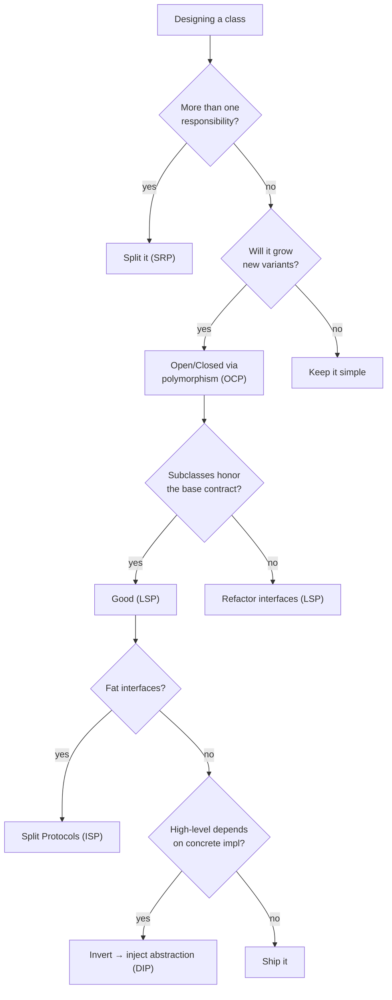

# SOLID Design Principles in Python

> SOLID is a set of five object-oriented design principles (codified by Robert C. Martin, "Uncle Bob") that help you write **maintainable, flexible, scalable** code. Each principle targets a specific *failure mode*: code that breaks when you add a feature, classes you can't test in isolation, or interfaces that force unrelated implementations together.
> Sources: [Real Python — SOLID](https://realpython.com/solid-principles-python/), [how2.sh — SOLID for production](https://how2.sh/posts/how-to-apply-solid-principles/).

---

## 1. The Five Principles at a Glance

| Letter | Principle | One sentence | Failure it prevents |
|---|---|---|---|
| **S** | Single Responsibility | A class should have only one reason to change | god classes, hard testing |
| **O** | Open/Closed | Open for extension, closed for modification | `elif` explosion |
| **L** | Liskov Substitution | Subtypes must be substitutable for their base types | overridden methods that break contracts |
| **I** | Interface Segregation | Don't force clients to depend on methods they don't use | fat interfaces, `NotImplementedError` |
| **D** | Dependency Inversion | Depend on abstractions, not concretions | untestable, tightly-coupled code |

---

## 2. S — Single Responsibility Principle

> **"A class should have only one reason to change."** — the "reason to change" *is* the responsibility.

**Bad:** one class does validation + business logic + persistence + notifications.
```python
class OrderProcessor:
    def process(self, order):
        if not order.items: raise ValueError("empty order")     # validation
        total = sum(i.price for i in order.items)               # business
        if total > 10000: total *= 0.9
        db.execute("INSERT ...", order)                          # persistence
        send_email(order.email, "confirmed")                     # notification
        return total
```
*(Four reasons to change: rules, pricing, DB, email.)*

**Good:** split by actor-of-change, orchestrate in a service.
```python
class OrderValidator:
    def validate(self, order): ...
class PricingCalculator:
    def calculate(self, order) -> float: ...
class OrderRepository:
    def save(self, order): ...
class OrderNotifier:
    def notify(self, order): ...

class OrderService:                       # the only thing with "and" logic
    def __init__(self, repo, notifier):
        self.repo, self.notifier = repo, notifier
    def process(self, order):
        OrderValidator().validate(order)
        total = PricingCalculator().calculate(order)
        self.repo.save(order)
        self.notifier.notify(order)
        return total
```
Now pricing changes don't touch persistence, and each piece is independently testable.

**Self-test:** "describe the class without using 'and'. If you can't, it has too many responsibilities."

---

## 3. O — Open/Closed Principle

> **"Software entities (classes, modules, functions) should be open for extension, but closed for modification."** — Bertrand Meyer (1988)

**Bad — adding a shape means editing the class:**
```python
class Shape:
    def area(self):
        if self.kind == "circle": return pi * self.r**2
        elif self.kind == "rect": return self.w * self.h
        # square? → edit this method again
```

**Good — add behavior by adding a new subclass (polymorphism):**
```python
from abc import ABC, abstractmethod

class Shape(ABC):
    @abstractmethod
    def area(self): ...

class Circle(Shape):
    def area(self): return pi * self.r**2
class Square(Shape):
    def area(self): return self.side**2      # NEW — no existing code touched

def total_area(shapes):                       # closed: never changes
    return sum(s.area() for s in shapes)
```

**When to abstract:** don't build abstractions before you need them ("Rule of Three" — extract the abstraction at the *second/third* concrete implementation).

---

## 4. L — Liskov Substitution Principle

> **"Subtypes must be substitutable for their base types."** If a function works with `Bird`, it must work with any `Bird` subclass without surprises.

**Bad — the penguin can't fly:**
```python
class Bird:
    def fly(self): return "flying"
class Penguin(Bird):
    def fly(self): raise NotImplementedError("penguins can't fly")   # breaks callers
```

**Good — split capabilities into interfaces:**
```python
class Bird:
    def move(self): ...

class FlyingBird(Bird):
    def move(self): return "flying"
class SwimmingBird(Bird):
    def move(self): return "swimming"

class Eagle(FlyingBird): ...
class Penguin(SwimmingBird): ...     # move() works for both
```

**LSP rules for overrides:**
- Don't *narrow* inputs (child must accept everything parent did — Python is duck-typed so mostly a discipline).
- Don't *widen* outputs/raise new exceptions the caller can't handle.
- Preserve the *behavioral contract* (same meaning). `Square(Rectangle)` fails LSP the moment width/height must stay equal.

---

## 5. I — Interface Segregation Principle

> **"Don't force clients to depend on methods they don't use."** A fat interface couples unrelated behaviors; implementers then `raise NotImplementedError` on stuff they don't support.

**Bad — every storage must implement everything:**
```python
class Storage:
    def read(self, key): ...
    def write(self, key, value): ...
    def delete(self, key): ...
    def stream(self, key): ...          # not every storage streams

class ReadOnlyCache(Storage):
    def write(self, key, value): raise NotImplementedError
    def delete(self, key): raise NotImplementedError
```

**Good — split into focused Protocols:**
```python
from typing import Protocol

class Readable(Protocol):
    def read(self, key: str) -> bytes: ...
class Writable(Protocol):
    def write(self, key: str, value: bytes) -> None: ...
class Streamable(Protocol):
    def stream(self, key: str): ...

class ReadOnlyCache:                     # implements only what it supports
    def read(self, key): ...
class S3Storage:                         # implements all three
    def read(self, key): ...
    def write(self, key, value): ...
    def stream(self, key): ...
```
*(Protocols = structural typing; see [[polymorphism]] §5.)*

---

## 6. D — Dependency Inversion Principle

> **"High-level modules shouldn't depend on low-level modules. Both should depend on abstractions."** (Not the same as "dependency injection" — DI is the delivery vehicle; DIP is the design rule.)

**Bad — service hard-wires MySQL:**
```python
class OrderService:
    def __init__(self):
        self.db = MySQLDatabase(host="localhost")     # untestable, unswappable
    def get_order(self, order_id):
        return self.db.query(f"SELECT * FROM orders WHERE id={order_id}")
```

**Good — depend on an abstraction, inject the concrete impl:**
```python
from typing import Protocol

class OrderRepository(Protocol):
    def get(self, order_id: int) -> dict: ...
    def save(self, order: dict) -> None: ...

class MySQLOrderRepository: ...      # production
class InMemoryOrderRepository: ...   # tests

class OrderService:
    def __init__(self, repo: OrderRepository):   # injected
        self.repo = repo
    def get_order(self, order_id):
        return self.repo.get(order_id)

service = OrderService(MySQLOrderRepository())      # prod
test_service = OrderService(InMemoryOrderRepository())  # tests — zero changes
```

The **dependency flow** now points inward:
```
OrderService (high level)  ──▶  OrderRepository (abstraction)  ◀── MySQLRepo (low level)
```

---

## 7. Composition over Inheritance (the meta-rule)

> "Prefer object composition over class inheritance." — GoF

| Situation | Prefer |
|---|---|
| Genuine **is-a** + you reuse most of the parent's implementation | Inheritance (keep it shallow) |
| **has-a**, or you just need a behavior | Composition |
| You only want an interface/contract | `Protocol` / ABC (not deep inheritance) |

```python
# Inheritance (fine for true is-a):
class NotificationService: ...
class EmailService(NotificationService): ...

# Composition (has-a — often better):
class ReportGenerator:
    def __init__(self, exporter, formatter):   # inject collaborators
        self.exporter = exporter
        self.formatter = formatter
```
Why: composition is loosely coupled (component changes rarely ripple), swappable at runtime, and avoids deep fragile hierarchies.

---

## 8. Summary Decision Flow



---

## 9. Navigation

- Pillars that SOLID sharpens: [[the-four-pillars]] · [[inheritance]] (LSP/mixins) · [[polymorphism]] (OCP/ISP/DIP tools)
- Design patterns are SOLID's recurring solutions: [[design-patterns]]
- Modern typing idioms (Protocol) used here: [[modern-oop-dataclasses-typing]]
- Reference: [[cheatsheet]] · back to [[overview]]
